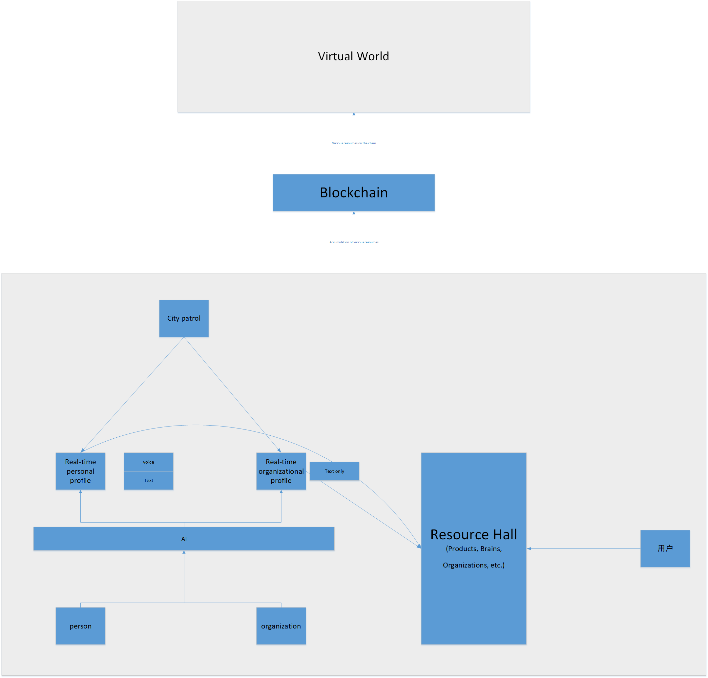

# Implementation Steps

## Organizational Chat

First, mimic other platforms to implement the organizational chat function.

## Organizational + Personal Chat

Consider how to make the organization accessible to individuals. This can be achieved using a resource lobby.

Once these two steps are completed, monetization can begin.

For example, education (tutors, fitness coaches, etc.) combined with users can already generate revenue.

## Personal Chat

Consider how to make it entirely accessible to individual users. Here, we need to assume that individuals are "useful."

When introducing this feature, we need to consider that individuals can use their own PCs as servers.

> Development Roadmap Of The Above Plans:
> 
> Phase 1 (Current): Pure Chat
> - Core Architecture: Extremely fast, high throughput.
> - Strategy: Only MongoDB local transactions + NATS JetStream.
> - Goal: Solve the issues of message loss and latency.
>
> Phase 2 (Expansion): Introduce State Consistency
> - Features: For example, "self-destructing messages" (requiring strong coordination between the messaging service and scheduled task service), or "permission transfer during group owner transfer."
> - Strategy: Lightweight Saga (such as using NestJS's Saga module) can be introduced to handle such complex, long-running business processes.
>
> Phase 3 (Commercial): Introduce Cash Flow
> - Features: Red envelopes, tipping, e-commerce.
> - Strategy: A TCC mechanism must be introduced (at this point you might truly consider frameworks like Seata, or write your own TCC logic).

## AI-Generated Profiles

Generate AI profiles based on chat content.

## Consider how to create personal profiles in real time.

## Introduction of Blockchain Technology

Put resources on the blockchain.

## Establishment of a Virtual World

After putting resources on the blockchain, establish a virtual world to enable transactions.
