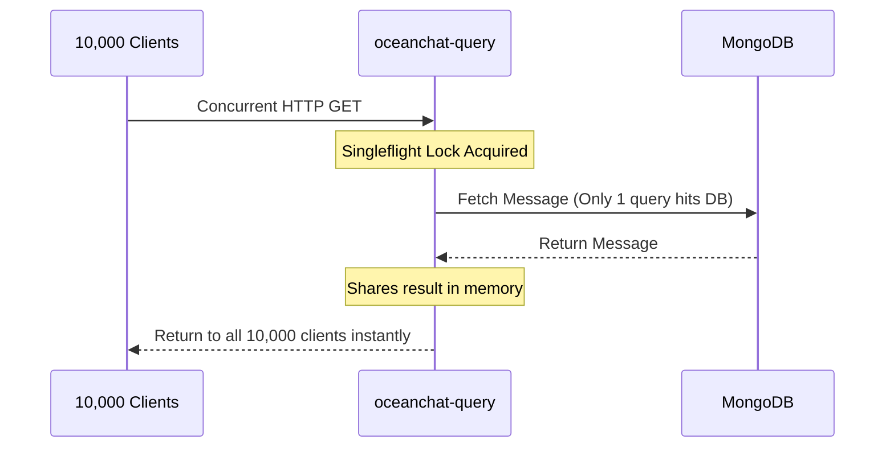

import Tabs from '@theme/Tabs';
import TabItem from '@theme/TabItem';

# Understanding How My System Supports 100k Concurrency

When I designed Ocean Chat, my primary engineering goal was to build a system capable of handling 100,000+ concurrent WebSocket connections efficiently. Traditional instant messaging architectures often break down under extreme concurrency due to compounding I/O bottlenecks. 

This document explains the conceptual background and the interconnected architectural decisions that form the backbone of Ocean Chat's scalability.

## Context: The Bottleneck of Scale

In traditional web applications, scaling is often achieved by spinning up more instances and relying on a centralized Redis cache or database. However, in an IM system with 100,000 active connections, standard design patterns fail catastrophically:

1. **Authentication Storms:** If every WebSocket connection or HTTP request requires a Redis lookup to validate a token, the network interface becomes a lethal bottleneck.
2. **Write Blocking:** Synchronously writing every message to a database (like MongoDB) before acknowledging the client degrades message throughput and causes thread starvation.
3. **Thundering Herds:** A single message in a 10,000-user group chat can trigger 10,000 simultaneous read requests, tearing down the database instantly.
4. **Queue Explosions:** Broadcasting the full JSON payload of a message to 10,000 users over WebSocket causes massive head-of-line blocking and OOM (Out of Memory) crashes.

To solve these, I completely abandoned traditional synchronous CRUD logic. Instead, I designed Ocean Chat around **extreme I/O decoupling**, **memory-first operations**, and **asynchronous event-driven state machines**.

---

## Core Concept: The Pillars of Concurrency

My system relies on five distinct architectural pillars to eliminate the bottlenecks mentioned above. 

### 1. Zero-I/O Authentication

I eliminated the Redis lookup bottleneck by moving authentication entirely to CPU-bound cryptographic operations. 

My `oceanchat-api-gateway` uses **Zero-I/O Authentication**. It validates RS256 cryptographically signed access tokens strictly in local memory. Revocations (like a user logging out or a token being banned) are broadcasted via NATS JetStream and cached in a local LRU blacklist. By performing an $O(1)$ memory lookup, I guarantee that the gateway can authenticate thousands of requests per second without a single outbound network call to a database.

### 2. Write-After-Persistence (NATS JetStream WAL)

I decoupled the fast client interaction from the slow database insertion.

When a client sends a message (`MSG_UP`), the `oceanchat-message` service performs its checks and writes the payload to a highly available **NATS JetStream** stream (`im.orchestrate.msg`). 

:::tip The Write Fence
NATS JetStream acts as my **Write-Ahead Log (WAL)**. The moment NATS returns an ACK, the system has crossed the write fence. I immediately return a success ACK to the client. The actual insertion into MongoDB happens asynchronously in the background via the `MessagePersistence Worker` using `bulkWrite`.
:::

### 3. Segment-Based ID Generation (SeqSvr)

If I queried MongoDB to generate an auto-incrementing ID for every single message, the IOPS limits would crush the database. 

I implemented a segment-based pre-allocation strategy inspired by WeChat's `seqsvr`. The message service fetches a block of IDs (e.g., a step of 10,000) from the database in a single transaction. It then distributes these IDs (`SyncSeqId`) purely from memory. This strategy slices the database write load for ID generation by **99.99%**.

### 4. Push-Pull Hybrid & Singleflight Defense

Broadcasting heavy message payloads to thousands of users simultaneously destroys bandwidth. 

I implemented a **Push-Pull Hybrid** model. The server pushes a tiny, zero-payload `MSG_NOTIFY` signal containing only the `GroupId` and the latest `SyncSeqId`. Clients then pull the actual message entities via a standard HTTP endpoint.

To protect the database when 10,000 users concurrently execute this HTTP pull, I use the **Singleflight** pattern:

### 5. Queue Collapse & Asymmetric Heartbeats

I heavily utilize NATS JetStream's `max_msgs_per_subject: 1` constraint. When calculating unread badge counts or syncing read cursors (`CURSOR_STATE`), NATS automatically discards older messages. Even if a user generates 50 read receipts in a second by scrolling fast, the queue collapses them into a single record. 

Furthermore, I use an **Asymmetric Heartbeat** protocol. The server pings every 30 seconds, and the client serves as a fallback at 35 seconds. Combined with the rule that "any valid business packet resets the heartbeat timer," I eliminated up to 50% of the redundant ping/pong bandwidth overhead typical in WebSocket applications.

---

## Alternatives and Trade-offs

When designing this architecture, I made several explicit trade-offs:

<Tabs>
  <TabItem value="consistency" label="Eventual vs. Strict Consistency" default>
    **Alternative:** Wrap message sending and database insertion in a distributed transaction (Saga/TCC).
    **My Choice:** I chose **Eventual Consistency**. A message is ACKed before hitting MongoDB. If the background worker fails, it goes to a Dead Letter Queue (DLQ). I trade strict ACID guarantees for massive throughput, because a 1-second delay in database persistence is invisible to users, but a 1-second delay in the UI sending a message is catastrophic.
  </TabItem>
  <TabItem value="nats" label="NATS vs. Apache Kafka">
    **Alternative:** Use Kafka for the central message bus.
    **My Choice:** Kafka provides extreme throughput but introduces JVM memory overhead and complex ZooKeeper/KRaft dependencies. **NATS JetStream** compiles to a single Go binary, requires minimal memory, and natively supports the dynamic subject routing (e.g., `cursor.read.*`) and Request-Reply RPC patterns critical for my microservices.
  </TabItem>
  <TabItem value="state" label="Stateful Gateway vs. Stateless Business">
    **Alternative:** Let the WebSocket gateway handle business logic and database queries directly.
    **My Choice:** I kept the `oceanchat-ws-gateway` strictly **stateless** regarding business logic. It only holds raw TCP sockets. All logic is routed to `oceanchat-router` and `oceanchat-message`. This allows me to restart or scale the heavy business logic services seamlessly without ever dropping a user's active WebSocket connection.
  </TabItem>
</Tabs>

## Higher-Level Perspective

Supporting 100k concurrency is not achieved through a single magic bullet or by writing "faster" code. It is an exercise in managing state, isolating bottlenecks, and embracing asynchrony.

By decentralizing authorization so that data owners make decisions locally, and by enforcing a strict Push-Pull dichotomy, my architecture ensures that network I/O is heavily minimized. Ocean Chat transforms what is typically an I/O-bound problem into a CPU-bound process, allowing infinite horizontal scalability simply by adding more compute instances.