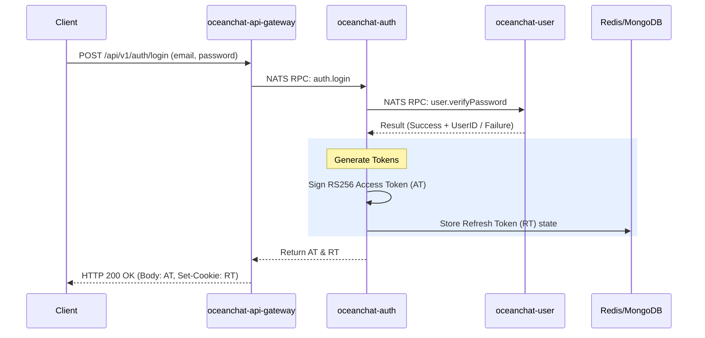
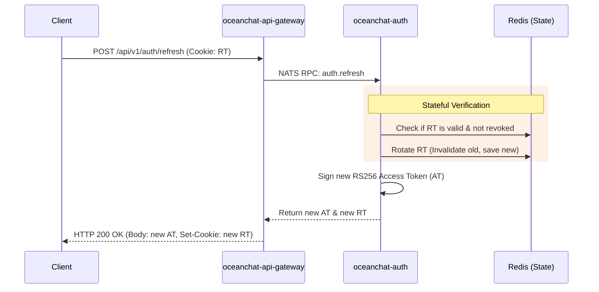
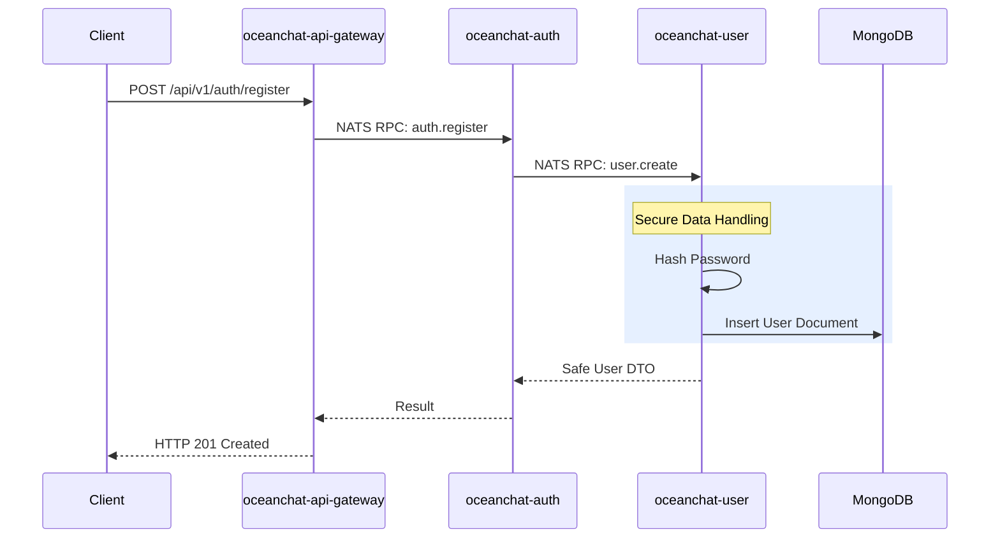

<head>
  <meta name="twitter:card" content="summary_large_image" />
  <meta property="og:title" content="Ocean Chat Authentication Architecture | Ocean Chat" />
  <meta property="og:description" content="A comprehensive overview of the Ocean Chat Authentication Service, integrating Zero-I/O architecture and the JWT Hybrid strategy for maximum security and scalability." />
  <link rel="canonical" href="https://docs.oceanchat.com/devdocs/auth-overview" />
</head>

# Ocean Chat Authentication Architecture

Authentication serves as the foundational security layer for Ocean Chat, gatekeeping access for millions of concurrent users. Designing an authentication system for an Instant Messaging (IM) platform of this scale requires balancing extreme performance with rigorous security constraints.

This page explains the overarching architecture of the Ocean Chat Authentication system, detailing how it orchestrates the **Zero-I/O verification pattern** with a **JWT Hybrid management strategy** across three highly specialized microservices.

## The Context: Balancing Scale and Security

In traditional web applications, authentication often relies on centralized sessions or stateful token validation. However, Ocean Chat is designed to handle **10 million concurrent connections**. At this scale, traditional stateful verification creates a massive bottleneck. Every request verifying a token against a central database (like Redis) generates network overhead, potentially leading to cascading infrastructure failures under heavy load.

Conversely, purely stateless tokens (like standard long-lived JWTs) pose unacceptable security risks. If a token is stolen, it cannot be revoked without changing the signing key for all users. The challenge for Ocean Chat's Auth Service is to deliver the performance of stateless tokens while retaining the security control of stateful sessions.

## Core Concept: The Decentralized Verifier Model

The Ocean Chat Authentication Service resolves this tension by adopting a **Centralized Issuer, Decentralized Verifier** architecture.

The architecture is distributed across three primary microservices:

1. **`oceanchat-api-gateway` (Layer 1):** The decentralized verifier. It uses an asymmetric public key (RS256) to cryptographically verify Access Tokens locally using CPU cycles (**Zero-I/O**).
2. **`oceanchat-auth` (Layer 2):** The centralized issuer and session manager. It handles complex logic like generating tokens and managing Refresh Token states.
3. **`oceanchat-user` (Layer 2):** The secure source of truth for user data and password hashing.

:::tip Security Boundary
By design, **password hashes never leave the `oceanchat-user` service**. The Auth service delegates password verification via NATS RPC, ensuring sensitive cryptographic hashes are isolated from the rest of the network.
:::

## Service Interactions and Authentication Flows

The following sequences illustrate how these microservices cooperate during critical authentication lifecycles using NATS RPC.

### 1. The Login Flow

During login, the system validates credentials and issues the JWT Hybrid pair. The Refresh Token is sent securely via an `HttpOnly` cookie, while the short-lived Access Token is returned in the response body.

### 2. The Token Refresh Flow

Because Access Tokens are strictly verified in-memory by the Gateway without network calls (Zero-I/O), they must have a very short lifespan (e.g., 15 minutes). When they expire, the client uses the stateful Refresh Token to obtain a new session.

### 3. The Registration Flow

During registration, the Gateway proxies the request to Auth, which then delegates to User for secure creation.

## Summary

By strictly separating concerns—delegating high-frequency, stateless validation to the `oceanchat-api-gateway` and low-frequency, stateful session management to the `oceanchat-auth` service—Ocean Chat achieves a highly secure authentication pipeline capable of scaling horizontally to millions of concurrent connections without causing database I/O storms.
