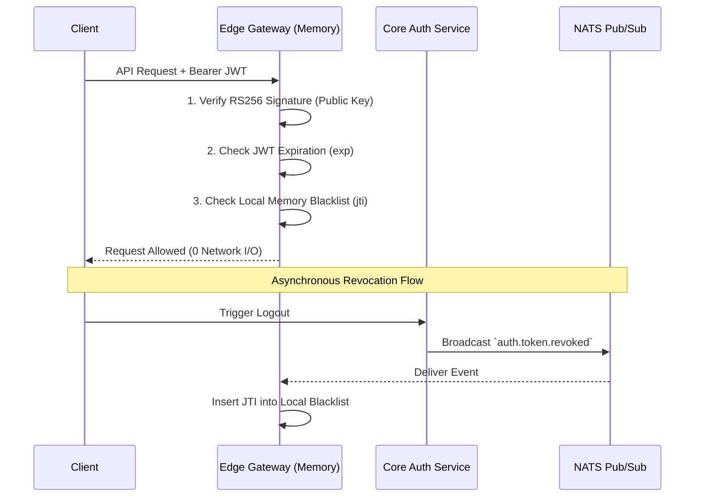

<head>
  <meta name="twitter:card" content="summary_large_image" />
  <meta property="og:title" content="Understanding Zero-I/O Authentication | Ocean Chat" />
  <meta property="og:description" content="An explanation of Ocean Chat's Zero-I/O authentication, which uses RS256 asymmetric encryption and in-memory blacklists to eliminate network bottlenecks at 10M concurrent connections." />
  <link rel="canonical" href="https://docs.oceanchat.com/devdocs/understanding-zero-io-authentication" />
</head>

# Understanding Zero-I/O Authentication

Authentication is the critical gatekeeper for Ocean Chat. However, as the platform scales toward **tens of millions of concurrent connections**, traditional remote authentication verification becomes a catastrophic bottleneck.

This document explains the conceptual foundation of Ocean Chat's **Zero-I/O Authentication Architecture**, detailing how it shifts from network-bound checks to CPU-bound cryptography to ensure infinite horizontal scalability.

## The Context: The Network I/O Bottleneck

In conventional microservice architectures, an API Gateway verifies a JSON Web Token (JWT) by checking its validity against a centralized datastore or remote cache (like a Redis whitelist).

While this guarantees strict, synchronous state consistency, it introduces severe structural flaws at massive scale:

1. **The Remote I/O Penalty:** Every HTTP request or WebSocket handshake requires a network trip to Redis.
2. **The Read Storm:** At 10 million concurrent users, routine traffic generates millions of queries per second. This read storm can overwhelm the most robust Redis clusters, causing increased latency and cascading timeouts.
3. **Symmetric Secret Vulnerabilities:** Sharing a single symmetric key (e.g., HS256) between the central Auth service and edge gateways means compromising any edge node allows attackers to forge administrative tokens.

To achieve horizontal scalability, Ocean Chat must eliminate remote network I/O from the critical path of token verification.

## Core Concept: Cryptography and Event-Driven Memory

Ocean Chat solves this by inverting the verification paradigm: the gateway assumes all cryptographically valid tokens are legitimate **unless explicitly informed otherwise**. This relies on two primary pillars.

### 1. Asymmetric Cryptography (RS256)

Ocean Chat shifts from symmetric shared secrets to **asymmetric encryption** (public/private key pairs).

- **The Central Auth Service (Issuer):** Holds the **Private Key** and exclusively signs valid JWTs.
- **The Edge Gateways (Verifiers):** Hold only the **Public Key**. They mathematically verify token signatures but cannot generate new tokens.

:::tip Security Minimization
By using RS256, the blast radius of a compromised edge node is contained. An attacker gains only the Public Key, which is mathematically useless for forging credentials.
:::

### 2. The Event-Driven In-Memory Blacklist

Cryptographic verification only proves a token was legitimately issued; it does not prove the user hasn't logged out. Instead of querying a remote database to check valid standing, gateways use an **Event-Driven In-Memory Blacklist**.

When a user logs out, the Auth Service publishes an asynchronous `auth.token.revoked` event via NATS JetStream. Every active gateway receives this broadcast and inserts the token's unique ID (`jti`) into a local, in-memory LRU cache (or Bloom Filter). 

During request verification, the gateway performs an `O(1)` local memory lookup. If the `jti` is not found, the request proceeds immediately with zero network I/O. The `jti` is naturally evicted from memory once the token reaches its absolute `exp` expiration time.

## Alternatives and Trade-offs

- **Centralized Whitelists:** Provide strict synchronous consistency. If a user is banned, their next request is immediately rejected. However, the IOPS limitations of central databases make this impossible at IM scale.
- **Short-Lived JWTs (without Blacklists):** Relying solely on token expiration (e.g., 5 minutes) removes the need for databases. However, it leaves a 5-minute vulnerability window where a stolen token or banned user retains full access.

The Zero-I/O approach with NATS provides **eventual consistency**. There is a microsecond-to-millisecond window between revocation at the Auth Service and event delivery to the gateways. In the context of global chat infrastructure, this microscopic delay is a necessary and highly advantageous trade-off for eliminating network latency.

## Higher-Level Perspective

By internalizing token validation into local memory, Ocean Chat transforms authentication from a network-bound problem into a CPU-bound operation. The throughput of the edge gateway layer is no longer constrained by database IOPS, allowing the platform to scale horizontally indefinitely just by adding more gateway compute instances.