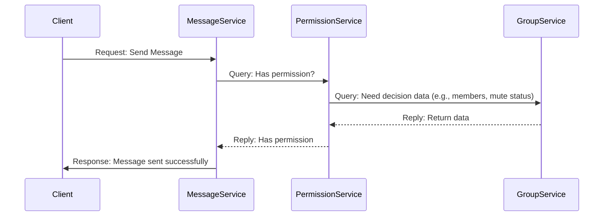

# Permission System Design Considerations

:::tip Core Principle: Whoever Owns the Data, Makes the Decision
For permission design, I am not adopting a separate, centralized permission service. Instead, I follow a more pragmatic design principle: **The sole owner of the data is the sole party responsible for permission decisions (Policy Decision Point, PDP)**.
:::

## Approach 1: A Centralized, Independent Permission Service

A common approach is to extract permission logic (e.g., "determine if Role A has Permission X") into an independent oceanchat-permission service. In theory, this approach has several advantages:

- **Highly Centralized Logic:** All permission rules are concentrated in one place, making it very simple to modify and audit policies.
- **Decoupling of Business Services:** The MessageService or GroupService no longer needs to care about complex permission logic. They only need to ask the permission service, "Can User U perform Action A on Resource R?" and then proceed based on the "yes/no" answer, leading to cleaner business code.
- **Single Responsibility:** The permission service only makes authorization decisions, giving it a very pure responsibility.

## The Practical Challenges of a Centralized Permission Service

Although the model of an independent permission service is elegant in theory, it faces two major challenges in practice, especially in a system like oceanchat that requires a large amount of contextual data for decision-making.

### 1. Network Overhead and Performance Bottlenecks

Treating a permission check as a network call (RPC/HTTP) significantly increases request latency. More critically, the permission service becomes a key single point of failure for the entire system. If it fails or its performance degrades, all services that rely on it for permission checks (especially write operations) could be blocked.



The diagram above shows that a simple request to send a message results in multiple internal network communications because of the introduction of a centralized permission service.

### 2. Data Dependency and Service Coupling

Permission decisions are often not stateless; they are highly dependent on specific business data.

> **Scenario 1: Can User A send a message in Group G?**
>
> - **Data Needed:** Is A a member of Group G? Has A been muted? Is Group G currently in a "mute-all" state?
> - **Data Owner:* All of this data is stored in the database of the Group Service (oceanchat-group).

> **Scenario 2: Can User A remove their friendship with User B?**
>
> - **Data Needed:** Are A and B friends?
> - **Data Owner:** This data is stored in the database of the User Relationship Service (oceanchat-user).

For an independent permission service to make these decisions, it only has two options, both of which have serious flaws:

- **Option A: Reverse-Calling Data Services**
  To make a decision, the permission service needs to call back to the GroupService and UserRelationshipService to fetch the required data. This leads to a complex and fragile service call chain (e.g., MessageService -> PermissionService -> GroupService), which not only increases latency but also raises the risk of circular dependencies in the system.

- **Option B: Synchronizing Data to the Permission Service**
  The permission service maintains its own copy of the data required for decisions (such as group memberships, friend relationships, etc.). This introduces extremely high complexity related to data synchronization and eventual consistency.

## My Design: Decentralized Decisions

Based on the challenges above, I decided to adopt a more pragmatic and efficient model: **let the service that owns the data become the Policy Decision Point itself.**。

This means that the logic for permission checks will be tightly co-located with the data it depends on.

Here is the implementation plan:

### 1. Decentralizing the Decision Logic

Delegate the responsibility for permission decisions to the services that own the relevant data.

- **Group-related Permissions:** All permission-checking logic related to groups (e.g., sending messages, inviting members, muting) is encapsulated within the GroupService. When the MessageService needs to check a user's permissions in a group, it directly calls an interface provided by the GroupService, such as groupService.checkPermission(userId, groupId, 'SEND_MESSAGE').
- **User Relationship Permissions:** Similarly, permission checks for adding/removing friends are handled by the UserRelationshipService.

**The advantages of this model are clear:**

- **High Performance:** Permission decisions are made within the same service that holds the required data, avoiding extra network overhead.
- **High Cohesion:** The data and the logic that uses it are encapsulated together, which aligns with good software design principles.
- **High Availability:** It eliminates the single point of failure risk associated with a centralized permission service.

### 2. Centralizing Permission Metadata

Although the decision logic is decentralized, the "definitions" of permissions must be centralized and consistent.

I will create a shared internal library (e.g., common-defs) where all platform-wide "Roles" and "Permission" identifiers are uniformly defined using Enums or Constants.

For example:

```typescript
// In the shared library common-defs
export enum GroupPermission {
  SEND_MESSAGE = "group:send_message",
  INVITE_USER = "group:invite_user",
  // ... other permissions
}
```

All services will depend on this shared library to reference permission definitions, ensuring that the entire system has a consistent understanding of what each permission means.
