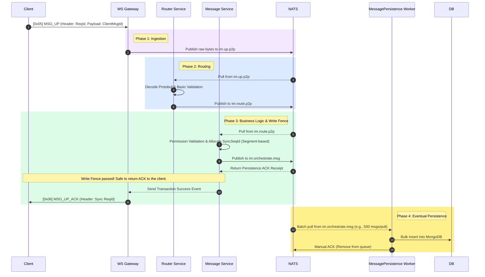

# Message Sending and Persistence

## Architecting Message Sending and Persistence for 100k+ Concurrency

To support hundreds of thousands of concurrent connections, traditional synchronous database writes (i.e., blocking the client until the database finishes saving the message) will cause severe performance bottlenecks. Ocean Chat utilizes a **Write-Ahead Logging (WAL)** pattern based on NATS JetStream to solve this issue. The NATS WAL utilizes JetStream as a high-speed persistence buffer to instantly persist messages to disk, thoroughly decoupling fast client responses from slow underlying database writes.

This guide details the specific microservices, JetStream subjects, and step-by-step data flow required to achieve high-throughput, asynchronous message sending and persistence.

## Required Core Components

To complete the lifecycle of message sending and persistence, specific stateless microservices must coordinate with stateful JetStream Streams.

import Tabs from '@theme/Tabs';
import TabItem from '@theme/TabItem';

<Tabs>
  <TabItem value="services" label="Required Microservices" default>
    1. Connection Gateway (oceanchat-ws-gateway): Stateless edge node. Receives the WebSocket MSG_UP data frame, strips the transport layer, and directly forwards the raw payload.
    2. Router Service (oceanchat-router): Traffic dispatcher. Pulls raw data packets, decodes Protobuf, and routes them to the correct business service (P2P or Group chat).
    3. Message Logic Service (oceanchat-message): The business brain. Responsible for permission verification, content filtering, and allocating the segment-based session-level SyncSeqId. It acts as the Write Fence.
    4. Message Persistence Worker (MessagePersistence): Background consumer. Batches pulls messages from NATS and writes them to MongoDB.
  </TabItem>
  <TabItem value="streams" label="Required JetStreams">
    1.  IM_CORE Stream:
        - Subject: im.up.> (im.up.p2p, im.up.group)
        - Purpose: The raw ingestion stream for the gateway. Extremely high throughput with a short data retention period.
    2.  IM_HANDOFF Stream (WAL):
        - Subject: im.route.*
        - Purpose: The oceanchat-router passes the decoded payload to oceanchat-message.
        - Subject: im.orchestrate.msg
        - Purpose: The final processed message. This is the Write Fence boundary. It simultaneously provides the data source for `oceanchat-orchestrator` (used to generate ultra-lightweight `MSG_NOTIFY` wake-up notifications for downstream broadcasting) and the `MessagePersistence worker`.
  </TabItem>
</Tabs>

:::info Rich Media and Large Payload Uplink Strategy (Push-Pull Collaboration)
In accordance with Ocean Chat's global push-pull hybrid strategy, for large files such as images, voice messages, and videos (the data plane), clients are **strictly forbidden** from transmitting binary entity streams directly over the long connection. Doing so would cause severe Head-of-Line Blocking at the long-connection gateway.
**The correct uplink process is:** The client first uploads the multimedia file to object storage (OSS/S3) via an **HTTP short connection**, then encapsulates the file's download URL and metadata into an ultra-lightweight Protobuf payload, and finally sends the `[0x05] MSG_UP` control plane command via the long connection channel.
:::

The following sequence diagram illustrates how a message travels from the client, through the microservice layer, into the NATS WAL, and is finally persisted asynchronously into MongoDB.

