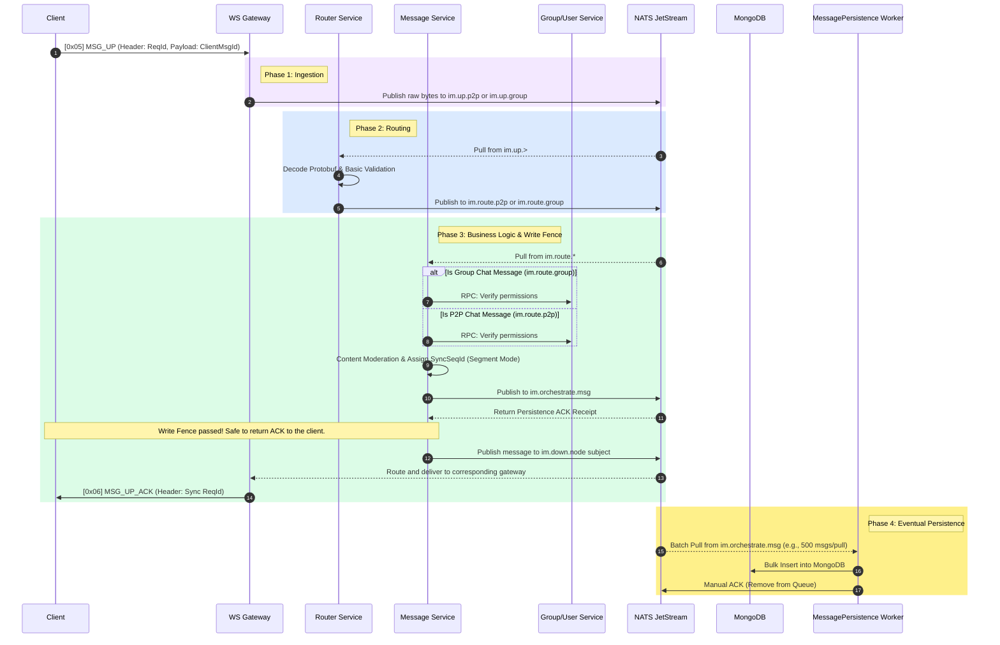

# Message Sending and Persistence

## How to Architect Message Sending and Persistence Under 100k+ Concurrency

To support 100k+ concurrent connections, traditional synchronous database writes (which block the client until the database saves the message) cause severe performance bottlenecks. Ocean Chat uses a **Write-Ahead Log (WAL)** pattern based on NATS JetStream to solve this. NATS WAL uses JetStream as a high-speed persistent buffer, instantly saving messages to disk, thereby completely decoupling fast client responses from slow underlying database writes.

This guide details the specific microservices, JetStream topics, and step-by-step data flow required to achieve high-throughput, asynchronous message sending and persistence.

## Required Core Components

To complete the message sending and persistence lifecycle, specific stateless microservices and stateful JetStream Streams must collaborate.

import Tabs from '@theme/Tabs';
import TabItem from '@theme/TabItem';

<Tabs>
  <TabItem value="services" label="Required Microservices" default>
    1. Connection Gateway (oceanchat-ws-gateway): Stateless edge node. Receives WebSocket MSG_UP data frames, strips the transport layer, and directly forwards the raw payload.
    2. Router Service (oceanchat-router): Traffic scheduler. Pulls raw data packets, decodes Protobuf, and routes them to the correct business service (P2P or Group chat).
    3. Message Logic Service (oceanchat-message): Business brain. Responsible for permission validation, content filtering, and assigning session-level SyncSeqId based on the segment mode. It manages the Write Fence.
    4. Group/User Service (oceanchat-group / oceanchat-user): Decision makers. Called via high-speed internal RPC by the Message Service during permission validation to check group membership, mute status, or P2P friend relationships.
    5. Message Persistence Worker (MessagePersistence): Background consumer. Pulls messages in batches from NATS and writes them to MongoDB.
  </TabItem>
  <TabItem value="streams" label="Required JetStream Streams">
    1.  IM_CORE Stream:
        - Subject: im.up.> (im.up.p2p, im.up.group)
        - Purpose: Gateway raw ingestion stream. Extremely high throughput, short data retention period.
    2.  IM_HANDOFF Stream (WAL):
        - Subject: im.route.\*
        - Purpose: oceanchat-router passes the decoded payload to oceanchat-message.
        - Subject: im.orchestrate.msg
        - Purpose: The fully processed message. This is the write fence boundary. It acts as the data source for both `oceanchat-orchestrator` (for generating ultra-lightweight `MSG_NOTIFY` wake-up signals for downstream broadcasting) and the `MessagePersistence worker`.
  </TabItem>
</Tabs>

:::info Rich Media and Large Payload Upbound Strategy (Long/Short Connection Collaboration)
According to Ocean Chat's global long/short connection strategy, for large files like images, audio, and video (Data Plane), clients are **strictly forbidden** from transmitting binary entity streams directly over long connections. Doing so would cause severe Head-of-Line Blocking at the long connection gateway.
**The correct upbound process is:** The client first uploads the multimedia file to Object Storage (OSS/S3) via an **HTTP short connection**, then encapsulates the file's download URL and metadata in an ultra-lightweight Protobuf payload, and finally sends the `[0x05] MSG_UP` control plane command through the long connection channel.
:::

The following sequence diagram illustrates how a message originates from the client, passes through the microservice layer, enters the NATS WAL, and is ultimately persisted to MongoDB asynchronously.

