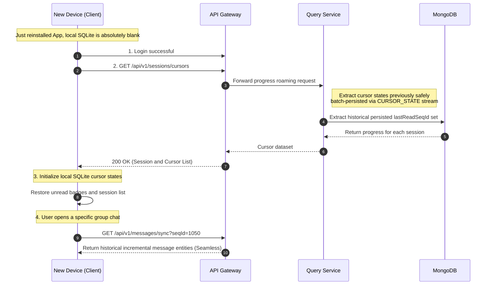

import Tabs from '@theme/Tabs';
import TabItem from '@theme/TabItem';

# Cross-Device Roaming and Progress Recovery

This guide demonstrates how Ocean Chat seamlessly recovers reading progress for various group chats and private chats when a user switches to a new phone or uninstalls and reinstalls the App.

By reading this guide, you will understand how the system, when the new device's local SQLite database is completely empty and has lost its "local fallback deduplication" capability, relies on cursor data previously batch-persisted into MongoDB to accurately deliver roaming progress to the new device, achieving a seamless chat experience for the user.

## Core Components Required

To complete the recovery of client-side roaming progress, the following stateless microservices and persistent storage must collaborate:

<Tabs>
  <TabItem value="services" label="Required Microservices" default>
    1. **API Gateway (oceanchat-api-gateway)**: Handles HTTP progress and session pull requests from the new device.
    2. **Data Query Service (oceanchat-query)**: Receives requests forwarded by the gateway and extracts the user's session list and corresponding historical read cursors from the database.
    3. **Persistence Pipeline (MessagePersistence Worker)**: (Prerequisite) Responsible for folding high-frequency cursors in the `CURSOR_STATE` stream during daily chats and safely persisting them into the database.
  </TabItem>
  <TabItem value="storage" label="Persistent Storage">
    1. **MongoDB**:
       - Purpose: The final destination (Source of Truth) for cursor data. It safely stores the user's absolute latest reading progress (e.g., `lastReadSeqId`) in each session.
  </TabItem>
</Tabs>

---

## 1. New Device Login and Absolute Blank State

When a user buys a new phone or uninstalls and reinstalls the App, the initial state after the new device logs in is extremely fragile:

- **Blank Local SQLite**: There are no historical message entity records.
- **No Cursor State**: The local client is completely unaware of the `MaxLocalSyncSeqId` for any group chats.
- **Loss of Deduplication Capability**: Because there are no historical messages locally, if the server were to push all historical messages out of order at this moment, the client would be entirely unable to use `ClientMsgId` for "local fallback deduplication."

## 2. Initiating a Roaming Progress Request

To safely rebuild the local state machine, the very first thing the new device must do after completing login and before (or simultaneously with) establishing a WebSocket long connection is to initiate an HTTP request to the server to pull the global session list and reading progress:

```http title="Pull Session Roaming Progress Request"
GET /api/v1/sessions/cursors
```

:::tip Progress Prior to Entity Messages
The client must first acquire and initialize the cursor progress for all sessions before it can safely process any newly arriving real-time `MSG_NOTIFY` wake-up signals. This guarantees absolute ordering between the state machine and incremental pulling (HTTP Sync).
:::

## 3. Server Extracts Persisted Roaming Data

Upon receiving the request, the `oceanchat-query` data query service directly queries the underlying MongoDB.

At this point, the system heavily relies on the architectural achievements I designed in "Cross-Device Read Receipt Sync." Because the high-frequency `[0x0B] READ_RECEIPT` signals generated when the user scrolled the screen on their old phone have already been automatically folded and safely persisted to disk by the `CURSOR_STATE` queue stream, MongoDB perfectly preserves the exact progress of every session for that user.

The query service assembles this progress data and returns it to the new device:

```json title="Cursor Roaming Response Example"
{
  "sessions": [
    {
      "groupId": "G1001",
      "lastReadSeqId": 1050
    },
    {
      "groupId": "G2048",
      "lastReadSeqId": 88
    }
  ]
}
```

## 4. Seamless Client-Side Handoff and On-Demand Incremental Pull

After receiving the above response, the client executes the following recovery logic:

1. **Initialize Local DB**: Writes the `lastReadSeqId` of each session into the blank local SQLite database, restoring them as the current `MaxLocalSyncSeqId` for each group.
2. **UI State Self-Healing**: By comparing the SeqId of the latest message in the current group chat with the newly acquired cursor, the UI can accurately restore which groups have unread red badges and how many unread messages each has, achieving an experience identical to the old phone.
3. **On-Demand Incremental Pull**: If the user taps into a specific chat interface, the client only needs to use the newly restored `lastReadSeqId` to initiate a standard `HTTP Sync` incremental pull. This perfectly avoids the network bandwidth explosion and memory crashes caused by mindlessly pulling the full historical data.

:::info The Ceiling of Experience
The client's local fallback deduplication is the system's "lower bound of fault tolerance"; whereas the `CURSOR_STATE` asynchronous batch persistence, maintained by the server to prevent write storms, now becomes the "upper bound of business capability" for the new device's seamless roaming experience.
:::

## End-to-End Sequence Diagram

The following diagram illustrates the complete sequence of how the system extracts persisted cursors and completes roaming progress recovery after a new device logs in:


