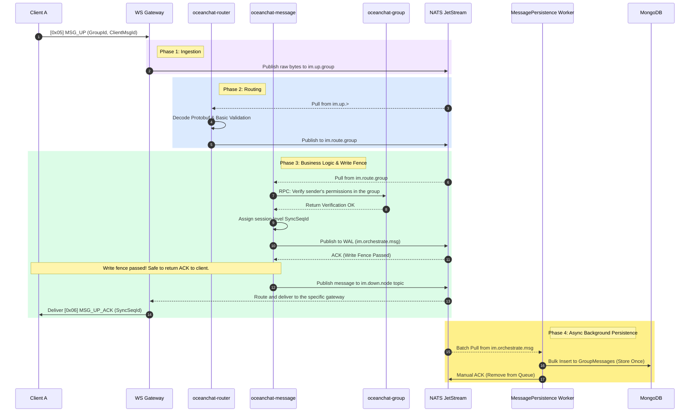
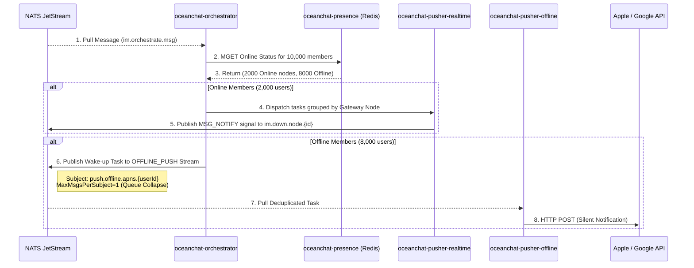
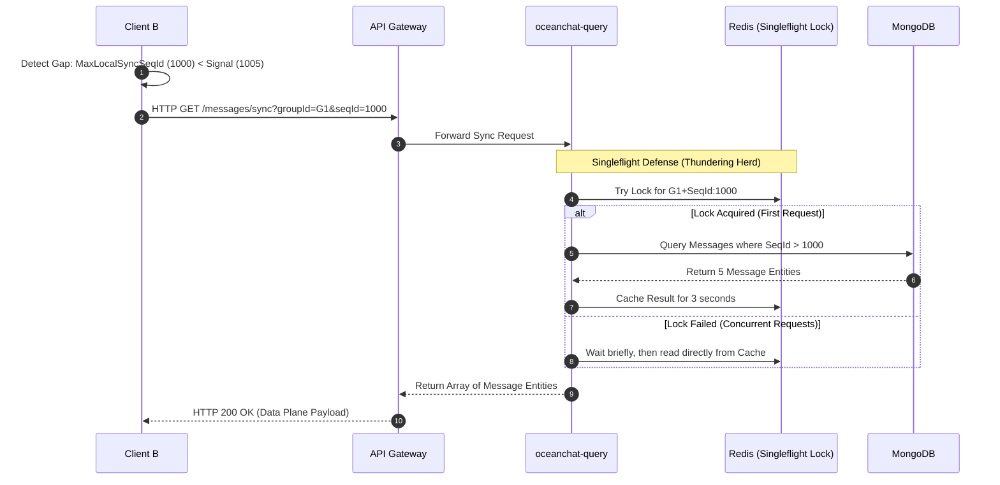
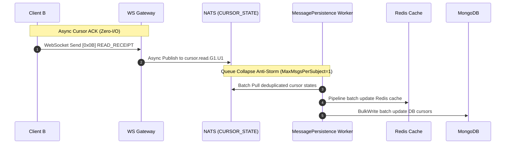

import Tabs from '@theme/Tabs';
import TabItem from '@theme/TabItem';

# Group Message Lifecycle: Sending & Receiving

This document explains the end-to-end lifecycle of a group message within the Ocean Chat architecture. It details how the system leverages a **Read-Diffusion (Store Once) model** combined with a **Push-Pull Hybrid strategy** to deliver messages to thousands of group members without triggering a "write storm" or network avalanche.

The process is divided into four major phases: **Ingestion & Persistence (Upbound)**, **Targeted Delivery (Downbound)**, **Message Entity Synchronization (Data Plane)**, and **Cursor State Acknowledgment (Control Plane)**.

---

## 1. The Global Architecture Strategy

Before examining the flow, it is critical to understand the foundational strategies employed by Ocean Chat for group messaging:

- **Store Once (Read-Diffusion):** A group message entity is saved only once in the global MongoDB `GroupMessages` collection. The system does _not_ create individual copies for every member.
- **Push-Pull Hybrid:** The WebSocket long connection is strictly reserved for extremely lightweight signaling (Control Plane). Actual message payloads are pulled incrementally by clients via HTTP short connections (Data Plane).
- **Asynchronous Decoupling:** NATS JetStream (Write-Ahead Log) is the absolute boundary separating fast client interactions from slow database I/O.

---

## 2. Phase 1: Ingestion & Persistence (Upbound)

When a user sends a message to a group, the goal of this phase is to rapidly accept the message, validate it, assign it a global sequence ID, and safely store it in the WAL before returning an acknowledgment to the sender.

### Key Mechanisms:

- **Write Fence:** The sender receives the `MSG_UP_ACK` immediately after Step 8 (when NATS acknowledges the write). The sender _does not wait_ for the MongoDB insertion, guaranteeing sub-millisecond response times.
- **Deduplication:** The sender must provide a unique `ClientMsgId`. If the sender retries due to a network drop, the backend uses this ID to prevent duplicate `SyncSeqId` generation or duplicate database records.

---

## 3. Phase 2: Targeted Delivery (Downbound)

Once the message safely lands in the `im.orchestrate.msg` topic, the Push Orchestrator takes over. Its job is to split the massive recipient list into online and offline groups and route them appropriately.

Assume a group has **10,000 members** (2,000 online, 8,000 offline).

### Key Mechanisms:

- **Zero-Payload Push:** The `MSG_NOTIFY` sent to the 2,000 online users via WebSocket contains _no message content_. It only carries the `GroupId` and the latest `SyncSeqId` (e.g., `{"seqId": 1005}`).
- **Queue Collapse (Anti-Storm):** For the 8,000 offline users, the Orchestrator publishes tasks to `push.offline.apns.{userId}`. Because this stream is configured with `MaxMsgsPerSubject=1`, if 10 messages are sent to this group in 1 second, NATS automatically drops the older 9 tasks. The `oceanchat-pusher-offline` worker will only pull the final wake-up task, calling the Apple/Google API exactly once per user, drastically saving bandwidth and preventing notification spam.

---

## 4. Phase 3: Message Entity Synchronization (Data Plane)

Both online users receiving the `MSG_NOTIFY` signal and offline users waking up from an APNs push must actively pull the actual message entities.

### Key Mechanisms:

- **Singleflight Defense (Thundering Herd):** When 2,000 online users receive the MSG_NOTIFY simultaneously and fire HTTP GET requests within milliseconds, the oceanchat-query service uses a Singleflight pattern and a short-lived Redis cache to ensure only the first request penetrates to MongoDB. The remaining 1,999 requests return results directly from memory, perfectly protecting the database from instant collapse.
- **Client Deduplication:** When parsing the HTTP response array, the client must use the ClientMsgId of each message against its local SQLite database to silently discard any duplicate messages caused by network retries.

## 5. Phase 4: Cursor State Acknowledgment (Control Plane)

It is important to clarify that after the client pulls the message entities in the background (Data Plane), it **does not** immediately send an acknowledgment. The client only reports its latest consumption progress to the backend when the user actually opens the group chat window and **physically reads (renders on the UI)** those messages.

The core business goal of this phase is to support **accurate unread badge calculation**, **multi-device synchronization to clear badges**, and **cross-device roaming recovery** (seamlessly restoring chat history and unread status when a user switches phones, reinstalls the app, or logs in on a tablet/PC). The primary technical challenge is recording this state while defending against a "database write storm" triggered by millions of users sending read receipts simultaneously.

### Key Mechanisms:

Driving the "Unread Badge" and Business Loop: The persistence worker updating the cursor not only provides accurate data for calculating offline push badge counts but also integrates with the backend DEVICE_SYNC flow. This instantly notifies the user's concurrently online PC or iPad to clear the corresponding group unread badge.

- **Extreme Asynchrony and Zero Gateway I/O:** Upon receiving the READ_RECEIPT, the gateway performs no read/write operations. Instead, it instantly dumps the payload into the NATS CURSOR_STATE stream.
- **Underlying Queue Collapse:** This stream utilizes the MaxMsgsPerSubject=1 mechanism. If a user constantly scrolls the screen in a group, generating a massive amount of receipts, NATS automatically drops the old cursors and retains only the latest lastReadSeqId for that group, eliminating redundant data at the source.
- **Batch Dual-Write Persistence:** The background Worker pulls this batch of collapsed, simplified states and uses Redis Pipeline and MongoDB BulkWrite to complete the cursor updates, completely protecting database IOPS performance.

:::tip Summary
This Push-Pull architecture guarantees that the real-time WebSocket connection is exclusively used for ultra-fast, low-bandwidth control signaling. Heavy data transfer and historical synchronization are entirely offloaded to scalable HTTP endpoints, ensuring Ocean Chat can comfortably handle groups with tens of thousands of active members.
:::
