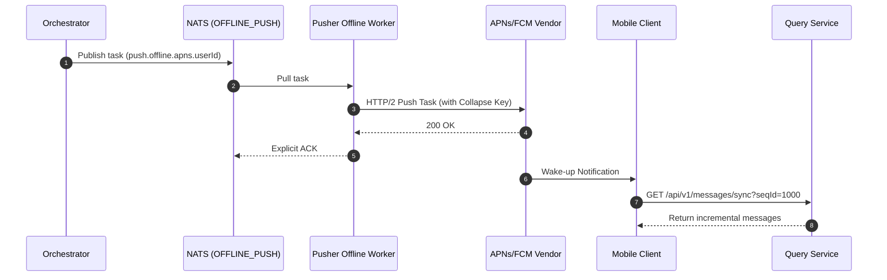

import Tabs from '@theme/Tabs';
import TabItem from '@theme/TabItem';

# Handling Offline Message Push

## How to Architect and Handle Offline Message Pushes

This guide demonstrates in detail how Ocean Chat reliably delivers offline messages to users who do not currently have an active WebSocket connection.

This guide assumes you have a basic understanding of NATS JetStream and Ocean Chat's microservice architecture, and that the message has successfully crossed the write barrier and persisted in the `im.orchestrate.msg` subject.

## Core Components Required

To complete offline message push delivery, the following stateless microservices and stateful JetStream Stream must collaborate:

<Tabs>
  <TabItem value="services" label="Required Microservices" default>
    1. **Orchestrator Service (oceanchat-orchestrator)**: Responsible for pulling message metadata and determining the target user's online status to generate a push task.
    2. **Presence Service (oceanchat-presence)**: Based on Redis. Provides query support for user connection status and platform type (e.g., iOS, Android) for the orchestrator.
    3. **Offline Pusher Worker (oceanchat-pusher-offline)**: A work unit specifically dedicated to consuming the offline push queue, responsible for calling vendor (APNs/FCM) HTTP APIs.
    4. **Data Query Service (oceanchat-query)**: Provides an HTTP interface for awakened offline clients to incrementally pull historical message entities.
  </TabItem>
  <TabItem value="streams" label="Required JetStream">
    1.  **IM_HANDOFF Stream**:
        - Subject: `im.orchestrate.msg`
        - Purpose: The safe persistence point after a message crosses the write barrier, providing the message source waiting for dispatch processing.
    2.  **OFFLINE_PUSH Stream**:
        - Subject: `push.offline.{vendor}.{user_id}`
        - Purpose: A WorkQueue used for third-party push tasks. By configuring the `max_msgs_per_subject: 1` strategy, it achieves notification folding to prevent bombarding users with messages.
  </TabItem>
</Tabs>

## 1. Intercepting and Persisting Messages

When a user sends a message, the `oceanchat-message` service writes it to the `im.orchestrate.msg` subject in NATS JetStream. This acts as a **Write Fence (Write Barrier)**. Once an ACK is received from NATS, the message is considered safely persisted and ready for downstream delivery routing.

## 2. Determining User Online Status

The `oceanchat-orchestrator` service pulls the message metadata and queries the `oceanchat-presence` state service (based on Redis).

If it detects that the target user has no active TCP/WebSocket connections, the orchestrator marks the user as "offline" and further parses their device platform (e.g., iOS, Android).

## 3. Generating and Isolating Push Tasks

To avoid slow third-party network requests from blocking core real-time traffic, the system must route offline push tasks into a dedicated queue.

1. **Publishing the Task**: The orchestrator publishes a lightweight push task to the `push.offline.{vendor}.{user_id}` subject (e.g., `push.offline.apns.user123`) in the `OFFLINE_PUSH` stream.
2. **Queue Folding Anti-Storm**: This stream uses the `max_msgs_per_subject: 1` retention policy. If multiple messages are sent to the same offline user within a short period, NATS automatically discards old tasks, keeping only the latest wake-up signal in the queue. This achieves notification folding, preventing user harassment.

:::tip Physical Isolation
Using an independent NATS stream for offline tasks physically isolates the core `IM_CORE` real-time message queue from the high latency and rate limits of external HTTP APIs, protecting the system from slow external I/O.
:::

## 4. Delivery via Vendor APIs

The `oceanchat-pusher-offline` service runs as a background work unit consuming the `OFFLINE_PUSH` stream.

- **Pull Mode Consumption**: The service uses `consumer.consume()` to pull tasks, adapting to the rate limits of Apple/Google APIs to achieve peak shaving and valley filling.
- **Calling Vendor Interfaces**: The work unit calls APNs or FCM interfaces. It includes a **Collapse Key** in the payload, ensuring the mobile OS only silently updates the unread badge and the latest message preview.
- **Explicit ACK**: The work unit replies with an explicit ACK to NATS only after receiving a `200 OK` HTTP response from the vendor. If the API fails or times out, the task will be redelivered up to 3 times (or based on configuration), and then moved to a Dead Letter Queue (DLQ).

## 5. Client Wake-Up and HTTP Sync

Push notifications serve strictly as **wake-up signals** and never carry the full message payload.

When the mobile OS receives an APNs/FCM payload and wakes the app, it executes the following pull flow:

1. The client reads its `MaxLocalSyncSeqId` from local storage.
2. The client initiates an HTTP Sync request by calling the API gateway:

```http title="HTTP Sync Request"
GET /api/v1/messages/sync?seqId={MaxLocalSyncSeqId}
```

3. The `oceanchat-query` data query service fetches all incremental messages strictly greater than the provided ID from MongoDB and returns them.
4. The client processes this batch of data, uses `ClientMsgId` to silently discard any duplicates, and then updates the local `MaxLocalSyncSeqId`.

:::warning Mandatory Client Deduplication
Be sure to perform deduplication on the client side using `ClientMsgId` to safely handle edge cases where NATS's "At-Least-Once" semantics lead to overlapping sync batch data.
:::

## End-to-End Sequence Diagram

Through the above steps, the following offline push and sync sequence will be achieved:

