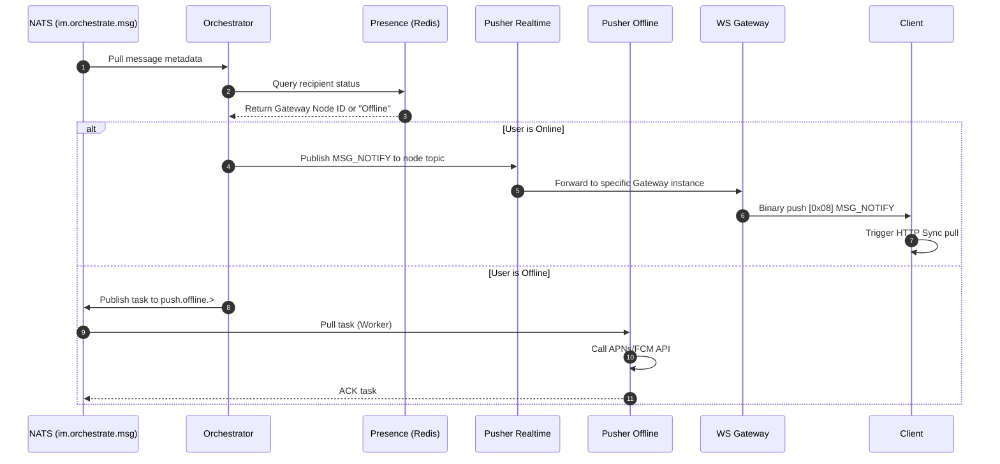

# Message Dispatch and Push

## How to Architect Online and Offline Message Dispatch and Push

This guide explains how to route messages to active WebSocket connections or third-party push providers (APNs/FCM) based on the recipient's real-time online status.

This guide assumes the message has already passed the **Write Fence** and is safely persisted in the NATS JetStream Write-Ahead Log (WAL) under the `im.orchestrate.msg` topic.

## Required Core Components

To orchestrate dispatching, the following stateless microservices and stateful JetStream Streams must collaborate:

import Tabs from '@theme/Tabs';
import TabItem from '@theme/TabItem';

<Tabs>
  <TabItem value="services" label="Required Microservices" default>
    1. Orchestrator Service (oceanchat-orchestrator): The "brain" of the delivery pipeline. It decides the delivery path based on online status.
    2. Presence Service (oceanchat-presence): Redis-based. Responsible for maintaining all active global sessions and their corresponding `gateway_node_uuid`.
    3. Real-time Pusher (oceanchat-pusher-realtime): Routes lightweight `MSG_NOTIFY` signals to specific gateway instances.
    4. Offline Pusher Worker (oceanchat-pusher-offline): An isolated background consumer that handles slow external HTTP calls to APNs or FCM.
  </TabItem>
  <TabItem value="streams" label="Required JetStream Streams">
    1.  IM_HANDOFF Stream:
        - Subject: `im.orchestrate.msg`
        - Purpose: Provides the source of messages waiting for dispatch.
    2.  IM_DOWNBOUND Stream:
        - Subject: `im.down.node.{gateway_node_uuid}`
        - Purpose: Transiently routes signals to specific gateway instances for online users.
    3.  OFFLINE_PUSH Stream:
        - Subject: `push.offline.{vendor}.{user_id}`
        - Purpose: A WorkQueue for third-party push tasks. It uses a `max_msgs_per_subject: 1` policy to prevent notification storms by collapsing multiple unread messages into a single task.
  </TabItem>
</Tabs>

## 1. Querying Recipient Online Status

1.  `oceanchat-orchestrator` pulls message metadata from the `im.orchestrate.msg` topic.
2.  It queries the `oceanchat-presence` service via Redis to locate all active sessions for the recipient.

:::info Branched Execution
A recipient might be "online" (e.g., active on a desktop client) and "offline" (e.g., mobile app running in the background) simultaneously. In this scenario, the system **concurrently executes** both online and offline delivery paths to ensure maximum reachability.
:::

## 2. Executing Online Delivery (Push-Pull Hybrid)

If an active session is found on a specific `gateway_node_uuid`, the real-time notification path is triggered:

1.  **Signal Dispatch**: The orchestrator service publishes a lightweight `MSG_NOTIFY` signal to the `im.down.node.{gateway_node_uuid}` topic.
2.  **WebSocket Push**: The `oceanchat-pusher-realtime` service routes the signal to the exact `oceanchat-ws-gateway` instance holding the connection. The gateway pushes a binary `MSG_NOTIFY` packet containing only the `SyncSeqId` to the client.
3.  **HTTP Sync (Pull)**: Upon receiving a notification, the client **should not** immediately pull the message. Instead, it should implement a **200ms intelligent debounce window**. If multiple notifications are received consecutively during this period, the client only needs to extract the largest `SyncSeqId` and send a **HTTP Sync** request to the `oceanchat-query` service to incrementally pull the actual message load in batches.

:::tip Why Use a Push-Pull Hybrid?
By only pushing extremely small wake-up signals and having the client pull heavy payloads via HTTP, the system avoids "Head-of-Line Blocking" on WebSocket connections and fully leverages standard HTTP caching and load balancing mechanisms.
:::

## 3. Executing Offline Delivery (Third-Party Push)

If no active session is found (or the user has an offline mobile device), the system degrades to vendor-specific push notifications:

1.  **Task Generation**: The orchestrator service publishes a push task to the `push.offline.{vendor}.{user_id}` topic in the `OFFLINE_PUSH` stream.
2.  **Queue Consumption**: The `oceanchat-pusher-offline` worker pulls the task. This step is strictly physically isolated from real-time traffic, protecting the system from slow or rate-limited external network I/O.
3.  **Vendor Invocation**: The worker calls the APNs or FCM HTTP/2 API. Only when the vendor accepts the push does the worker reply with an ACK to NATS.

:::warning Message Collapse
To prevent harassing users with "notification storms", the `OFFLINE_PUSH` stream relies on the `max_msgs_per_subject: 1` constraint. If a large number of messages are sent to an offline user in a short period, NATS collapses them into a single, unique notification task representing the latest state.
:::

## End-to-End Sequence Diagram

Through the above steps, the following delivery sequence is achieved:

