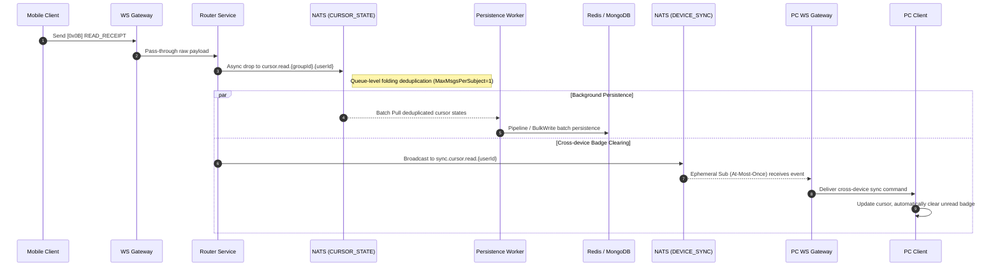

import Tabs from '@theme/Tabs';
import TabItem from '@theme/TabItem';

# Cross-Device Read Receipt Sync and Unread Count Calculation

This guide will demonstrate how Ocean Chat combines various underlying microservices, streams, and protocol commands to achieve elegant multi-device read receipt synchronization, as well as the core high-performance unread count calculation mechanism behind it.

By reading this guide, you will understand how the system accurately collects read cursors with "zero blocking", rapidly calculates precise unread counts within `O(log(N))` complexity, and clears unread notification badges in real-time across all other devices logged in by the user after they read a message on any single device.

## Core Components Required

To complete cross-device cursor synchronization, the following stateless microservices and stateful JetStream Streams must collaborate:

<Tabs>
  <TabItem value="services" label="Required Microservices" default>
    1. **Connection Gateway (oceanchat-ws-gateway)**: Responsible for handling long-lived WebSocket connections, receiving the `[0x0B] READ_RECEIPT` command, and silently delivering it to desktop clients.
    2. **Router Service (oceanchat-router)**: Receives the signal passed through by the gateway, routes and publishes it to the `CURSOR_STATE` stream, and triggers cross-device `DEVICE_SYNC` synchronization.
    3. **Presence Service (oceanchat-presence)**: Based on Redis. Provides calculation support by executing the ZSET `ZCOUNT` command when users pull their unread counts.
    4. **Persistence Pipeline (MessagePersistence Worker)**: A background work unit. Responsible for batch pulling folded cursors and completing dual-writing of cursors using Redis Pipeline and MongoDB BulkWrite.
  </TabItem>
  <TabItem value="streams" label="Required JetStream">
    1.  **CURSOR_STATE Stream**:
        - Subject: `cursor.read.\{groupId}.\{userId}`
        - Purpose: Lightning-fast asynchronous write buffer. Configured with `max_msgs_per_subject: 1` to fold massive high-frequency cursor updates of a single user into a single record, preventing database write storms.
    2.  **DEVICE_SYNC Stream**:
        - Subject: `sync.cursor.read.\{userId\}`
        - Purpose: Used to broadcast cursor roaming events to the connection gateways, achieving instantaneous cross-device badge clearing.
  </TabItem>
</Tabs>

---

## 1. Client Sends Read Receipt

When a user opens a chat window on a mobile device and actually views new messages, the client must send a read receipt specifying the Sequence ID (`lastReadSeqId`) of the latest message they have currently seen.

:::info Client Intelligent Debounce Deduplication
To prevent users from triggering an uplink "receipt sending storm" when rapidly scrolling through message history, the client **should not** immediately send a receipt every time a new message is rendered.
The client needs to implement a **200ms intelligent debounce window**: if multiple receipt update requests are triggered within a continuous 200ms period, the client only needs to extract and send the one with the largest `lastReadSeqId` at the end of the window. This mechanism builds the first and highly effective line of defense against traffic at the edge.
:::

Please use the `[0x0B] READ_RECEIPT` binary command defined in the Monkey Protocol:

```json title="Read Receipt Payload"
{
  "groupId": "G1001",
  "userId": "U8899",
  "lastReadSeqId": 1050
}
```

:::tip Gateway Zero I/O Blocking
After this signal arrives at `oceanchat-ws-gateway`, the gateway only unpacks and passes it through, immediately handing it over to the backend `oceanchat-router` for routing. On this link, the service will never immediately perform any synchronous Redis or MongoDB write operations.
:::

## 2. Router Dispatch and Asynchronous State Folding

Upon receiving this receipt, the `oceanchat-router` service directly publishes it as a state change event into the NATS `CURSOR_STATE` stream, with the routing subject precisely matched as: `cursor.read.\{groupId\}.\{userId\}`.

:::info Anti-Storm Mechanism (Queue Collapse)
The `CURSOR_STATE` stream achieves extreme write buffering by configuring `max_msgs_per_subject: 1`. Suppose a user rapidly scrolls through history in a 10,000-member group, triggering 50 cursor updates within 1 second. When these updates enter the same Subject, NATS automatically discards the old values. The queue for this subject always only retains the absolute latest cursor state for Workers to pull, fundamentally cutting off write storms caused by read storms.
:::

## 3. Batch Persistence and Cache Updating

At this stage, the `MessagePersistence Worker` executes a dimensionality-reduction storage update in the background:

1. **Batch Pulling**: The worker uses the Pull mode to pull up to 1000 deduplicated latest cursor states at a time from the `CURSOR_STATE` stream.
2. **Batch Cache Updating**: Using Redis Pipeline, it concurrently writes the `lastReadSeqId` of these 1000 users into the Redis cursor cache in one go.
3. **Database Fallback Persistence**: Subsequently, it constructs bulk operation commands to execute `bulkWrite` against MongoDB, finally and safely persisting the cursor states to disk.

## 4. Advanced Reveal: Sliding Window (Read-Diffusion) Unread Calculation Based on Redis ZSET

**Why go to such great lengths to collect and persist users' `lastReadSeqId`?**

This is to cooperate with the "unread badge calculation" for large group chats. The traditional "write-diffusion" (incrementing the unread counter for 10,000 group members by +1 for every message sent) leads to catastrophic write storms. Ocean Chat innovatively adopts a **"Read-Diffusion" sliding window model based on Redis ZSET (Sorted Set):**

1. **Public Message Timeline (ZADD)**

   When a new message is generated in a group, the server only executes 1 write operation to the group's public Redis ZSET (e.g., Key: `group:msg:G1001`). The message's `SyncSeqId` is inserted as the Score, and the message ID as the Member.

2. **Constant-Space Sliding Window (ZREMRANGEBYRANK)**

   To prevent infinite memory expansion, the server conveniently executes a truncation operation after each new message insertion, always only keeping the most recent 500 messages for that group. This forms a fixed-size sliding window in memory, with an absolute space complexity of `O(1)`.

3. **Lightning-Fast Badge Calculation (ZCOUNT)**

   When it's necessary to deliver an unread count to user `U8899`, the `oceanchat-presence` service extracts their latest persisted cursor (`lastReadSeqId: 1050`) and sends a command to Redis: `ZCOUNT group:msg:G1001 (1050 +inf`. Relying on the Skip List, Redis instantaneously calculates the unread count within `O(log(N))` complexity.

## 5. Cross-Device Sync and Real-Time Badge Clearing

At the same time (or after persistence is completed), if a user reads a message on their mobile device, the red badge on their desktop interface (or other active clients) must also disappear automatically:

1. **Trigger Roaming Broadcast**: `oceanchat-router` broadcasts a sync cursor event to the `sync.cursor.read.\{userId\}` subject of the `DEVICE_SYNC` stream.
2. **Gateway Pull and Distribution**: All `oceanchat-ws-gateway` instances where the target user currently maintains a connection listen to this subject using an ephemeral, At-Most-Once subscription pattern. Upon receiving the event, the gateway assembles a cross-device clear command and silently delivers it to the client.
3. **Multi-Device State Self-Healing**: After another desktop client intercepts the downlink sync event, it silently updates the `MaxLocalSyncSeqId` cursor for the corresponding group in its local database, thereby instantaneously clearing the unread red badge on the UI without any manual clicking intervention.

## Expected Outcome

Through the above steps, a highly scalable multi-device cursor synchronization pipeline is successfully constructed.

### End-to-End Sequence Diagram

The following diagram illustrates the complete sequence of how the system processes "asynchronous persistence" and "roaming sync for desktop badge clearing" in parallel in the background after a user sends a read receipt on a mobile device:


