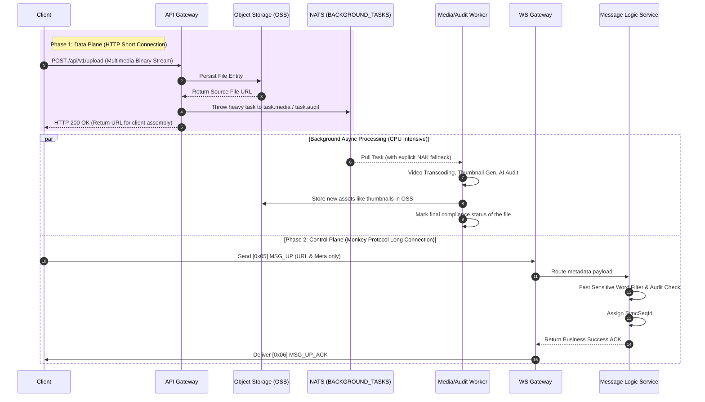

import Tabs from '@theme/Tabs';
import TabItem from '@theme/TabItem';

# Multimedia and Compliance Audit Processing

This guide demonstrates how Ocean Chat gracefully and performantly handles multimedia files such as images, audio, and video sent by users in high-concurrency chat scenarios, and performs strict sensitive word filtering and NSFW compliance auditing.

By reading this guide, you will understand how the system utilizes the **"Long-Short Chain Collaboration"** architecture to completely avoid Head-of-Line (HoL) blocking at the gateway, and leverages the NATS JetStream `BACKGROUND_TASKS` work queue to achieve perfect physical isolation between CPU-intensive operations (such as video transcoding, thumbnail extraction, NSFW auditing) and the core real-time message link.

## Core Components Required

To complete multimedia processing and compliance auditing, the following stateless microservices and JetStream streams must collaborate:

<Tabs>
  <TabItem value="services" label="Required Microservices" default>
    1. **API Gateway (oceanchat-api-gateway)**: Receives HTTP large file upload requests from clients, interfaces with external Object Storage (OSS), and triggers background asynchronous processing tasks.
    2. **Connection Gateway (oceanchat-ws-gateway)**: Responsible for handling long-lived WebSocket connections and receiving extremely lightweight `[0x05] MSG_UP` business signals (containing only multimedia metadata).
    3. **Message Logic Service (oceanchat-message)**: Responsible for high-speed synchronous sensitive word filtering of plain text content and deciding message status based on asynchronous NSFW audit results.
    4. **Media & Audit Workers**: Dedicated CPU-intensive background work units responsible for audio/video transcoding, thumbnail generation, and calling external AI models for NSFW (pornography/violence) identification.
  </TabItem>
  <TabItem value="streams" label="Required JetStream">
    1.  **BACKGROUND_TASKS Stream**:
        - Subject: `task.*` (e.g., `task.media.transcode`, `task.audit.nsfw`)
        - Purpose: A WorkQueue designed specifically for CPU-intensive tasks. Protects the main business flow from being dragged down by heavy computation.
    2.  **IM_HANDOFF Stream**:
        - Subject: `im.orchestrate.msg`
        - Purpose: Final compliant and fully processed valid messages are delivered to this stream to cross the write barrier.
  </TabItem>
</Tabs>

---

## 1. Short-Connection Upload (Data Plane)

The Monkey Protocol strictly prohibits direct transmission of large binary file streams through WebSocket connections, as this leads to severe Head-of-Line (HoL) blocking and gateway OOM (Out Of Memory) issues.

Clients must first upload image or audio/video entities to the `oceanchat-api-gateway` (or directly to OSS/S3 using pre-signed URLs) via HTTP/HTTPS short connections.

## 2. Triggering and Publishing Heavy Background Tasks

Once the file is successfully persisted in Object Storage (OSS), the `oceanchat-api-gateway` (or a business microservice) immediately generates the raw URL of the file, assembles it into a processing task, and asynchronously publishes it to the NATS JetStream `BACKGROUND_TASKS` stream.

```javascript title="Publishing Multimedia Processing and Audit Tasks"
// Publish transcoding and thumbnailing tasks
nats.publish("task.media.process", { fileUrl: "...", type: "VIDEO" });

// Publish security compliance audit tasks in parallel
nats.publish("task.audit.nsfw", { fileUrl: "...", type: "IMAGE" });
```

## 3. Worker Pull and Explicit NAK Fault Tolerance

Background **Media Services** and **Audit Services**, acting as consumer groups, pull tasks from `task.*` subjects. Since multimedia processing is CPU-heavy and time-consuming (typically ranging from seconds to minutes), this design offers significant elasticity:

- **Peak Shaving**: Regardless of how many videos are uploaded by the frontend, background Workers only pull tasks based on their own CPU capacity ("doing what they can"), ensuring they are never overwhelmed.
- **Explicit NAK Fallback**: If ffmpeg crashes during video transcoding or a third-party AI NSFW API call times out, the work unit sends a Negative Acknowledgment (NAK) to NATS. This causes the task to be immediately re-queued and handed off to another healthy instance for retry, rather than waiting for a timeout.

## 4. Long-Connection Delivery (Control Plane Signaling)

After a successful file upload, the client receives the file URL. The client then encapsulates this URL and metadata (such as width, height, and duration) into an extremely lightweight Protobuf payload and sends it through the Monkey Protocol long-lived connection.

```json
{
  "ClientMsgId": "123e4567-e89b-...",
  "MsgType": "VIDEO",
  "Payload": {
    "URL": "https://oss.example.com/videos/v1.mp4",
    "ThumbnailURL": "https://oss.example.com/thumbs/v1.jpg",
    "Duration": 15,
    "Width": 1080,
    "Height": 1920
  }
}
```

## 5. Sensitive Word Interception and Asynchronous Compliance Decision

When the `[0x05] MSG_UP` signal carrying multimedia metadata reaches the backend `oceanchat-message` logic service, the system performs a final compliance review:

- **Synchronous Plain Text Filtering**: For accompanying text descriptions, a high-speed sensitive word filter based on Trie tree or DFA algorithms is used for synchronous interception. If prohibited words are found, the system can return a failure or replace them with masks (`***`).
- **Asynchronous NSFW Status Validation**: For image/video URLs, the message service can rapidly query the file's "compliance status" in Redis or the database (written asynchronously by the aforementioned Audit Service).
  - If the file has been judged as non-compliant (**NSFW**), the message is intercepted and not allowed to cross the write barrier.
  - If it is still "**under review**", the message can be released first (**Send-first, Audit-later**). If the Audit Service subsequently determines a violation, a "recall/block" command is broadcasted via system signals to the entire network.

## Expected Outcome

Through this "Long-Short Chain Collaboration" and background asynchronous processing mechanism, Ocean Chat completely separates heavy media data transmission and time-consuming CPU computation from the core `IM_CORE` real-time link, ensuring absolute high throughput and low latency for chat signaling.

## End-to-End Sequence Diagram


