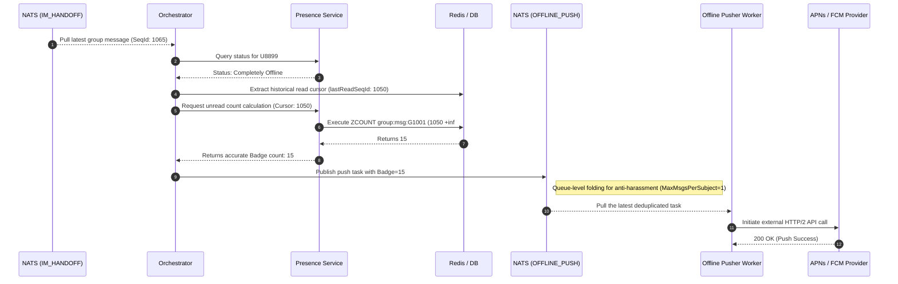

import Tabs from '@theme/Tabs';
import TabItem from '@theme/TabItem';

# Accurate Calculation of Offline Push Unread Badges

This guide demonstrates how Ocean Chat calculates precise unread counts (Badges) and performs silent wake-up pushes for offline devices, even in high-concurrency scenarios involving large groups of 10,000+ members.

By reading this guide, you will understand how the system extracts historical read cursors, rapidly calculates the total global unread messages with `O(log(N))` complexity when a user's app is completely offline or suspended, and delivers payloads with accurate Badge values to third-party push providers (Apple APNs / Google FCM).

## Core Components Required

To complete the accurate unread count calculation and offline delivery, the following stateless microservices and stateful JetStream streams must collaborate:

<Tabs>
  <TabItem value="services" label="Required Microservices" default>
    1. **Orchestrator Service (oceanchat-orchestrator)**: Responsible for determining user offline status, extracting read cursors, calling internal interfaces to calculate unread counts, and finally generating push tasks.
    2. **Presence Service (oceanchat-presence)**: Based on Redis. Exposes high-speed `ZCOUNT` query capabilities to support unread count calculations.
    3. **Offline Pusher Worker (oceanchat-pusher-offline)**: A background work unit. Responsible for consuming the offline push queue and sending HTTP/2 payloads containing specific `badge` values to Apple or Google servers.
  </TabItem>
  <TabItem value="streams" label="Required JetStream">
    1.  **IM_HANDOFF Stream**:
        - Subject: `im.orchestrate.msg`
        - Purpose: Provides the latest message source to trigger offline push decisions.
    2.  **OFFLINE_PUSH Stream**:
        - Subject: `push.offline.{vendor}.{userId}`
        - Purpose: A peak-shaving queue for third-party push tasks. Configured with a `max_msgs_per_subject: 1` strategy to achieve notification "storm folding" (deduplication).
  </TabItem>
</Tabs>

---

## 1. Message Trigger and Offline Determination

When a new message is generated in a group chat and successfully crosses the write barrier (written to the `im.orchestrate.msg` subject), `oceanchat-orchestrator` pulls that message.

The orchestrator queries the target recipient's online status in Redis. If it finds that user `U8899` currently has no active WebSocket/TCP connections, the system determines the user to be "offline" and enters the offline push processing branch.

## 2. Extracting the Global Read Cursor

To calculate the unread count, the system first needs to know where the user last left off.

Thanks to the `CURSOR_STATE` asynchronous persistence stream designed in our *Cross-Device Read Receipt Sync* strategy, the user's latest read cursor is safely recorded. The orchestrator rapidly extracts the latest read sequence number (`lastReadSeqId`) for that user in the target group (e.g., `G1001`) from MongoDB or the Redis cache.

## 3. Core: Using ZCOUNT for Rapid Group Unread Calculation

For a large group of 10,000 people, we **absolutely cannot** perform a full table scan in MongoDB like `SELECT COUNT(*) WHERE SeqId > lastReadSeqId`, as this would cause fatal database overload during traffic peaks.

Instead, the orchestrator passes the extracted cursor to the `oceanchat-presence` service, which utilizes the sliding window of a Redis ZSET (Sorted Set) for lightning-fast dimensionality reduction calculation:

```redis title="Executing ZCOUNT Query"
ZCOUNT group:msg:G1001 (1050 +inf
```

- **`1050`**: The `lastReadSeqId` for user `U8899`.
- **`+inf`**: Represents positive infinity (i.e., the latest message).

The underlying Skip List in Redis can return the number of new messages in this interval (e.g., returning `15`) in `O(log(N))` time, typically within microseconds (`μs`).

:::info O(1) Space Complexity and Fallback Truncation
As previously mentioned, this ZSET only retains the most recent 500 messages in the group (truncated via `ZREMRANGEBYRANK`). If the user's cursor is extremely old and falls outside the ZSET's retention window, `ZCOUNT` will return 500, which the system handles as a `500+` badge indicator, ensuring memory and calculation costs remain constant.
:::

## 4. Assembling the Push Payload and Folding for Storm Protection

After obtaining the accurate unread count, the orchestrator assembles this number into a push payload optimized for APNs/FCM formats.

```json title="APNs Push Payload Example"
{
  "aps": {
    "alert": {
      "title": "Ocean Group",
      "body": "Someone mentioned you..."
    },
    "badge": 15,
    "sound": "default",
    "content-available": 1
  },
  "apns-collapse-id": "group-G1001"
}
```

Subsequently, the orchestrator publishes this task to the `OFFLINE_PUSH` stream subject `push.offline.apns.U8899`. Thanks to the `max_msgs_per_subject: 1` strategy, even if 100 messages trigger pushes in that group within one second, NATS will automatically discard old tasks and only keep the notification task with the latest unread count (e.g., `badge: 15`), significantly saving external API call costs.

## 5. Vendor Delivery and Device-Side Presentation

Finally, the background offline push worker `oceanchat-pusher-offline` pulls this folded final task and sends it to Apple or Google servers via HTTP/2.

Upon receiving the instruction, the user's mobile OS silently updates the red number in the upper-right corner of the app icon to `15`, completing the calculation and delivery loop.

## End-to-End Sequence Diagram

The following diagram illustrates the complete sequence of calculating precise Badge unread counts and performing notification storm protection during offline pushes:


