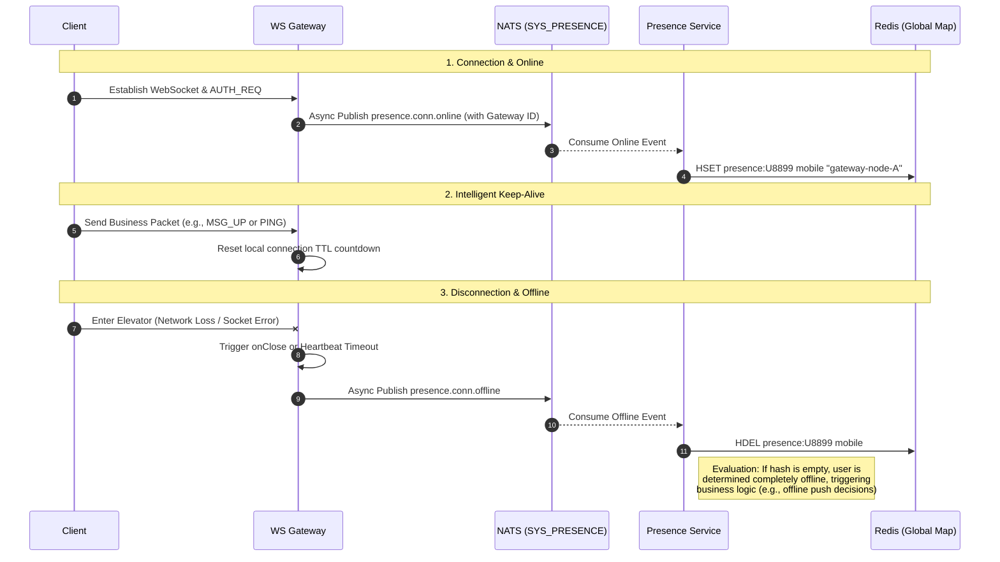

import Tabs from '@theme/Tabs';
import TabItem from '@theme/TabItem';

# User Presence Management and Global Presence Map

This guide demonstrates how Ocean Chat accurately perceives user online (connection) and offline (disconnection) status in high-concurrency scenarios and builds a "Global Presence Map" to support precise message routing.

By reading this guide, you will understand how the system uses an extremely lightweight event-driven model to decouple stateful gateways from stateless business logic, gracefully handling network status changes and multi-device roaming under hundreds of thousands or even millions of concurrent connections.

## Core Components Required

To complete the real-time update of the presence map, the following gateways, microservices, and stream channels must collaborate:

<Tabs>
  <TabItem value="services" label="Required Microservices" default>
    1. **Connection Gateway (oceanchat-ws-gateway)**: The only "stateful" edge node. It holds real TCP/WS handles and emits transient online/offline events when connections are established, abnormally disconnected, or timed out.
    2. **Presence Service (oceanchat-presence)**: A stateless business logic unit. It is responsible for pulling online/offline events and transforming them into global map data in Redis.
  </TabItem>
  <TabItem value="streams" label="Required JetStream">
    1.  **SYS_PRESENCE Stream**:
        - Subjects: `presence.conn.online`, `presence.conn.offline`
        - Purpose: Buffers user connection status change events during extreme concurrency, protecting Redis from "connection storms" (e.g., massive disconnections/reconnections during server restarts).
  </TabItem>
  <TabItem value="storage" label="Storage Support">
    1.  **Redis Cache**:
        - Purpose: Stores the "Global Presence Map". Typically uses a Hash structure where the key is `presence:{userId}`, the field is `deviceId/deviceType`, and the value is the corresponding `gatewayNodeId` and timestamp.
  </TabItem>
</Tabs>

---

## 1. Connection Establishment and Online Event (Online)

When a user opens the app or reconnects after a network interruption, the client performs a low-level TCP handshake and WebSocket upgrade with `oceanchat-ws-gateway`, completing authentication based on `[0x01] AUTH_REQ`.

1. **Local State Registration**: Once authentication succeeds, the connection gateway binds the physical connection with `userId` and `deviceId` in its memory.
2. **Asynchronous Event Emission**: The gateway **does not** directly manipulate Redis. Instead, it assembles an extremely lightweight online event payload and asynchronously publishes it to the NATS `SYS_PRESENCE` stream (subject: `presence.conn.online`).

:::tip Extreme Decoupling
The gateway is only responsible for throwing events and then immediately returns to continue processing network I/O. This "Fire-and-Forget" design ensures that even during a "thundering herd effect" where millions of users reconnect simultaneously, the gateway won't suffer from thread blocking due to waiting for Redis writes.
:::

## 2. Intelligent Keep-Alive Mechanism (Any Message is Pong)

To maintain connection viability, Ocean Chat abandons rigid periodic heartbeat strategies.

The gateway maintains a TTL (e.g., 5 minutes) countdown timer for each connection locally.

1. **Business Packets as Heartbeats**: As long as the client sends **any** valid uplink data packet (whether a simple `[0x03] PING` or a chat signal `[0x05] MSG_UP`), the gateway immediately resets the connection's TTL countdown.
2. This design significantly reduces the frequency of meaningless empty packets sent by mobile devices in the background, saving user battery and network bandwidth to the extreme.

## 3. Disconnection and Offline Perception (Offline)

User disconnection typically falls into two categories, both accurately perceived by the gateway:

- **Graceful/Hard Disconnection (TCP FIN/RST)**: The user actively kills the app process, cuts off Wi-Fi, or enters an elevator causing the low-level socket to be severed by the OS or network middleware. An `onClose` event is triggered instantly at the gateway's low level.
- **Heartbeat Timeout**: The client enters deep sleep and cannot send heartbeats, causing the gateway's local TTL countdown to reach zero. The gateway will actively terminate the zombie connection.

Once a disconnection is perceived, the gateway immediately publishes a `presence.conn.offline` event to the `SYS_PRESENCE` stream.

## 4. Global Presence Map Updates

The backend `oceanchat-presence` service, acting as a consumer group, continuously pulls these interleaved online/offline events from the `SYS_PRESENCE` stream and draws the global presence map in Redis.

### Hash Structure Supporting Simultaneous Multi-Terminal Login

Since modern IM supports multi-device login (e.g., phone and computer online simultaneously), the presence service uses a Hash structure (`HSET` / `HDEL`) in Redis to precisely maintain the routing nodes for each device.

```redis title="Redis Presence Map Structure Example"
// Key: presence:{userId}
HSET presence:U8899 mobile "gateway-node-A"
HSET presence:U8899 desktop "gateway-node-B"
```

**Processing Logic**:

- **Receive `online` event**: Execute `HSET` to record the specific gateway node ID where the device is currently connected. This tells `oceanchat-orchestrator` which gateway to push to when delivering online messages.
- **Receive `offline` event**: Execute `HDEL` to remove the device from the Hash. If the Hash becomes empty after deletion, it indicates that all devices for the user have disconnected, and the user is now completely "offline".

## End-to-End Sequence Diagram

The following diagram illustrates the complete lifecycle of a user establishing a connection, maintaining heartbeats, and finally going offline, with the system updating the global presence map in real-time:


