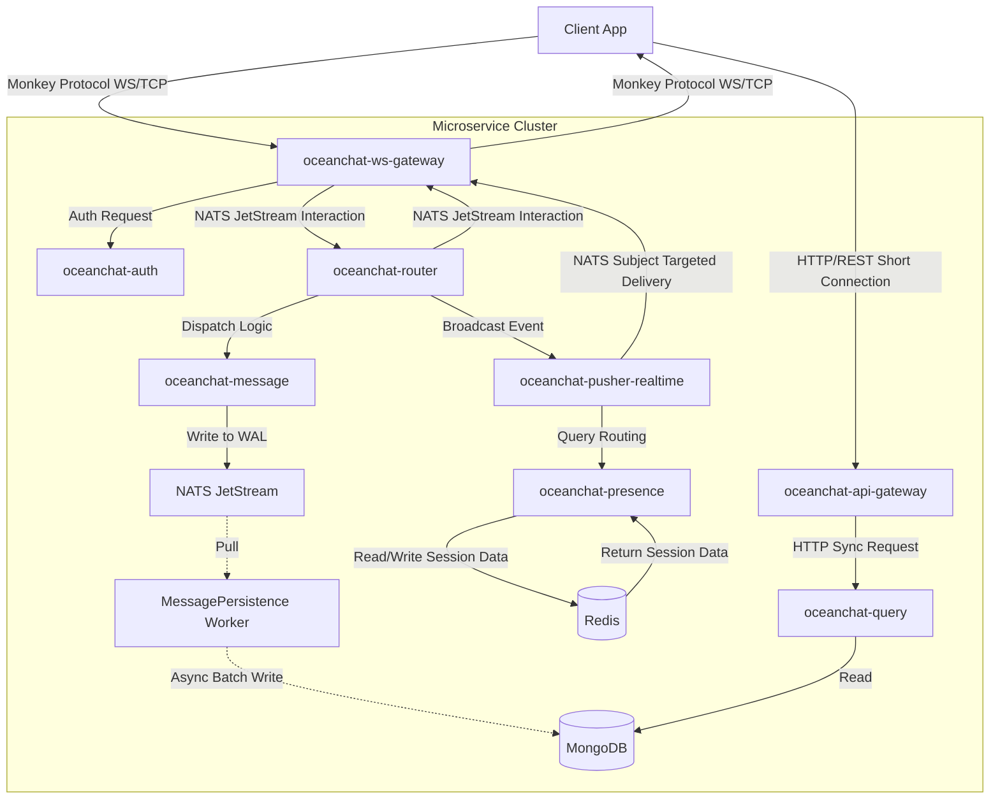
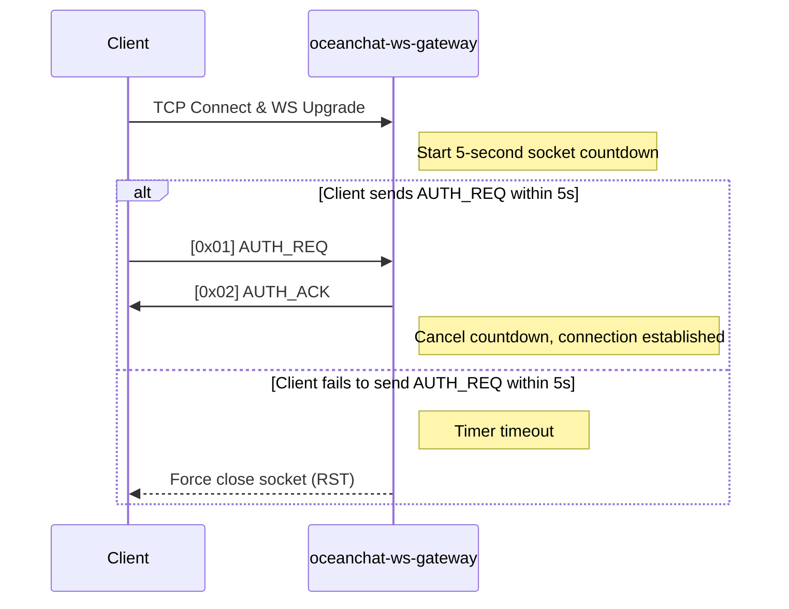
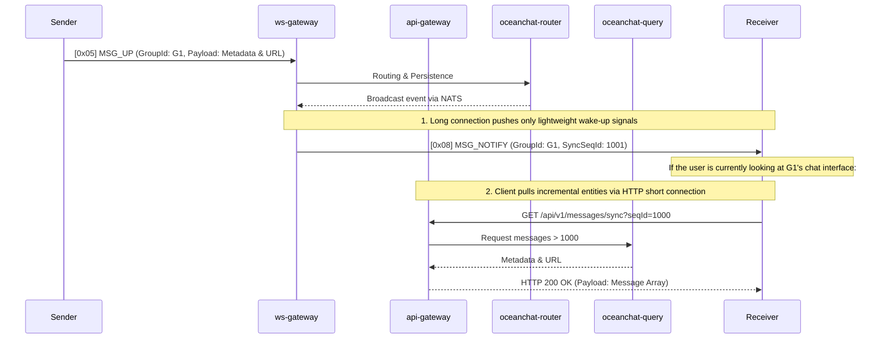
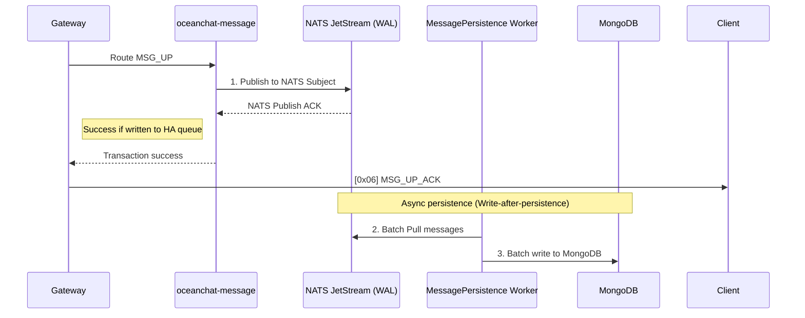
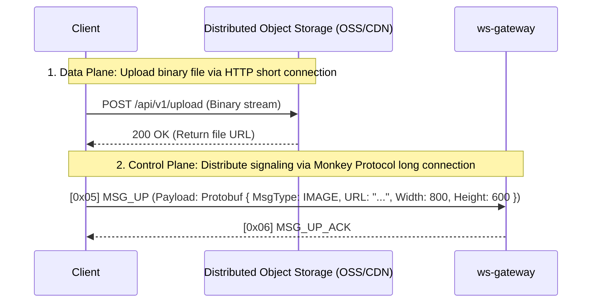

<head>
  <meta name="twitter:card" content="summary_large_image" />
  <meta property="og:title" content="Monkey Protocol Specification | Ocean Chat" />
  <meta property="og:description" content="Ocean Chat Monkey Protocol comprehensive reference specification. Covers 100,000+ concurrent WebSocket messaging, push-pull hybrid model, microservice architecture data flow, and high-reliability guarantee mechanisms." />
  <link rel="canonical" href="https://jameswilson19970101.github.io/ocean.chat.docs/docs/devdocs/monkey-protocol-spec" />
</head>

# Monkey Protocol Specification

**Monkey Protocol** is Ocean Chat's self-developed high-performance binary application-layer protocol, running on top of WebSocket or pure TCP. The protocol is designed to support a distributed microservices architecture with **10 million+ concurrent connections**.

This reference document specifies the byte-accurate frame structure, instruction set, and strict state machine operations that must be followed in gateway and client implementations.

:::info TODO: Multi-protocol Gateway and Underlying Transport Optimization
While WebSocket (WS) is currently used for maximum cross-platform compatibility (especially for Web and Mini Programs), for native mobile Apps (iOS/Android), **pure TCP is the preferred solution for achieving extreme power efficiency and connection stability**.

In future planning, the gateway needs to be upgraded to a "multi-protocol gateway" that exposes dual ports (e.g., `TCP: 8080` and `WS: 8081`). Whether the outer layer is a WS frame after an HTTP Upgrade or a pure TCP byte stream, the 12-byte Monkey Protocol binary core payload passed to the backend microservices after stripping the transport layer encapsulation will be identical.
:::

## 1. Architecture Overview and Microservice Data Flow

Ocean Chat's architecture strictly isolates network I/O from business logic. This protocol relies on the following core microservices:

- **`oceanchat-ws-gateway`**: Completely stateless. Responsible only for long-connection lifecycle management, minimalist protocol encoding/decoding, downlink signaling micro-batching, and token bucket rate limiting.
- **`oceanchat-api-gateway`**: Stateless HTTP gateway. Responsible for handling client HTTP requests (such as incremental data pulls), providing rate limiting and preliminary authentication.
- **`oceanchat-auth`**: Responsible for verifying JWTs during the initial connection handshake.
- **`oceanchat-presence`**: Manages global online status in Redis (`UserId -> DeviceType -> Gateway IP`).
- **`oceanchat-router`**: The core routing orchestrator, responsible for interacting with NATS JetStream.
- **`oceanchat-message`**: Responsible for generating globally unique Sequence IDs and reliably writing messages to NATS JetStream (Write-Ahead Log) for high-throughput asynchronous persistence.
- **`oceanchat-query`**: Responsible for incremental message synchronization (via HTTP short connections) in cases of offline wake-up, new message arrival, or message gaps.
- **`oceanchat-orchestrator`**: The push decision brain, responsible for querying online status and splitting messages into online wake-up notifications (`MSG_NOTIFY`) or offline push tasks.
- **`oceanchat-pusher-realtime`**: Responsible for the actual delivery of online signaling, dispatching `MSG_NOTIFY` to specific gateway nodes.

### End-to-End Data Flow

## 2. Frame Structure

Every Monkey Protocol data packet consists of a strictly fixed-length **12-byte Header** and a variable-length **Payload**.

### 2.1 Header Layout

| Offset | Field     | Size     | Type      | Description                                                                                                                                                                                                                                                                     |
| :----- | :-------- | :------- | :-------- | :------------------------------------------------------------------------------------------------------------------------------------------------------------------------------------------------------------------------------------------------------------------------------ |
| 0      | `Magic`   | 2 Bytes  | `UInt16`  | Magic number `0x4D4B` ("MK"), used to identify the protocol.                                                                                                                                                                                                                    |
| 2      | `Version` | 1 Byte   | `UInt8`   | Protocol version number for forward compatibility (Current: `0x01`).                                                                                                                                                                                                            |
| 3      | `Cmd`     | 1 Byte   | `UInt8`   | Command type identifier (see Command Registry).                                                                                                                                                                                                                                 |
| 4      | `Flags`   | 1 Byte   | `Bitmask` | 8-bit flags to control protocol features (e.g., compression, ACK).                                                                                                                                                                                                              |
| 5      | `ReqId`   | 3 Bytes  | `UInt24`  | Request ID, used to match requests and responses within the current connection. It is used cyclically after reaching its limit. It starts at 1, with 0 already occupied. For performance and network bandwidth considerations, `reqid` should be used instead of `clientMsgId`. |
| 8      | `Length`  | 4 Bytes  | `UInt32`  | Byte length of the variable Payload (hard limit: max 16KB).                                                                                                                                                                                                                     |
| 12     | `Payload` | Variable | `Binary`  | **Protobuf** encoded business payload.                                                                                                                                                                                                                                          |

:::warning JSON is Strictly Prohibited in Production
To support 100,000+ concurrency, JSON serialization in the Payload is strictly forbidden. **Protobuf** must be enforced. This saves over 40% bandwidth and significantly reduces CPU parsing overhead at the gateway.
:::

### 2.2 Flags (`Flags`)

To minimize Payload redundancy, boolean states are encoded into the `Flags` byte:

- **Bit 0 (`0x01`) - `REQUIRE_ACK`**: If set to 1, the receiver must send an explicit acknowledgment (ACK).
- **Bit 1 (`0x02`) - `COMPRESSED`**: If set to 1, indicates the Payload is compressed using Zstd or Gzip.
- **Bit 2 (`0x04`) - `ENCRYPTED`**: If set to 1, indicates the Payload is symmetrically encrypted (e.g., AES-GCM).
- **Bit 3 (`0x08`) - `NO_RETRY`**: If set to 1, indicates the signaling is extremely time-sensitive (e.g., "The other party is typing..."). During network reconnection and automatic replay of the underlying In-Flight Queue, the client SDK will directly discard packets with this flag to save bandwidth during the network recovery burst.

### 2.3 ReqId Matching and Server Push

In normal RPC (Remote Procedure Call) interaction flows, `ReqId` is used to achieve strict "request-response" matching (e.g., the client sends `MSG_UP` with `ReqId: 123`, and the server returns `MSG_UP_ACK` with the same `ReqId: 123`).

However, in actual business scenarios, there are many **Server Push** or unidirectional event broadcast scenarios where the client did not initiate any preceding request. Typical scenarios include:

- The server node proactively sends a `503 Service Unavailable` `EXCEPTION_ACK` notification before shutting down due to rolling updates.
- Proactive disconnection notifications like `401 Unauthorized` due to security reasons or JWT Token revocation after a password change.
- Multi-terminal read receipt synchronization events.

**Protocol Convention:** For all unidirectional push or broadcast frames initiated by the server that are not responses to specific client requests, the **`ReqId` in the Header must be strictly set to `0`**.
When the client parses the underlying protocol and finds `ReqId: 0`, it should clearly understand that this is not a callback response for a specific business interface. The client should not look for it in the local Request-Promise matching queue but should treat it as a global asynchronous event or system-level notification, passing it directly to the global event bus or state machine.

## 3. Command Registry (`Cmd`)

| Cmd Hex | Command Name    | Direction        | Description                                                                                                                                   |
| :------ | :-------------- | :--------------- | :-------------------------------------------------------------------------------------------------------------------------------------------- |
| `0x01`  | `AUTH_REQ`      | Client -> Server | Request connection authentication. Payload includes `DeviceType`, `DeviceId`, JWT, and client `supported_versions`.                           |
| `0x02`  | `AUTH_ACK`      | Server -> Client | Authentication result response.                                                                                                               |
| `0x03`  | `PING`          | Client -> Server | Keep-alive heartbeat request (Payload must be empty).                                                                                         |
| `0x04`  | `PONG`          | Server -> Client | Keep-alive heartbeat response (Payload must be empty).                                                                                        |
| `0x05`  | `MSG_UP`        | Client -> Server | Client-to-server chat message. Payload must carry `ClientMsgId` for idempotency.                                                              |
| `0x06`  | `MSG_UP_ACK`    | Server -> Client | Server acknowledgment of an uplink message. Payload includes assigned `SyncSeqId` and `ServerTimestamp`.                                      |
| `0x08`  | `MSG_NOTIFY`    | Server -> Client | Global "push-pull hybrid" new message notification (wake-up only, no entity). Payload contains the target session and the latest `SyncSeqId`. |
| `0x0B`  | `READ_RECEIPT`  | Both             | Read receipt synchronization signaling for multi-terminal.                                                                                    |
| `0x0C`  | `EXCEPTION_ACK` | Server -> Client | Global exception response. Used to send error messages, status codes (e.g., 426 version mismatch), and `server_supported_versions`.           |

## 4. Connection Lifecycle and Security

### 4.1 Handshake Window Timeout

To defend against Slowloris attacks and file descriptor (FD) exhaustion, `oceanchat-ws-gateway` enforces a very short connection establishment window at the TCP layer.

### 4.2 Intelligent Keep-alive (Any Message is Pong)

Ocean Chat abandons the traditional "bidirectional periodic PING/PONG" strategy and adopts an **Asymmetric Time Difference** and **Implicit Heartbeat** mechanism to significantly save bandwidth and address weak network probing:

1. **Business Packets as Heartbeats (Implicit Heartbeat):** Whether it's PING, PONG, or any business packet (e.g., `MSG_UP`), as long as the gateway receives legitimate data from the client, it immediately refreshes the active timestamp of that connection. The client works identically: receiving any data from the server resets its heartbeat countdown.
2. **Asymmetric Interval:** The server's proactive PING interval is fixed at **30 seconds**, the client's fallback PING interval is fixed at **35 seconds**, and the absolute disconnect timeout for both ends is **60 seconds**. During normal idle periods, the server always triggers the PING first; the client replies with a PONG and resets its local 35-second timer, perfectly avoiding the bandwidth waste caused by bidirectional PING collisions.

_See Monkey Protocol: Asymmetric Heartbeat and Keep-alive Design for details._

### 4.3 Traffic Shaping and Avalanche Prevention

- **Layered Token Bucket Rate Limiting:**
  - **Connection Layer (Gateway):** Limits the overall request rate per physical connection (e.g., 20 requests/sec) to prevent malicious flooding. Violating packets are discarded immediately.
  - **Business Layer (Router):** After decoding, performs higher-dimension rate limiting based on `UserId` (e.g., 100 business messages/sec) to prevent distributed coordinated attacks. Business error codes can be returned when intercepted.
- **Exponential Backoff Reconnection:** When the network is disconnected, the client is **strictly forbidden** from reconnecting immediately and repeatedly. It must implement exponential backoff with random jitter (e.g., 1s, 2s, 4s, 8s) to prevent an authentication storm that could crash `oceanchat-auth`.

### 4.4 Smooth Version Negotiation

To prevent old clients from entering an infinite reconnection loop due to incompatible server upgrades, Monkey Protocol implements a version negotiation mechanism during the handshake:

1. **Compatibility Probe**: The client proactively reports its supported protocol version list (`supported_versions`) in the `AUTH_REQ`.
2. **Graceful Rejection**: If the gateway does not support the preferred `Version` in the Header, it proactively sends an `[0x0C] EXCEPTION_ACK` (error code `426 Protocol Mismatch`) with the list of currently supported versions.
3. **Silent Downgrade and Forced Update**: After intercepting the 426 error, the client SDK calculates the version intersection. If an intersection exists, it silently downgrades the protocol version and re-handshakes; otherwise, it disconnects and requires the user to update the App.

_See Monkey Protocol: Smooth "Version Negotiation" Mechanism in the Handshake Phase for details._

## 5. Message Delivery Model

### 5.1 Global Message Delivery: Push-Pull Hybrid

To maintain extremely high throughput for the gateway and prevent head-of-line blocking caused by large payloads, Ocean Chat abandons the practice of the server directly "stuffing" message entities to the client. Instead, it adopts a **Push-Pull Hybrid** model. The long connection is only responsible for "pushing" extremely lightweight wake-up signals, while the short connection (HTTP) is responsible for "pulling" the actual data.

**Cache Breakdown Defense**: When a large group message notification reaches a massive number of users, clients concurrently initiate HTTP synchronization requests. The `oceanchat-query` service or API gateway must utilize Redis caching and "distributed locking/singleflight" mechanisms to merge concurrent queries for the same `SyncSeqId` range to avoid breaking through to the underlying MongoDB.

### 5.2 Notification Collapse and Micro-Batching

To maximize throughput and significantly reduce software interrupts, `oceanchat-ws-gateway` implements signal collapse and micro-batching. If multiple new message events for the same user and same session are generated on the NATS bus within a 200ms window, the gateway **will not** send multiple `MSG_NOTIFY` signals. Instead, it will automatically collapse them, keeping only **one** `MSG_NOTIFY` signal with the largest `SyncSeqId`. After receiving this, the client only needs to initiate one HTTP Sync to pull all incremental messages produced during this period.

## 6. Reliability and Ordering

### 6.1 Write-after-persistence and Eventual Consistency

To support 100,000+ high concurrency, Ocean Chat adopts an asynchronous **Write-after-persistence** scheme. As long as a message is successfully written to high-availability NATS JetStream (WAL) and an ACK is returned, success is returned to the gateway without waiting for MongoDB persistence.

### 6.2 Idempotency and Optimistic UI Anchor

The client must generate a unique UUIDv7 (`ClientMsgId`) for each `MSG_UP`. This ID serves two critical roles:

1. Server Idempotent Deduplication: If the client retries due to a network disconnection before receiving `MSG_UP_ACK`, the backend elegantly implements deduplication using a SET structure (UserID + ClientMsgId) in Redis to prevent duplicate records in the database.
2. Client Optimistic UI Loop: Serves as the unique anchor connecting the local temporary state (sending) with the server's real state. In extremely weak network conditions, if the ACK is lost, the client can perfectly "finalize" its message locally via subsequent HTTP incremental pulls using this ID.

See [Monkey Protocol: Auxiliary Design for Optimistic UI](./monkey-optimistic-ui.md) for details.

### 6.3 SyncSeqId and Gap Detection (Self-Healing)

To support extremely high concurrency, Ocean Chat uses a **segment-based pre-allocation** mechanism for message synchronization (similar to WeChat's seqsvr).
To avoid confusion, the protocol strictly distinguishes between two ID concepts:

1. **`ReqId` (Header, 24-bit):** Used only for RPC matching on the underlying TCP/WS connection (e.g., mapping `MSG_UP` to `MSG_UP_ACK`). Wraps around and is not persisted.
2. **`SyncSeqId` (Payload, 64-bit):** A monotonically increasing session-level version number assigned by `oceanchat-message`. Due to the memory segment pre-allocation mechanism, **`SyncSeqId` may not be continuous** (e.g., it might jump from 100 to 1000 after a server restart).

The client must maintain a `MaxLocalSyncSeqId` locally. If an incoming `MSG_NOTIFY` carries a `SyncSeqId` greater than the local `MaxLocalSyncSeqId`, it indicates **new messages** have arrived or a **message gap** has occurred.

- Since `SyncSeqId` allows legitimate jumps, the client **cannot guess** which IDs are missing in between.
- The client **must not** render forged message shells directly on the interface.
- It must buffer the wake-up notification and immediately initiate an incremental synchronization request via **HTTP short connection** containing the current `MaxLocalSyncSeqId`.
- The `oceanchat-query` service will query all incremental messages strictly greater than that ID from the database and return them. Subsequently, the client updates the `MaxLocalSyncSeqId` cursor to the latest received value and renders the real messages.

### 6.4 Global Exception Handling (EXCEPTION_ACK)

When the gateway encounters business exceptions (e.g., insufficient permissions, invalid parameters) or infrastructure exceptions (e.g., Redis temporarily unavailable) while processing binary frames, the underlying interceptor will isolate the error and convert it into a legitimate `[0x0C] EXCEPTION_ACK` instruction to be sent to the client.

When the client processes `EXCEPTION_ACK`:

1. **Special Protocol Interception (Version Negotiation)**: Checks the `errorCode` in the Payload. If it's `426`, the client should immediately trigger the version negotiation state machine, use `serverSupportedVersions` to calculate the intersection, and perform a silent reconnection or block.
2. **General Protocol Matching**: For other errors, use the `ReqId` in the Header to locate which specific long-connection RPC request (e.g., `MSG_UP`) failed.
3. **User Interaction**: Based on the `errorCode` and the safe `message` field provided in the Payload, provide feedback on the UI (e.g., a red exclamation mark next to a message, a Toast notification, etc.) without causing the long connection to crash.

## 7. Multi-terminal Roaming Synchronization

- **Unread Count Dimensionality Reduction (ZSET):** Ocean Chat avoids all `SELECT COUNT` operations in MongoDB. The `oceanchat-presence` service maintains a Sorted Set (ZSET) for each group in Redis, storing the recent 500 message IDs. By passing the user's `LastReadSeqID` to the `ZCOUNT` command, the system can calculate an accurate unread count in O(log(N)) complexity.
- **Read Receipt Broadcast:** When a user reads a message on the PC terminal and sends a `[0x0B] READ_RECEIPT` signal, this signal will be routed via the NATS bus and broadcast to all mobile gateway connections currently active for that user based on the `DeviceType`, achieving instantaneous unread red dot elimination across devices.

## 8. Rich Media and File Transfer Architecture (Push-Pull Collaboration)

Monkey Protocol is positioned for **high-concurrency signaling and short text transmission** (control plane). For large files such as images, audio, and video (data plane), the system strictly adopts a **Push-Pull Hybrid** architecture.

Transmitting large binary file streams directly through Monkey Protocol (WebSocket/TCP) is strictly forbidden, as it would cause gateway Out-of-Memory (OOM) and serious Head-of-Line Blocking, preventing timely transmission of critical signaling (such as heartbeat packets).

### 8.1 Transfer Collaboration Workflow

1. **Short Connection (HTTP) Data Plane Upload:** The client directly uploads file fragments to distributed object storage (such as OSS / AWS S3) via HTTP/HTTPS short connections, taking advantage of CDN edge node acceleration and resume-from-break features.

2. **Long Connection (Monkey Protocol) Control Plane Delivery:** After the file is uploaded successfully, the client gets the download URL. Subsequently, the client encapsulates the URL and file metadata into a lightweight Protobuf payload and completes the rapid delivery via Monkey Protocol's `MSG_UP` instruction.

### 8.2 Payload Metadata Structure

For non-text messages, the Payload only carries metadata, typically including:

- Image: URL, ThumbnailURL, Width, Height, Size, Format
- Audio: URL, Duration (seconds), Size
- File: URL, FileName, Extension, Size
