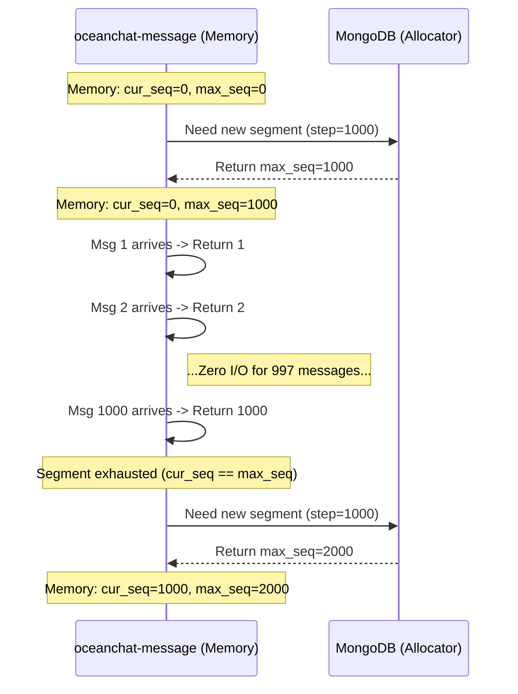

import Tabs from '@theme/Tabs';
import TabItem from '@theme/TabItem';

# Distributed ID Generation Strategy

In a massive-scale distributed IM system like Ocean Chat, the way message IDs are generated directly dictates the performance of the database and the reliability of message synchronization. 

This document explains why Ocean Chat decouples message uniqueness from message ordering, and how it implements a "Segment-based pre-allocation" (号段模式) architecture—heavily inspired by WeChat's `seqsvr`—to generate the crucial `SyncSeqId` capable of handling over 100k+ concurrent writes.

---

## 1. The Core Problem: Uniqueness vs. Ordering

Many traditional systems try to use a single ID (like a Snowflake ID or a UUID) to represent both the identity of a message and its chronological order. In a high-concurrency IM system, this creates two fatal flaws:

1. **Clock Skew (Snowflake):** If server clocks drift, Snowflake IDs can go backwards, causing messages to appear out of order or breaking the "strictly increasing" requirement needed for gap detection.
2. **Missing Context (UUID):** A UUID guarantees uniqueness but provides absolutely no sequence information. A client cannot look at two UUIDs and know if it missed a message in between.

### Ocean Chat's Decoupled Approach

Ocean Chat solves this by strictly separating the responsibilities into two distinct IDs:

*   **`ClientMsgId` (For Uniqueness):** A standard UUID generated by the *Client* the moment the user clicks "Send". It is used exclusively by the server and client to silently deduplicate messages if network retries occur.
*   **`SyncSeqId` (For Ordering & Sync):** A 64-bit integer generated by the *Server* (`oceanchat-message`). It is strictly monotonically increasing **within the context of a single session (a specific P2P chat or a specific Group chat)**.

Because the `SyncSeqId` is strictly increasing (e.g., 100, 101, 102...), the client can perform mathematical Gap Detection. If the client's local ID is 100 and it receives a Push signal for 105, it mathematically proves that messages 101, 102, 103, and 104 are missing and must be pulled via HTTP.

---

## 2. The Segment-Based Pre-allocation Architecture

To generate the `SyncSeqId`, making a synchronous `UPDATE seq = seq + 1` query to MongoDB or Redis for every single message sent by 10 million users would instantly crush the database. 

Ocean Chat adopts the **Segment-based pre-allocation (号段模式)** strategy.

### How It Works

Instead of requesting a new ID from the database for every message, the `oceanchat-message` service requests a large **segment** of IDs at once (e.g., `step = 10,000`).

1. **Memory Allocation:** The service holds two variables in local memory for a given session: `cur_seq` (current sequence) and `max_seq` (the upper limit of the pre-allocated segment).
2. **Lightning Fast Generation:** When a new message arrives, the service simply does an in-memory `cur_seq++`. It then returns this value as the `SyncSeqId`. This takes nanoseconds and involves **zero network I/O**.
3. **Database Interaction (The Slow Path):** Only when `cur_seq == max_seq` does the service make a network call to the database. It asks the database to increment the stored sequence by 10,000. The database returns the new upper bound, and the service updates its in-memory `max_seq` and continues.

:::tip I/O Reduction
If the step size is 10,000, the database write load is reduced by **99.99%**. A database that could previously only handle 1,000 messages/sec can now theoretically support 10,000,000 messages/sec.
:::

---

## 3. Section-Based Storage (Space Optimization)

If Ocean Chat has 100 million active groups and P2P sessions, storing a separate `max_seq` record for every single one of them in the database wastes massive amounts of disk space.

To optimize this, Ocean Chat groups multiple sessions together into a **Section (号段块)**.

For example, sessions with IDs from `0` to `99,999` all share the exact same `max_seq` record in the database. 
When the `oceanchat-message` service needs a new segment for *any* session in that block, it increments the shared `max_seq` by 10,000. 

*   Group A might get the segment `100,000` to `109,999`.
*   Group B (which happens to ask for a segment right after Group A) gets `110,000` to `119,999`.

This drastically reduces the number of rows the database needs to store and maintain, lowering memory consumption on the database indexes.

---

## 4. Handling Node Crashes & ID Jumps

A common question regarding in-memory pre-allocation is: **"What happens if the `oceanchat-message` node crashes while holding an unused segment?"**

Assume the node pre-allocated the segment `[1000, 2000]`. It issued `SyncSeqId` 1001 and 1002, and then the server's power cable was pulled. IDs 1003 through 2000 were lost in memory.

When the server restarts (or traffic routes to another node), the new node will request a segment from the database. The database, having safely stored `max_seq = 2000`, will hand out the next segment: `[2000, 3000]`.

The next message for that group will be assigned `SyncSeqId = 2001`.

### Why is this completely fine?

The `SyncSeqId` jumped directly from `1002` to `2001`. **This is by design.**

The Monkey Protocol strictly mandates:
1.  **Monotonicity is Non-Negotiable:** The IDs never go backward. The mathematical proof of order remains perfectly intact.
2.  **Continuity is Not Required:** Clients are explicitly forbidden from assuming IDs are continuous (+1).

When the client (currently at `MaxLocalSyncSeqId = 1002`) receives the push signal containing `2001`, it detects a gap. It makes an HTTP Sync request: `"Give me all messages strictly greater than 1002"`.

The `oceanchat-query` service queries MongoDB and simply returns the single new message `2001`. The client realizes there were no actual lost messages in between, updates its local cursor to `2001`, and continues functioning perfectly.

:::info Disaster Recovery
By intentionally wasting a small range of IDs upon a crash, the system trades sequence continuity for absolute data safety and instantaneous disaster recovery without complex rollback logic.
:::