<head>
  <meta name="twitter:card" content="summary_large_image" />
  <meta property="og:title" content="JetStream Topology & Consumption Strategy | Ocean Chat" />
  <meta property="og:description" content="Comprehensive guide to Ocean Chat's NATS JetStream topology, subject namespaces, and distributed consumption strategies for 100k+ concurrent connections." />
  <link rel="canonical" href="https://jameswilson19970101.github.io/ocean.chat.docs/docs/devdocs/jetstream-strategy" />
</head>

# NATS JetStream Topology & Strategy

To support 100k+ concurrent connections, Ocean Chat utilizes **NATS JetStream** not just as a message broker, but as the central nervous system connecting all microservices. The topology strictly isolates high-throughput data streams from control streams and leverages wildcard routing for precise microservice consumption strategies.

## Overview Diagram

The following diagram illustrates the production and consumption flows between Ocean Chat microservices and NATS JetStream subjects.

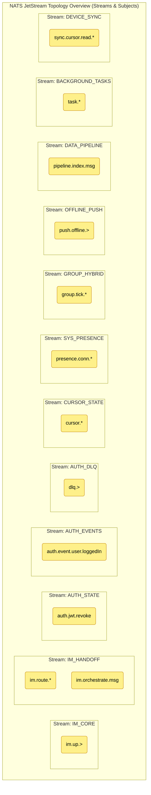

This document details the exact Stream definitions, Subject namespaces, and the delivery semantics (Push/Pull, At-Least-Once, At-Most-Once) required for the Ocean Chat architecture.

## 1. Stream Definitions

Streams in Ocean Chat are partitioned by **business domain** and **data retention lifecycle**, never by user or group ID (which would cause a stream explosion).

### **IM_CORE (Gateway Upbound Ingestion Stream)**

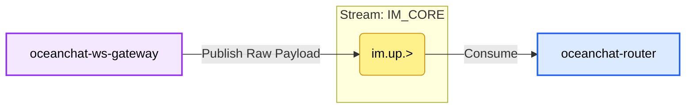

- **Core Responsibility**: The traffic inlet for the entire IM system (Ingestion), dedicated to receiving massive amounts of raw upbound client packets from the WebSocket Gateway. This is the highest throughput stream in the system.
- **Retention Strategy**: `RetentionPolicy.Limits` (Size/Age based).
  - **Reason**: The data retention period is short (e.g., 1-3 days). Because this is merely a raw byte buffer for the gateway, once the backend Router service pulls, decodes, and hands off the data to the `IM_HANDOFF` stream, the historical mission of this raw data is complete. Short-term retention is only used for troubleshooting during extreme anomalies or system crashes.
- **Storage**: `StorageType.File` (SSD).
  - **Reason**: Although the retention period is short, during traffic spikes of hundreds of thousands or millions of concurrent users (e.g., massive group interactions during major live events), if backend microservices slow down, upbound messages will instantly accumulate in NATS. Using SSD-backed file storage safely buffers these bursts on disk, completely avoiding Out-Of-Memory (OOM) crashes.
- **Key Configurations & Design Details**:
  - **Edge Stateless Extreme Buffering**: The gateway at this stage does not care about specific business logic at all. After stripping the WebSocket protocol, data instantly drops into this stream. Extremely high I/O efficiency significantly increases the maximum number of long connections a single gateway can handle.

#### Topic 1: im.up.> (e.g., im.up.p2p, im.up.group)

**Responsibility**: Raw ingestion buffer pool. Carries raw Protobuf business payloads that have not yet been decoded.

- **Producer Configuration** (Producer: `oceanchat-ws-gateway`)
  - **Publish Logic**: After parsing a valid WebSocket/TCP frame, it only appends necessary system-level metadata (like `gatewayId` and `connectionId`) and publishes the core raw byte Payload to this topic at high speed.
  - **Details & Reasons**:
    - **Pure Pipe Transmission**: This process involves no database queries or write operations. The client will **not** receive a `MSG_UP_ACK` at this stage. A confirmation is only returned after the message flows downstream and passes the Write Fence.

- **Consumer Configuration** (Consumer: `oceanchat-router`)
  - **Consume Logic**: Pull mode (Pull Queue Group).
  - **Details & Reasons**:
    - **Consumer Group Load Balancing**: Multiple Router instances form the same consumer group to jointly divide this massive upbound traffic, ensuring the same message is only parsed by one Router.
    - **Batch Pulling & Decoding**: The Router does not pull messages one by one. Instead, through an internal loop, it pulls a batch at once (e.g., hundreds of messages), utilizes CPU power to efficiently decode Protobuf, and performs basic validation.
    - **Delayed Handoff ACK Mechanism**: After pulling a message from `im.up.>`, the Router service only sends an explicit ACK for this `im.up.>` message _after_ it successfully routes, dispatches, and publishes the decoded message to the downstream `im.route.*` (`IM_HANDOFF` stream). This perfectly guarantees zero data loss during the handoff from the "edge ingestion layer" to the "internal business layer".

### **IM_HANDOFF (Internal Routing & Core WAL Stream) 🌟**

- **Core Responsibility**: The most critical stream in the system. It acts not only as a relay baton passing business payloads between microservices but also serves as the **Write Fence** and **Write-Ahead Log (WAL)** for the entire system.
  - After `oceanchat-router` parses the gateway's upbound data, it hands it off to this stream to trigger core business processing downstream.
  - After the business service finishes processing, it writes to this stream again, utilizing NATS's high reliability to ensure no message loss. It then branches into two paths: [Message sending and database storage](./Bussiness%20Logic/Message%20sending%20and%20database%20storage.md) and "real-time dispatch pushing".
- **Retention Strategy**: `RetentionPolicy.Limits` (Size/Age based).
  - **Reason**: Data needs to be independently and fully consumed by multiple different microservice consumer groups (like the Push Orchestrator and Persistence Worker). The Limits strategy ensures that even if one consumer (like MongoDB bulk persistence) experiences latency or crashes, the message is safely retained in the queue until all subscribers successfully advance their consumption cursors.
- **Storage**: `StorageType.File` (SSD).
  - **Reason**: Extreme reliability requirements. This is where the Write Fence (WAL) resides. As long as the server receives a NATS ACK from this stream, it will return a success confirmation to the client. If a datacenter power outage or NATS crash occurs, this portion of message data that hasn't yet been persisted to MongoDB MUST be recoverable from disk. It absolutely cannot be lost.
- **Key Configurations & Design Details**:
  - **Write-after-persistence Architecture**: Completely decoupling fast client responses (returning an ACK right after crossing the write fence) from slow database persistence (background async batch Pull consumption and insertion) is the performance cornerstone allowing Ocean Chat to support hundreds of thousands of concurrent writes.

#### Topic 1: im.route.\* (e.g., im.route.p2p, im.route.group)

**Responsibility**: Internal business routing handoff. After `oceanchat-router` completes raw packet parsing, it routes and delivers the business Payload to the specific business logic service.

- **Producer Configuration** (Producer: `oceanchat-router`)
  - **Publish Logic**: After parsing the Protobuf frame and completing initial business-level rate limiting and basic validation, it directs the publish based on business type.
- **Consumer Configuration** (Consumer: `oceanchat-message` or `oceanchat-group` service)
  - **Consume Logic**: Pull Mode.
  - **Details & Reasons**:
    - **Queue Group**: Multiple instances of the same business service form a Pull Queue Group, sharing consumption cursors to achieve horizontal scaling and load balancing. A single message will only be pulled and processed by one business instance.
    - **At-Least-Once Delivery**: If a business service crashes midway through processing (e.g., during permission validation) and fails to return an explicit ACK, NATS will automatically re-deliver the message to other healthy instances after an ACK timeout. This ensures core business logic is not interrupted and messages are never lost.

#### Topic 2: im.orchestrate.msg

**Responsibility**: **The Critical Write Fence Boundary!** Processed, valid messages are delivered here, acting as the ultimate proof of "safely received". It simultaneously provides the data source for downstream asynchronous persistence and message dispatch pushing.

- **Producer Configuration** (Producer: `oceanchat-message`)
  - **Publish Logic**: After completing friend/group authorization, content compliance checks, and allocating a globally monotonically increasing `SyncSeqId`, the final business message body is published to this topic.
  - **Details & Reasons**:
    - **Synchronous Wait for ACK**: When the message service publishes, it MUST await a successful persistence ACK receipt from NATS JetStream. Only after crossing this write fence boundary will the service notify the gateway to dispatch a `[0x06] MSG_UP_ACK` back to the client.

- **Consumer Configuration** (Features two independent durable Consumer Groups)
  - **Consumer A**: `oceanchat-orchestrator` (Push Orchestrator Service)
    - **Consume Logic**: Real-time Pull.
    - **Details & Reasons**: After pulling the message, the orchestrator queries the Redis online status graph to evaluate the recipient's network state. Based on this, it decides whether to transform the message into a lightweight `MSG_NOTIFY` sent down the downbound stream, or convert it into an offline wake-up task routed to the `OFFLINE_PUSH` stream for vendor pushing.
  - **Consumer B**: `MessagePersistence Worker` (Message Persistence Pipeline)
    - **Consume Logic**: Background asynchronous large batch Pull.
    - **Details & Reasons**: This Worker completely decouples slow disk I/O from the critical path. By pulling hundreds of messages at once and utilizing MongoDB's Bulk Insert API for batch writing, it drastically reduces database IOPS bottleneck pressure. Only after successful database insertion will the Worker send explicit ACKs to NATS, advancing the consumer group's progress and ensuring eventual consistency under massive concurrency.

### **AUTH_STATE (Global Security Stream)**

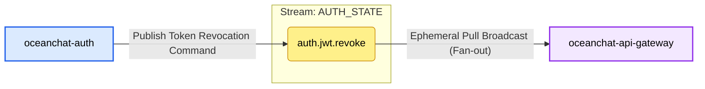

- **Core Responsibility**: High-speed broadcasting of critical global security state changes between microservices.
  - Currently dedicated to synchronizing JWT token blacklist revocations (`auth.jwt.revoke`).
  - When an active user logs out, the backend detects a Refresh Token Replay Attack, or normal refresh token rotation dictates an old Access Token must immediately expire, the Auth service publishes a revocation command to this stream.
  - The API Gateway is its primary consumer. The Gateway employs a "Zero-I/O Authentication" architecture. It no longer queries Redis for every request; instead, by subscribing to this stream, it builds and maintains a local blacklist in memory (`TokenBlacklistService`).
- **Retention Strategy**: `RetentionPolicy.Limits`.
  - **Reason**: This is a classic Broadcast (Fan-out) pattern. If there are multiple API Gateway instances, or a gateway is restarting, every single instance must be able to retrieve the revocation records for the current time window. If a Workqueue pattern were used, once one gateway read the event, it would disappear, and other gateways wouldn't receive it.
- **Storage**: `StorageType.Memory`.
  - **Reason**: Blacklist state is highly time-sensitive and demands the highest possible read/write speeds. Placing it in memory provides ultimate low latency.
  - (Note: For security reasons, if the NATS Server crashes and restarts, memory data is lost. Though gateways will still perform JWT signature validation, if resources permit, switching to File storage for these tiny yet highly critical security events would further enhance disaster recovery.)
- **Key Configurations & Design Details**:
  - **`max_age: 30 minutes`**: A very clever sliding window design. The gateway only needs to intercept tokens that are still within their valid lifespan but have been prematurely revoked. If the configured natural lifespan of an Access Token is 30 minutes, revocation events older than 30 minutes have no retention value (because the token's own validation will fail it for being expired). (Note: This value must be greater than or equal to the `jwt.accessExpiresIn` configuration).
  - **Consumer Type (`Ephemeral + DeliverPolicy.All`)**: The API Gateway does not configure a `durableName`; it is an ephemeral consumer. Every time it starts or reconnects, it applies the `DeliverPolicy.All` strategy to pull all surviving data (from the past 30 minutes) from the beginning of the stream. This ensures the gateway can rapidly rebuild a complete blacklist cache upon a cold start, preventing security vacuums.
  - **Publish Priority (`isCritical: true`)**: Inside the underlying `BoundedPublisherService`, revocation commands enjoy a reserved "safety channel" queue quota. Even if the system is overwhelmed by normal events, revocation commands can still be published with priority, ensuring system security.

#### Topic 1: auth.jwt.revoke

**Responsibility**: Broadcasts security commands for premature JWT Token invalidation (e.g., active logout, kickout, replay attack detection).

- **Producer Configuration** (Producer: `oceanchat-auth`)
  - **Publish Logic**: `BoundedPublisherService.publishSafe('auth.jwt.revoke', payload, '...', { isCritical: true })`
  - **Details & Reasons**:
    - **`isCritical: true` (Critical Priority)**:
      - **Reason**: This topic transmits core security commands. `BoundedPublisherService` maintains two bounded queues in memory: a normal queue (`maxNormalQueueSize=5000`) and a critical queue (`maxCriticalQueueSize=10000`). When the system faces massive traffic shocks causing backpressure, normal events will be dropped. But messages configured with `isCritical: true` use a larger safety threshold, ensuring revocation commands still get out under extreme pressure, safeguarding system security.
    - **Asynchronous Fire-and-Forget**:
      - **Reason**: Publishing a revocation command should not block the Response Time (RT) of the current HTTP request. Asynchronous dispatch dramatically improves endpoint throughput.

- **Consumer Configuration** (Consumer: `oceanchat-api-gateway`)
  - **Consume Logic**: `NatsEventsService extends BaseNatsSubscriber`
  - **Details & Reasons**:
    - **`durableName: undefined` (Ephemeral Consumer)**:
      - **Reason**: The API Gateway requires a Fan-out broadcast pattern. If a `durableName` were configured, multiple gateway instances would form a load-balancing group (competing for messages), resulting in each instance only receiving a fraction of the blacklist records. Omitting `durableName` means every gateway instance establishes an independent ephemeral subscription, allowing each instance to receive _all_ revocation commands and maintain a complete blacklist in its own memory.
    - **`deliver_policy: DeliverPolicy.All`**:
      - **Reason**: If an ephemeral consumer disconnects and reconnects, messages sent in the interim are lost. To solve cold starts and network blips, the gateway requests NATS to re-send all currently existing messages in the stream (all revocations from the past 30 minutes) every time it connects. This perfectly facilitates rapid reconstruction of the gateway's in-memory blacklist.
    - **Redis Distributed Lock `setnx(idempotencyKey, '1', 120)` (Idempotency Handling)**:
      - **Reason**: To handle the extremely low probability of NATS network redelivery (At-Least-Once). Because the gateway sets DeliverPolicy to All, it will pull old, previously processed messages every time it restarts. The Redis lock acts as a high-speed cache here to quickly ignore tokens already in the blacklist, preventing repeated database operations.

### **AUTH_EVENTS (Authentication Event Stream)**

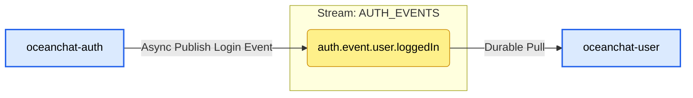

- **Core Responsibility**: Recording and distributing system-level business behaviors and events.
  - Currently used primarily to broadcast user login success events (`auth.event.user.loggedIn`).
  - Represents a classic asynchronous decoupling design. The Auth module focuses on high-concurrency authentication and token issuance. Time-consuming operations that don't block the user's current request, like "recording the user's last login time" or "updating device login history", are tossed into this stream as events to be slowly consumed asynchronously in the background by the `oceanchat-user` service.
- **Retention Strategy**: `RetentionPolicy.Limits` (Production environment).
  - **Reason**: This is an Event Sourcing / Pub-Sub pattern. Besides the User service updating profiles, a future security audit service (Audit) or analytics service (Analytics) might also want to consume a login event simultaneously. The Limits strategy ensures a single event can be independently consumed by any number of different business Consumer Groups.
- **Storage**: `StorageType.File` (SSD).
  - **Reason**: Business events possess data value and require consistency. If the downstream User service crashes or NATS restarts, file storage guarantees all login records generated during that period are not lost.
- **Key Configurations & Design Details**:
  - **`max_age: 24 hours`**: Provides an ample fault recovery window for downstream consumers. If the User service crashes due to a bug, operators have 24 hours to fix and restart it. Upon restart, it can resume processing the backlogged login events. Data older than 24 hours is purged to free disk space.
  - **Consumer Type (Durable Consumer)**: `oceanchat-user` configures `durableName: 'oceanchat-user-auth-events'`. This forces the NATS server to persistently remember its consumption progress (Cursor/Offset). Even across restarts, it resumes from where it left off, ensuring zero missed messages. Simultaneously, if multiple User service instances are running, sharing the same Durable name automatically forms a Queue Group for load balancing (one login event is processed exactly once by one of the instances).
  - **Idempotency Guarantee**: Because NATS JetStream provides "At-least-once" delivery, to prevent duplicate database updates under extreme network conditions causing redeliveries, the consumer internally uses a strict distributed anti-duplication lock backed by Redis.

#### Topic 1: auth.event.user.loggedIn

**Responsibility**: Records the business behavior of a successful user login, used to update device last active times, record audit logs, etc.

- **Producer Configuration** (Producer: `oceanchat-auth`)
  - **Publish Logic**: `BoundedPublisherService.publishSafe('auth.event.user.loggedIn', payload, '...', { isCritical: false })`
  - **Details & Reasons**:
    - **`isCritical: false` (Normal Priority)**:
      - **Reason**: Recording a login time is a non-critical business event. If the Auth service experiences a massive traffic spike completely congesting NATS, discarding these log events is acceptable (Graceful Degradation). We absolutely cannot allow recording a login time to blow up the Auth service's memory and paralyze the actual login functionality.

- **Consumer Configuration** (Consumer: `oceanchat-user`)
  - **Consume Logic**: `NatsEventsService extends BaseNatsSubscriber`
  - **Details & Reasons**:
    - **`durableName: oceanchat-user-auth-events` (Durable Consumer)**:
      - **Reason**: This is a work queue/unicast pattern. Regardless of how many `oceanchat-user` service instances are deployed in the background, a single login event can only be processed once by one instance (otherwise it would cause concurrent duplicate database writes). A shared Durable name prompts the NATS server to automatically Load Balance across these instances. Furthermore, durably recording the consumption cursor (Offset) ensures that if all user services crash for an hour, they will resume processing exactly from an hour ago without missing a beat upon restart.

### **AUTH_DLQ (Dead Letter Queue Stream)**

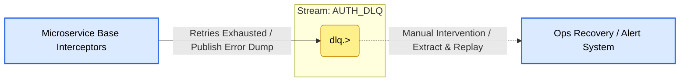

- **Core Responsibility**: The system's error fallback repository (Dead Letter Queue). It centrally stores "Poison Messages" that could not be processed normally after multiple retries due to various reasons (code bugs, dirty data, downstream database crashes).
- **Retention Strategy**: `RetentionPolicy.Limits`.
  - **Reason**: Raw data representing an error scene must not be accidentally consumed by other consumers. It must be permanently retained within the storage limits pending manual or automated system intervention.
- **Storage**: `StorageType.File` (SSD).
  - **Reason**: Dead letter data contains extremely precious error context and the original Payload. It must be absolutely reliably persisted to disk to prevent loss.
- **Key Configurations & Design Details**:
  - **`max_age: 7 days`**: Provides a generous buffer period (covering weekends and long holidays) for developers and ops teams. Once a DLQ alert is received, engineers have 7 days to locate the issue. After fixing the bug, original messages can be extracted from the DLQ via an admin API and re-injected (by simply stripping the `dlq.` prefix).
  - **Unified Fallback Prefix (`dlq.>`):** Through standardized topic naming (currently like `dlq.auth.event.>` etc.), the framework can centrally archive failed events from different business domains while clearly indicating which domain generated the dead letter via the suffix.
  - **Comprehensive Inflow Mechanisms**:
    - **Consumer Fallback**: Within `BaseNatsSubscriber`, if a message throws a NAK on the consumer side (e.g., cannot connect to the User DB) and continues to fail after reaching maximum retries (`max_deliver: 3`), the consumer framework will actively intercept it, forward it to the DLQ, and send an ACK for the original message (kicking it out of the original queue to prevent an infinite dead loop from locking up the whole queue).
    - **Producer Fallback**: Within `BoundedPublisherService`, if publishing to a normal topic fails due to NATS exceptions or a full rate-limiter, the publisher framework will also attempt to toss the data into the DLQ as a Fallback to preserve the evidence.

#### Topic 1: dlq.> (e.g., dlq.auth.event.user.loggedIn)

**Responsibility**: The recycle bin for Poison Messages and crash scenes.

- **Producer Configuration** (Producer: Framework layer interceptors across various microservices) This is a special topic; its "producer" is not business code, but rather the underlying framework's exception-catching mechanisms.
  - **Production Scenario 1: Consumer Retries Exhausted**:
    - **Logic**: In `BaseNatsSubscriber.handleError`, when `deliveryCount >= max_deliver` (default 3) and it still throws an exception.
    - **Publish Behavior**: Sends the original message to `dlq.${m.subject}` and sends `m.ack()` for the original message.
    - **Reason**: If the database is down or unresolvable dirty data is encountered, continuously calling `m.nak()` will cause this message to get stuck at the front of the queue forever, blocking all subsequent normal message consumption (queue blocking). Transferring it to the DLQ while ACKing the original queue acts to "unblock the pipe" and isolate the error.
  - **Production Scenario 2: Publisher NATS Link Broken**:
    - **Logic**: In `BoundedPublisherService`, if publishing to the main subject fails.
    - **Publish Behavior**: Enters `.catch()` and attempts `js.publish(dlqSubject, payload)`.
    - **Reason**: As a last line of defense, when the target stream is unavailable (e.g., misconfigured), attempting to write the data to the DLQ stream is a best-effort attempt to save the evidence.

- **Consumer Configuration** (Consumer: Currently None)
  - **Reason**: Dead letter queues must absolutely never be consumed automatically. A message entering the DLQ implies it could not be handled despite the system's repeated struggles. It must lie quietly on the hard drive for a long time (`max_age: 7 days`).
  - **Future Evolution**: A common practice is that writing to the DLQ directly triggers the company's alert system (Slack, Teams bots). Developers see the alert, check the logs, fix the bug, and finally, through an Admin backend management interface, click "One-Click Replay". The system strips the `dlq.` prefix in the background and resends it to the corresponding stream.

### **CURSOR_STATE (Cursor State Persistence Stream)**

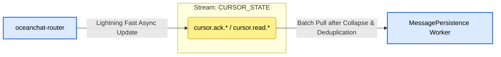

- **Core Responsibility**: Acts as an **asynchronous Write-behind Cache** for extremely high-frequency ACK/Read Cursors, protecting the underlying database (MongoDB) and cache layer (Redis) from IOPS overload caused by "acknowledgment storms".
  - In large group chats or highly active P2P chats, clients send `[0x0B] READ_RECEIPT` signals at high frequency after pulling messages. The gateway/router simply dumps these state changes into this stream, achieving true zero-I/O blocking at the gateway layer.
  - The `MessagePersistence` Worker consumes in batch mode in the background, syncing the final collapsed and deduplicated cursor states to Redis and persisting them to MongoDB simultaneously.
- **Retention Strategy**: `RetentionPolicy.Limits`.
  - **Reason**: Cursor data represents typical **"State"** rather than **"Events"**. We only care about the user's final state (what is the latest message they've seen), and care nothing about the process (which intermediate SeqIds they passed through). The Limits strategy, combined with the `MaxMsgsPerSubject=1` magic below, achieves perfect memory and disk load shaving.
- **Storage**: `StorageType.Memory`.
  - **Reason**: Even with file storage, this queue takes up almost no space due to its extreme deduplication characteristics. More importantly, if a catastrophic total system crash loses the last second or two of cursor ACK data, the system simply resumes from the last position recorded in Redis or MongoDB. Because the client has an innate deduplication mechanism during its next sync or reconnection, we don't have to worry about pulling duplicate messages. Therefore, we aggressively employ Memory storage to gain unbeatable throughput.
- **Key Configurations & Design Details**:
  - **`max_msgs_per_subject: 1` (Geek-level Storm Collapse Mechanism) 🌟**:
    - **Reason**: **This is the core black magic for solving group chat ACK write storms.** If a user frantically scrolls through a 10,000-member group chat in 1 second, triggering 50 cursor updates (e.g., SeqId updates from 101 to 150). When these 50 update events are published to the exact same Subject pinpointing that user, NATS automatically discards the old values. Throughout the entire stream, in the cursor queue for that user in that group, **there is always only one single latest data entry (SeqId 150)**.
  - **Asynchronous Batch Persistence (BulkWrite & Pipeline)**:
    - **Reason**: The persistence Worker doesn't need to care about those 49 useless intermediate updates. It only periodically (e.g., once per second) pulls the leanest, collapsed state collection from the stream. After grabbing the latest cursors for 1000 users, it not only executes a single MongoDB `bulkWrite` but also uses Redis Pipeline to batch update the cache, effectively dimensionality-reducing 50,000 high-frequency random write operations into a minimal number of network I/Os.

#### Topic 1: cursor.ack.\{groupId\}.\{userId\} / cursor.read.\{groupId\}.\{userId\}

**Responsibility**: Receives and merges the latest cursor state for a specific user in a specific session (group/P2P).

- **Producer Configuration** (Producer: `oceanchat-router` or `oceanchat-api-gateway`)
  - **Publish Logic**: Upon receiving an ACK/Read signal from the client, it performs **zero synchronous database or Redis operations**. Instead, it asynchronously publishes the Payload (e.g., `{"seqId": 1005}`) directly to the precise wildcard topic.
  - **Details & Reasons**:
    - **Highly Granular Topics**: The `groupId` and `userId` MUST be written into the topic name (e.g., `cursor.ack.G1.U1`). This is the absolute prerequisite for `max_msgs_per_subject: 1` to accurately execute "keep only the single latest record for U1 in G1".

- **Consumer Configuration** (Consumer: `MessagePersistence Worker`)
  - **Consume Logic**: Pull mode subscribing to `cursor.>`.
  - **Details & Reasons**:
    - **Batch Pull & Dual Write**: The Worker uses long polling to batch pull (e.g., `batch: 1000`), grabbing all the leanest cursor states left after system collapse in one go. Subsequently, the Worker uses Redis Pipeline to batch update the Redis cursor cache and executes MongoDB BulkWrite for persistence.
    - **Explicit ACK**: Only after BOTH Redis and MongoDB batch writes execute successfully will the Worker send batch ACKs back to NATS. Because the client has idempotent deduplication capabilities, even if a partial failure causes a retry here, it will not affect ultimate business consistency.
    - **Durable Queue Group**: Multiple Worker instances share the cursor persistence pressure across the entire network. A lean cursor state will only be written to the database once.

### **SYS_PRESENCE (Presence & Events Stream)**

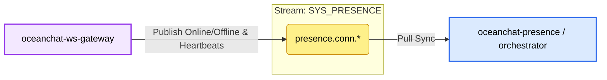

- **Responsibility**: Handles user online/offline events and connection heartbeats.
- **Retention**: Interest (retained only while services are actively listening) or short Limits.
- **Storage**: Memory (transient data).
- **Producer**: WebSocket Gateway.
- **Consumer**: Presence Service / Push Service.
- **Strategy**: Pull Consumer with Queue Group (At-Least-Once).

### **GROUP_HYBRID (Large Group Degradation Stream)**

- **Responsibility**: Dedicated to the **Push-Pull Hybrid** strategy for mega-groups (10k+ users) to prevent fan-out avalanches.
- **Producer**: Router Service.
- **Consumer**: WebSocket Gateways (and transitively, the Clients).
- **Strategy**: Signal Push + Client Pull (Jittered HTTP/RPC).

### **OFFLINE_PUSH (Third-party Push Stream)**

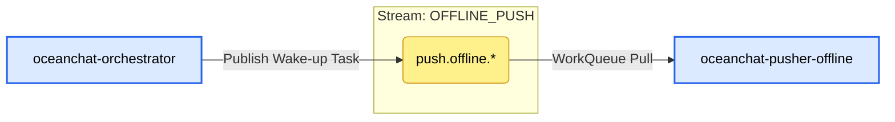

- **Core Responsibility**: Handles offline push notifications to APNs, FCM, and other vendor APIs.
  - When `oceanchat-orchestrator` detects a target user is offline (no active TCP/WS connections), it publishes a lightweight wake-up task to this stream.
  - A dedicated `oceanchat-pusher-offline` worker pulls tasks from this stream and calls third-party network APIs. Through physical isolation, it ensures slow or unstable third-party HTTP calls do not drag down the core `IM_CORE` real-time message queues.
- **Retention Strategy**: `RetentionPolicy.WorkQueue`.
  - **Reason**: Offline pushing is a typical task consumption scenario. Once a push task is successfully sent to Apple/Google by a worker and an ACK is returned, this task is completely finished and should be immediately removed from NATS to free space. If there are multiple push service instances, a WorkQueue ensures a single task is only allocated to one idle instance, naturally providing load balancing.
- **Storage**: `StorageType.File` (SSD).
  - **Reason**: Third-party push APIs frequently encounter Rate Limits or downtime. If a massive backlog of tasks builds up, storing them entirely in memory would cause NATS to OOM. Using disk storage not only accommodates huge backlogs but also prevents unsent offline notification tasks from being lost if NATS restarts.
- **Key Configurations & Design Details**:
  - **`max_msgs_per_subject: 1` and `discard: "old"` (Folding Deduplication Strategy)**:
    - **Reason**: This is a geek-level optimization designed for the "fan-out avalanche" problem caused by massive messages generated instantly in large groups. The essence of an offline notification is merely to "wake up" the client and refresh the mobile OS's unread count. Configuring `max_msgs_per_subject: 1` means that for a single user's sub-topic (e.g., `push.offline.apns.user123`), the NATS queue will always only retain the latest one. If new messages arrive while the old message hasn't been consumed and sent out, the old message will be directly dropped (`discard: "old"`) and replaced by the new message. This naturally achieves **lock-free collapse of push signals** at the physical queue layer, massively lowering third-party API calling costs while avoiding harassing users with frantic popups and vibrations.
  - **`max_age: 24h`**:
    - **Reason**: If offline push tasks are backlogged for more than a day due to extreme circumstances, there is usually no meaning in continuing to push them. Dead tasks older than 24 hours will be automatically purged.

#### Topic 1: push.offline.\{vendor\}.\{user_id\} (e.g., push.offline.apns.uid123)

**Responsibility**: Precision dispatch of offline wake-up task topics to specific device vendors and specific users.

- **Producer Configuration** (Producer: `oceanchat-orchestrator`)
  - **Publish Logic**: After querying the Redis online status, if the target is completely offline, the orchestrator retrieves their device platform, constructs a lightweight wake-up command, and publishes it here.
  - **Details & Reasons**:
    - **Topic paths subdivided by `user_id`**:
      - **Reason**: The topic MUST be refined to the individual user level so the underlying stream's `max_msgs_per_subject: 1` policy knows _which user's_ queue to deduplicate. If all users' push tasks were sent to the same broad topic, the queue would only be left with one single piece of data across everyone.

- **Consumer Configuration** (Consumer: `oceanchat-pusher-offline` worker)
  - **Consume Logic**: Pull mode wildcard subscription `push.offline.>`.
  - **Details & Reasons**:
    - **Pull Mode**:
      - **Reason**: The offline push service needs to call Apple or Google's external HTTP APIs, which have uncontrollable network latency and severe Rate Limiting penalties. Pull mode allows consumers to pull tasks "according to their capability" based on their own processing power and vendor quotas, achieving peak shaving and completely avoiding being crushed by massive offline tasks (solving OOM risks).
    - **`ack_policy: "explicit"` and `ack_wait: "10s"`**:
      - **Reason**: Only when explicitly receiving an HTTP 200 OK from APNs or FCM indicating a successful push does the worker send an ACK to NATS. If the external interface hangs, times out, or returns a 5xx error, the service absolutely will not send an ACK. After 10 seconds, NATS will automatically put the task back into the work queue for other healthy worker instances to retry.
    - **`max_deliver: 5`**:
      - **Reason**: Prevents infinite loops. If a user's DeviceToken has permanently expired (e.g., they uninstalled the App), causing the Apple server to continuously return `400 BadDeviceToken`, after 5 consecutive failed retries, the NATS consumer framework will transfer the task as a poison message to the Dead Letter Queue (DLQ), preventing the task from permanently jamming the queue and draining system resources.
    - **`durable_name: "offline-pusher-group"` (Durable Consumer Group)**:
      - **Reason**: A fixed Durable Name MUST be configured. This makes NATS treat all launched `oceanchat-pusher-offline` instances as the same "Consumer Group". They share the same consumption cursor on the NATS server, naturally achieving **Load Balancing**. A single push notification will only be pulled by one idle instance, absolutely preventing a user from receiving _n_ duplicate pushes.
    - **`deliver_policy: "all"`**:
      - **Reason**: This policy **only takes effect when the consumer group is first created**. It instructs NATS to point the consumer group's initial shared cursor to the oldest message in the stream. Coupled with the Durable mechanism above, it ensures that even if all push instances are taken down for maintenance for a while, upon coming back online, the entire cluster can start from the earliest backlogged tasks, clearing the push queue without missing or duplicating anything.

### **DATA_PIPELINE (Data Heterogeneity Stream)**

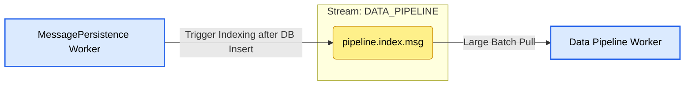

- **Responsibility**: Acts as the data pipeline for syncing chat records to Elasticsearch for global search.
- **Retention Strategy**: Limits (Retains data until safely indexed).
- **Storage**: File (SSD).
- **Producer**: MessagePersistence Worker (triggered immediately after saving to MongoDB).
- **Consumer**: Data Pipeline Worker.
- **Strategy**: **Large Batch Pull**. The worker fetches thousands of messages at once and uses the Elasticsearch Bulk API for high-efficiency indexing.

### **BACKGROUND_TASKS (Media & Audit Stream)**

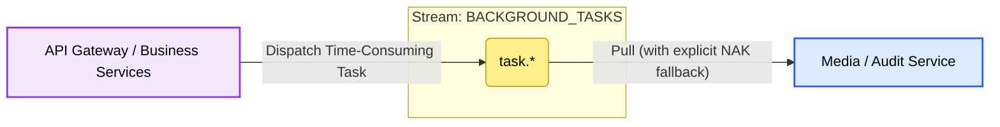

- **Responsibility**: Manages CPU-intensive background jobs like media transcoding, image thumbnail generation, and content auditing (NSFW filters).
- **Retention Strategy**: WorkQueue.
- **Storage**: File (SSD).
- **Producer**: API Gateway or Business Microservices (upon successful file upload).
- **Consumer**: Media Service / Audit Service.
- **Strategy**: **Pull Consumer with Explicit NAKs**. If a video transcoding job fails, the consumer sends a Negative Acknowledgment (NAK) to NATS, instantly requeuing the task to another healthy instance instead of waiting for a timeout.

### **DEVICE_SYNC (Cursor Synchronization Stream)**

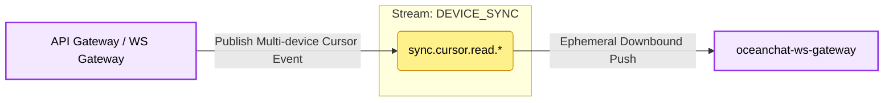

- **Responsibility**: Synchronizes read cursors and clears notification badges across multiple devices for the same user.
- **Retention Strategy**: Limits or Interest.
- **Storage**: Memory (Optimized for extreme IOPS; safe to lose during a NATS restart as clients will auto-sync upon reconnection).
- **Producer**: API Gateway (HTTP Receipt) & WebSocket Gateway (WS Signal Receipt).
- **Consumer**: WebSocket Gateways.
- **Strategy**: **Ephemeral At-Most-Once Push**. Gateways listen to cursor updates and silently pass them to connected clients to clear UI badges.

## 2. Subject Namespace Design

The Subject hierarchy utilizes NATS wildcards (`*` and `>`) to enable precise routing.

- **Upbound Messages (Gateway -> Backend)**
  - P2P Chat: `im.up.p2p`
  - Group Chat: `im.up.group`
  - Signals (Read, Recall): `im.up.signal.*`
- **Internal Handoff (Inter-microservice Routing)**
  - Business Routing: `im.route.{service}` (e.g., `im.route.message`, `im.route.group`)
  - Push Orchestration: `im.orchestrate.{push_type}`
- **Downbound Push (Push Service -> Gateway)**
  - Targeted Node Push: `im.down.node.{gateway_node_uuid}`
- **System State**
  - Connection Events: `presence.conn.online`, `presence.conn.offline`
- **Authorization Control**
  - Token Revocation: `auth.jwt.revoke`

## 5. Reliability Sequence

The following diagram illustrates the interaction between microservices and JetStream to ensure the **Write Fence** guarantee.

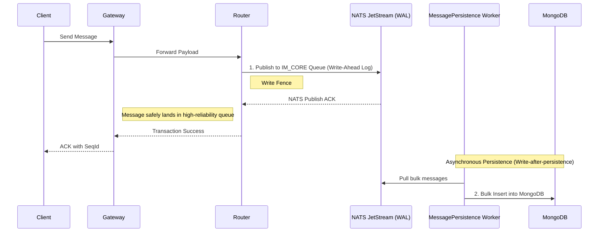
