<head>
  <meta name="twitter:card" content="summary_large_image" />
  <meta property="og:title" content="JetStream Topology and Consumption Strategy | Ocean Chat" />
  <meta property="og:description" content="Detailed explanation of Ocean Chat NATS JetStream topology, subject namespaces, and distributed consumption strategies, supporting 100,000+ concurrent connections." />
  <link rel="canonical" href="https://jameswilson19970101.github.io/ocean.chat.docs/docs/devdocs/jetstream-strategy" />
</head>

# NATS JetStream Topology and Strategy

To support 100,000+ concurrent connections, Ocean Chat uses **NATS JetStream** not only as message middleware but as the central nervous system connecting all microservices. This topology strictly isolates high-throughput data flows from control flows and utilizes wildcard routing for precise microservice consumption strategies.

## Architecture Overview

The following diagram illustrates the production and consumption flows between Ocean Chat microservices and NATS JetStream subjects.

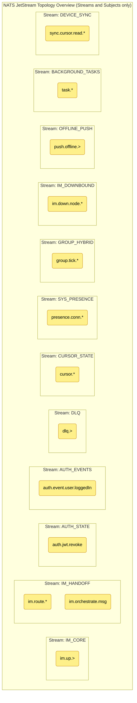

This document details the stream definitions, subject namespaces, and delivery semantics (push/pull, at-least-once, at-most-once) required for the Ocean Chat architecture.

## 1. Stream Definitions

Streams in Ocean Chat are partitioned by **business domain** and **data retention lifecycle**, never by user or group ID (which would cause stream explosion).

### **IM_CORE (Gateway Uplink Ingestion Stream)**

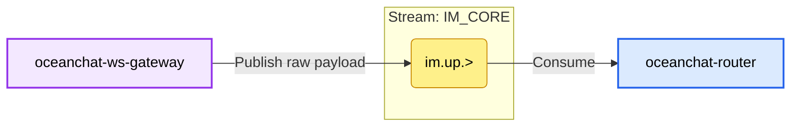

- **Core Responsibility**: Traffic entry point for the entire IM system (Ingestion), specifically handling large amounts of raw client uplink packets received by the WebSocket gateway. This is an extremely high-throughput stream.
- **Retention Strategy**: `RetentionPolicy.Limits`.
  - **Reason**: Data retention is short (e.g., 1-3 days). Since this is only a raw byte buffer stream for the gateway, its mission is complete once the downstream Router pulls, decodes, and hands off to the `IM_HANDOFF` stream. Short-term retention is used only for troubleshooting during extreme anomalies or system crashes.
- **Storage Type**: `StorageType.File` (SSD).
  - **Reason**: Although retention is short, under peaks of 100,000+ or even 1,000,000+ concurrent connections (e.g., group interactions during major live events), if downstream microservices slow down, uplink messages will accumulate instantly in NATS. Using SSD-based file storage safely buffers burst traffic to disk, completely avoiding Memory Overflow (OOM) crashes.
- **Key Configuration and Design Details**:
  - **Stateless Edge Buffer**: The gateway is completely unaware of specific business logic at this stage. After stripping the WebSocket protocol, data immediately enters this stream. High I/O efficiency significantly increases the maximum number of long connections a single gateway can handle.

#### Subject 1: im.up.> (e.g., im.up.p2p, im.up.group)

**Description**: Raw ingestion buffer pool. Carries raw Protobuf business payload packets that haven't been decoded yet.

- **Producer Configuration (Producer: `oceanchat-ws-gateway`)**
  - **Publishing Logic**: After parsing a valid WebSocket/TCP frame, it attaches only necessary system-level metadata (like `gatewayId` and `connectionId`) and publishes the core raw byte payload to this subject at high speed.
  - **Details and Reason**:
    - **Pure Pipeline Transmission**: This process involves no database queries or writes. Clients do **not** receive a `MSG_UP_ACK` at this stage; they only receive acknowledgment after the message has passed through the downstream write barrier.

- **Consumer Configuration (Consumer: `oceanchat-router`)**
  - **Consumption Logic**: Pull mode (Pull Queue Group).
  - **Details and Reason**:
    - **Consumer Group Load Balancing**: Multiple Router instances form a single consumer group, sharing the massive uplink traffic to ensure each message is parsed by only one Router.
    - **Batch Pulling and Decoding**: Routers pull messages in batches (e.g., hundreds at once) via internal loops, using CPU power to efficiently decode Protobuf and perform basic validation.
    - **Delayed Handoff ACK Mechanism**: After pulling a message from `im.up.>`, the Router service only sends an explicit ACK after it successfully routes and delivers the decoded message to the downstream `im.route.*` (`IM_HANDOFF` stream). This ensures zero data loss during the transition from the "edge ingestion layer" to the "internal business layer."

### **IM_HANDOFF (Internal Routing and WAL Core Stream)**

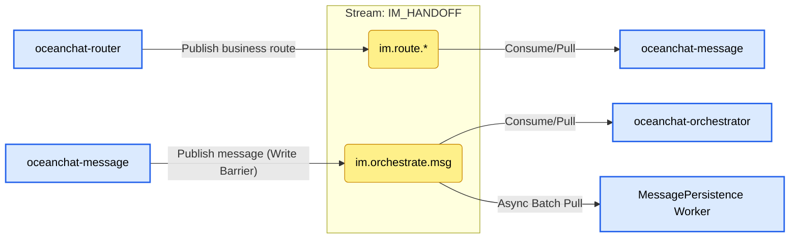

- **Core Responsibility**: The most critical stream in the system. It serves not only as a "relay baton" for business payloads between microservices but also as the system's **Write Fence** and **Write-Ahead Log (WAL)**.
  - After `oceanchat-router` parses data from the gateway, it hands it off to this stream to trigger core business processing.
  - After business services complete processing, they write to this stream again, leveraging NATS' high reliability to ensure no message loss. The flow then splits into [Message Sending and Storage](./Bussiness%20Logic/Message%20sending%20and%20database%20storage.md) and "Real-time Dispatch/Push" branches.

- **Retention Strategy**: `RetentionPolicy.Limits`.
  - **Reason**: Data needs to be consumed independently and fully by multiple different microservice consumer groups (e.g., Push Orchestrator, Persistence Worker). The Limits strategy ensures that even if one consumer (like MongoDB batch persistence) is delayed or down, messages remain safely in the queue until all subscribers have successfully advanced their consumption cursors.

- **Storage Type**: `StorageType.File` (SSD).
  - **Reason**: Ultimate reliability requirement. This is where the Write Barrier (WAL) resides. Once the server receives a NATS ACK for this stream, it returns a success confirmation to the client. In the event of a data center power failure or NATS crash, messages not yet persisted in MongoDB must be recoverable from disk and absolutely cannot be lost.

- **Key Configuration and Design Details**:
  - **Write-after-persistence Architecture**: Decouples fast client response (ACK returned after crossing the write barrier) from slow database persistence (async batch pull consumption and insertion in the background). This is the performance foundation for Ocean Chat to support 100,000+ concurrent write operations.

#### Subject 1: im.route.\* (e.g., im.route.p2p, im.route.group)

**Description**: Internal business routing handoff. After `oceanchat-router` completes raw packet parsing, it routes business payloads to corresponding business logic services.

- **Producer Configuration (Producer: `oceanchat-router`)**
  - **Publishing Logic**: After decoding Protobuf frames and completing preliminary business-level rate limiting and basic validation, it publishes to specific business types.
- **Consumer Configuration (Consumer: `oceanchat-message` or `oceanchat-group`)**
  - **Consumption Logic**: Pull mode.
  - **Details and Reason**:
    - **Queue Group**: Multiple instances of the same business service form a pull queue group, sharing the consumption cursor to achieve horizontal scaling and load balancing. Each message is processed by only one business instance.
    - **At-Least-Once Delivery**: If a business service crashes during processing (e.g., during permission validation) and fails to return an explicit ACK, NATS will redeliver the message to other healthy instances after a timeout, ensuring core business logic is not interrupted and messages are never lost.

#### Subject 2: im.orchestrate.msg

**Description**: **Where the critical Write Barrier resides!** Successfully processed legitimate messages are delivered here as the final proof of "safe receipt." It serves as the data source for both downstream asynchronous persistence and message dispatch/push.

- **Producer Configuration (Producer: `oceanchat-message`)**
  - **Publishing Logic**: After completing friend/group authorization, content compliance review, and assigning a globally monotonic `SyncSeqId`, the final business message body is published to this subject.
  - **Details and Reason**:
    - **Synchronous Wait for ACK**: When the message service publishes, it must wait for a persistence success ACK from NATS JetStream. Only after crossing this write barrier boundary will the service notify the gateway to send `[0x06] MSG_UP_ACK` to the client.

- **Consumer Configuration (Two independent Consumer Groups)**
  - **Consumer A: `oceanchat-orchestrator` (Push Orchestration Service)**
    - **Consumption Logic**: Real-time Pull.
    - **Details and Reason**: After pulling a message, the Orchestrator queries the Redis online status map to evaluate the receiver's network status. It then decides whether to convert the message into a lightweight `MSG_NOTIFY` sent to the downbound stream or an offline wake-up task moved to the `OFFLINE_PUSH` stream for vendor push.
  - **Consumer B: `MessagePersistence Worker` (Message Persistence Pipeline)**
    - **Consumption Logic**: Async Batch Pull.
    - **Details and Reason**: This worker completely decouples slow disk I/O from the main path. By pulling hundreds of messages in a single batch and using MongoDB's Bulk Insert interface, it significantly reduces database IOPS bottleneck pressure. Only after successful persistence does the worker send an explicit ACK to NATS, advancing the current consumer group's progress and guaranteeing eventual consistency under massive concurrency.

### **AUTH_STATE (Global Security Stream)**

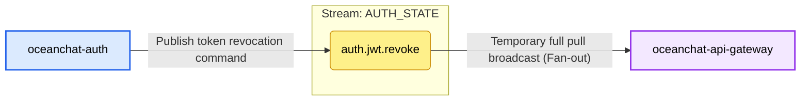

- **Core Responsibility**: Used for high-speed broadcasting of critical global security state changes between microservices.
  - Currently dedicated to JWT token blacklist revocation synchronization (`auth.jwt.revoke`).
  - When a user logs out, the system detects a Refresh Token Replay Attack, or normal token rotation requires an old Access Token to be invalidated immediately, the Auth service publishes a revocation command to this stream.
  - `oceanchat-api-gateway` is the primary consumer. The gateway adopts a "Zero-I/O Authentication" architecture; instead of querying Redis for every request, it maintains a local blacklist in memory (`TokenBlacklistService`) by subscribing to this stream.

- **Retention Strategy**: `RetentionPolicy.Limits`.
  - **Reason**: This is a typical broadcast (Fan-out) mode. If there are multiple API Gateway instances, or if a gateway is restarting, each instance must be able to retrieve revocation records from that period. If Workqueue mode were used, an event would disappear after one gateway read it, making it unavailable to others.

- **Storage Type**: `StorageType.Memory`.
  - **Reason**: Blacklist status is extremely time-sensitive, requiring the highest read/write speeds. Keeping it in memory enables ultimate latency performance.
  - _(Note: For security reasons, if NATS Server crashes and restarts, memory data will be lost. Although the gateway validates at the JWT level, changing to File storage if conditions allow could further improve disaster recovery for these small but critical security events.)_

- **Key Configuration and Design Details**:
  - **max_age: 30 minutes**: A clever sliding window design. The gateway only needs to intercept tokens that are still within their valid lifecycle but have been revoked early. The Access Token's natural lifespan in the configuration is 30 minutes; revocation events older than 30 minutes have no retention value as the token itself would have expired. (Note: This value must be greater than or equal to the `jwt.accessExpiresIn` time.)
  - **Consumer Type (`Ephemeral + DeliverPolicy.All`)**: The API Gateway does not configure a `durableName`, making it an ephemeral consumer. Every time it starts or reconnects, it uses the `DeliverPolicy.All` strategy to pull all surviving data in the current stream (i.e., within the last 30 minutes). This ensures the gateway can quickly rebuild its full blacklist cache upon cold start, preventing a security vacuum.
  - **Publish Priority (`isCritical: true`)**: In the underlying `BoundedPublisherService`, revocation commands enjoy a reserved "security channel" queue quota. Even if the system is overwhelmed by normal events, revocation commands are prioritized, ensuring system security.

#### Subject 1: auth.jwt.revoke

**Description**: Broadcasts security commands for early JWT Token invalidation (e.g., logout, kick-out, replay attack detection).

- **Producer Configuration (Producer: `oceanchat-auth`)**
  - **Publishing Logic**: `BoundedPublisherService.publishSafe('auth.jwt.revoke', payload, '...', { isCritical: true })`
  - **Details and Reason**:
    - **isCritical: true (Critical Priority)**:
      - **Reason**: This subject transmits core security commands. `BoundedPublisherService` maintains two limited queues in memory: a normal queue (`maxNormalQueueSize=5000`) and a critical queue (`maxCriticalQueueSize=10000`). When the system faces massive traffic resulting in backpressure, normal events are discarded, but messages with `isCritical: true` use a larger safety threshold, ensuring revocation commands are still sent even under extreme high pressure.
    - **Asynchronous Fire-and-Forget (No wait for result)**:
      - **Reason**: Publishing revocation commands should not block the RT (Response Time) of the current HTTP response. Using asynchronous dispatch significantly improves interface throughput.

- **Consumer Configuration (Consumer: `oceanchat-api-gateway`)**
  - **Consumption Logic**: `NatsEventsService extends BaseNatsSubscriber`
  - **Details and Reason**:
    - **durableName: undefined (Ephemeral Consumer)**:
      - **Reason**: The API Gateway requires a broadcast mode (Fan-out). If `durableName` were configured, multiple gateway instances would form a load-balanced group (competing for messages), resulting in each instance receiving only a subset of blacklist records. No `durableName` means each gateway instance establishes an independent ephemeral subscription, ensuring each receives all revocation commands to maintain a complete local blacklist.
    - **deliver_policy: `DeliverPolicy.All` (Full history pull)**:
      - **Reason**: Ephemeral consumers lose messages if they disconnect. To solve cold start/network glitch issues, each time a gateway connects, it requests NATS to resend all existing messages in the stream (all revocation records from the last 30 minutes). This perfectly achieves rapid reconstruction of the gateway's memory blacklist.
    - **Redis Distributed Lock `setnx(idempotencyKey, '1', 120)` (Idempotent processing)**:
      - **Reason**: Handles extremely rare cases of NATS network redelivery (At-Least-Once). Since the gateway sets DeliverPolicy to All, it pulls old messages it has already processed upon each restart. The Redis lock acts as a high-speed cache to quickly ignore tokens already in the blacklist, avoiding redundant storage logic.

### **AUTH_EVENTS (Authentication Event Stream)**

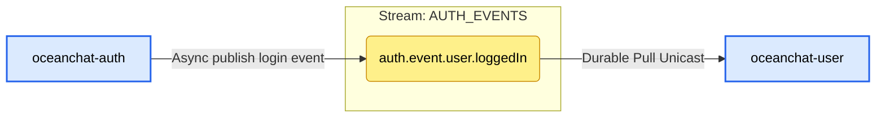

- **Core Responsibility**: Used to record and distribute system business-level behaviors and events.
  - Currently primarily used to broadcast user login success events (`auth.event.user.loggedIn`).
  - A typical asynchronous decoupling design. The Auth module focuses on high-concurrency authentication and token issuance; time-consuming operations like "recording user's last login time" or "updating login device history" are thrown as events into this stream for the `oceanchat-user` service to consume and process asynchronously in the background.

- **Retention Strategy**: `RetentionPolicy.Limits` (Production).
  - **Reason**: This is an Event Sourcing / Pub-Sub pattern. Besides the User service updating profiles, login events might be consumed by security auditing (Audit) or data analytics (Analytics) services in the future. The Limits strategy ensures an event can be consumed independently by any number of different business consumer groups.

- **Storage Type**: `StorageType.File` (Disk).
  - **Reason**: Business events have data value and consistency requirements. If the downstream User service crashes or NATS restarts, file storage ensures all login records from that period are not lost.

- **Key Configuration and Design Details**:
  - **max_age: 24 hours**: Provides a sufficient failure recovery window for downstream consumers. If the User service crashes due to a bug, operators have up to 24 hours to fix and restart it, after which it can continue processing accumulated login events. Data older than 24 hours is cleaned up to free disk space.
  - **Durable Consumer**: `oceanchat-user` is configured with `durableName: 'oceanchat-user-auth-events'`. This allows the NATS server to persistently remember its consumption progress (Cursor/Offset). Even after a restart, it continues from where it left off, avoiding missed messages. Also, multiple User service instances automatically form a Queue Group, enabling load balancing (each login event is processed only once by one instance).
  - **Idempotency Guarantee**: Since NATS JetStream guarantees At-Least-Once delivery, consumers use Redis to implement strict distributed deduplication locks to prevent redundant database updates under extreme network conditions.

#### Subject 1: auth.event.user.loggedIn

**Description**: Records business behavior of successful user login, used for updating device's last active time, recording audit logs, etc.

- **Producer Configuration (Producer: `oceanchat-auth`)**
  - **Publishing Logic**: `BoundedPublisherService.publishSafe('auth.event.user.loggedIn', payload, '...', { isCritical: false })`
  - **Details and Reason**:
    - **isCritical: false (Normal Priority)**:
      - **Reason**: Recording login time is a non-critical business event. If the Auth service hits a traffic peak and NATS becomes congested, discarding these log events is acceptable (graceful degradation). We cannot risk the Auth service's memory overflowing and crashing core login functionality just to record a login time.

- **Consumer Configuration (Consumer: `oceanchat-user`)**
  - **Consumption Logic**: `NatsEventsService extends BaseNatsSubscriber`
  - **Details and Reason**:
    - **durableName: `oceanchat-user-auth-events` (Durable Consumer)**
      - **Reason**: This is a work queue/unicast mode. Regardless of how many `oceanchat-user` instances are deployed, a login event must only be processed once (to avoid concurrent DB writes). The same Durable Name allows NATS to automatically load balance among instances. Furthermore, it persistently stores the consumption cursor (Offset); if all user services are down for an hour, they will resume from where they left off upon restart, ensuring no tasks are missed.

### **DLQ (Dead Letter Queue Stream)**

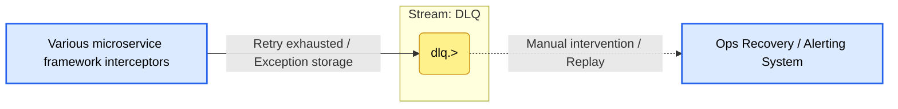

- **Core Responsibility**: The system's error fallback repository (Dead Letter Queue). It centrally stores "Poison Messages" that cannot be processed normally after multiple retries due to various reasons (bugs, dirty data, downstream database crashes).
- **Retention Strategy**: `RetentionPolicy.Limits`.
  - **Reason**: Original data from error scenes must be preserved permanently within storage limits, waiting for manual or automated intervention, and cannot be accidentally consumed by other consumers.

- **Storage Type**: `StorageType.File` (Disk).
  - **Reason**: Dead letter data contains precious error context and raw payloads, which must be persisted to disk absolutely reliably.

- **Key Configuration and Design Details**:
  - **max_age: 7 days**: Provides an ample buffer for developers and ops teams (covering weekends and long holidays). Once a DLQ alert is received, engineers have 7 days to locate the issue. After fixing the bug, original messages can be extracted from the DLQ via ops interfaces and redelivered (simply by removing the `dlq.` prefix).
  - **Unified Degradation Prefix (`dlq.>`)**: Through standard subject naming (currently `dlq.auth.event.>`, etc.), the framework centrally archives failed events from different business lines, while the suffix clearly indicates which business produced the dead letter.
- **Comprehensive Inflow Mechanisms**:
  - **Consumer-side Fallback**: In `BaseNatsSubscriber`, if a message NAKs at the consumer end (e.g., User DB unreachable) and still fails after maximum retries (`max_deliver: 3`), the consumer framework intercepts it, forwards it to the DLQ, and ACKs the original message (removing it from the original queue to prevent infinite loops blocking the entire queue).
  - **Producer-side Fallback**: In `BoundedPublisherService`, if publishing to a normal subject fails due to NATS anomalies or a full rate limiter, the publisher framework also attempts to drop the data into the DLQ stream as a fallback to preserve evidence.

#### Subject 1: dlq.> (e.g., dlq.auth.event.user.loggedIn)

**Description**: Recycle bin for Poison Messages and crash scenes.

- **Producer Configuration (Producer: Framework-layer interception in various microservices)** This is a special subject whose "producer" is not business code but the underlying framework's exception capture mechanism.
  - **Production Scenario 1: Consumer Retry Exhaustion**:
    - **Logic**: In `BaseNatsSubscriber.handleError`, when an exception is still thrown after `deliveryCount >= max_deliver` (default 3).
    - **Publishing Behavior**: Sends original message to `dlq.${m.subject}` and sends `m.ack()` to the original message.
    - **Reason**: If the database is down or dirty data is encountered, continuous `m.nak()` would keep the message at the front of the queue, blocking all subsequent normal messages (head-of-line blocking). Moving it to DLQ while ACKing the original queue "unclogs the pipe" and isolates the error.
  - **Production Scenario 2: Producer NATS Link Interruption**:
    - **Logic**: In `BoundedPublisherService`, if the main subject publish fails.
    - **Publishing Behavior**: Enters `.catch()` and attempts `js.publish(dlqSubject, payload)`.
    - **Reason**: As a last line of defense, when the target stream is unavailable (e.g., misconfiguration), it attempts to write the data to the DLQ stream to preserve evidence.

- **Consumer Configuration (Consumer: None currently)**
  - **Reason**: Dead letter queues must never be automatically consumed. Messages entering DLQ mean the system has repeatedly struggled but failed to process them. They must lie quietly on disk (`max_age: 7 days`).
  - **Future Evolution**: Typically, writing to the DLQ triggers an alert to the company's notification system (Lark, DingTalk bots). Developers see the alert, troubleshoot logs, fix bugs, and finally click "Replay" in an Admin dashboard. The system then removes the `dlq.` prefix and resends it back to the corresponding stream.

### **CURSOR_STATE (Cursor State Persistence Stream)**

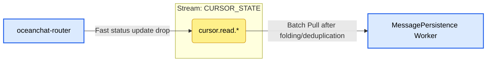

- **Core Responsibility**: Serves as a **Write-behind Cache** for extremely high-frequency ACK/Read Cursors, protecting the underlying database (MongoDB) and cache layer (Redis) from IOPS overload caused by "acknowledgment storms."
  - In large group chats or extremely active private chats, clients send high-frequency `[0x0B] READ_RECEIPT` confirmation signals after pulling messages. The gateway/router only delivers these state changes to this stream, achieving zero I/O blocking at the gateway layer.
  - The persistence worker consumes in batch mode in the background, syncing the final deduplicated and folded cursor states to Redis and persisting them to MongoDB.

- **Retention Strategy**: `RetentionPolicy.Limits`.
  - **Reason**: Cursor data is typical **"State Data"** rather than **"Event Data"**. We only care about the user's final state (the latest message seen) and completely ignore the process (intermediate SeqIds). The Limits strategy, combined with the `MaxMsgsPerSubject=1` trick, achieves perfect peak shaving for memory and disk.

- **Storage Type**: `StorageType.Memory`.
  - **Reason**: Even with file storage, it occupies almost no space due to the extreme queue deduplication feature. Even in the rare case of a total system crash losing cursor ACK data within a second or two, the system can restart from the last Redis or MongoDB record. Since clients have natural deduplication when receiving/sending messages or reconnecting, there's no need to worry about redundant message pulling, making Memory storage a safe bet for unbeatable throughput.

- **Key Configuration and Design Details**:
  - **`max_msgs_per_subject: 1` (Expert Storm Folding Mechanism)** 🌟:
    - **Reason**: **This is the core "magic" for solving group chat ACK write storms.** If a user scrolls frantically through a 10,000-person group chat in 1 second, triggering 50 cursor updates (e.g., SeqId from 101 to 150), NATS automatically discards old values when these 50 updates are published to the same subject precisely identifying that user. In the entire stream, for that group and user, the cursor queue **always contains only the latest entry (SeqId 150)**.
  - **Asynchronous Large-Batch Persistence (BulkWrite)**:
    - **Reason**: The persistence worker doesn't need to care about those 49 useless intermediate updates. it only periodically (e.g., once per second) Pulls the most compact set of states from the stream. After getting latest cursors for 1000 users, it calls MongoDB's `bulkWrite` once and uses Redis Pipeline for batch cache updates, reducing 50,000 high-frequency random writes to a minimal number of network I/Os.

#### Subject 1: cursor.read.\{groupId\}.\{userId\}

**Description**: Receives and merges the latest cursor state for a specific user in a specific session (group/private chat).

- **Producer Configuration (Producer: `oceanchat-router` or `oceanchat-api-gateway`)**
  - **Publishing Logic**: Upon receiving an ACK/Read signal from the client, it **performs no synchronous database or Redis operations** and asynchronously publishes the payload (e.g., `{"seqId": 1005}`) to the precise wildcard subject.
  - **Details and Reason**:
    - **Highly Granular Subjects**: Both `groupId` and `userId` must be included in the subject name (e.g., `cursor.read.G1.U1`). This is the prerequisite for `max_msgs_per_subject: 1` to precisely "keep only the latest record for U1 in G1."

- **Consumer Configuration (Consumer: `MessagePersistence Worker`)**
  - **Consumption Logic**: Pull mode subscribing to `cursor.>`.
  - **Details and Reason**:
    - **Batch Pull & Dual Write**: The worker pulls in batches (e.g., `batch: 1000`) via long polling, grabbing the most compact folded cursor states. It then uses Redis Pipeline for batch updates and performs MongoDB BulkWrite for persistence.
    - **Explicit ACK**: Worker ACKs NATS in batches only after both Redis and MongoDB batch writes succeed. Since the client is idempotent, any partial failures leading to retries won't affect business consistency.
    - **Durable Queue Group**: Multiple worker instances share the global cursor persistence load; each compacted cursor state is persisted only once.

### **SYS_PRESENCE (Status and Event Stream)**

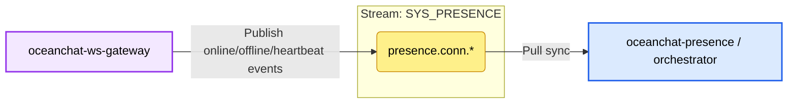

- **Responsibility**: Handles user online/offline events and connection heartbeats.
- **Retention Strategy**: Interest (retained only when services are listening) or short-term Limits.
- **Storage**: Memory (transient data).
- **Producer**: WebSocket Gateway.
- **Consumer**: Online Presence service / Push service.
- **Strategy**: Pull consumer with Queue Group (At-Least-Once delivery).

### **GROUP_HYBRID (Large Group Degradation Stream)**

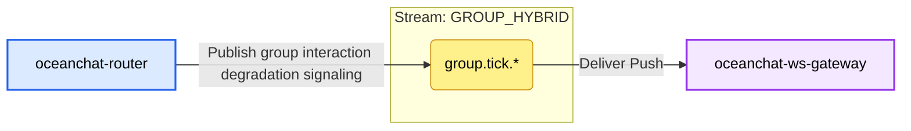

- **Responsibility**: Specifically designed for the **Push-Pull Hybrid** strategy in large groups (over 10,000 members) to prevent fan-out avalanches.
- **Producer**: Router service.
- **Consumer**: WebSocket Gateway (and indirectly to the client).
- **Strategy**: Signaling push + client pull (jittered HTTP/RPC).

### **IM_DOWNBOUND (Real-time Online Delivery Stream)**

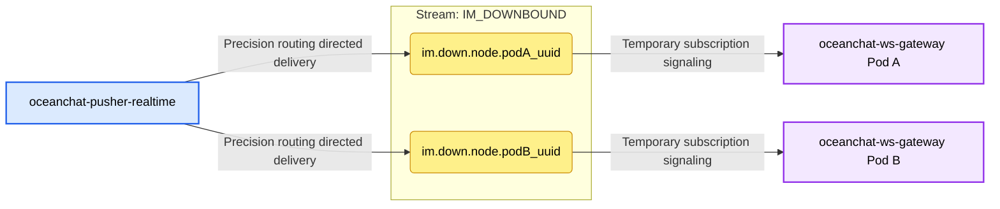

- **Core Responsibility**: In a distributed architecture, responsible for the **Precise Delivery (Unicast)** of downbound signaling (like `MSG_NOTIFY` wake-up and `MSG_UP_ACK` receipts) to the specific gateway instance holding the target user's WebSocket connection.
  - This is the link between "stateless gateways" and "centralized state services." The core Orchestrator service only needs to check the Redis online map for the device's `gatewayId` to deliver data like a parcel to the correct Pod.
- **Retention Strategy**: `RetentionPolicy.Interest` or very short `Limits`.
  - **Reason**: Downbound signaling strictly depends on specific physical gateway processes. If `Pod A` crashes, its in-memory WebSocket connections are all severed. Accumulating messages in `im.down.node.podA_uuid` is meaningless and creates data black holes. The Interest strategy ensures unowned messages are discarded immediately once the gateway goes offline.
- **Storage Type**: `StorageType.Memory`.
  - **Reason**: Ultimate delivery latency requirement. Online push signaling is "volatile data." According to the Push-Pull Hybrid mechanism, even if signaling is lost in memory during extreme cases, clients will pull historical entity data via an active HTTP Sync upon reconnection or session opening, so Memory is safely used for maximum IOPS.
- **Key Configuration and Design Details**:
  - **Zero-Payload Push**: The `MSG_NOTIFY` transmitted here contains no business message entities, only `GroupId` and `SyncSeqId` (cursor). This completely eliminates network fan-out avalanches and head-of-line blocking under high-concurrency group chats.

#### Subject 1: im.down.node.\{gatewayId\}

**Description**: Precise "delivery address" for cross-node communication between microservices, used for sending real-time binary protocol frames to a single specific gateway node.

- **Producer Configuration (Producer: `oceanchat-pusher-realtime` or `oceanchat-orchestrator`)**
  - **Publishing Logic**: After finding the target user's online node ID from Redis `oceanchat-presence`, publishes events to the dedicated subject corresponding to that UUID.
  - **Details and Reason**:
    - **Asynchronous Fire-and-Forget**: The push service releases lightweight signals immediately without waiting for the gateway's ACK, ensuring ultra-high throughput during high-frequency dispatch.

- **Consumer Configuration (Consumer: `oceanchat-ws-gateway`)**
  - **Consumption Logic**: Each gateway instance extracts its own UUID upon startup and dynamically listens to its private `im.down.node.{this.gatewayId}` subject.
  - **Details and Reason**:
    - **Ephemeral Consumer**: **Never configures `durable_name`**.
      - **Reason**: The gateway is a stateless physical-layer proxy; process destruction means connection termination. No `durable_name` makes this an At-Most-Once ephemeral subscription. Once the gateway dies, its private mailbox is automatically destroyed, leaving no unreachable garbage queues on the server.
    - **Pure Memory Reverse Routing**: Upon receiving a NATS message, the gateway performs an O(1) lookup in its local memory tree (`userRoutingTree`: `Map<UserId, Map<DeviceId, ClientConnection>>`) to find the corresponding TCP socket without querying any database.
    - **Intelligent Micro-batching**: To prevent push storms from high-burst group messages, the gateway writes signals into a per-connection folding pool and automatically collapses multiple `MSG_NOTIFY` signals for the same group into a single downbound packet carrying the largest `SyncSeqId` within a 200ms anti-shake window (`collapseTimer`).

### **OFFLINE_PUSH (Third-party Push Stream)**

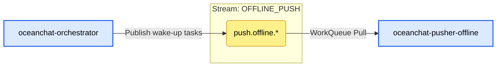

- **Core Responsibility**: Handles offline wake-up notifications to Apple APNs, Google FCM, and domestic vendor APIs.
  - When `oceanchat-orchestrator` detects a user is offline (no active TCP/WS connection), it publishes a lightweight wake-up task to this stream.
  - Dedicated `oceanchat-pusher-offline` workers pull tasks from this stream and call third-party network interfaces. Physical isolation ensures slow or unstable third-party HTTP calls don't drag down the core `IM_CORE` real-time message queue.

- **Retention Strategy**: `RetentionPolicy.WorkQueue`.
  - **Reason**: Offline push is a typical task consumption scenario. Once a push task is successfully sent to Apple/Google and an ACK is returned, the task is complete and should be removed from NATS immediately. With multiple push service instances, WorkQueue ensures a task is assigned to only one idle instance, providing natural load balancing.

- **Storage Type**: `StorageType.File` (Disk).
  - **Reason**: Third-party push interfaces often face rate limiting or downtime. If a large number of tasks accumulate, keeping them in memory could lead to NATS OOM. Disk storage handles massive backlogs and prevents losing pending notifications if NATS restarts.

- **Key Configuration and Design Details**:
  - **`max_msgs_per_subject: 1` with `discard: "old"` (Folding Deduplication Strategy)**:
    - **Reason**: An expert-level optimization for the "fan-out avalanche" caused by high-burst group messages. Offline notifications only need to "wake up" the client and refresh the OS unread count. `max_msgs_per_subject: 1` for a single user's sub-subject (e.g., `push.offline.apns.user123`) ensures only the latest task is kept. If a new message arrives before the old one is sent, the old one is discarded (`discard: "old"`) and replaced. This achieves lock-free folding of push signaling at the physical queue layer, significantly reducing third-party API costs and avoiding excessive vibrations/popups for users.
  - **`max_age: 24h`**:
    - **Reason**: Offline push tasks pending for more than a day usually lose their relevance. Dead tasks older than 24 hours are automatically cleaned up.

#### Subject 1: push.offline.\{vendor\}.\{user_id\} (e.g., push.offline.apns.uid123)

**Description**: Precise offline wake-up task subjects for specific vendors and users.

- **Producer Configuration (Producer: `oceanchat-orchestrator`)**
  - **Publishing Logic**: After querying Redis online status and finding the user is completely offline, the Orchestrator identifies the device platform and publishes a lightweight wake-up command.
  - **Details and Reason**:
    - **User-specific Subject Paths**:
      - **Reason**: Subjects must be granular down to the user level for the stream-level `max_msgs_per_subject: 1` strategy to know which user's queue to deduplicate. Broad subjects would leave only one task for all users.

- **Consumer Configuration (Consumer: `oceanchat-pusher-offline`)**
  - **Consumption Logic**: Pull mode using wildcard subscription to `push.offline.>`.
  - **Details and Reason**:
    - **Pull Consumer**:
      - **Reason**: The service calls external HTTP APIs (Apple/Google) with uncontrollable latency and strict rate limits. Pull mode allows consumers to fetch tasks based on their processing capacity and vendor limits, smoothing out peaks and avoiding being overwhelmed by massive offline tasks (solving OOM risks).
    - **`ack_policy: "explicit"` and `ack_wait: "10s"`**:
      - **Reason**: The worker ACKs NATS only after receiving an HTTP 200 OK from APNs or FCM. If the external interface hangs, times out, or returns a 5xx error, no ACK is sent, and NATS automatically returns the task to the queue after 10 seconds for other healthy workers to retry.
    - **`max_deliver: 3` (Maximum Delivery Attempts)**:
      - **Reason**: Prevents infinite loops. If a user's DeviceToken is completely invalid (e.g., App uninstalled) and Apple returns 400 BadDeviceToken consistently, after 3 retries, the NATS consumer framework moves the task to the DLQ as a poison message to avoid wasting system resources.
    - **`durable_name: "offline-pusher-group"` (Durable Consumer Group)**:
      - **Reason**: A fixed Durable Name is required so NATS treats all `oceanchat-pusher-offline` instances as one "Consumer Group." They share a single consumption cursor for natural **load balancing**. Each push notification is pulled by only one instance, preventing duplicate pushes.
    - **`deliver_policy: "all"`**:
      - **Reason**: Only takes effect when the consumer group is first created. It instructs NATS to point the initial shared cursor to the oldest message in the stream. Combined with the Durable mechanism, this ensures that even if all push instances are down for maintenance, they will resume from the oldest pending tasks upon restart, without missing or duplicating messages.

### **BACKGROUND_TASKS (Multimedia and Audit Stream)**

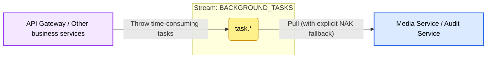

- **Core Responsibility**: Handles CPU-intensive computing (audio/video transcoding, thumbnail generation) and time-consuming external I/O calls (third-party AI for NSFW/violence detection).
  - By throwing these heavy multimedia and compliance tasks into a dedicated background stream, the core `IM_CORE` real-time chat path is protected from "avalanche" slowdowns and head-of-line blocking, achieving perfect physical isolation.
- **Retention Strategy**: `RetentionPolicy.WorkQueue`.
  - **Reason**: A pure task distribution scenario. Once a transcoding or audit task is successfully executed and ACKed by a worker, it should be removed from the stream immediately. WorkQueue mode naturally supports competitive consumption; with 10 transcoding workers, tasks are automatically load-balanced.
- **Storage Type**: `StorageType.File` (Disk).
  - **Reason**: Tasks like multimedia transcoding take time (often tens of seconds to minutes). If massive videos are uploaded concurrently, accumulating tasks in memory would likely cause NATS OOM. Disk storage safely handles bursty upload peaks.
- **Key Configuration and Design Details**:
  - **Explicit NAK Fallback**:
    - **Reason**: Tools like ffmpeg can easily crash due to abnormal file formats, and external audit APIs can be volatile or timeout. When workers capture these exceptions, they immediately send a Negative Acknowledgment (NAK) to NATS. NATS then puts the task back at the front of the queue immediately (or after a backoff) for another healthy node to retry, rather than waiting for an Ack Wait timeout, greatly speeding up fault recovery.
  - **max_deliver: 3**:
    - **Reason**: Prevents "poison files" (e.g., completely corrupted video files) from infinitely looping and paralyzing the transcoding cluster. Tasks failing after 3 retries trigger the framework's fallback mechanism and are forwarded to the DLQ for isolation and manual intervention.

#### Subject 1: task.\* (e.g., task.media.transcode, task.audit.nsfw)

**Description**: Task queues for triggering specific background asynchronous computing units.

- **Producer Configuration (Producer: `oceanchat-api-gateway` or `oceanchat-message`)**
  - **Publishing Logic**: After a client successfully uploads a large file to OSS via HTTP, the gateway assembles the file's OSS URL and metadata into a task and throws it into this subject.
  - **Details and Reason**:
    - **Asynchronous Fire-and-Forget**: Business microservices proceed immediately after throwing tasks without waiting for background transcoding or AI audits. This significantly boosts front-end request throughput and perfectly supports the "send first, audit later" business model.
- **Consumer Configuration (Consumer: Media Service / Audit Service workers)**
  - **Consumption Logic**: Pull mode precisely subscribing to required task types (e.g., `task.media.>` or `task.audit.>`).
    - **Details and Reason**:
      - **Pull Mode and Peak Shaving**:
        - **Reason**: Media processing is extremely CPU and memory intensive. Pull mode allows workers to fetch tasks based strictly on their hardware load and concurrent capacity (e.g., `batch: 1`). Thus, no matter how high the front-end concurrency is, back-end workers won't be overwhelmed.
      - **durable_name (Durable Consumer Group)**:
        - **Reason**: Media and Audit services must respectively configure unique Durable Names (e.g., `media-worker-group` and `audit-worker-group`) to ensure identical tasks aren't processed repeatedly under multi-instance deployments.
      - **Extended ack_wait time**:
        - **Reason**: Compared to normal chat signals, transcoding tasks take much longer. The consumer's `ack_wait` must be set large enough (e.g., `5m` or `10m`) to prevent NATS from mistaking a normally running node for a crashed one and triggering redelivery.

### **DEVICE_SYNC (Device Sync Stream)**

- **Core Responsibility**: Syncs read cursors and clears notification badges across multiple devices. When a user reads a message on one device (e.g., mobile), it triggers multi-terminal status sync, instantly and silently clearing the corresponding unread red dots on other active devices (e.g., PC, tablet).
- **Retention Strategy**: `RetentionPolicy.Interest`.
  - **Reason**: Roaming events are only valuable when the target user is actually online on other devices (i.e., a gateway subscription exists for that `userId`). Without subscribers, messages can be discarded to save queue storage.
- **Storage Type**: `StorageType.Memory`.
  - **Reason**: This is merely a "transient online notification" for experience enhancement. Even if NATS failure causes event loss before delivery, clients will automatically pull the latest sync cursor from the backend upon reconnection or opening a session (via HTTP Sync). Thus, this data is loss-tolerant and safely kept in memory for maximum IOPS.

#### Subject 1: sync.cursor.read.\{userId\}

**Description**: Broadcasts cross-device cursor synchronization events for a specific user.

- **Producer Configuration (Producer: `oceanchat-router`)**
  - **Publishing Logic**: While processing a `[0x0B] READ_RECEIPT` protocol packet passed from the gateway, the Router not only asynchronously places the cursor in `CURSOR_STATE` for persistent folding but also broadcasts a cross-terminal sync event to the `sync.cursor.read.{userId}` subject in this stream.

- **Consumer Configuration (Consumer: `oceanchat-ws-gateway`)**
  - **Consumption Logic**: Temporary, At-Most-Once subscription monitoring mode.
  - **Details and Reason**:
    - **No durableName (Ephemeral Subscription)**: The user might be online on multiple different gateway instances (e.g., PC on Gateway A, iPad on Gateway B). Each gateway instance needs to receive this broadcast (Fan-out), so a Queue Group cannot be formed; independent ephemeral subscriptions must be used.
    - **Silent Delivery and Badge Clearance**: Upon receiving an event for this subject, the gateway immediately assembles a cross-terminal clear command and delivers it to the corresponding long connection. The receiver (e.g., PC) silently updates its local `MaxLocalSyncSeqId` cursor for that group and instantly clears the unread red dot on the UI without human intervention.
