<head>
  <meta name="twitter:card" content="summary_large_image" />
  <meta property="og:title" content="JetStream Topology and Consumption Strategy | Ocean Chat" />
  <meta property="og:description" content="Detailed explanation of Ocean Chat NATS JetStream topology, subject namespaces, and distributed consumption strategies, supporting 100k+ concurrent connections." />
  <link rel="canonical" href="https://jameswilson19970101.github.io/ocean.chat.docs/docs/devdocs/jetstream-strategy" />
</head>

# NATS JetStream Topology and Strategy

To support 100k+ concurrent connections, Ocean Chat uses **NATS JetStream** not just as message middleware, but as the central nervous system connecting all microservices. This topology strictly isolates high-throughput data streams from control flows and leverages wildcard routing for precise microservice consumption strategies.

## Architecture Overview Diagram

The following diagram illustrates the production and consumption flows between Ocean Chat microservices and NATS JetStream subjects.

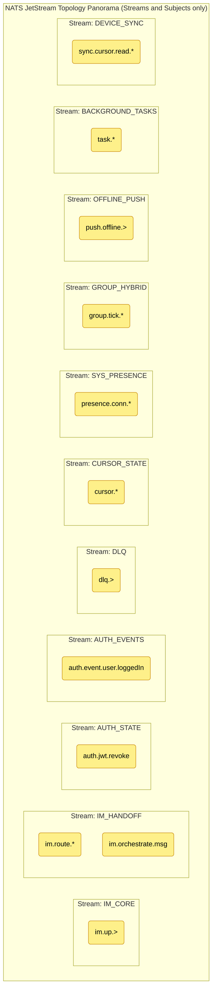

This document details the stream definitions, subject namespaces, and delivery semantics (push/pull, at-least-once, at-most-once) required for the Ocean Chat architecture.

## 1. Stream Definitions

Streams in Ocean Chat are partitioned by **Business Domain** and **Data Retention Lifecycle**, never by user or group ID (which would cause stream explosion).

### **IM_CORE (Gateway Uplink Access Stream)**

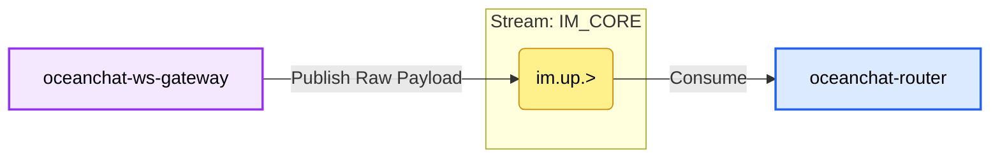

- **Core Responsibility**: The traffic entry point (Ingestion) for the entire IM system, specifically designed to handle large volumes of raw client uplink packets received by the WebSocket gateway. This is the highest throughput stream in the system.
- **Retention Strategy**: `RetentionPolicy.Limits`.
  - **Reason**: Short data retention period (e.g., 1-3 days is sufficient). This is merely a raw byte buffer stream for the gateway. Once the backend Router pulls, decodes, and hands off to the `IM_HANDOFF` stream, the mission of this raw data is complete. Short-term retention is used only for troubleshooting during extreme anomalies or system crashes.
- **Storage Type**: `StorageType.File` (Disk/SSD).
  - **Reason**: Although the retention period is short, during traffic peaks (e.g., massive group interactions during major live events) at 100k+ or even millions of concurrent connections, if backend microservices slow down, uplink messages will instantly accumulate in NATS. SSD-based file storage safely buffers burst traffic on disk, preventing Out-Of-Memory (OOM) crashes.
- **Key Configuration & Design Details**:
  - **Edge Stateless Fast Buffering**: The gateway is completely agnostic of specific business logic at this stage, dropping data into this stream immediately after stripping the WebSocket protocol. High I/O efficiency significantly increases the maximum number of long connections a single gateway instance can carry.

#### Subject 1: im.up.> (e.g., im.up.p2p, im.up.group)

**Description**: Raw access buffer pool. Carries undecoded Protobuf raw business payload packets.

- **Producer Configuration** (Producer: `oceanchat-ws-gateway`)
  - **Publishing Logic**: Upon parsing a valid WebSocket/TCP frame, it appends necessary system-level metadata (e.g., `gatewayId` and `connectionId`) and publishes the core raw byte payload to this subject at high speed.
  - **Details & Reasoning**:
    - **Pure Pipeline Transmission**: This process involves no database queries or writes. Clients will **not** receive a `MSG_UP_ACK` at this stage; confirmation is only returned after the message flows through to the downstream write barrier.

- **Consumer Configuration** (Consumer: `oceanchat-router`)
  - **Consumption Logic**: Pull mode (Pull Queue Group).
  - **Details & Reasoning**:
    - **Consumer Group Load Balancing**: Multiple Router instances form a single consumer group, sharing the massive uplink traffic to ensure each message is parsed by only one Router.
    - **Batch Pulling & Decoding**: Routers pull messages in batches (e.g., hundreds at a time) rather than one by one, leveraging CPU power to efficiently decode Protobuf and perform basic validation.
    - **Deferred Handoff ACK Mechanism**: After pulling a message from `im.up.>`, the Router service sends an explicit ACK only after it successfully routes and delivers the decoded message to the downstream `im.route.*` (`IM_HANDOFF` stream). This perfectly ensures no data loss during the handoff from the "Edge Access Layer" to the "Internal Business Layer".

### **IM_HANDOFF (Internal Routing & WAL Core Stream)**

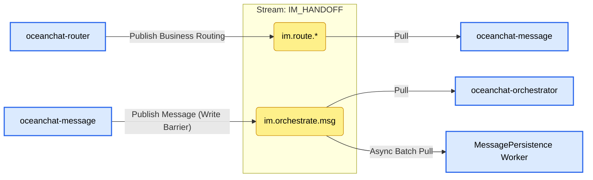

- **Core Responsibility**: The most critical stream in the system, acting not only as a "relay baton" for business payloads between microservices but also as the system's **Write Barrier (Write Fence)** and **Write-Ahead Log (WAL)**.
  - After `oceanchat-router` parses data from the gateway, it hands it off to this stream to trigger core business processing.
  - Once business services complete processing, they write back to this stream, leveraging NATS' high reliability to ensure no message loss, before branching into [Message Sending and Database Storage](./Bussiness%20Logic/Message%20sending%20and%20database%20storage.md) and "Real-time Dispatch/Push".

- **Retention Strategy**: `RetentionPolicy.Limits`.
  - **Reason**: Data needs to be independently and fully consumed by multiple different microservice consumer groups (e.g., Push Orchestrator, Persistence Worker). The Limits strategy ensures that even if one consumer (e.g., MongoDB batch persistence) is delayed or down, messages remain safe in the queue until all subscribers successfully advance their consumption cursors.

- **Storage Type**: `StorageType.File` (Disk/SSD).
  - **Reason**: Extreme reliability requirements. This is where the Write Barrier (WAL) resides. Once the server receives a NATS ACK from this stream, it returns a successful send confirmation to the client. In case of data center power failure or NATS crash, messages not yet persisted in MongoDB must be recoverable from disk.

- **Key Configuration & Design Details**:
  - **Write-after-persistence Architecture**: Decouples fast client responses (ACK returned upon crossing the write barrier) from slow database persistence (background asynchronous batch pull and insertion). This is the performance foundation for Ocean Chat to support 100k+ concurrent write operations.

#### Subject 1: im.route.\* (e.g., im.route.p2p, im.route.group)

**Description**: Internal business routing handoff. After `oceanchat-router` parses raw packets, it routes business payloads to specific business logic services.

- **Producer Configuration** (Producer: `oceanchat-router`)
  - **Publishing Logic**: Published to targeted subjects based on business type after Protobuf frame parsing, preliminary business-level rate limiting, and basic validation.
- **Consumer Configuration** (Consumer: `oceanchat-message` or `oceanchat-group`)
  - **Consumption Logic**: Pull mode.
  - **Details & Reasoning**:
    - **Queue Group**: Multiple instances of the same business service form a pull queue group, sharing the consumption cursor to achieve horizontal scaling and load balancing. Each message is processed by only one instance.
    - **At-Least-Once Delivery**: If a business service crashes during processing (e.g., during permission check) without sending an explicit ACK, NATS re-delivers the message to other healthy instances after a timeout, ensuring core business logic is not interrupted and messages are never lost.

#### Subject 2: im.orchestrate.msg

**Description**: **Location of the critical Write Barrier!** Valid processed messages are delivered here as final proof of "safe receipt". It simultaneously provides data sources for downstream asynchronous persistence and message dispatch/push.

- **Producer Configuration** (Producer: `oceanchat-message`)
  - **Publishing Logic**: Publishes the final business message body to this subject after friend/group authentication, content compliance audit, and assignment of a globally monotonically increasing `SyncSeqId`.
  - **Details & Reasoning**:
    - **Synchronous Wait for ACK**: When publishing, the message service must wait for a successful persistence ACK from NATS JetStream. Only after crossing this write barrier boundary will the service notify the gateway to deliver `[0x06] MSG_UP_ACK` to the client.

- **Consumer Configuration** (Has two independent Consumer Groups)
  - **Consumer A**: `oceanchat-orchestrator` (Push Orchestrator)
    - **Consumption Logic**: Real-time Pull.
    - **Details & Reasoning**: After pulling a message, the orchestrator queries the Redis presence map to evaluate the recipient's network status. It then decides whether to convert the message into a lightweight `MSG_NOTIFY` for the downlink stream or an offline wake-up task for the `OFFLINE_PUSH` stream.
  - **Consumer B**: `MessagePersistence Worker` (Message Persistence Pipeline)
    - **Consumption Logic**: Background asynchronous Batch Pull.
    - **Details & Reasoning**: This worker completely decouples slow disk I/O from the main link. By pulling hundreds of messages in a single batch and using MongoDB's Bulk Insert interface, it significantly reduces database IOPS pressure. The worker sends an explicit ACK to NATS only after successful persistence, advancing the group's progress and ensuring eventual consistency under massive concurrency.

### **AUTH_STATE (Global Security Stream)**

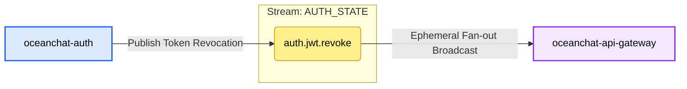

- **Core Responsibility**: High-speed broadcast of global critical security status changes between microservices.
  - Currently dedicated to JWT token blacklist revocation sync (`auth.jwt.revoke`).
  - When a user logs out, a Refresh Token replay attack is detected, or normal token rotation requires an old Access Token to be invalidated immediately, the Auth service publishes a revocation command to this stream.
  - API Gateway is the primary consumer. Using a "Zero-I/O Authentication" architecture, it no longer queries Redis for every request but maintains a local in-memory blacklist (`TokenBlacklistService`) by subscribing to this stream.

- **Retention Strategy**: `RetentionPolicy.Limits`.
  - **Reason**: A typical broadcast (Fan-out) pattern. If multiple API Gateway instances are running or restarting, each must be able to retrieve revocation records from this period. A Workqueue mode would cause events to disappear after one gateway reads them, preventing others from receiving them.

- **Storage Type**: `StorageType.Memory`.
  - **Reason**: Blacklist status is highly time-sensitive and requires maximum read/write speed; memory storage provides extreme latency performance.
  - *(Note: For security, if NATS Server crashes, memory data is lost. While gateways validate at the JWT level, changing to File storage for these small but critical security events could further enhance disaster recovery.)*

- **Key Configuration & Design Details**:
  - **max_age: 30m**: A clever sliding window design. Gateways only need to intercept tokens that are still within their valid lifespan but revoked early. The Access Token lifespan is configured as 30 minutes; revocation events older than 30 minutes have no retention value as the tokens themselves would have expired. (This value must be ≥ `jwt.accessExpiresIn`).
  - **Consumer Type (`Ephemeral + DeliverPolicy.All`)**: API Gateway is an ephemeral consumer without a `durableName`. Each time it starts or reconnects, it uses `DeliverPolicy.All` to pull all surviving data (past 30 minutes) from the stream. This ensures gateways quickly rebuild a complete blacklist cache upon cold start, preventing security vacuums.
  - **Publish Priority (`isCritical: true`)**: In the underlying `BoundedPublisherService`, revocation commands enjoy a reserved "security channel" queue quota. Even if the system is overwhelmed by normal events, revocation commands are prioritized to ensure system security.

#### Subject 1: auth.jwt.revoke

**Description**: Broadcasts security commands for early JWT token invalidation (e.g., logout, kick-out, replay attack detection).

- **Producer Configuration** (Producer: `oceanchat-auth`)
  - **Publishing Logic**: `BoundedPublisherService.publishSafe('auth.jwt.revoke', payload, '...', { isCritical: true })`
  - **Details & Reasoning**:
    - **isCritical: true**: This subject carries core security commands. `BoundedPublisherService` maintains two in-memory queues: Normal (`maxNormalQueueSize=5000`) and Critical (`maxCriticalQueueSize=10000`). Under extreme traffic pressure leading to backpressure, normal events are discarded, but messages with `isCritical: true` use a larger safety threshold to ensure revocation commands are still sent.
    - **Asynchronous Fire-and-Forget**: Revocation publishing should not block the current HTTP response time (RT); asynchronous emission maximizes interface throughput.

- **Consumer Configuration** (Consumer: `oceanchat-api-gateway`)
  - **Consumption Logic**: `NatsEventsService extends BaseNatsSubscriber`
  - **Details & Reasoning**:
    - **Ephemeral (No `durableName`)**: API Gateway requires a broadcast (Fan-out) mode. If `durableName` were set, multiple gateway instances would form a load-balanced group, with each instance receiving only a portion of the blacklist records. Without `durableName`, each gateway instance establishes an independent ephemeral subscription, receiving all revocation commands to maintain a complete local blacklist.
    - **DeliverPolicy.All**: Ephemeral consumers lose messages during disconnection. To solve cold start/network flicker issues, the gateway requests NATS to re-send all existing messages (all revocations from the past 30 minutes) upon each connection, perfectly rebuilding the in-memory blacklist.
    - **Redis Distributed Lock (Idempotency)**: `setnx(idempotencyKey, '1', 120)`. Handles the rare case of NATS network re-delivery (At-Least-Once). Since the gateway uses `DeliverPolicy.All`, it pulls old processed messages upon restart; the Redis lock acts as a high-speed cache to quickly ignore tokens already in the blacklist.

### **AUTH_EVENTS (Auth Events Stream)**

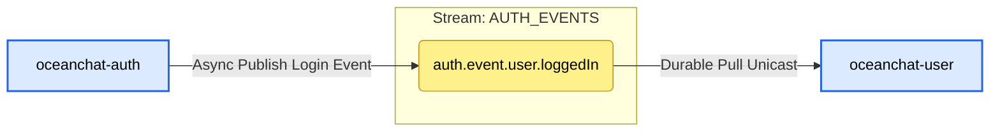

- **Core Responsibility**: Records and distributes system business-level behaviors and events.
  - Currently mainly used to broadcast user login success events (`auth.event.user.loggedIn`).
  - A typical asynchronous decoupling design. Auth focuses on high-concurrency authentication; time-consuming but non-critical operations like "recording last login time" or "updating login device history" are thrown into this stream for background processing by `oceanchat-user`.

- **Retention Strategy**: `RetentionPolicy.Limits`.
  - **Reason**: An Event Sourcing / Pub-Sub pattern. A login event might be consumed by Security Audit or Analytics services in the future. The Limits strategy ensures one event can be independently consumed by any number of different business consumer groups.

- **Storage Type**: `StorageType.File`.
  - **Reason**: Business events have data value and consistency requirements. If the downstream User service is down or NATS restarts, file storage ensures login records are not lost.

- **Key Configuration & Design Details**:
  - **max_age: 24h**: Provides a sufficient recovery window for downstream consumers. If the User service crashes, DevOps has 24 hours to fix and restart it, after which it can resume processing accumulated events. Data older than 24 hours is cleared to free disk space.
  - **Durable Consumer**: `oceanchat-user` is configured with `durableName: 'oceanchat-user-auth-events'`. This lets NATS persist its consumption cursor (Offset). Even after a restart, it continues from where it left off. Multiple User service instances with the same Durable name automatically form a Queue Group for load balancing.
  - **Idempotency Guarantee**: Since NATS JetStream guarantees At-Least-Once delivery, the consumer uses Redis to implement strict distributed deduplication locks to prevent redundant database updates under extreme network conditions.

#### Subject 1: auth.event.user.loggedIn

**Description**: Records successful user login business behavior for updating last active time, audit logs, etc.

- **Producer Configuration** (Producer: `oceanchat-auth`)
  - **Publishing Logic**: `BoundedPublisherService.publishSafe('auth.event.user.loggedIn', payload, '...', { isCritical: false })`
  - **Details & Reasoning**:
    - **isCritical: false**: Recording login time is a non-critical event. If Auth service encounters a traffic peak leading to NATS congestion, discarding these log events is acceptable (graceful degradation) to prevent Auth service memory from being exhausted and paralyzing core login functionality.

- **Consumer Configuration** (Consumer: `oceanchat-user`)
  - **Consumption Logic**: `NatsEventsService extends BaseNatsSubscriber`
  - **Details & Reasoning**:
    - **Durable (Durable Name: `oceanchat-user-auth-events`)**: A work queue/unicast mode. Regardless of how many `oceanchat-user` instances are deployed, each login event is processed only once. The Durable name lets NATS load balance between instances and persist the cursor so no events are missed even after a one-hour downtime.

### **DLQ (Dead Letter Queue Stream)**

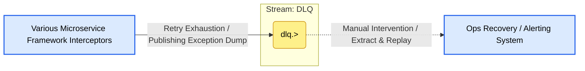

- **Core Responsibility**: The system's error fallback repository (Dead Letter Queue). Centrally stores "Poison Messages" that cannot be processed normally after multiple retries due to various reasons (bugs, dirty data, downstream database crash).
- **Retention Strategy**: `RetentionPolicy.Limits`.
  - **Reason**: Raw error data must not be accidentally consumed and should be retained within storage limits for manual or automated intervention.

- **Storage Type**: `StorageType.File`.
  - **Reason**: Dead letter data contains precious error contexts and raw payloads, which must be reliably persisted.

- **Key Configuration & Design Details**:
  - **max_age: 7d**: Provides a sufficient buffer for developers and Ops teams (covering weekends and holidays). Upon receiving a DLQ alert, engineers have 7 days to locate the problem. After fixing the bug, messages can be extracted from DLQ via an Ops interface and re-delivered (simply by removing the `dlq.` prefix).
  - **Unified Degradation Prefix (`dlq.>`)**: Standardized subject naming (e.g., `dlq.auth.event.>`) allows the framework to centrally archive failure events from different business lines while remaining clear about their origin.
  - **Comprehensive Inflow Mechanism**:
    - **Consumer Fallback**: In `BaseNatsSubscriber`, if a message NAKs at the consumer end and fails after maximum retries (`max_deliver: 3`), the framework intercepts it, forwards it to DLQ, and ACKs the original message (removing it from the original queue to prevent infinite blocking).
    - **Producer Fallback**: In `BoundedPublisherService`, if a normal subject publication fails due to NATS anomaly or rate limit saturation, the framework attempts to dump data into DLQ as a fallback to preserve evidence.

#### Subject 1: dlq.> (e.g., dlq.auth.event.user.loggedIn)

**Description**: Recycling bin for Poison Messages and crash scene contexts.

- **Producer Configuration** (Producer: Framework-level interception in microservices)
  - **Scenario 1: Consumer Retry Exhaustion**:
    - **Logic**: In `BaseNatsSubscriber.handleError`, when `deliveryCount >= max_deliver` (default 3) and an exception is still thrown.
    - **Action**: Sends the original message to `dlq.${m.subject}` and executes `m.ack()`.
    - **Reason**: Prevents "Poison Messages" (e.g., dirty data or database down) from blocking the entire queue by continuously NAK-ing.
  - **Scenario 2: Publisher NATS Link Interruption**:
    - **Logic**: In `BoundedPublisherService`, if primary subject publishing fails.
    - **Action**: Enters `.catch()` to attempt `js.publish(dlqSubject, payload)`.
    - **Reason**: As a last line of defense, attempts to save data to the DLQ stream when the target stream is unavailable.

- **Consumer Configuration** (Consumer: None currently)
  - **Reason**: Dead letter queues must never be automatically consumed. Messages in DLQ require manual intervention.
  - **Evolution**: Typically, DLQ writes trigger alerts (e.g., Slack/Teams/DingTalk). Developers fix the bug and then use an Admin UI to "Replay" messages by stripping the `dlq.` prefix and re-sending them to their original streams.

### **CURSOR_STATE (Cursor State Persistence Stream)**

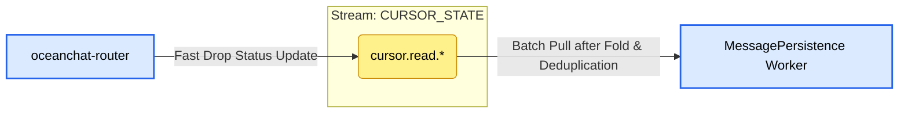

- **Core Responsibility**: Acts as an **asynchronous write-behind cache** for high-frequency read/receipt cursors, protecting the underlying database (MongoDB) and cache layer (Redis) from IOPS overload caused by "acknowledgment storms".
  - In large groups or highly active private chats, clients frequently send `[0x0B] READ_RECEIPT` signals. Gateways/Routers deliver these status changes to this stream, achieving zero I/O blocking at the gateway layer.
  - The persistence worker consumes in batch mode in the background, syncing final folded and deduplicated cursor statuses to Redis and MongoDB.

- **Retention Strategy**: `RetentionPolicy.Limits`.
  - **Reason**: Cursor data is typical **"State data"** rather than **"Event data"**. We only care about the final state (the latest message seen) and not the intermediate steps. The Limits strategy, combined with `max_msgs_per_subject: 1`, achieves perfect peak shaving.

- **Storage Type**: `StorageType.Memory`.
  - **Reason**: Due to extreme queue deduplication, it occupies almost no space even with memory storage. Even if system-wide downtime causes loss of a few seconds of cursor ACKs, the system simply resumes from the last Redis/MongoDB record. Clients have natural deduplication upon reconnection, so Memory storage is used for invincible throughput.

- **Key Configuration & Design Details**:
  - **`max_msgs_per_subject: 1` (Storm Folding Mechanism) 🌟**:
    - **Reason**: **The core "dark art" for solving group chat ACK write storms.** If a user triggers 50 cursor updates in 1 second while scrolling, all 50 events published to the same subject for that user will be automatically deduplicated by NATS. The queue for that user in that group **always contains only the latest entry (e.g., SeqId 150)**.
  - **Asynchronous BulkWrite**:
    - **Reason**: The persistence worker doesn't care about the 49 intermediate updates. It periodically (e.g., every second) pulls the folded status set from the stream. Pulling 1000 users' latest cursors allows for a single MongoDB `bulkWrite` and a Redis Pipeline update, reducing 50,000 random writes to minimal network I/O.

#### Subject 1: cursor.read.\{groupId\}.\{userId\}

**Description**: Receives and merges the latest cursor status for a specific user in a specific session.

- **Producer Configuration** (Producer: `oceanchat-router` or `oceanchat-api-gateway`)
  - **Publishing Logic**: Upon receiving ACK/Read signals from the client, it **performs no synchronous DB or Redis operations** and asynchronously publishes the payload (e.g., `{"seqId": 1005}`) to the precise wildcard subject.
  - **Details & Reasoning**:
    - **Highly Granular Subjects**: Both `groupId` and `userId` must be part of the subject name (e.g., `cursor.read.G1.U1`). This is a prerequisite for `max_msgs_per_subject: 1` to precisely retain only the latest record for U1 in G1.

- **Consumer Configuration** (Consumer: `MessagePersistence Worker`)
  - **Consumption Logic**: Pull mode subscription to `cursor.>`.
  - **Details & Reasoning**:
    - **Batch Pull & Dual Write**: The worker pulls folded statuses in large batches (e.g., `batch: 1000`). It then uses Redis Pipeline and MongoDB BulkWrite to sync status.
    - **Explicit ACK**: Worker sends batch ACKs to NATS only after successful Redis and MongoDB writes. Since clients are idempotent, partial failures leading to retries do not impact business consistency.
    - **Durable Queue Group**: Multiple workers share the load, ensuring each folded status is persisted only once.

### **SYS_PRESENCE (Presence & Event Stream)**

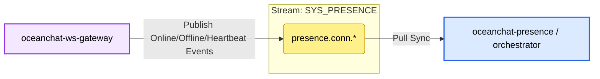

- **Responsibility**: Handles user online/offline events and connection heartbeats.
- **Retention Strategy**: Interest (retained only if there are active listeners) or short-term limits.
- **Storage**: Memory (transient data).
- **Producer**: WebSocket gateway.
- **Consumer**: Presence service / Push service.
- **Strategy**: Pull consumer with queue group (at-least-once delivery).

### **GROUP_HYBRID (Ultra-Large Group Degradation Stream)**

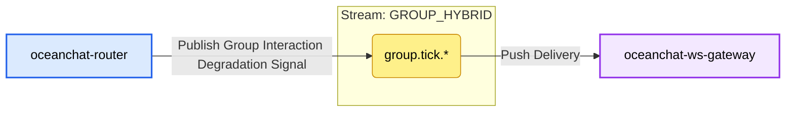

- **Responsibility**: Dedicated to the **Push-Pull Hybrid** strategy for ultra-large groups (10k+ members) to prevent fan-out avalanches.
- **Producer**: Router service.
- **Consumer**: WebSocket gateway (and indirectly the client).
- **Strategy**: Signal push + Client pull (jittered HTTP/RPC).

### **OFFLINE_PUSH (Third-party Push Stream)**

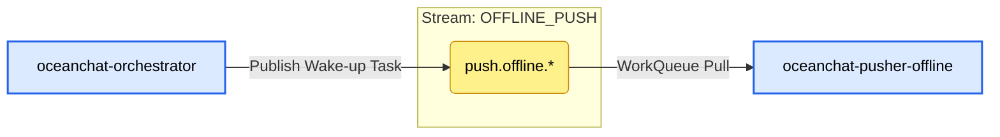

- **Core Responsibility**: Handles offline wake-up notifications for Apple APNs, Google FCM, and domestic vendors.
  - When `oceanchat-orchestrator` detects a target user is offline (no active TCP/WS connection), it publishes a lightweight wake-up task to this stream.
  - Dedicated `oceanchat-pusher-offline` workers pull tasks and call third-party APIs. Physical isolation ensures slow or unstable third-party HTTP calls do not drag down the core `IM_CORE` real-time queue.

- **Retention Strategy**: `RetentionPolicy.WorkQueue`.
  - **Reason**: Typical task consumption scenario. Once a task is successfully sent and ACK-ed, it should be removed from NATS. WorkQueue ensures each task is assigned to only one idle instance, achieving natural load balancing.

- **Storage Type**: `StorageType.File`.
  - **Reason**: Third-party APIs often encounter rate limits or downtime. Accumulating tasks in memory would cause NATS OOM. Disk storage handles massive backlogs and prevents task loss during NATS restarts.

- **Key Configuration & Design Details**:
  - **`max_msgs_per_subject: 1` & `discard: "old"` (Folding Strategy)**:
    - **Reason**: Optimized for "fan-out avalanches" caused by sudden message bursts in large groups. Offline notifications only need to "wake up" the client and refresh unread counts. `max_msgs_per_subject: 1` for a single user's sub-subject (e.g., `push.offline.apns.user123`) ensures only the latest task is kept. New tasks replace old ones, achieving **lock-free folding** of push signals at the physical queue layer, reducing API costs and user disturbance.
  - **`max_age: 24h`**:
    - **Reason**: Offline tasks accumulated for over a day usually lose their relevance and are automatically cleared.

#### Subject 1: push.offline.\{vendor\}.\{user_id\} (e.g., push.offline.apns.uid123)

**Description**: Subjects for precise dispatch of offline wake-up tasks to specific vendors and users.

- **Producer Configuration** (Producer: `oceanchat-orchestrator`)
  - **Publishing Logic**: After querying presence, if the target is completely offline, the orchestrator identifies the device platform and publishes a lightweight wake-up command.
  - **Details & Reasoning**:
    - **Per-user Subject Paths**: Subject must be granular to the user level so `max_msgs_per_subject: 1` can correctly deduplicate per user.

- **Consumer Configuration** (Consumer: `oceanchat-pusher-offline`)
  - **Consumption Logic**: Pull mode wildcard subscription to `push.offline.>`.
  - **Details & Reasoning**:
    - **Pull Consumer**: Allows workers to pull tasks based on their capacity and vendor limits, achieving peak shaving and preventing OOM under massive load.
    - **`ack_policy: "explicit"` & `ack_wait: "10s"`**: Workers ACK only after receiving HTTP 200 OK from APNs/FCM. Timeout without ACK leads to NATS automatically re-queuing the task.
    - **`max_deliver: 3`**: Prevents infinite loops for "poison tokens" (e.g., App uninstalled). After 5 failed attempts (configurable), the task is moved to DLQ.
    - **`durable_name: "offline-pusher-group"`**: Ensures all instances are treated as a single consumer group for load balancing and sharing a single cursor.
    - **`deliver_policy: "all"`**: Ensures that upon first group creation (or restart with durable), the group resumes from the oldest message in the stream.

### **BACKGROUND_TASKS (Media & Audit Stream)**

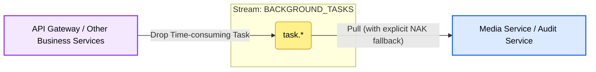

- **Core Responsibility**: Handles CPU-intensive computing (transcoding, thumbnail generation) and time-consuming external I/O (NSFW AI auditing).
  - Isolating these heavy tasks ensures the core `IM_CORE` real-time chat link is free from "avalanches" and Head-of-Line (HoL) blocking.
- **Retention Strategy**: `RetentionPolicy.WorkQueue`.
  - **Reason**: Typical task distribution scenario. Completed tasks are removed. Supports competitive consumption among multiple worker instances.
- **Storage Type**: `StorageType.File`.
  - **Reason**: Media processing tasks can take seconds to minutes. Disk storage safely handles bursts without NATS OOM.
- **Key Configuration & Design Details**:
  - **Explicit NAK Fallback**:
    - **Reason**: Transcoding (ffmpeg) or AI APIs often fail or timeout. Workers send a Negative Acknowledgment (NAK) upon error, causing NATS to immediately (or after a backoff) re-queue the task for other healthy nodes, speeding up recovery.
  - **max_deliver: 3**:
    - **Reason**: Prevents "poison files" (e.g., corrupt videos) from paralyzing the cluster. Failed tasks move to DLQ after 3 retries.

#### Subject 1: task.\* (e.g., task.media.transcode, task.audit.nsfw)

**Description**: Task queues for triggering specific background asynchronous computing workers.

- **Producer Configuration** (Producer: `oceanchat-api-gateway` or `oceanchat-message`)
  - **Publishing Logic**: After large files are uploaded to OSS via HTTP, the gateway publishes the OSS URL and metadata to this subject.
  - **Details & Reasoning**:
    - **Async Fire-and-Forget**: Business microservices return immediately without waiting for transcoding or auditing, maximizing frontend throughput and supporting "send-first-audit-later" models.
- **Consumer Configuration** (Consumer: Media Service / Audit Service)
  - **Consumption Logic**: Pull mode targeted subscription (e.g., `task.media.>` or `task.audit.>`).
    - **Details & Reasoning**:
      - **Pull Mode & Peak Shaving**: Allows workers to pull tasks strictly based on hardware capacity (e.g., `batch: 1`), preventing overload.
      - **Durable Name**: Independent Durable Names (e.g., `media-worker-group`) prevent redundant processing.
      - **Extended `ack_wait`**: Since transcoding can take minutes, `ack_wait` must be sufficiently large (e.g., `5m` or `10m`) to prevent premature re-delivery.

### **DEVICE_SYNC (Device Sync Stream)**

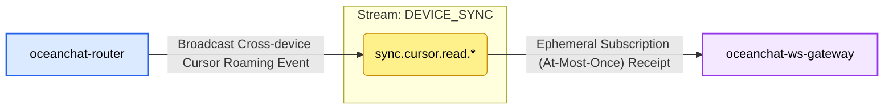

- **Core Responsibility**: Synchronizes read cursors across devices and clears notification badges. When a user reads messages on one device (e.g., mobile), it triggers a sync to other active devices (e.g., PC, tablet) to silently clear corresponding unread indicators.
- **Retention Strategy**: `RetentionPolicy.Interest`.
  - **Reason**: Roaming events are only valuable if the target user is indeed online elsewhere (gateway has active subscription). Without subscribers, messages are discarded to save space.
- **Storage Type**: `StorageType.Memory`.
  - **Reason**: Transient "online notifications" for UX. Loss during NATS failure is acceptable as clients fetch full sync cursors via HTTP upon reconnection.

#### Subject 1: sync.cursor.read.\{userId\}

**Description**: Broadcasts cross-device cursor sync events for a specific user.

- **Producer Configuration** (Producer: `oceanchat-router`)
  - **Publishing Logic**: While handling `[0x0B] READ_RECEIPT` packets, the Router asynchronously places the cursor in `CURSOR_STATE` for persistence and broadcasts a sync event to this subject.

- **Consumer Configuration** (Consumer: `oceanchat-ws-gateway`)
  - **Consumption Logic**: Ephemeral, At-Most-Once subscription.
  - **Details & Reasoning**:
    - **No `durableName` (Ephemeral)**: Since a user might be online on multiple gateway instances simultaneously, each gateway must receive the broadcast (Fan-out). Independent ephemeral subscriptions ensure this.
    - **Silent Delivery & Badge Clearing**: Gateways deliver clear commands to long-lived connections. Devices silently update local `MaxLocalSyncSeqId` and clear UI indicators without user intervention.
