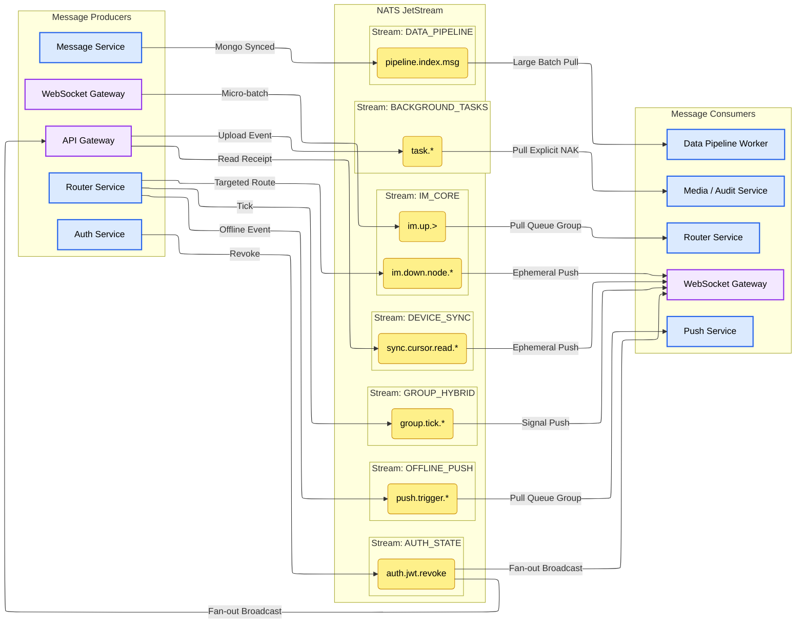
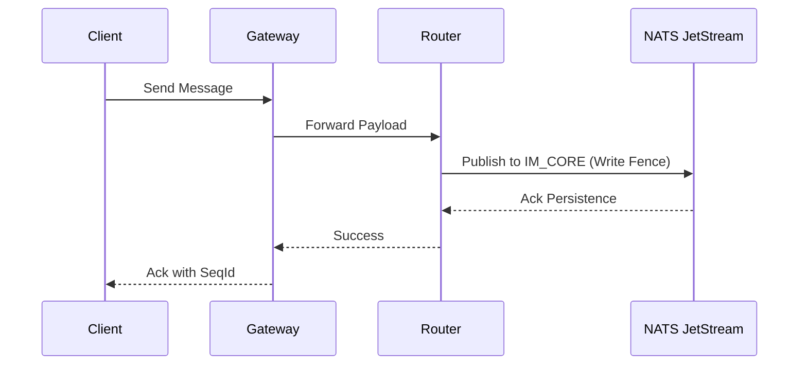

<head>
  <meta name="twitter:card" content="summary_large_image" />
  <meta property="og:title" content="JetStream Topology & Consumption Strategy | Ocean Chat" />
  <meta property="og:description" content="Comprehensive guide to Ocean Chat's NATS JetStream topology, subject namespaces, and distributed consumption strategies for ten-million concurrent connections." />
  <link rel="canonical" href="https://docs.oceanchat.com/docs/devdocs/jetstream-strategy" />
</head>

# NATS JetStream Topology & Strategy

To support ten-million concurrent connections, Ocean Chat utilizes **NATS JetStream** not just as a message broker, but as the central nervous system connecting all microservices. The topology strictly isolates high-throughput data streams from control streams and leverages wildcard routing for precise microservice consumption strategies.

## Overview Diagram

The following diagram illustrates the production and consumption flows between Ocean Chat microservices and NATS JetStream subjects.

This document details the exact Stream definitions, Subject namespaces, and the delivery semantics (Push/Pull, At-Least-Once, At-Most-Once) required for the Ocean Chat architecture.

## 1. Stream Definitions (Macro Isolation)

Streams in Ocean Chat are partitioned by **business domain** and **data retention lifecycle**, never by user or group ID (which would cause stream explosion).

### **IM_CORE (Core Messaging Stream)**

- **Responsibility**: Carries all upbound user messages and downbound system pushes. This is the highest throughput stream.
- **Retention**: Limits (e.g., 3-7 days, backed up by MongoDB for cold storage).
- **Storage**: File (SSD) for high throughput and persistence.
- **Producer**: WebSocket Gateway (upbound messages), Router Service (downbound messages).
- **Consumer**: Router Service (upbound), WebSocket Gateways (downbound).
- **Strategy**: Pull Consumer with Queue Group (for routing), Ephemeral Push (for delivery).
- **Write Fence Requirement**: All messages entering this stream are subject to the [Monkey Protocol Write Fence](./monkey-protocol-spec.md).

### **AUTH_STATE (Global Security Stream)**

- **Responsibility**: Distributes JWT revocation blacklists and security policies to support Zero-I/O local authentication.
- **Retention**: WorkQueue or NATS KV Store (Rollup by Subject).
- **Storage**: Memory or File.
- **Producer**: Auth Service.
- **Consumer**: All WebSocket Gateway and API Gateway instances.
- **Strategy**: Fan-out Broadcast (No Queue Group).

### **SYS_PRESENCE (Presence & Events Stream)**

- **Responsibility**: Handles user online/offline events and connection heartbeats.
- **Retention**: Interest (retained only while services are actively listening) or short Limits.
- **Storage**: Memory (transient data).
- **Producer**: WebSocket Gateway.
- **Consumer**: Presence Service / Push Service.
- **Strategy**: Pull Consumer with Queue Group (At-Least-Once).

### **GROUP_HYBRID (Large Group Degradation Stream)**

- **Responsibility**: Dedicated to the Push-Pull Hybrid strategy for mega-groups (10k+ users) to prevent fan-out avalanches.
- **Producer**: Router Service.
- **Consumer**: WebSocket Gateways (and transitively, the Clients).
- **Strategy**: Signal Push + Client Pull (Jittered HTTP/RPC).

## 2. Subject Namespace Design

The Subject hierarchy utilizes NATS wildcards (`*` and `>`) to enable precise routing.

- **Upbound Messages (Gateway -> Backend)**
  - P2P Chat: `im.up.p2p`
  - Group Chat: `im.up.group`
  - Signals (Read, Recall): `im.up.signal.*`
- **Downbound Push (Router -> Gateway)**
  - Targeted Node Push: `im.down.node.{gateway_node_uuid}`
- **System State**
  - Connection Events: `presence.conn.online`, `presence.conn.offline`
- **Authorization Control**
  - Token Revocation: `auth.jwt.revoke`

## 3. Microservice Consumption Strategies

Different microservices within the Ocean Chat ecosystem demand distinct consistency models and JetStream consumer types.

:::danger
Never use Push Consumers for CPU-intensive tasks (like Router or Message persistence). Under high load, Push Consumers will lead to memory exhaustion (OOM) and massive redelivery avalanches. Always use **Pull Consumers** with batching for heavy processing.
:::

import Tabs from '@theme/Tabs';
import TabItem from '@theme/TabItem';

<Tabs>
<TabItem value="router" label="Router Service: Core Routing" default>

The Router is the brain of the IM system. It decodes Protobuf payloads and computes target gateway nodes.

- **Producer**: WebSocket Gateway (publishing micro-batched client messages).
- **Consumer**: Router Service.
- **Strategy**: **At-Least-Once + Queue Group + Pull Mode**.
- **Mechanism**: Multiple Router instances share the load using a Queue Group. They use a continuous long-polling loop (e.g., fetching 500 messages at a time) to process batches. An explicit ACK is sent only after successful processing and database logging.

</TabItem>
<TabItem value="gateway" label="WebSocket Gateway: Targeted Delivery">

The Connection Gateway is strictly stateless and acts as a transparent proxy.

- **Producer**: Router Service (computing and routing to a specific gateway).
- **Consumer**: WebSocket Gateway (listening to its specific `local_uuid`).
- **Strategy**: **At-Most-Once + Ephemeral Push Consumer**.
- **Mechanism**: The Router sends a downbound message to a specific gateway node. The gateway blindly forwards it to the established WebSocket. If the gateway crashes, the message is lost in transit. Reliability is guaranteed by the client via the [Reliability & Ordering](./monkey-protocol-spec.md).

</TabItem>
<TabItem value="auth" label="Authentication Service: Zero-I/O Verification">

Implements the Zero-I/O authentication mechanism by keeping local memory states synchronized across all entry points.

- **Producer**: Auth Service (triggering token revocation).
- **Consumer**: ALL WebSocket Gateway and API Gateway instances.
- **Strategy**: **Fan-out Broadcast (No Queue Group)**.
- **Mechanism**: Every single Gateway instance (both WS and API) MUST subscribe independently to `auth.jwt.revoke`. When a token is revoked, the event reaches all gateways simultaneously so they can update their in-memory blacklists, entirely eliminating synchronous network I/O (like Redis queries) during both WebSocket handshakes and REST API requests.

</TabItem>
<TabItem value="group" label="Group Service: Push-Pull Hybrid">

Designed for mega-groups (e.g., live streaming rooms) to prevent NATS avalanches.

- **Producer**: Router Service.
- **Consumer**: WebSocket Gateways (and transitively, the Clients).
- **Strategy**: **Signal Push + Client Pull**.
- **Mechanism**: Instead of fanning out 100,000 full Protobuf messages to `im.down.node.*`, the Router publishes a tiny Tick signal containing the latest MaxSeqId to `group.tick.{group_id}`. Gateways forward the tick. Clients then initiate jittered HTTP/RPC pulls to fetch the actual payload, smoothing out backend read spikes.

</TabItem>
</Tabs>

## 4. TODO: Edge Service Streams

To protect the `IM_CORE` throughput, peripheral tasks are segregated into their own streams:

### **OFFLINE_PUSH (Third-party Push Stream)**

- **Responsibility**: Handles offline push notifications to APNs, FCM, and other vendor APIs.
- **Retention**: WorkQueue. Messages are removed once successfully pushed.
- **Storage**: File (SSD) to prevent loss during vendor API outages.
- **Producer**: Router Service (triggered when it detects the target user has no active TCP connections).
- **Consumer**: Push Service.
- **Strategy**: **Queue Group + Pull Consumer**. Since vendor APIs (Apple/Google) are prone to rate-limiting and latency, Pull mode allows the service to control the consumption rate. Built-in NATS redelivery handles flaky external network calls.

### **DATA_PIPELINE (Data Heterogeneity Stream)**

- **Responsibility**: Acts as the data pipeline for syncing chat records to Elasticsearch for global search.
- **Retention**: Limits (Retains data until safely indexed).
- **Storage**: File (SSD).
- **Producer**: Message Service (triggered immediately after saving to MongoDB).
- **Consumer**: Data Pipeline Worker.
- **Strategy**: **Large Batch Pull**. The worker fetches thousands of messages at once and uses the Elasticsearch Bulk API for high-efficiency indexing.

### **BACKGROUND_TASKS (Media & Audit Stream)**

- **Responsibility**: Manages CPU-intensive background jobs like media transcoding, image thumbnail generation, and content auditing (NSFW filters).
- **Retention**: WorkQueue.
- **Storage**: File (SSD).
- **Producer**: API Gateway or Business Microservices (upon successful file upload).
- **Consumer**: Media Service / Audit Service.
- **Strategy**: **Pull Consumer with Explicit NAKs**. If a video transcoding job fails, the consumer sends a Negative Acknowledgment (NAK) to NATS, instantly requeuing the task to another healthy instance instead of waiting for a timeout.

### **DEVICE_SYNC (Cursor Synchronization Stream)**

- **Responsibility**: Synchronizes read cursors and clears notification badges across multiple devices for the same user.
- **Retention**: Limits or Interest.
- **Storage**: Memory (Optimized for extreme IOPS; safe to lose during a NATS restart as clients will auto-sync upon reconnection).
- **Producer**: API Gateway (upon receiving a read-receipt from a client).
- **Consumer**: WebSocket Gateways.
- **Strategy**: **Ephemeral At-Most-Once Push**. Gateways listen to cursor updates and silently pass them to connected clients to clear UI badges.

## 5. Reliability Sequence

The following diagram illustrates the interaction between microservices and JetStream to ensure the **Write Fence** guarantee.

