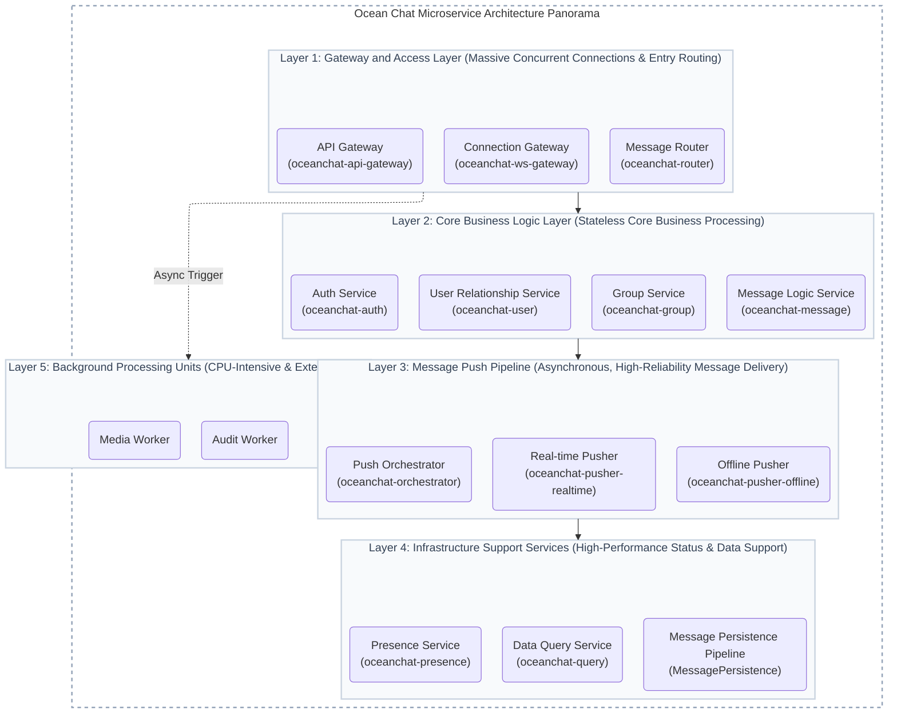
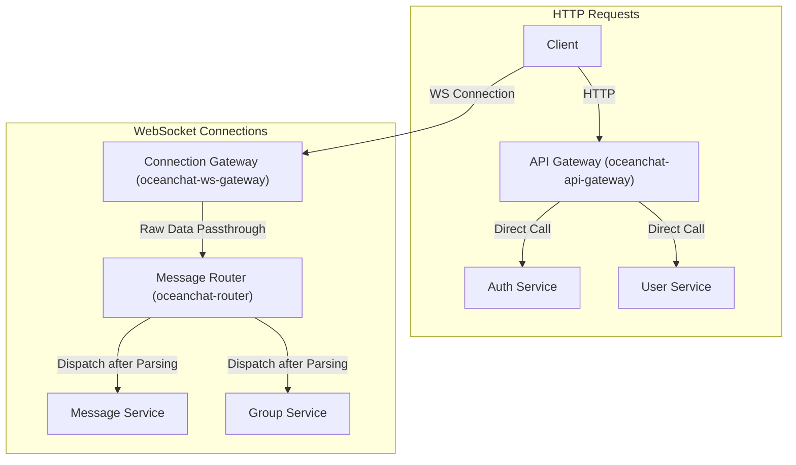

import Tabs from '@theme/Tabs';
import TabItem from '@theme/TabItem';

# Microservice Architecture

:::info Architecture Overview
The entire platform adopts a distributed microservice architecture, designed to support tens of millions (10M+) of concurrent connections. It is divided into five logical layers, comprising 11 core microservices, 2 independent background work units, and 1 data processing pipeline, ensuring clear separation of responsibilities.
:::

## Technology Stack

The project is built on a modern and robust technology stack, selected for its performance, scalability, and developer experience.

- **[NestJS 11](https://nestjs.com/)**: A progressive Node.js framework for building efficient, reliable, and scalable server-side applications. Its modular architecture is ideal for developing the microservices in this project.

- **[TypeScript 5](https://www.typescriptlang.org/)**: The primary programming language of the project. By adding static types to JavaScript, it improves code quality, readability, and maintainability, which is essential for large-scale projects.

- **[Yarn 4.7](https://yarnpkg.com/)**: A fast, reliable, and secure dependency management tool used to efficiently manage the project's packages and dependencies.

- **[MongoDB](https://www.mongodb.com/) (with Mongoose)**: The primary NoSQL database for persistent data storage. It is used for storing user data, messages, group information, etc. Mongoose acts as the Object Data Modeling (ODM) library, providing a schema-based solution for application data modeling.

- **[Redis](https://redis.io/)**: A high-performance in-memory data store. In this project, it is used for caching, real-time user presence management, and as a high-speed message bus for certain real-time communication scenarios.

- **[NATS](https://nats.io/) (with JetStream)**: A simple, secure, and high-performance open-source messaging system that serves as the primary communication backbone between microservices. This project specifically leverages its built-in persistence engine, **NATS JetStream**, to provide at-least-once delivery guarantees. This is crucial for reliable asynchronous operations such as persisting messages, handling offline pushes, and broadcasting domain events.

## IM Architecture Diagram

## Layer 1: Gateway and Access Layer

This layer is the direct entry point for users, focusing on handling massive concurrent connections, which is the performance bottleneck of the entire system.

### 1. **API Gateway Service (oceanchat-api-gateway)** (Stateless)

<Tabs>
<TabItem value="desc" label="Overview" default>
This gateway is the sole entry point for external HTTP requests.
</TabItem>
<TabItem value="resp" label="Core Responsibilities">

- **Request Routing**: Core functionality. Acts as the unique entry point for all external RESTful API requests. Client requests for login, registration, profile retrieval, and history queries first arrive here, then are forwarded to the corresponding services based on rules (e.g., `/auth/*` to oceanchat-auth, `/users/*` to oceanchat-user).
- **Authentication**: Implements **Zero-I/O Authentication**. It cryptographically verifies RS256 Access Tokens and performs `O(1)` local memory lookups against token blacklists (synchronized via NATS JetStream events), completely eliminating synchronous network I/O (like Redis queries) on the critical path to support high concurrency.
- **Rate Limiting**: For instance, limiting a single IP to 10 requests per second to prevent backend services from being overwhelmed.
- **Logging & Monitoring**: Records logs for all incoming and outgoing HTTP requests for troubleshooting and performance analysis.

</TabItem>
<TabItem value="reason" label="Reason for Separation">
Provides a unified, secure, and manageable facade for all stateless HTTP requests. Separating API management from real-time connection management ensures single responsibility and easier independent scaling.
</TabItem>
</Tabs>

### 2. **Connection Gateway Service (oceanchat-ws-gateway)** (Stateless)

<Tabs>
<TabItem value="desc" label="Overview" default>
Given that this service is stateless, it is designed to be business-agnostic, lightweight, and simple.
</TabItem>
<TabItem value="resp" label="Core Responsibilities">

- **Real-time Connection Entry**: The sole entry point for all external WebSocket/TCP long connections.
- **Connection Authentication**: Authenticates connections when clients establish long-lived sessions (via "Auth Service" calls or local validation using shared public keys).
- **Data Passthrough**: Acts as a pure connection channel, encapsulating raw client data packets (e.g., appending `connectionId`, `gatewayId`) and quickly delivering them to the backend **Message Router**.
- **Message Delivery**: Receives instructions from the **Real-time Pusher** to accurately push messages to clients connected to this instance.

</TabItem>
<TabItem value="reason" label="Reason for Separation">
Completely separates resource-intensive I/O tasks (maintaining connections) from CPU-intensive tasks (business logic). This allows the Connection Gateway to be highly optimized and horizontally scaled to support millions or even billions of concurrent connections.
</TabItem>
</Tabs>

### 3. **Message Router Service (oceanchat-router)** (Stateless)

<Tabs>
<TabItem value="resp" label="Core Responsibilities" default>

- **Message Decoding & Dispatch**: Receives raw data packets from the **Connection Gateway**, performing decoding, protocol parsing, and preliminary validation.
- **Business Routing**: Determines which business microservice should handle the message based on its type, then dispatches it via NATS message queues.
- **Upstream Flow Control**: Works with the gateway's connection-layer rate limiting to implement fine-grained `userId`-based rate limiting and circuit breaking after decoding business packets. For example, "limiting each user ID to 100 business requests per second."

</TabItem>
<TabItem value="reason" label="Reason for Separation">
Decouples the access layer from the business logic layer. As an intermediary orchestrator, the Router makes backend service changes transparent to the gateway layer, greatly improving system flexibility.
</TabItem>
</Tabs>

## Layer 2: Core Business Logic Layer

This layer handles all core business functions of the IM platform and is designed as stateless services for easy horizontal scaling.

### 4. **Auth Service (oceanchat-auth)** (Stateless)

<Tabs>
<TabItem value="resp" label="Core Responsibilities" default>

- **User Authentication**: Processes user registration, login, and logout HTTP requests proxied by the API Gateway.
- **Token Management**: Responsible for generating, validating, and refreshing access tokens (JWT recommended), serving as the core of system security.
- **Validation Capability**: Provides internal APIs for other microservices (especially the **Connection Gateway**) to verify token validity.
- **Domain Event Publishing**: Publishes asynchronous domain events (e.g., registration success, login success) to NATS JetStream for other services to subscribe and process.

</TabItem>
<TabItem value="reason" label="Reason for Separation">
Independently provides a single trusted service for user identity authentication. All other services rely on it to confirm user identity, ensuring clear responsibility and unified security policy management.
</TabItem>
</Tabs>

### 5. **User Relationship Service (oceanchat-user)** (Stateless)

<Tabs>
<TabItem value="resp" label="Core Responsibilities" default>

- **Data Management**: Manages user accounts, profiles, friend relationships (add/remove/blacklist), and contacts.
- **Permission Decision-Making**: As the sole owner of relationship data, it performs permission checks (e.g., answering "Are users A and B friends?").

</TabItem>
<TabItem value="reason" label="Reason for Separation">
User and relationship data are foundational to IM; an independent service provides a unified and stable data source. Encapsulating permission logic here ensures consistency in data and rules.
</TabItem>
</Tabs>

### 6. **Group Service (oceanchat-group)** (Stateless)

<Tabs>
<TabItem value="resp" label="Core Responsibilities" default>

- **Lifecycle Management**: Handles group creation/dissolution, member management, permissions, announcements, and settings.
- **Permission Decision-Making**: As the sole owner of group data, it contains all group-related permission logic (e.g., checking if a user is a member or muted).

</TabItem>
<TabItem value="reason" label="Reason for Separation">
Group chat business logic (especially permissions and membership) is complex; an independent service reduces code complexity and facilitates independent development.
</TabItem>
</Tabs>

### 7. **Message Logic Service (oceanchat-message)** (Stateless)

<Tabs>
<TabItem value="resp" label="Core Responsibilities" default>

- **Permission Coordination**: Acts as a "coordinator" for permission verification, calling the correct "decision-maker" service. For example, it calls the **User Service** for private messages and the **Group Service** for group messages.
- **Message Processing**: The business hub for private and group messages, responsible for permission validation, content processing (@mentions, sensitive word filtering), message ID generation, and message body assembly.
- **Delivery Trigger**: After processing, calls the **Push Orchestrator** to start the delivery process.

</TabItem>
<TabItem value="reason" label="Reason for Separation">
Separates the "what" (message business logic) from the "how" (delivery process), ensuring clear responsibilities.
</TabItem>
</Tabs>

## Layer 3: Message Push Pipeline

This is critical for ensuring reliable and real-time message delivery through a highly asynchronous process.

### 8. **Push Orchestrator (oceanchat-orchestrator)** (Stateless)

<Tabs>
<TabItem value="resp" label="Core Responsibilities" default>

- **Delivery Decision**: Receives messages to be delivered from the **Message Logic Service**.
- **Status Query**: Queries the **Presence Service** in real-time for recipients' online status and their corresponding gateway nodes.
- **Task Dispatch**: Based on status, converts messages into "lightweight `MSG_NOTIFY` online wake-up tasks" or "offline push tasks," dispatching them to different NATS subjects.

</TabItem>
<TabItem value="reason" label="Reason for Separation">
As the "brain" of message delivery, it handles complex decision logic. Independence clarifies the push flow and simplifies monitoring and debugging.
</TabItem>
</Tabs>

### 9. **Real-time Pusher (oceanchat-pusher-realtime)** (Stateless)

<Tabs>
<TabItem value="resp" label="Core Responsibilities" default>

- **Task Consumption**: Listens to the "online push" queue and consumes tasks.
- **Command Delivery**: Directly communicates with the **Connection Gateway** instance where the target user is connected, instructing it to deliver the message.
- **Tech Stack**: NATS JetStream subscriber, ioredis (for cross-gateway Pub/Sub).

</TabItem>
<TabItem value="reason" label="Reason for Separation">
Dedicated to online message delivery, it can be scaled independently based on the number of online users and message volume to ensure real-time performance.
</TabItem>
</Tabs>

### 10. **Offline Pusher (oceanchat-pusher-offline)** (Stateless)

<Tabs>
<TabItem value="resp" label="Core Responsibilities" default>

- **Task Consumption**: Subscribes to the "offline push" subject and consumes tasks.
- **API Invocation**: Calls push APIs from Apple (APNs), Google (FCM), or domestic vendors to send offline notifications.

</TabItem>
<TabItem value="reason" label="Reason for Separation">
Integration with third-party APIs involves network latency and uncertainty. Isolating it prevents failures or slow responses from impacting the core real-time push chain.
</TabItem>
</Tabs>

## Layer 4: Infrastructure Support Services

These services provide stable and efficient foundational capabilities for the entire platform.

### 11. **Presence Service (oceanchat-presence)** (Stateless)

<Tabs>
<TabItem value="resp" label="Core Responsibilities" default>

- **Status Maintenance**: Maintains global user online status in real-time via `userId -> {gatewayId, status}` mapping.
- **Status Query**: Provides millisecond-level online status query APIs for services like the **Push Orchestrator**.

</TabItem>
<TabItem value="reason" label="Reason for Separation">
Online status is the cornerstone of distributed IM, with extremely high read/write frequency. An independent service using in-memory databases like Redis ensures high performance.
</TabItem>
</Tabs>

### 12. **Data Query Service (oceanchat-query)** (Stateless)

<Tabs>
<TabItem value="resp" label="Core Responsibilities" default>

- **Unified Query Entry**: Provides clients with a unified HTTP API for querying historical messages, conversation lists, etc.
- **Hierarchical Query**: Intelligently pulls and aggregates data from different storage media (Redis cache, MongoDB, etc.) based on the query's time range.

</TabItem>
<TabItem value="reason" label="Reason for Separation">
Implements Read-Write Separation. Separating high-frequency read operations from the core write chain allows independent query optimization without affecting message writing stability.
</TabItem>
</Tabs>

### Data Processing Pipeline (MessagePersistence): Message Persistence

:::note This is an asynchronous process, not an independent service

- **Core Responsibilities**: After the **Message Logic Service** processes a message, it sends a copy to a NATS subject (backed by JetStream) dedicated to persistence. One or more independent **Writer processes** listen to this queue and write messages to the database in batches.
- **Reason for Separation**: Complete asynchronization. Message sending and receiving should not wait for database writes. This "Persistence after Sending" design maximizes real-time performance.

:::

## Layer 5: Background Processing Units

### 13. **Media Worker** (Stateless Work Unit)

<Tabs>
<TabItem value="resp" label="Core Responsibilities" default>

- **Task Consumption**: Pulls tasks from the NATS JetStream `BACKGROUND_TASKS` work queue.
- **Media Processing**: Executes CPU-intensive tasks such as video/audio transcoding, video thumbnail extraction, and image thumbnail generation, saving results back to OSS.

</TabItem>
<TabItem value="reason" label="Reason for Separation">
Video transcoding is extremely CPU-intensive. Processing it within a business microservice could exhaust the container's CPU, dragging down concurrent connections or core signaling on the same node and leading to a serious "avalanche." It must be isolated in a dedicated worker cluster for asynchronous processing.
</TabItem>
</Tabs>

### 14. **Audit Worker** (Stateless Work Unit)

<Tabs>
<TabItem value="resp" label="Core Responsibilities" default>

- **Content Compliance**: Subscribes to the `BACKGROUND_TASKS` queue to call third-party AI models for NSFW (Not Safe For Work) checks on uploaded image or media URLs.
- **Status Write-back**: Writes final audit results (compliant/violated) back to the database or Redis for the Message Logic Service to decide whether to block, allow, or recall the message.

</TabItem>
<TabItem value="reason" label="Reason for Separation">
Calling external AI auditing models typically involves network latency. Isolating the Audit Worker avoids Head-of-Line (HoL) blocking in the business system, achieving fault-tolerant asynchronous auditing.
</TabItem>
</Tabs>
