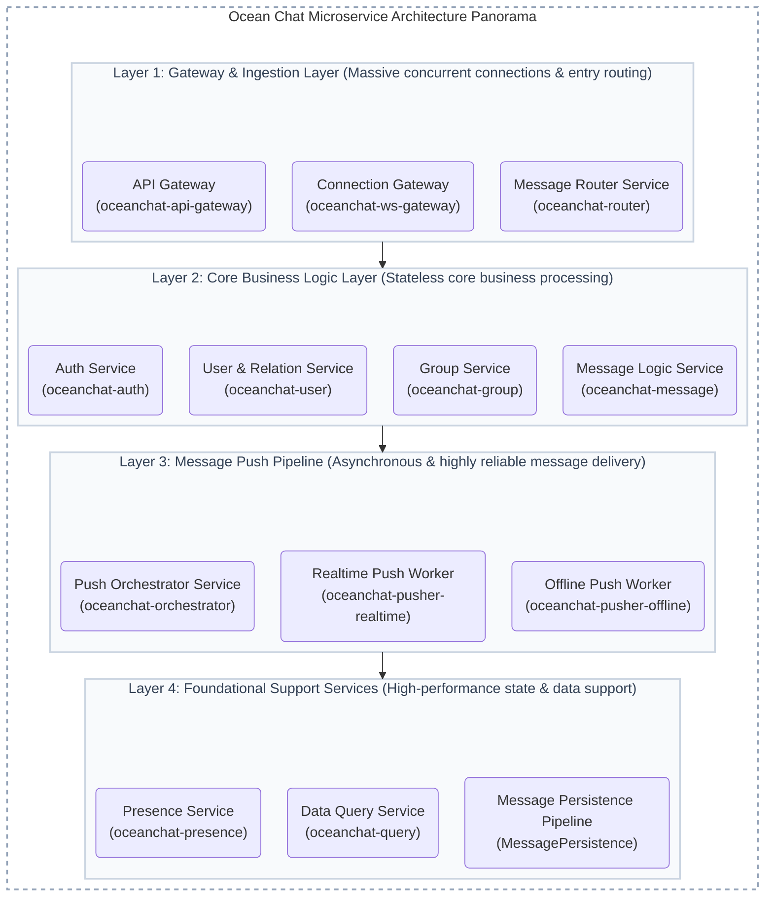
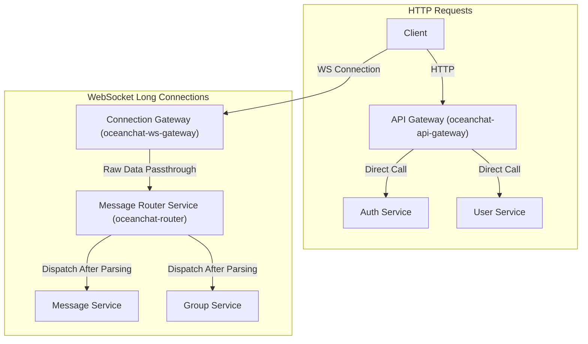

import Tabs from '@theme/Tabs';
import TabItem from '@theme/TabItem';

# Microservice Architecture

:::info Architecture Overview
The entire platform adopts a distributed microservice architecture designed to support 10 million-level (100k+) concurrency. It is divided into four logical layers, comprising 11 core microservices and 1 data processing pipeline, ensuring a clear separation of responsibilities.
:::

## Technology Stack

This project is built on a modern and robust technology stack, chosen for its performance, scalability, and developer experience.

- **[NestJS 11](https://nestjs.com/)**: A progressive Node.js framework for building efficient, reliable, and scalable server-side applications. Its modular architecture is perfectly suited for developing the microservices in this project.

- **[TypeScript 5](https://www.typescriptlang.org/)**: The primary programming language for the project. By adding static types to JavaScript, it helps improve code quality, readability, and maintainability, which is crucial for large-scale projects.

- **[Yarn 4.7](https://yarnpkg.com/)**: A fast, reliable, and secure dependency manager used to efficiently manage the project's packages and dependencies.

- **[MongoDB](https://www.mongodb.com/) (with Mongoose)**: The primary NoSQL database used for persistent data storage. It stores user data, messages, group information, etc. Mongoose acts as an Object Data Modeling (ODM) library, providing a schema-based solution to model application data.

- **[Redis](https://redis.io/)**: A high-performance in-memory data store. In this project, it is used for caching, real-time user online status management, and as a high-speed message bus for certain real-time communication scenarios.

- **[NATS](https://nats.io/) (with JetStream)**: A simple, secure, and high-performance open-source messaging system acting as the main communication backbone between microservices. This project specifically utilizes its built-in persistence engine, **NATS JetStream**, to provide at-least-once message delivery guarantees. This is crucial for reliable asynchronous operations such as persisting messages, handling offline pushes, and broadcasting domain events.

## IM Architecture Diagram

## Layer 1: Gateway and Access Layer

This layer serves as the direct entry point for users, focusing on handling massive concurrent connections, and is a critical performance chokepoint for the entire system.

### 1. **API Gateway Service (oceanchat-api-gateway)** (Stateless)

<Tabs>
<TabItem value="desc" label="Introduction" default>
This gateway is the sole entry point for external HTTP requests.
</TabItem>
<TabItem value="resp" label="Core Responsibilities">

- **Request Routing**: Core functionality. Serves as the only entry point for all external RESTful API requests. Client HTTP requests for login, registration, retrieving user profiles, querying histories, etc., arrive here first. The requests are then forwarded to the corresponding services based on routing rules. For example, requests starting with `/auth/*` are forwarded to the `oceanchat-auth` service, and `/users/*` to the `oceanchat-user` service.
- **Authentication**: Implements **Zero-I/O Authentication**. It cryptographically verifies the RS256 Access Token and performs an `O(1)` local memory lookup against a token blacklist (synchronized via NATS JetStream events), entirely eliminating synchronous network I/O on the critical path (such as Redis queries) to support 100k+ concurrency. Endpoints that do not require authentication are passed through directly.
- **Rate Limiting**: For instance, limiting requests from the same IP address to 10 per second to protect backend services from being overwhelmed.
- **Logs and Monitoring**: Records all incoming and outgoing HTTP request logs for troubleshooting and performance analysis.

</TabItem>
<TabItem value="reason" label="Reason for Separation">
To provide a unified, secure, and manageable facade for all stateless HTTP requests. Separating API management from real-time connection management ensures singular responsibilities, making independent scaling and maintenance easier.
</TabItem>
</Tabs>

### 2. **Connection Gateway Service (oceanchat-ws-gateway)** (Stateless)

<Tabs>
<TabItem value="desc" label="Introduction" default>
Given this service is stateless, its design should remain business-agnostic, lightweight, and simple.
</TabItem>
<TabItem value="resp" label="Core Responsibilities">

- **Real-time Connection Entry Point**: Serves as the sole entry point for all external WebSocket/TCP long connections.
- **Connection Authentication**: Responsible for authenticating connections when clients establish long connections (by calling the "Auth Service" or using a shared public key for local verification).
- **Data Passthrough**: Acts as a pure connection channel, only wrapping the raw client packets (e.g., appending `connectionId`, `gatewayId`), and rapidly delivering them to the backend **Message Router Service**.
- **Client Message Delivery**: Receives instructions from the **Real-time Pusher Worker** and accurately pushes messages to clients connected to this instance.

</TabItem>
<TabItem value="reason" label="Reason for Separation">
To completely separate the most resource-intensive I/O-bound tasks (maintaining connections) from CPU-bound tasks (business logic). This allows the Connection Gateway to be extremely optimized and horizontally scaled independently to support tens or even hundreds of millions of concurrent connections.
</TabItem>
</Tabs>

### 3. **Message Router Service (oceanchat-router)** (Stateless)

<Tabs>
<TabItem value="resp" label="Core Responsibilities" default>

- **Message Decoding & Dispatch**: Receives raw data packets from the **Connection Gateway**, performing decoding, protocol parsing, and preliminary validation.
- **Business Routing**: Based on the message type, determines which business microservice should handle it, then dispatches the payload via the NATS message queue.
- **Business-Level Uplink Rate Limiting**: Coordinates with the gateway's connection-level rate limits to implement fine-grained, `userId`-based rate limiting and circuit breaking after decoding business packets. For example, restricting "a maximum of 100 business requests per second per user ID." More specific API business limits (like group creation frequency) are handled by the downstream services.

</TabItem>
<TabItem value="reason" label="Reason for Separation">
Decouples the access layer from the business logic layer. The router service acts as a central coordinator, making the addition, removal, or modification of backend business services completely transparent to the gateway layer, greatly improving system flexibility and maintainability.
</TabItem>
</Tabs>

## Layer 2: Core Business Logic Layer

This layer is responsible for processing all core business functions of the IM platform, designed as stateless services to facilitate easy horizontal scaling.

### 4. **Auth Service (oceanchat-auth)** (Stateless)

<Tabs>
<TabItem value="resp" label="Core Responsibilities" default>

- **User Authentication**: Processes HTTP requests for user registration, login, and logout proxied by the API Gateway.
- **Token Management**: Responsible for generating, validating, and refreshing access tokens (JWT recommended), acting as the core of system security.
- **Provide Verification Capabilities**: Offers internal endpoints for other microservices (especially the **Connection Gateway**) to verify token validity.
- **Publish Domain Events**: Upon the completion of critical business operations (e.g., successful user registration, successful login), publishes asynchronous domain events to NATS JetStream for other services to subscribe to and process.

</TabItem>
<TabItem value="reason" label="Reason for Separation">
Isolates the universal and critical security capability of user authentication into a single trusted service. All other services rely on it to confirm user identity, ensuring clear responsibilities and facilitating the unified management of security policies.
</TabItem>
</Tabs>

### 5. **User & Relationship Service (oceanchat-user)** (Stateless)

<Tabs>
<TabItem value="resp" label="Core Responsibilities" default>

- **Data Management**: Manages user accounts, profiles, friend relationships (add/delete/blacklist), address books, etc.
- **Authorization Decision-Making**: As the sole owner of relationship data, it is responsible for making permission judgments on related operations (e.g., answering "Are user A and B friends?").

</TabItem>
<TabItem value="reason" label="Reason for Separation">
User and relationship data are the foundational data of an IM system. An independent service provides a unified and stable data source for other services. Co-locating authorization decision logic within this service ensures data and rule consistency.
</TabItem>
</Tabs>

### 6. **Group Service (oceanchat-group)** (Stateless)

<Tabs>
<TabItem value="resp" label="Core Responsibilities" default>

- **Lifecycle Management**: Responsible for group creation/dissolution, member management, permission systems, group announcements, group settings, etc.
- **Authorization Decision-Making**: As the sole owner of group data, it internally houses all group-related authorization logic (e.g., determining if a user is a group member, is muted, etc.).

</TabItem>
<TabItem value="reason" label="Reason for Separation">
The business logic for group chats (especially permissions and member management) is highly complex. Isolating it into an independent service helps reduce code complexity, making independent development and iteration easier.
</TabItem>
</Tabs>

### 7. **Message Logic Service (oceanchat-message)** (Stateless)

<Tabs>
<TabItem value="resp" label="Core Responsibilities" default>

- **Authorization Check Coordination**: Acts as the "coordinator" for permission verification, calling the correct "decision-maker" service to complete permission checks. For example, it calls the **User & Relationship Service** when sending a 1-on-1 message, and calls the **Group Service** when sending a group message.
- **Message Processing**: Acts as the business processing center for 1-on-1 and group messages, handling permission checks, content processing (@mentions, sensitive word filtering), generating message IDs, assembling message bodies, etc.
- **Triggering Delivery**: Once processing is complete, it calls the **Push Orchestrator Service** to kick off the message delivery workflow.

</TabItem>
<TabItem value="reason" label="Reason for Separation">
Separates the business logic of the message itself ("what it is") from the message delivery process ("how it is sent"), resulting in much clearer responsibilities.
</TabItem>
</Tabs>

## Layer 3: Message Push Pipeline

This is the key to ensuring reliable, real-time message delivery and operates as a highly asynchronous workflow.

### 8. **Push Orchestrator Service (oceanchat-orchestrator)** (Stateless)

<Tabs>
<TabItem value="resp" label="Core Responsibilities" default>

- **Delivery Decision-Making**: Receives pending messages from the **Message Logic Service**.
- **Status Query**: Queries the **Presence Service** in real-time to obtain the online status and gateway node locations of all recipients.
- **Task Dispatching**: Based on the online status, transforms the message into either an "ultra-lightweight `MSG_NOTIFY` online wake-up task" or an "offline push task," publishing them to different NATS subjects.

</TabItem>
<TabItem value="reason" label="Reason for Separation">
As the "brain" of message delivery, it handles complex decision-making logic. Isolating it makes the push flow clearer and far easier to monitor and debug.
</TabItem>
</Tabs>

### 9. **Real-time Pusher Worker (oceanchat-pusher-realtime)** (Stateless)

<Tabs>
<TabItem value="resp" label="Core Responsibilities" default>

- **Task Consumption**: Listens to the "online push" queue and consumes tasks.
- **Command Issuance**: Communicates directly with the **Connection Gateway** instance where the target user resides, instructing it to deliver the message.
- **Tech Stack**: NATS JetStream subscriber, ioredis (for inter-gateway Pub/Sub).

</TabItem>
<TabItem value="reason" label="Reason for Separation">
Dedicated to processing online message pushes, it can scale horizontally independently based on the volume of online users and message traffic, guaranteeing real-time delivery performance.
</TabItem>
</Tabs>

### 10. **Offline Pusher Worker (oceanchat-pusher-offline)** (Stateless)

<Tabs>
<TabItem value="resp" label="Core Responsibilities" default>

- **Task Consumption**: Subscribes to the "offline push" topic and consumes tasks.
- **API Invocation**: Calls the push APIs of Apple APNS, Google FCM, or regional vendors to send offline notifications.

</TabItem>
<TabItem value="reason" label="Reason for Separation">
Integration with third-party APIs inherently involves network latency and uncertainty. Isolating this prevents external failures or slowdowns from impacting the core real-time push pipeline.
</TabItem>
</Tabs>

## Layer 4: Foundational Support Services

These services provide stable, high-efficiency foundational capabilities for the entire platform.

### 11. **Presence Service (oceanchat-presence)** (Stateless)

<Tabs>
<TabItem value="resp" label="Core Responsibilities" default>

- **Status Maintenance**: Maintains global real-time online status for all users via a `userId -> {gatewayId, status}` mapping.
- **Status Query**: Provides millisecond-level online status query endpoints for the **Push Orchestrator Service** and others.

</TabItem>
<TabItem value="reason" label="Reason for Separation">
Online presence is the bedrock of a distributed IM system, experiencing extremely frequent reads and writes. An independent service, highly optimized with an in-memory database like Redis, ensures high performance.
</TabItem>
</Tabs>

### 12. **Query Service (oceanchat-query)** (Stateless)

<Tabs>
<TabItem value="resp" label="Core Responsibilities" default>

- **Unified Query Entry Point**: Provides a unified HTTP API for clients to query data such as message history and session lists.
- **Tiered Querying**: Intelligently fetches and aggregates data from different storage mediums (Redis cache, MongoDB, etc.) based on the requested time range.

</TabItem>
<TabItem value="reason" label="Reason for Separation">
Implements read-write splitting. By detaching high-frequency read operations from the core write pipeline, query performance can be optimized independently without jeopardizing message write stability.
</TabItem>
</Tabs>

### Data Processing Pipeline (MessagePersistence): Message Persistence

:::note This is an asynchronous processing workflow, not a standalone service.

- **Core Responsibility**: After the **Message Logic Service** processes a message, in addition to invoking the push orchestrator, it also sends a copy of the message to a NATS topic dedicated to persistence (backed by JetStream). One or more independent **Subscriber Processes (Writers)** will listen to this queue and bulk-write the messages to the database.

- **Reason for Separation**: Complete asynchronicity. The sending and receiving of messages should never wait for database writes to complete. This "write-after-persistence" design maximizes the real-time nature and throughput of messaging.

:::
