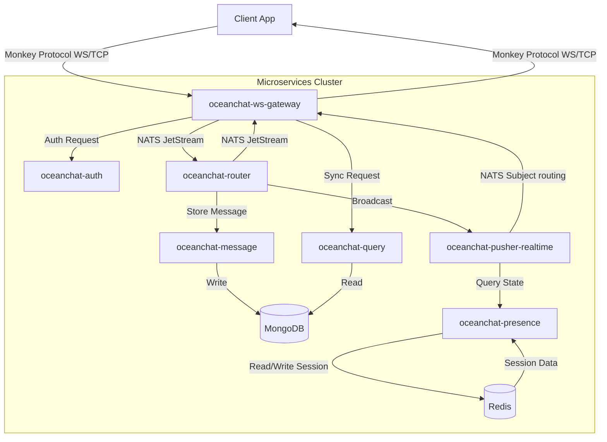
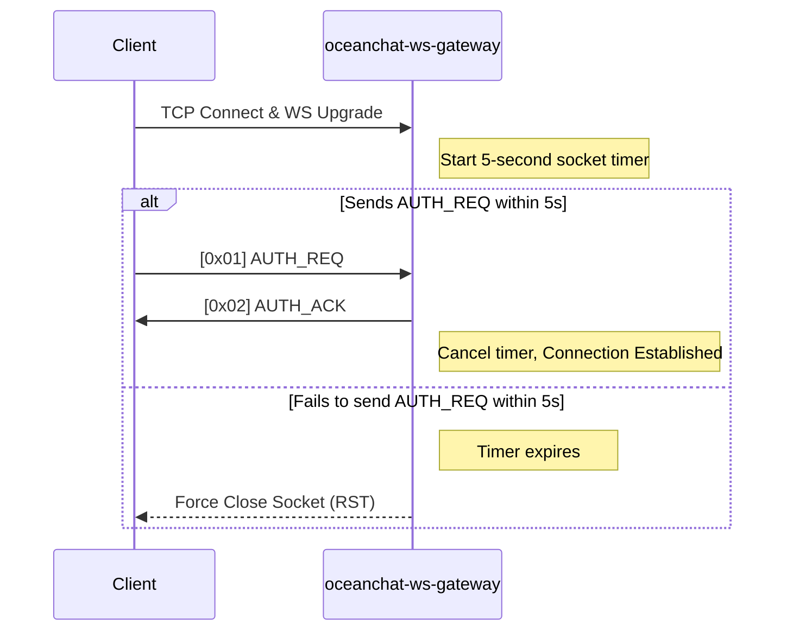
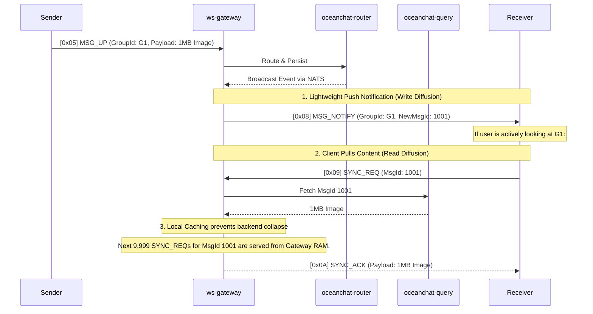
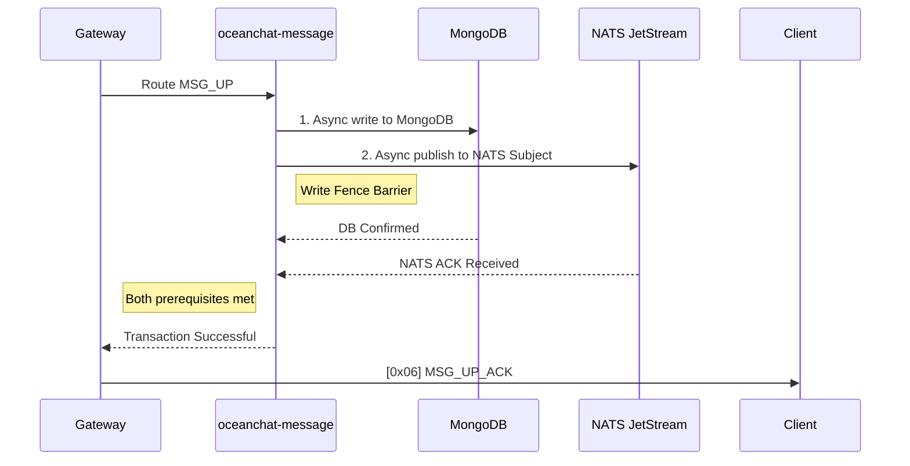

<head>
  <meta name="twitter:card" content="summary_large_image" />
  <meta property="og:title" content="Monkey Protocol Specification | Ocean Chat" />
  <meta property="og:description" content="Comprehensive reference specification for the Ocean Chat Monkey Protocol. Covers high-concurrency WebSocket messaging, push-pull hybrid delivery, microservices architecture, and reliability mechanisms for 10M+ concurrent users." />
  <link rel="canonical" href="https://docs.oceanchat.com/docs/devdocs/monkey-protocol-spec" />
</head>

# Monkey Protocol Specification

The **Monkey Protocol** is Ocean Chat's proprietary, high-performance binary application-layer protocol running over WebSocket (or raw TCP). It is explicitly engineered for a distributed microservices architecture designed to handle **10 million+ concurrent connections**.

This reference outlines the exact bit-level frame structure, command registry, and the strict operational state machines required for gateway and client implementations.

:::info TODO: Multi-Protocol Gateway & Transport Layer
While WebSocket (WS) is currently utilized for broad compatibility (especially for Web/Mini-programs), **pure TCP is the optimal transport for native mobile apps (iOS/Android) to achieve maximum battery efficiency and connection stability**. 

Future gateway iterations must expose dual ports (e.g., `TCP: 8080` and `WS: 8081`). The `oceanchat-ws-gateway` will be upgraded to a multi-protocol gateway that strips the transport layer framing (WebSocket frames vs. TCP streams) and forwards the identical, underlying 12-byte Monkey Protocol binary payload to the backend microservices.
:::

## 1. Architectural Overview & Microservices Data Flow

Ocean Chat's architecture strictly isolates network I/O from business logic. The protocol relies on the following core microservices:

- **`oceanchat-ws-gateway`**: Absolutely stateless. Handles connection lifecycle, protocol framing, micro-batching, local short-caching, and token bucket rate limiting.
- **`oceanchat-auth`**: Validates JWTs during the initial connection handshake.
- **`oceanchat-presence`**: Manages global online state in Redis (`UserId -> DeviceType -> Gateway IP`).
- **`oceanchat-router`**: The central routing orchestrator interacting with NATS JetStream.
- **`oceanchat-message`**: Enforces the Write Fence, guarantees MongoDB persistence, and generates global Sequence IDs.
- **`oceanchat-query`**: Handles historical message sync (`SYNC_REQ`) for offline users and message hole healing.
- **`oceanchat-pusher-realtime`**: Distributes downstream messages (`MSG_DOWN` / `MSG_NOTIFY`) to the correct gateways via NATS.

### End-to-End Data Flow

## 2. Frame Structure

Every Monkey Protocol packet consists of a strict, fixed-length **12-byte Header** followed by a variable-length **Payload**. 

### 2.1 Header Layout

| Offset | Field | Size | Type | Description |
| :--- | :--- | :--- | :--- | :--- |
| 0 | `Magic` | 2 Bytes | `UInt16` | Magic number `0x4D4B` ("MK") to identify the protocol. |
| 2 | `Version` | 1 Byte | `UInt8` | Protocol version for forward compatibility (current: `0x01`). |
| 3 | `Cmd` | 1 Byte | `UInt8` | Command type identifier (see Command Registry). |
| 4 | `Flags` | 1 Byte | `Bitmask`| 8-bit flags for protocol features (e.g., Compression, ACK). |
| 5 | `SeqId` | 3 Bytes | `UInt24` | Sequence ID for matching Request/Response pairs. |
| 8 | `Length` | 4 Bytes | `UInt32` | Length of the variable payload in bytes (Max 16KB). |
| 12 | `Payload`| Variable| `Binary` | **Protobuf** encoded payload. |

:::warning JSON is Prohibited in Production
To achieve 10M concurrency, JSON serialization is strictly prohibited. You must use **Protobuf** for the `Payload`. This reduces bandwidth by 40%+ and drastically lowers CPU overhead on the gateway.
:::

### 2.2 Bit Flags (`Flags`)

To minimize payload overhead, boolean states are encoded into the `Flags` byte:

- **Bit 0 (`0x01`) - `REQUIRE_ACK`**: If set, the receiver MUST send an explicit acknowledgment.
- **Bit 1 (`0x02`) - `COMPRESSED`**: If set, the payload is compressed using Zstd or Gzip.
- **Bit 2 (`0x04`) - `ENCRYPTED`**: If set, the payload is symmetrically encrypted (e.g., AES-GCM).

## 3. Command Registry (`Cmd`)

| Cmd Hex | Name | Direction | Description |
| :--- | :--- | :--- | :--- |
| `0x01` | `AUTH_REQ` | Client -> Server | Authenticate connection. Payload contains `DeviceType`, `DeviceId`, and JWT. |
| `0x02` | `AUTH_ACK` | Server -> Client | Authentication result. |
| `0x03` | `PING` | Client -> Server | Keep-alive heartbeat (Empty Payload). |
| `0x04` | `PONG` | Server -> Client | Keep-alive response (Empty Payload). |
| `0x05` | `MSG_UP` | Client -> Server | Upstream chat message. Payload requires `ClientMsgId` for idempotency. |
| `0x06` | `MSG_UP_ACK` | Server -> Client | Acknowledgment of upstream message. |
| `0x07` | `MSG_DOWN` | Server -> Client | Downstream push message (1-to-1 chat or small groups). |
| `0x08` | `MSG_NOTIFY` | Server -> Client | Push-Pull hybrid notification for large groups. Payload contains `GroupId` and `MsgId` only. |
| `0x09` | `SYNC_REQ` | Client -> Server | Request offline or missing messages. Payload contains required `SeqId` ranges. |
| `0x0A` | `SYNC_ACK` | Server -> Client | Returns an array of requested messages. |
| `0x0B` | `READ_RECEIPT`| Both | Synchronization of unread status across multiple devices. |

## 4. Connection Lifecycle & Defenses

### 4.1 Handshake Window Timeout

To defend against Slowloris and FD-exhaustion attacks, the `oceanchat-ws-gateway` enforces a strict connection establishment window at the TCP layer.

### 4.2 Smart Keep-Alive (Any Message is Pong)

Ocean Chat abandons rigid periodic heartbeats. 
1. **Any Data is Liveness:** Whenever the gateway receives *any* valid upstream packet (e.g., `MSG_UP`), it immediately refreshes the connection's `LastActiveTime`.
2. **Adaptive Heartbeat:** Clients MUST dynamically adjust `PING` intervals (e.g., from 30s to 4 mins) based on their NAT environment and OS background state. If a client is actively sending messages, it should suspend background `PING`s to save bandwidth.

### 4.3 Rate Limiting & Backpressure

- **Token Bucket Limiting:** Gateways limit individual connections to a maximum of 5 `MSG_UP` requests per second. Violations trigger an immediate packet drop and an explicit error code.
- **Exponential Backoff:** Upon disconnection, clients MUST implement exponential backoff (e.g., 1s, 2s, 4s, 8s) with random jitter to prevent "Thundering Herd" authentication storms that could crash `oceanchat-auth`.

## 5. Message Delivery Models

### 5.1 Push-Pull Hybrid (Large Groups)

For groups exceeding 1,000 members, **Write-Diffusion is strictly forbidden**. Pushing large payloads to 100,000 members simultaneously will collapse the outbound bandwidth. Ocean Chat uses a **Push-Pull Hybrid** model.

**Gateway Local Short-Cache:** The gateway maintains a short-lived (e.g., 3 seconds) LRU cache. It prevents "Cache Breakdown" on the backend by serving subsequent `SYNC_REQ`s for identical messages directly from memory.

### 5.2 Micro-Batching (Chunking)

To maximize throughput and minimize soft interrupts, the `oceanchat-ws-gateway` performs micro-batching. If 10 downstream messages arrive for a single user within a 200ms window from NATS, the gateway packs them into a single Protobuf array and sends them using **one** 12-byte header.

## 6. Reliability & Ordering

### 6.1 Write Fence for Absolute Consistency

A message is only considered successful when it has been durably stored and scheduled for real-time delivery.

### 6.2 Idempotency

Clients must generate a UUID (`ClientMsgId`) for every `MSG_UP`. If the client disconnects before receiving `MSG_UP_ACK`, it will retry the message. The backend utilizes a Redis SET structure (`UserID + ClientMsgId`) to gracefully deduplicate retries and prevent duplicate database records.

### 6.3 Message Hole Detection (Self-Healing)

Clients must maintain a local `MaxReceivedSeqId`. If a `MSG_DOWN` arrives with `SeqId=105` but the client's local max is `103`, a **Message Hole** has occurred. 
- The client MUST NOT render message `105` immediately. 
- It must stash `105`, send a `SYNC_REQ` for `104`, and only render the stream once continuous.

## 7. Multi-Device Synchronization

- **Unread Counts (ZSET):** Ocean Chat avoids all `SELECT COUNT` operations in MongoDB. The `oceanchat-presence` service maintains a Redis ZSET per group containing the last 500 `MessageIds`. The user's `LastReadSeqID` is compared against this ZSET using the `ZCOUNT` command to resolve unread totals in O(log(N)) time.
- **Read Receipts:** Sending a `[0x0B] READ_RECEIPT` from a PC client will be routed via NATS to all of the user's active mobile endpoints (via their respective `DeviceType` gateway connections), instantly clearing notification badges cross-device.