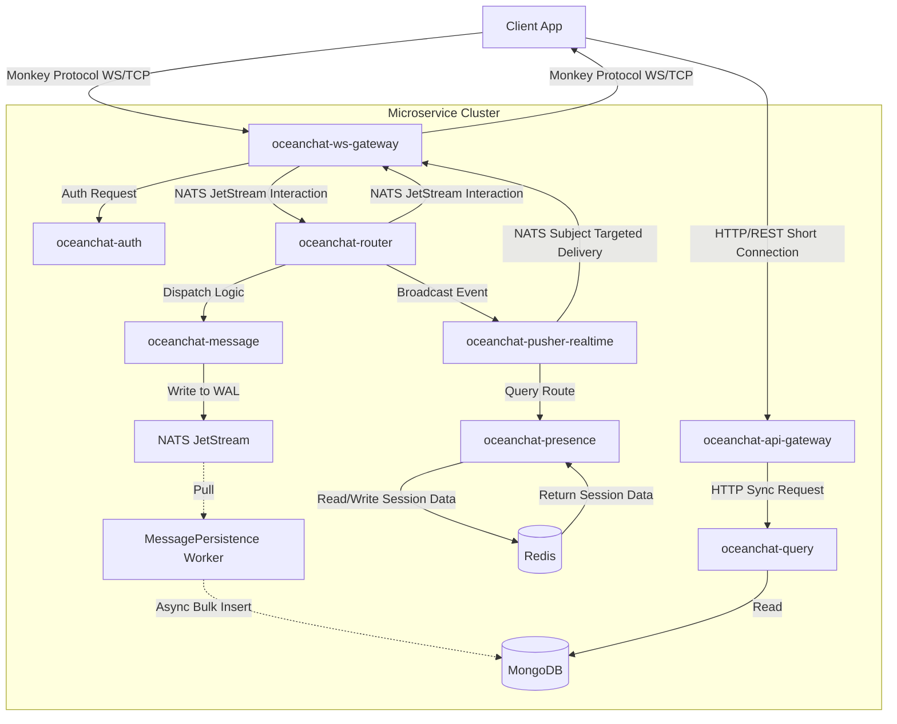
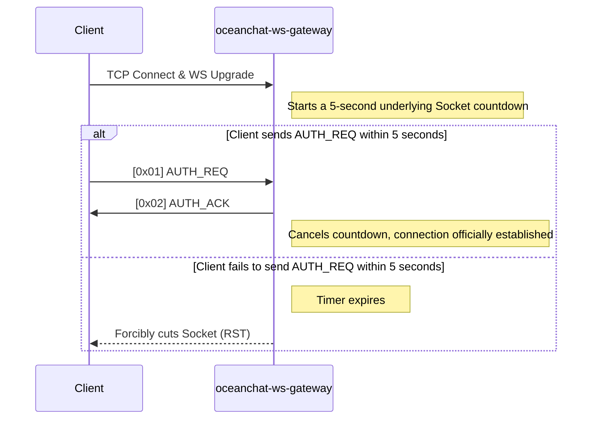
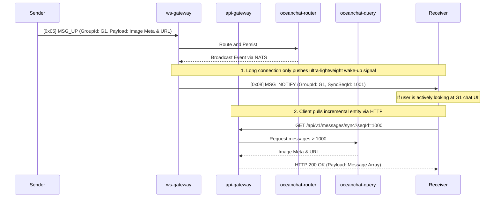
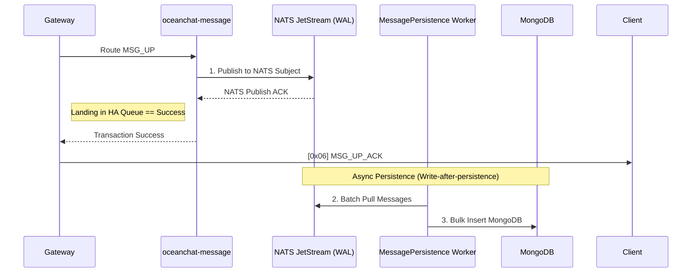
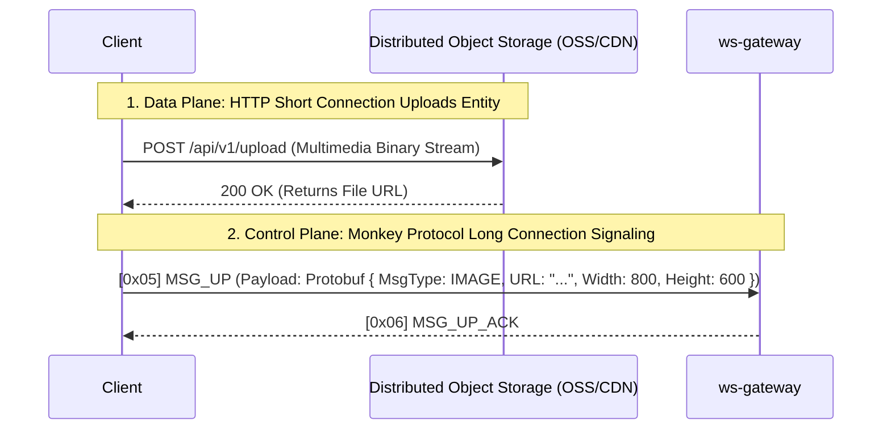

<head>
  <meta name="twitter:card" content="summary_large_image" />
  <meta property="og:title" content="Monkey Protocol Specification | Ocean Chat" />
  <meta property="og:description" content="Ocean Chat Monkey Protocol comprehensive reference. Covers 100k+ concurrency WebSocket messaging, Push-Pull hybrid model, microservice data flow, and reliability guarantees." />
  <link rel="canonical" href="https://jameswilson19970101.github.io/ocean.chat.docs/docs/devdocs/monkey-protocol-spec" />
</head>

# Monkey Protocol Specification

The **Monkey Protocol** is Ocean Chat's self-developed, high-performance binary application-layer protocol, designed to run over WebSocket or raw TCP. It is purpose-built to support a distributed microservice architecture capable of handling **10 million+ concurrent connections**.

This reference document strictly defines the bit-exact frame structure, command sets, and the rigorous state machine operations required for both Gateway and Client implementations.

:::info TODO: Multi-Protocol Gateway & Transport Optimization
Currently, to achieve extreme cross-platform compatibility (especially for Web and Mini Programs), WebSocket (WS) is utilized. However, for native mobile Apps (iOS/Android), **raw TCP is the preferred solution for extreme power efficiency and connection stability**.

In future roadmaps, the gateway needs to be upgraded to a "Multi-Protocol Gateway" exposing dual ports (e.g., `TCP: 8080` and `WS: 8081`). Whether the outer layer is a WS frame (post-HTTP Upgrade) or a raw TCP byte stream, after the gateway strips the transport layer wrapper, the exact same 12-byte Monkey Protocol binary core payload will be transparently forwarded to the backend microservices.
:::

## 1. Architectural Overview & Microservice Data Flow

Ocean Chat's architecture strictly isolates network I/O from business logic. This protocol relies on the following core microservices to operate:

- **`oceanchat-ws-gateway`**: Absolutely stateless. Solely responsible for the lifecycle of long connections, minimal protocol encoding/decoding, downstream signaling micro-batching, and token-bucket rate limiting.
- **`oceanchat-api-gateway`**: Stateless HTTP gateway. Responsible for handling client HTTP requests (like incremental data pulling), providing rate limiting, and preliminary authentication.
- **`oceanchat-auth`**: Validates the JWT during the initial connection handshake.
- **`oceanchat-presence`**: Manages global online presence in Redis (`UserId -> DeviceType -> Gateway IP`).
- **`oceanchat-router`**: Core routing orchestrator, responsible for interacting with NATS JetStream.
- **`oceanchat-message`**: Responsible for generating a globally unique Sequence ID and reliably writing messages to NATS JetStream (Write-Ahead Log) for high-throughput asynchronous database persistence.
- **`oceanchat-query`**: Handles incremental message synchronization (via HTTP short connections) for offline wake-ups, new message arrivals, or message gap detection.
- **`oceanchat-orchestrator`**: The "brain" of push decisions. It queries online presence and splits the message into either online wake-up notifications (`MSG_NOTIFY`) or offline push tasks.
- **`oceanchat-pusher-realtime`**: Responsible for the actual delivery of online signaling, dispatching `MSG_NOTIFY` to the designated gateway nodes.

### End-to-End Data Flow

## 2. Frame Structure

Every Monkey Protocol packet consists of a strictly fixed-length **12-byte Header** followed by a variable-length **Payload**.

### 2.1 Header Layout

| Offset | Field     | Size     | Type      | Description                                                                                             |
| :----- | :-------- | :------- | :-------- | :------------------------------------------------------------------------------------------------------ |
| 0      | `Magic`   | 2 Bytes  | `UInt16`  | Magic number `0x4D4B` ("MK") to identify the protocol.                                                  |
| 2      | `Version` | 1 Byte   | `UInt8`   | Protocol version for forward compatibility (Current: `0x01`).                                           |
| 3      | `Cmd`     | 1 Byte   | `UInt8`   | Command Type Identifier (See Command Registry).                                                         |
| 4      | `Flags`   | 1 Byte   | `Bitmask` | 8-bit flag used for controlling protocol features (e.g., Compression, ACK).                             |
| 5      | `ReqId`   | 3 Bytes  | `UInt24`  | Request ID used to match requests and responses within the current connection. Wraps around upon limit. |
| 8      | `Length`  | 4 Bytes  | `UInt32`  | Byte length of the variable Payload (Hard limit max 16KB).                                              |
| 12     | `Payload` | Variable | `Binary`  | The **Protobuf** encoded business payload.                                                              |

:::warning Do NOT use JSON in Production
To support 100k+ concurrency, JSON serialization within the Payload is strictly prohibited. **Protobuf** MUST be used. This saves over 40% in bandwidth and drastically reduces CPU parsing overhead on the gateways.
:::

### 2.2 Flags (`Flags`)

To minimize payload redundancy, boolean states are encoded into the `Flags` byte:

- **Bit 0 (`0x01`) - `REQUIRE_ACK`**: If set to 1, the receiver MUST send an explicit acknowledgment (ACK).
- **Bit 1 (`0x02`) - `COMPRESSED`**: If set to 1, indicates the Payload is compressed using Zstd or Gzip.
- **Bit 2 (`0x04`) - `ENCRYPTED`**: If set to 1, indicates the Payload is symmetrically encrypted (e.g., AES-GCM).

## 3. Command Registry (`Cmd`)

| Cmd Hex | Command Name   | Direction        | Description                                                                                                                                      |
| :------ | :------------- | :--------------- | :----------------------------------------------------------------------------------------------------------------------------------------------- |
| `0x01`  | `AUTH_REQ`     | Client -> Server | Request connection authentication. Payload MUST contain `DeviceType`, `DeviceId`, and JWT.                                                       |
| `0x02`  | `AUTH_ACK`     | Server -> Client | Authentication result response.                                                                                                                  |
| `0x03`  | `PING`         | Client -> Server | Keep-alive heartbeat request (Payload MUST be empty).                                                                                            |
| `0x04`  | `PONG`         | Server -> Client | Keep-alive heartbeat response (Payload MUST be empty).                                                                                           |
| `0x05`  | `MSG_UP`       | Client -> Server | Client upbound chat message. Payload MUST carry `ClientMsgId` to ensure idempotency.                                                             |
| `0x06`  | `MSG_UP_ACK`   | Server -> Client | Server confirmation of receiving the upbound message.                                                                                            |
| `0x08`  | `MSG_NOTIFY`   | Server -> Client | Global "Push-Pull Hybrid" new message event notification (wake-up only, no entity). Payload contains only the target session and latest `SyncSeqId`. |
| `0x0B`  | `READ_RECEIPT` | Both             | Multi-device read receipt sync signaling.                                                                                                        |

## 4. Connection Lifecycle & Security Defenses

### 4.1 Handshake Window Timeout

To defend against Slowloris and File Descriptor (FD) exhaustion attacks, `oceanchat-ws-gateway` enforces a very short connection establishment window at the TCP level.

### 4.2 Smart Keep-Alive (Any Message is Pong)

Ocean Chat abandons rigid periodic heartbeat strategies.

1. **Business Packets ARE Heartbeats:** As long as the gateway receives **any** valid upbound packet (like `MSG_UP`) from the client, it instantly refreshes that connection's `LastActiveTime`.
2. **Dynamic Heartbeat Pacing:** Clients **MUST** dynamically adjust the `PING` send interval (e.g., extending from 30 seconds to 4 minutes) based on their NAT network environment and the OS background state (Foreground/Background). If the client is actively sending messages, background periodic `PING`s should be paused to save bandwidth.

### 4.3 Traffic Shaping & Avalanche Prevention

- **Tiered Token Bucket Rate Limiting:**
  - **Connection Layer (Gateway):** The gateway applies a total request rate limit based on the single physical connection (e.g., 20 req/sec to prevent malicious flooding). Violating packets are instantly dropped.
  - **Business Layer (Router):** After decoding, the router applies higher-dimensional business rate limiting based on `UserId` (e.g., 100 business messages/sec) to prevent distributed coordinated attacks, returning business error codes upon interception.
- **Exponential Backoff Reconnection:** Upon network disconnection, clients are **strictly forbidden** from reconnecting frantically. They MUST implement Exponential Backoff with random jitter (e.g., 1s, 2s, 4s, 8s) to prevent a sudden authentication storm that could crush `oceanchat-auth`.

## 5. Message Delivery Model

### 5.1 Global Delivery: Push-Pull Hybrid

To maintain extremely high throughput on long-connection gateways and prevent large payloads from causing Head-of-Line blocking, Ocean Chat discards the practice of the server "shoving" message entities directly to clients. The system universally adopts a **Push-Pull Hybrid** model. Long connections are only responsible for "pushing" ultra-lightweight wake-up signals, while short connections (HTTP) are responsible for "pulling" the actual data.

**Cache Breakdown Defense:** When massive users are instantly notified of new messages in a large group, clients concurrently initiate HTTP sync requests. The `oceanchat-query` service or API Gateway MUST utilize Redis caching and a "Distributed Lock/Singleflight" mechanism to merge concurrent queries for the same `SyncSeqId` range, avoiding cache breakdown hitting the underlying MongoDB.

### 5.2 Notification Collapse & Micro-Batching

To maximize throughput and drastically reduce soft interrupts, `oceanchat-ws-gateway` implements signal collapse and micro-batching mechanisms. If multiple new message events destined for the same user and the same session arrive from the NATS bus within a 200ms time window, the gateway **will not** dispatch multiple `MSG_NOTIFY`s. The gateway auto-collapses them, dispatching only the **single** `MSG_NOTIFY` wake-up signal containing the largest `SyncSeqId`. Upon receipt, the client only needs to perform one HTTP Sync to pull all increments generated during that period.

## 6. Reliability & Ordering Guarantees

### 6.1 Write-After-Persistence & Eventual Consistency

To support 100k+ concurrency, Ocean Chat adopts an asynchronous **Write-after-persistence** schema. Once a message is successfully written to the highly-available NATS JetStream (Write-Ahead Log, WAL) and returns an ACK, the gateway considers it successful and returns immediately without waiting for MongoDB persistence actions.

### 6.2 Idempotency

Every time a client sends a `MSG_UP`, it MUST generate a unique UUID (`ClientMsgId`). If the client reconnects and retries due to a network drop before receiving `MSG_UP_ACK`, the backend elegantly implements deduplication interception via a Redis SET structure (`UserID + ClientMsgId`), preventing duplicate records in the database.

### 6.3 SyncSeqId and Message Gap Detection (Self-Healing)

To support extreme concurrency, Ocean Chat utilizes a **Segment-based Pre-allocation** mechanism for message synchronization (similar to WeChat's seqsvr).
To avoid confusion, the protocol strictly distinguishes between two ID concepts:

1. **`ReqId` (In Header, 24-bit):** Used solely for RPC matching over the underlying TCP/WS connection (e.g., mapping `MSG_UP` to `MSG_UP_ACK`). Wraps around, not persisted.
2. **`SyncSeqId` (In Payload, 64-bit):** A monotonically increasing, session-level version number allocated by `oceanchat-message`. Due to in-memory segment pre-allocation, **`SyncSeqId`s may be discontinuous** (e.g., jumping from 100 directly to 1000 after a server restart).

Clients MUST maintain a local `MaxLocalSyncSeqId`. If a downbound `MSG_NOTIFY` carries a `SyncSeqId` strictly greater than the local `MaxLocalSyncSeqId`, it indicates either a **new message** arrived or a **message gap** occurred.

- Because `SyncSeqId`s are allowed to jump legally, clients **cannot guess** which IDs are missing in between.
- Clients **MUST NOT** directly render fake message stubs on the UI.
- They MUST buffer the wake-up notification and immediately initiate an incremental sync request via **HTTP Short Connection**, including their current `MaxLocalSyncSeqId`.
- The `oceanchat-query` service will query the database and return all incremental messages strictly greater than that ID via HTTP. The client then updates its local `MaxLocalSyncSeqId` cursor to the latest received value and renders the real messages.

## 7. Multi-Device Roaming Synchronization

- **Unread Count Dimensionality Reduction (ZSET):** Ocean Chat avoids all `SELECT COUNT` operations in MongoDB. The `oceanchat-presence` service maintains a Sorted Set (ZSET) in Redis for each group, storing the recent 500 message IDs. By passing the user's `LastReadSeqID` into the `ZCOUNT` command, the system can instantly calculate the precise unread count in O(log(N)) complexity.
- **Read Receipt Broadcast:** When a user reads a message on the PC client and issues a `[0x0B] READ_RECEIPT` signal, this signal is routed via the NATS bus based on `DeviceType` and broadcast to all active mobile gateway connections for that user, achieving instantaneous unread badge clearance across devices.

## 8. Rich Media & File Transfer Architecture (Push-Pull Collaboration)

Monkey Protocol is positioned for **high-concurrency signaling and short text transmission** (Control Plane). For large files like images, voice notes, and videos (Data Plane), the system mandates a **Push-Pull Hybrid** architecture.

Directly transmitting large binary file streams over Monkey Protocol (WebSocket/TCP) is strictly prohibited. Doing so causes gateway Out-Of-Memory (OOM) errors and severe Head-of-Line Blocking, preventing critical signaling (like heartbeats) from being sent or received in time.

### 8.1 Transmission Collaboration Flow

1. **Short Connection (HTTP) Upload Data Plane:** Clients directly upload file segments to Distributed Object Storage (e.g., OSS / AWS S3) via HTTP/HTTPS short connections. This phase can fully leverage CDN edge node acceleration and resume-from-breakpoint capabilities.

2. **Long Connection (Monkey Protocol) Delivery Control Plane:** Upon successful file upload, the client retrieves the file's download URL. Subsequently, the client encapsulates this URL and the file's metadata into a lightweight Protobuf payload and completes rapid delivery via the Monkey Protocol `MSG_UP` command.

### 8.2 Payload Metadata Structure

For non-text messages, the Payload internally carries only metadata, typically including:

- Image: URL, ThumbnailURL, Width, Height, Size, Format
- Voice: URL, Duration (seconds), Size
- File: URL, FileName, Extension, Size
