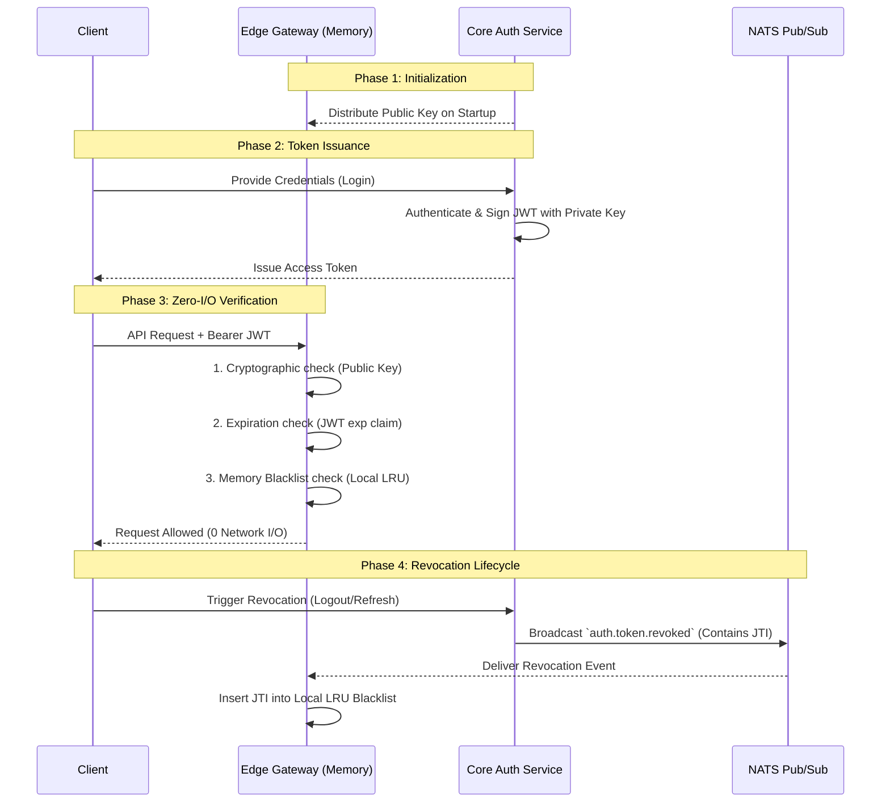

<head>
  <meta name="twitter:card" content="summary_large_image" />
  <meta property="og:title" content="Understanding Zero-I/O Authentication at Scale | Ocean Chat" />
  <meta property="og:description" content="An in-depth explanation of how Ocean Chat achieves zero-I/O authentication for tens of millions of concurrent connections using asymmetric encryption and event-driven in-memory blacklists." />
  <link rel="canonical" href="https://docs.oceanchat.com/devdocs/understanding-zero-io-authentication" />
</head>

# Understanding Zero-I/O Authentication at Scale

Authentication is the front door to any Instant Messaging (IM) platform. However, when a platform like Ocean Chat scales to handle **tens of millions of concurrent connections**, traditional authentication paradigms transform from security safeguards into critical performance bottlenecks.

This page explains the conceptual foundation of Ocean Chat's **Zero-I/O Authentication Architecture**, detailing why traditional methods fail at scale and how the combination of asymmetric cryptography and event-driven memory structures resolves these limitations.

---

## The Context: The Bottleneck of Traditional Authentication

In a standard microservice architecture, API Gateways typically verify a JSON Web Token (JWT) using a shared symmetric key (e.g., HS256) and then validate the token's standing against a centralized remote cache, such as a Redis whitelist. 

While this guarantees strict consistency, it introduces severe structural flaws at a massive scale:

1. **The Remote I/O Penalty:** Every single incoming HTTP request, WebSocket handshake, or heartbeat ping requires a network trip to Redis. 
2. **The Redis Read Storm:** At 10 million concurrent users, routine traffic can easily generate millions of requests per second. This concentrated read traffic creates a "hotkey" scenario that can overwhelm even the most robust Redis clusters, leading to increased latency, timeouts, and eventual cascading failures across the infrastructure.
3. **Security Boundaries:** Sharing a single symmetric secret between the core Authentication service (the issuer) and the edge API Gateways (the verifiers) means that if any single edge node is compromised, the attacker can forge administrative tokens.

To achieve horizontal scalability bounded only by CPU compute power, Ocean Chat must eliminate remote I/O from the critical path of token verification.

---

## Core Concept 1: Asymmetric Cryptography (RS256)

The first pillar of the Zero-I/O architecture is the shift from symmetric (shared secret) encryption to **asymmetric (public/private key pair) encryption**, specifically using the RS256 algorithm.

This shift strictly separates the responsibilities within the system:
- **The Issuer (Auth Service):** Only the central, highly-secured Authentication service holds the **Private Key**. It is the exclusive entity capable of generating and signing valid JWTs.
- **The Verifier (API & WS Gateways):** The edge gateways hold only the **Public Key**. They can mathematically verify that a token was signed by the Auth service and hasn't been tampered with, but they cannot create new tokens.

:::tip Security Posture
By utilizing asymmetric encryption, the blast radius of a compromised edge node is minimized. An attacker gaining access to an API Gateway only acquires the Public Key, which is mathematically useless for forging new authentication credentials.
:::

---

## Core Concept 2: The Event-Driven In-Memory Blacklist

Solving the cryptographic challenge only proves a token was *issued* legitimately; it does not prove the token is *currently valid* (e.g., the user hasn't logged out). 

Traditional systems solve this by querying a centralized whitelist. Ocean Chat flips this paradigm: the gateway assumes all cryptographically valid tokens are legitimate **unless explicitly informed otherwise**. This is achieved through an **Event-Driven In-Memory Blacklist**.

Instead of synchronously asking a central database "Is this token valid?", the gateway relies on an asynchronous event stream to be notified when a token becomes invalid.

---

## The Detailed Workflow

The orchestration of this architecture spans across four distinct phases of the user lifecycle.

### Phase 1: Key Distribution & Initialization
When an API Gateway or WebSocket Gateway instance boots up, it retrieves the Public Key from a secure, centralized configuration store (or directly from the Auth Service). This key is cached securely in the local memory of the gateway process. The gateway is now primed to verify signatures locally.

### Phase 2: Token Issuance
When a user successfully authenticates (e.g., via password or OAuth) at the Auth Service, the service constructs a JWT payload. Crucially, this payload includes a unique JWT ID (`jti` claim) and an expiration timestamp (`exp` claim). The Auth Service signs this payload using its closely guarded Private Key and returns the token to the client.

### Phase 3: The Zero-I/O Verification Path
This is the critical path that occurs millions of times per second. When a client makes a request to the gateway:

1. **Cryptographic Verification:** The gateway uses its locally cached Public Key to verify the signature. If tampered with, it rejects the request immediately.
2. **Expiration Verification:** The gateway checks the `exp` claim against the current system time. If expired, it rejects the request.
3. **Blacklist Verification:** The gateway extracts the `jti` (JWT ID) from the payload and performs a constant-time lookup (`O(1)`) against its local, in-memory data structure (such as an LRU Cache or a Bloom Filter). 

If the `jti` is not found in the local memory, the request is definitively authenticated and forwarded to the downstream business logic. **At no point does the gateway communicate over the network to verify the token.**

### Phase 4: The Revocation Lifecycle
Tokens must be revoked when a user logs out, forces a global sign-out, refreshes their session, or is banned.

1. **The Trigger:** The client or an internal administrative action triggers a revocation at the Auth Service.
2. **The Broadcast:** The Auth Service publishes a high-priority `auth.token.revoked` event to a NATS JetStream Pub/Sub topic. The payload contains the revoked token's `jti` and its remaining time-to-live.
3. **The Ingestion:** All active Gateway instances, acting as subscribers to this topic, receive the event asynchronously.
4. **The Local Update:** Each gateway inserts the `jti` into its local in-memory blacklist. 
5. **Automatic Eviction:** To prevent the local memory from growing infinitely, the in-memory cache is configured to automatically evict the `jti` exactly when the token's original `exp` timestamp is reached. Once the token naturally expires, it will fail the Step 2 expiration verification anyway, meaning it no longer needs to consume space in the blacklist.

---

## Higher-Level Perspective and Trade-offs

The transition to a Zero-I/O architecture is a deliberate trade-off prioritizing extreme scalability and low latency over strict, synchronous consistency.

:::info Eventual Consistency
Because the revocation mechanism relies on an asynchronous event bus (NATS), there is a microsecond-to-millisecond window between the moment a token is revoked at the Auth Service and the moment the event propagates to all edge gateways. During this microscopic window, a revoked token might still be accepted. In the context of an IM platform, this eventual consistency is universally accepted as a worthwhile trade-off for eliminating network I/O.
:::

By internalizing the validation process, the API Gateways become horizontally scalable to infinity. The throughput of the gateway layer is no longer constrained by the maximum IOPS of a Redis cluster, but solely by the CPU compute capacity of the gateway instances performing cryptographic math.