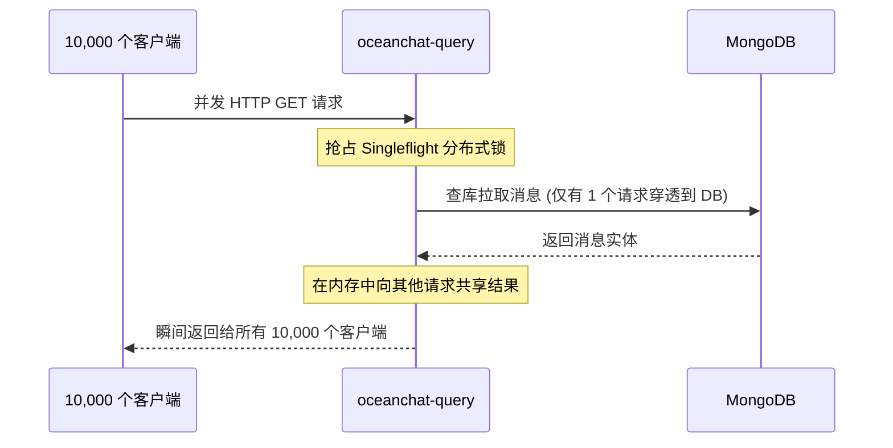

import Tabs from '@theme/Tabs';
import TabItem from '@theme/TabItem';

# 理解我的系统为何能支撑十万级并发

当我设计 Ocean Chat 时，我的首要工程目标就是构建一个能够高效处理 100,000+ 并发 WebSocket 连接的系统。传统的即时通讯（IM）架构在极高的并发压力下，可能会因为不断复合的 I/O 瓶颈而彻底崩溃。

本文档将解释这些概念背景，以及构成 Ocean Chat 高并发扩展性骨架的各种相互关联的架构决策。

## 上下文：规模化面临的瓶颈

在传统的 Web 应用中，扩展通常意味着增加更多的实例，并严重依赖中心化的 Redis 缓存或数据库。然而，在一个拥有十万级活跃连接的 IM 系统中，标准的设计模式会遭遇灾难性的失效：

1. **认证风暴：** 如果每一个 WebSocket 建连或 HTTP 请求都需要查询 Redis 来验证令牌，网络接口将瞬间成为致命的瓶颈。
2. **写入阻塞：** 在向客户端返回成功确认之前，同步地将每一条消息写入数据库（如 MongoDB）会严重降低吞吐量，并导致严重的线程饥饿。
3. **惊群效应 (Thundering Herds)：** 万人群聊中的一条消息可能会同时触发 10,000 个并发的读取请求，瞬间击垮底层数据库。
4. **队列爆炸：** 通过 WebSocket 向 10,000 名用户全量广播带有庞大 JSON 载荷的消息，会导致严重的队头阻塞 (Head-of-Line Blocking) 和 OOM（内存溢出）崩溃。

为了解决这些问题，我彻底抛弃了传统的同步 CRUD 逻辑。取而代之的是，我围绕 **极致的 I/O 解耦**、**内存优先操作** 以及 **异步事件驱动的状态机** 来设计 Ocean Chat。

---

## 核心概念：支撑高并发的架构支柱

我的系统依赖五个关键的架构支柱来彻底消除上述瓶颈。

### 1. 零 I/O 认证 (Zero-I/O Authentication)

我将认证过程完全转变为纯 CPU 绑定的密码学运算，从而彻底消除了 Redis 查询瓶颈。

我的 `oceanchat-api-gateway` 采用了 **零 I/O 认证**。它完全在本地内存中校验经过 RS256 密码学签名的 Access Token。令牌的撤销（例如用户登出或被封禁）通过 NATS JetStream 广播，并缓存在本地的 LRU 黑名单中。通过执行 $O(1)$ 的内存查找，我保证了网关每秒能够鉴权数以千计的请求，而无需向数据库发起任何一次出站网络调用。

### 2. 写后持久化 (NATS JetStream WAL)

我将极速的客户端交互与缓慢的数据库落盘彻底解耦。

当客户端发送一条消息 (`MSG_UP`) 时，`oceanchat-message` 服务在执行完校验后，会将载荷写入高可用的 **NATS JetStream** 流 (`im.orchestrate.msg`) 中。

:::tip 写入屏障 (The Write Fence)
NATS JetStream 在这里充当了我的 **预写日志 (WAL)**。在 NATS 返回 ACK 的那一刻，系统即视为跨越了写入屏障。我会立即向客户端返回成功 ACK 回执。而实际存入 MongoDB 的操作，则由 `MessagePersistence Worker` 在后台使用 `bulkWrite` 异步大批量完成。
:::

### 3. 基于号段的 ID 生成模式 (SeqSvr)

如果我针对每一条消息都去查询 MongoDB 生成一个自增 ID，那庞大的 IOPS 会直接压垮数据库。

我借鉴了微信的 `seqsvr`，实现了一种基于号段的预分配策略。消息服务会在一个事务中向数据库申请一整个 ID 块（例如步长为 10,000 的号段）。随后，它完全从内存中发放这些序列号 (`SyncSeqId`)。这种策略将生成 ID 的数据库写入负载直接削减了 **99.99%**。

### 4. 推拉结合 (Push-Pull) 与 Singleflight 防击穿

同时向数万名用户广播庞大的消息载荷会摧毁网络带宽。

我实现了一个 **推拉结合 (Push-Pull Hybrid)** 模型。服务端仅向外推送一个极小且零载荷的 `MSG_NOTIFY` 唤醒信号，其中只包含 `GroupId` 和最新的 `SyncSeqId`。随后，客户端通过标准的 HTTP 接口主动拉取实际的消息实体。

为了在 10,000 名用户并发发起 HTTP 拉取时保护数据库，我采用了 **Singleflight (单飞机制)** 防击穿模式：

### 5. 队列折叠与非对称心跳

我深度利用了 NATS JetStream 的 `max_msgs_per_subject: 1` 约束。在计算未读角标或同步已读游标 (`CURSOR_STATE`) 时，NATS 会自动丢弃旧消息。即便一个用户在 1 秒内快速滑动屏幕生成了 50 次已读回执，底层的队列也会将它们折叠为唯一的一条最新记录。

此外，我使用了 **非对称心跳 (Asymmetric Heartbeats)** 协议。服务端设定 30 秒 Ping 一次，而客户端设定 35 秒作为兜底探测。结合“任何合法的业务数据包都能重置心跳计时器”的规则，我成功消除了 WebSocket 应用中常见的、高达 50% 的双向 Ping/Pong 冗余带宽损耗。

---

## 替代方案与权衡 (Trade-offs)

在设计这套架构时，我做出了几个明确的权衡决策：

<Tabs>
  <TabItem value="consistency" label="最终一致性 vs. 强一致性" default>
    **替代方案：** 将消息发送和数据库插入包裹在一个分布式事务中 (Saga/TCC)。
    **我的选择：** 我选择了 **最终一致性 (Eventual Consistency)**。消息在落入 MongoDB 之前就会被 ACK。如果后台 Worker 发生故障，数据会进入死信队列 (DLQ)。我用严格的 ACID 保证换取了巨大的吞吐量，因为数据库落盘延迟 1 秒对用户来说是无感知的，但在 UI 上发送消息卡顿 1 秒却是灾难性的体验。
  </TabItem>
  <TabItem value="nats" label="NATS vs. Apache Kafka">
    **替代方案：** 使用 Kafka 作为核心消息总线。
    **我的选择：** Kafka 能提供极致的吞吐量，但会引入沉重的 JVM 内存开销以及复杂的 ZooKeeper/KRaft 依赖。**NATS JetStream** 编译为单一的 Go 二进制文件，占用内存极小，并且原生支持动态主题路由（如 `cursor.read.*`）以及对于微服务至关重要的 Request-Reply 同步 RPC 模式。
  </TabItem>
  <TabItem value="state" label="有状态网关 vs. 无状态业务">
    **替代方案：** 让 WebSocket 网关直接处理业务逻辑并查询数据库。
    **我的选择：** 我让 `oceanchat-ws-gateway` 在业务逻辑上保持绝对的 **无状态**，它只持有纯粹的 TCP Socket 句柄。所有的逻辑都被路由给底层的 `oceanchat-router` 和 `oceanchat-message`。这让我可以无缝地重启或扩容沉重的业务逻辑服务，而绝对不会断开任何用户的 WebSocket 活跃连接。
  </TabItem>
</Tabs>

## 站在更高维度的视角

支撑十万级并发并不是依靠一颗“银弹”或者写出“更快”的代码就能实现的。这是一场关于如何管理状态、隔离瓶颈以及拥抱异步处理的系统性工程。

通过去中心化的权限设计（让数据的拥有者在本地做决策），以及严格执行推拉结合的二分法则，我的架构确保了网络 I/O 被最大程度地压缩。Ocean Chat 将一个原本典型的 I/O 密集型难题，转化为了一个 CPU 密集型流程，使得平台仅仅通过添加更多的计算实例就能实现无限的水平扩展。