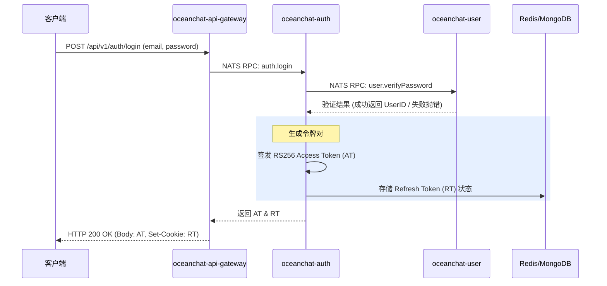
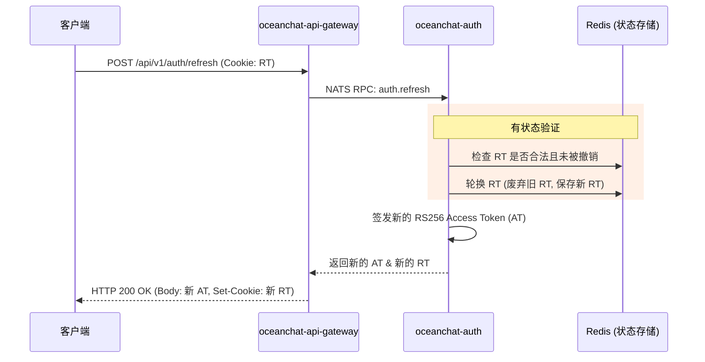
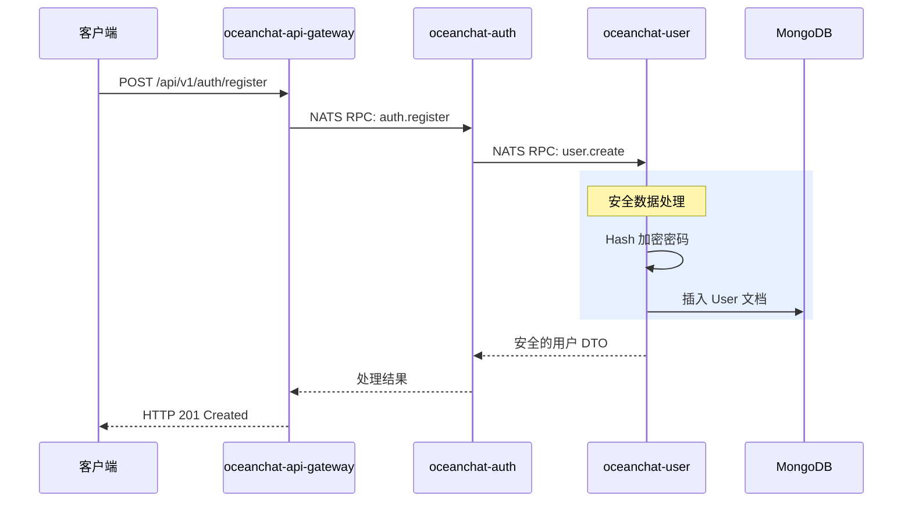

<head>
  <meta name="twitter:card" content="summary_large_image" />
  <meta property="og:title" content="Ocean Chat 认证架构 | Ocean Chat" />
  <meta property="og:description" content="全面解析 Ocean Chat 认证服务，详细介绍 Zero-I/O 架构、JWT 混合策略以及最大化安全性与可扩展性的服务设计。" />
  <link rel="canonical" href="https://docs.oceanchat.com/devdocs/auth-overview" />
</head>

# Ocean Chat 认证架构

认证系统是 Ocean Chat 最基础的安全屏障，为数以百万计的并发用户提供访问控制。在如此庞大的即时通讯 (IM) 平台规模下设计认证系统，必须在极致的性能与严格的安全约束之间找到完美的平衡。

本文将为您解释 Ocean Chat 认证系统的整体架构，详细说明它如何通过三个高度专业化的微服务，将 **Zero-I/O (零 I/O) 验证模式**与 **JWT 混合管理策略**结合在一起。

## 背景：在规模与安全之间寻找平衡

在传统的 Web 应用中，认证通常依赖于中心化的 Session（会话）或有状态的令牌验证。然而，Ocean Chat 的设计目标是承载 **1000 万以上的并发连接**。在这种规模下，传统的有状态验证会造成巨大的瓶颈。每一次针对中心化数据库（如 Redis）的令牌验证请求都会产生网络开销，在超高负载下极易导致基础设施的雪崩效应。

相反，纯粹的无状态令牌（例如标准的长期有效 JWT）又会带来无法接受的安全风险。如果令牌被盗，除非更改所有用户的签名密钥，否则根本无法撤销。因此，Ocean Chat 面临的挑战是：既要提供无状态令牌的极致性能，又要保留有状态会话的安全控制力。

## 核心概念：去中心化验证模型

Ocean Chat 认证系统通过采用 **集中式颁发者、去中心化验证者 (Centralized Issuer, Decentralized Verifier)** 架构来解决这个矛盾。

该架构分布在三个主要的微服务中：

1. **`oceanchat-api-gateway` (网关层 - Layer 1):** 作为去中心化的验证者。它使用非对称公钥 (RS256)，完全利用本地 CPU 算力对 Access Token 进行密码学验证 (**Zero-I/O**)，不产生任何网络调用。
2. **`oceanchat-auth` (认证层 - Layer 2):** 作为集中式颁发者和会话管理器。负责处理生成令牌、管理 Refresh Token 状态等复杂业务逻辑。
3. **`oceanchat-user` (用户层 - Layer 2):** 作为用户数据和密码 Hash 的安全真实数据源 (Source of Truth)。

:::tip 安全边界
在系统设计上，**用户密码的 Hash 值绝对不允许离开 `oceanchat-user` 服务**。Auth 服务通过 NATS RPC 委托 User 服务进行密码比对，确保敏感的密码学 Hash 始终被隔离在网络其余部分之外。
:::

## 服务交互与认证流程

以下时序图展示了这些微服务如何在关键的认证生命周期中，通过 NATS RPC 进行协作。

### 1. 登录流程 (Login Flow)

在登录期间，系统验证凭证并颁发 JWT 混合令牌对。为了安全起见，Refresh Token 会通过 `HttpOnly` Cookie 发送，而短期有效的 Access Token 则在响应体 (Body) 中返回。

### 2. 令牌刷新流程 (Token Refresh Flow)

由于 Access Token 是由网关在内存中严格验证的（不发起网络请求的 Zero-I/O 模式），因此它的生命周期必须非常短（例如 15 分钟）。当它过期时，客户端需使用有状态的 Refresh Token 来换取新的会话。

### 3. 注册流程 (Registration Flow)

在注册时，网关将请求代理给 Auth 服务，Auth 服务再将安全创建的职责委托给 User 服务。

## 总结

通过严格的职责分离——将高频、无状态的验证工作下放给 `oceanchat-api-gateway`，将低频、有状态的会话管理交由 `oceanchat-auth` 服务负责——Ocean Chat 实现了一条高度安全的认证流水线，能够在不引发数据库 I/O 风暴的前提下，实现支撑十万级并发连接的水平扩展。
