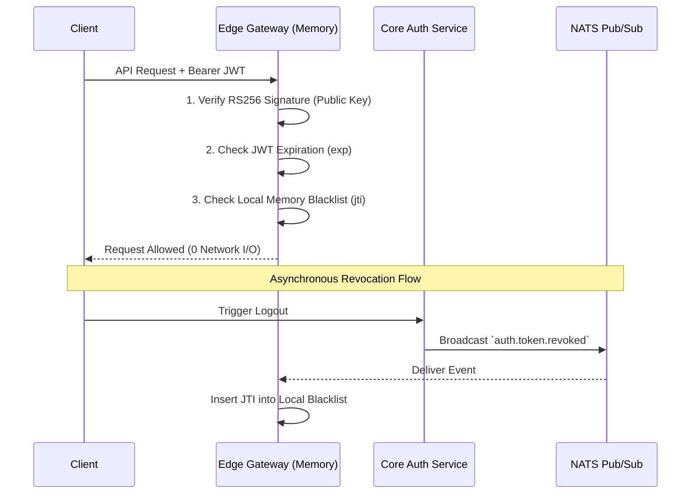

<head>
  <meta name="twitter:card" content="summary_large_image" />
  <meta property="og:title" content="理解零 I/O (Zero-I/O) 认证 | Ocean Chat" />
  <meta property="og:description" content="解释 Ocean Chat 的零 I/O 认证架构，该架构利用 RS256 非对称加密和内存黑名单，在十万并发连接下消除网络瓶颈。" />
  <link rel="canonical" href="https://jameswilson19970101.github.io/ocean.chat.docs/zh-CN/docs/devdocs/Auth%20Service/understanding-zero-io-authentication" />
</head>

# 理解零 I/O (Zero-I/O) 认证

认证是 Ocean Chat 关键的访问关卡。然而，当平台扩展到 **数十万并发连接** 时，传统的远程认证验证将成为灾难性的瓶颈。

本文档解释了 Ocean Chat 的 **零 I/O 认证架构 (Zero-I/O Authentication Architecture)** 的概念基础，详细说明了它如何从受网络限制的检查转变为受 CPU 限制的加密运算，以确保无限的水平扩展性。

## 上下文：网络 I/O 瓶颈

在传统的微服务架构中，API 网关通常通过查询集中式数据存储或远程缓存（如 Redis 白名单）来验证 JSON Web Token (JWT) 的有效性。

虽然这保证了严格、同步的状态一致性，但在大规模下会引入严重的结构性缺陷：

1. **远程 I/O 惩罚：** 每次 HTTP 请求或 WebSocket 握手都需要一次到 Redis 的网络往返。
2. **读取风暴：** 在 1000 万并发用户时，常规流量每秒会产生数百万次查询。这种读取风暴会压垮最强大的 Redis 集群，导致延迟增加和级联超时。
3. **对称密钥的脆弱性：** 在中央认证服务和边缘网关之间共享单一的对称密钥（如 HS256）意味着，一旦任何一个边缘节点被攻破，攻击者就可以伪造管理令牌。

为了实现水平扩展，Ocean Chat 必须将远程网络 I/O 从令牌验证的关键路径中彻底消除。

## 核心概念：加密学与事件驱动内存

Ocean Chat 通过反转验证范式解决了这个问题：网关假定所有加密有效的令牌都是合法的，**除非被明确告知相反的情况**。这依赖于两个主要支柱。

### 1. 非对称加密 (RS256)

Ocean Chat 从对称共享密钥转变为 **非对称加密**（公钥/私钥对）。

- **中央认证服务 (颁发者)：** 持有 **私钥** 并且是唯一能够签名有效 JWT 的服务。
- **边缘网关 (验证器)：** 仅持有 **公钥**。它们能在数学上验证令牌签名，但不能生成新令牌。

:::tip 安全最小化
通过使用 RS256，受损边缘节点的爆炸半径得到了控制。攻击者仅能获得公钥，而这在数学上无法用于伪造凭证。
:::

### 2. 事件驱动的内存黑名单

加密验证仅能证明令牌是合法颁发的；它无法证明用户没有退出登录。网关不再查询远程数据库来检查有效状态，而是使用 **事件驱动的内存黑名单**。

当用户退出登录时，认证服务会通过 NATS JetStream 异步发布一个 `auth.token.revoked` 事件。每个活动的网关都会接收此广播，并将该令牌的唯一 ID (`jti`) 插入到本地的内存 LRU 缓存（或布隆过滤器）中。

在请求验证期间，网关执行一次 `O(1)` 的本地内存查找。如果没有找到 `jti`，请求将立即继续处理，无需任何网络 I/O。一旦令牌达到其绝对过期时间 `exp`，`jti` 将自然地从内存中被驱逐。

## 替代方案与权衡

- **集中式白名单：** 提供严格的同步一致性。如果用户被封禁，他们的下一次请求会被立即拒绝。然而，中央数据库的 IOPS 限制使得这在 IM 规模下成为不可能。
- **短期 JWT（无黑名单）：** 仅依赖令牌过期（如 5 分钟）消除了对数据库的需求。但是，它留下了一个长达 5 分钟的安全漏洞窗口期，在此期间被盗的令牌或被封禁的用户仍然保持完全的访问权限。

带有 NATS 的零 I/O 方法提供了 **最终一致性**。在认证服务执行撤销操作与事件传递到网关之间存在一个微秒到毫秒级别的窗口。在全球聊天基础设施的背景下，这种微小的延迟是为了消除网络延迟而必须且极其有利的权衡。

## 高层次视角

通过将令牌验证内部化为本地内存操作，Ocean Chat 将认证从一个受网络限制的问题转化为受 CPU 限制的操作。边缘网关层的吞吐量不再受数据库 IOPS 的约束，从而允许平台只需添加更多网关计算实例即可无限水平扩展。
