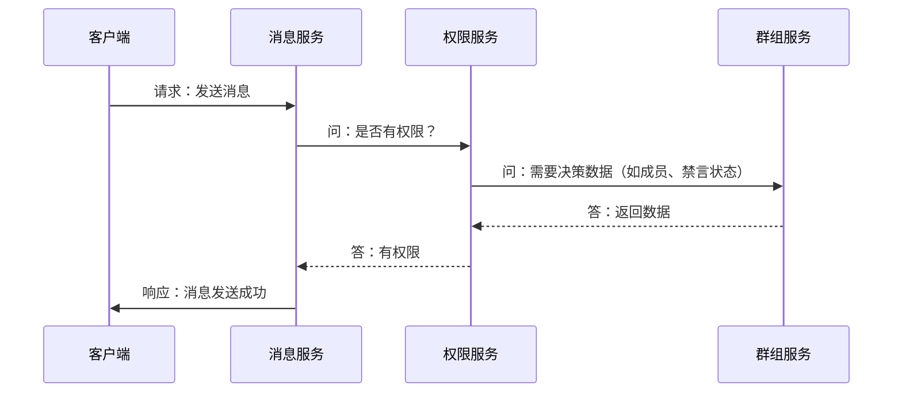

# 权限系统设计考量

:::tip 核心原则：谁拥有数据，谁负责决策
在权限设计上，我不采用独立的中央权限服务，而是遵循一个更务实的设计原则：**数据的唯一所有者是权限决策的唯一负责人（Policy Decision Point, PDP）。**
:::

## 方案探讨一：独立的中央权限服务

一种常见的思路是将权限逻辑（例如“判断角色 A 是否有权限 X”）抽离成一个独立的 `oceanchat-permission` 服务。这种方案在理论上具备以下优势：

- **逻辑高度集中**：所有的权限规则都集中在一个地方，修改和审计权限策略变得非常简单。
- **业务服务解耦**：`消息服务`或`群组服务`无需关心复杂的权限逻辑。它们只需向权限服务查询：“用户 U 能否对资源 R 执行操作 A？”，然后根据“是/否”的答案执行后续操作，使得业务代码更加简洁。
- **单一职责**：权限服务只做权限判断，职责非常纯粹。

## 中央权限服务的实践挑战

尽管独立的权限服务模型在理论上很优雅，但在实践中，尤其是在 `oceanchat` 这种需要大量上下文数据进行决策的系统中，会面临两大核心挑战：

### 1. 网络开销与性能瓶颈

将权限检查作为一次网络调用（RPC/HTTP），会显著增加请求的延迟。更严重的是，权限服务会成为整个系统的关键单点，一旦其发生故障或性能下降，所有依赖权限检查的服务（尤其是写操作）都可能被阻塞。



上图展示了，一次简单的发消息请求，因为引入了中央权限服务，导致了多次内部服务间的网络通信。

### 2. 数据依赖与服务耦合

权限判断往往不是无状态的，它高度依赖于具体的业务数据。

> **场景 1：用户 A 能在群 G 里发消息吗？**
>
> - **需要的数据**：A 是否是群 G 的成员？A 是否被禁言？群 G 当前是否是全员禁言状态？
> - **数据所有者**：这些数据都存储在 **群组服务 (`oceanchat-group`)** 的数据库里。

> **场景 2：用户 A 能删除用户 B 的好友关系吗？**
>
> - **需要的数据**：A 和 B 是否是好友关系？
> - **数据所有者**：这些数据存储在 **用户关系服务 (`oceanchat-user`)** 的数据库里。

为了让独立的权限服务能够做出决策，只有两种方案，但这两种方案都存在严重缺陷：

- **方案 A：反向调用数据服务**
  权限服务为了做决策，需要反向调用 `群组服务` 和 `用户关系服务` 来获取数据。这会导致复杂且脆弱的服务调用链（例如：`消息服务 -> 权限服务 -> 群组服务`），不仅延迟更高，还增加了系统出现循环依赖的风险。

- **方案 B：同步数据到权限服务**
  权限服务自己维护一份决策所需数据的副本（如群成员关系、好友关系等）。这会引入极高的数据同步和最终一致性问题，大大增加了系统复杂性。

## 我的设计方案：去中心化决策

基于以上挑战，我决定采用一种更务实、更高效的模式：**让拥有数据的服务自己成为权限决策点（Policy Decision Point）**。

这意味着，权限判断的逻辑将与其依赖的数据紧密地聚合在一起。

具体实施如下：

### 1. 决策逻辑去中心化

将权限决策的责任下放给拥有相关数据的服务。

- **群组相关权限**：所有与群组相关的权限判断逻辑（如发消息、邀请成员、禁言等），都封装在 **`群组服务`** 内部。当 `消息服务` 需要判断用户在某群组的权限时，直接调用 `群组服务` 提供的接口，例如 `groupService.checkPermission(userId, groupId, 'SEND_MESSAGE')`。
- **用户关系权限**：同理，好友添加/删除等权限判断，由 **`用户关系服务`** 负责。

**这种模式的优势非常明显：**

- **高性能**：权限决策与其所需的数据位于同一服务内，避免了额外的网络开销。
- **高内聚**：数据和使用这些数据的逻辑被封装在一起，符合优秀软件设计的原则。
- **高可用**：避免了中央权限服务的单点故障风险。

### 2. 权限元数据集中化

虽然决策逻辑是去中心化的，但权限的“定义”必须是集中且统一的。

我将创建一个共享的内部库（例如 `common-defs`），在这个库里通过枚举（Enum）或常量（Constants）的形式，统一定义整个平台所有的“角色 (Roles)”和“权限标识 (Permissions)”。

例如：

```typescript
// 在共享库 common-defs 中
export enum GroupPermission {
  SEND_MESSAGE = "group:send_message",
  INVITE_USER = "group:invite_user",
  // ... 其他权限
}
```

所有服务都依赖这个共享库来引用权限定义，从而确保了整个系统对“权限”的理解是一致的。
