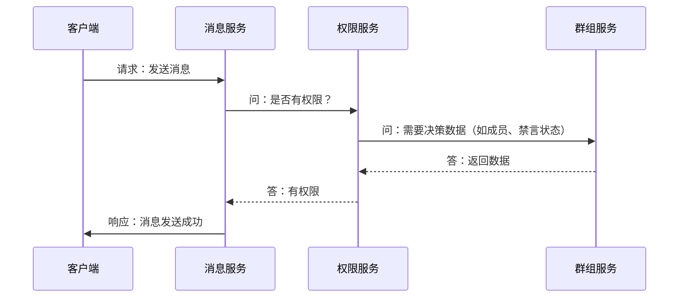

import Tabs from '@theme/Tabs';
import TabItem from '@theme/TabItem';

# 权限设计考量

:::tip 核心原则：谁拥有数据，谁负责决策
在权限设计上，我不采用独立的中央权限服务，而是遵循一个更务实的设计原则：**数据的唯一所有者是权限决策的唯一负责人（Policy Decision Point, PDP）。**
:::

## 方案探讨一：独立的中央权限服务

一种常见的思路是将权限逻辑（例如“判断角色 A 是否有权限 X”）抽离成一个独立的 `oceanchat-permission` 服务。这种方案在理论上具备以下优势：

- **逻辑高度集中**：所有的权限规则都集中在一个地方，修改和审计权限策略变得非常简单。
- **业务服务解耦**：`消息服务`或`群组服务`无需关心复杂的权限逻辑。它们只需向权限服务查询：“用户 U 能否对资源 R 执行操作 A？”，然后根据“是/否”的答案执行后续操作，使得业务代码更加简洁。
- **单一职责**：权限服务只做权限判断，职责非常纯粹。

## 中央权限服务的实践挑战
:::warning 实践中的挑战
尽管独立的权限服务模型在理论上很优雅，但在实践中，尤其是在 `oceanchat` 这种需要大量上下文数据进行决策的系统中，会面临两大核心挑战。
:::

### 1. 网络开销与性能瓶颈

将权限检查作为一次网络调用（RPC/HTTP），会显著增加请求的延迟。更严重的是，权限服务会成为整个系统的关键单点，一旦其发生故障或性能下降，所有依赖权限检查的服务（尤其是写操作）都可能被阻塞。



上图展示了，一次简单的发消息请求，因为引入了中央权限服务，导致了多次内部服务间的网络通信。

### 2. 数据依赖与服务耦合

权限判断往往不是无状态的，它高度依赖于具体的业务数据。

> **场景 1：用户 A 能在群 G 里发消息吗？**
>
> - **需要的数据**：A 是否是群 G 的成员？A 是否被禁言？群 G 当前是否是全员禁言状态？
> - **数据所有者**：这些数据都存储在 **群组服务 (`oceanchat-group`)** 的数据库里。

> **场景 2：用户 A 能删除用户 B 的好友关系吗？**
>
> - **需要的数据**：A 和 B 是否是好友关系？
> - **数据所有者**：这些数据存储在 **用户关系服务 (`oceanchat-user`)** 的数据库里。

为了让独立的权限服务能够做出决策，只有两种方案，但这两种方案都存在严重缺陷：

- **方案 A：反向调用数据服务**
  权限服务为了做决策，需要反向调用 `群组服务` 和 `用户关系服务` 来获取数据。这会导致复杂且脆弱的服务调用链（例如：`消息服务 -> 权限服务 -> 群组服务`），不仅延迟更高，还增加了系统出现循环依赖的风险。

- **方案 B：同步数据到权限服务**
  权限服务自己维护一份决策所需数据的副本（如群成员关系、好友关系等）。这会引入极高的数据同步和最终一致性问题，大大增加了系统复杂性。

## 我的设计方案：去中心化决策

基于以上挑战，我决定采用一种更务实、更高效的模式：**让拥有数据的服务自己成为权限决策点（Policy Decision Point）**。

这意味着，权限判断的逻辑将与其依赖的数据紧密地聚合在一起。

具体实施如下：

### 1. 决策逻辑去中心化

将权限决策的责任下放给拥有相关数据的服务。

- **群组相关权限**：所有与群组相关的权限判断逻辑（如发消息、邀请成员、禁言等），都封装在 **`群组服务`** 内部。当 `消息服务` 需要判断用户在某群组的权限时，直接调用 `群组服务` 提供的接口，例如 `groupService.checkPermission(userId, groupId, 'SEND_MESSAGE')`。
- **用户关系权限**：同理，好友添加/删除等权限判断，由 **`用户关系服务`** 负责。

**这种模式的优势非常明显：**

- **高性能**：权限决策与其所需的数据位于同一服务内，避免了额外的网络开销。
- **高内聚**：数据和使用这些数据的逻辑被封装在一起，符合优秀软件设计的原则。
- **高可用**：避免了中央权限服务的单点故障风险。

### 2. 权限元数据集中化

:::info 权限定义集中化
虽然决策逻辑是去中心化的，但权限的“定义”必须是集中且统一的。
:::

我将创建一个共享的内部库（例如 `common-defs`），在这个库里通过枚举（Enum）或常量（Constants）的形式，统一定义整个平台所有的“角色 (Roles)”和“权限标识 (Permissions)”。

例如：

```typescript
// 在共享库 common-defs 中
export enum GroupPermission {
  SEND_MESSAGE = "group:send_message",
  INVITE_USER = "group:invite_user",
  // ... 其他权限
}
```

所有服务都依赖这个共享库来引用权限定义，从而确保了整个系统对“权限”的理解是一致的。

## 基于[微服务架构](./microservice.md)的具体实现

我将这套去中心化决策的方案落地到具体的代码结构中，主要分为：

1.  **一个核心库 (`libs/authorization`)**: 作为“权限检查引擎”，在进程内运行，无网络延迟。
2.  **多个微服务 (`apps/...`)**: 作为“权限管理器”（负责数据持久化）和“消费者”（在执行业务逻辑时进行权限检查）。

<Tabs groupId="authorization-implementation">
<TabItem value="core-lib" label="核心库 (libs/authorization)" default>

这是 NestJS Monorepo `libs/` 目录下的一个库，作为权限的“单一事实来源” (Single Source of Truth)。

```bash title="libs/authorization 目录结构"
libs/authorization/
└── src/
    │
    ├── index.ts                (导出所有公共模块、服务、Guard 和常量)
    ├── authorization.module.ts (NestJS 模块)
    │
    ├── constants/              (权限定义 - 单一事实来源)
    │   ├── permissions.ts
    │   ├── roles.ts
    │   └── permission-ids.ts
    │
    ├── services/               (核心检查逻辑)
    │   ├── authorization.service.ts
    │   ├── permission-caching.service.ts
    │   └── user-role.provider.ts
    │
    ├── guards/                 (NestJS 路由守卫)
    │   └── permissions.guard.ts
    │
    ├── decorators/             (NestJS 装饰器)
    │   └── permissions.decorator.ts
    │
    ├── validators/             (复杂业务验证器)
    │   └── room-access.validator.ts
    │
    ├── utils/                  (辅助工具)
    │   └── authorization.utils.ts
    │
    └── interfaces/             (TypeScript 接口)
        ├── irole.interface.ts
        └── ipermission.interface.ts
```

#### 职责拆解

- **`constants/`**: 定义所有权限和角色的常量，是整个系统的“单一事实来源”。
  - `permissions.ts`: 定义所有权限及其默认角色，供数据初始化服务使用。
  - `roles.ts`: 定义所有系统默认角色（如 `admin`, `user`），供数据初始化服务使用。
  - `permission-ids.ts`: 导出类型安全的 `PermissionId` 枚举，供所有微服务的 `@Permissions()` 装饰器使用，避免硬编码字符串。
- **`services/`**: 核心检查逻辑。
  - `permission-caching.service.ts`: 负责在内存中缓存权限数据，并订阅 NATS 事件以在数据变更时清除本地缓存。
  - `user-role.provider.ts`: **数据提供者**，负责回答“某用户在某作用域下拥有哪些角色？”。它会优先查缓存，缓存未命中时通过 NATS/gRPC 调用 `oceanchat-user` 和 `oceanchat-group` 获取数据。
  - `authorization.service.ts`: **核心检查逻辑**，提供 `hasPermission(userId, permissionId, scope?)` 方法，在内存中进行角色和权限的比对。
- **`guards/` & `decorators/`**: 提供标准的 NestJS 路由守卫 `@PermissionsGuard()` 和装饰器 `@Permissions()`，用于在控制器方法上声明和检查权限。
- **`validators/`**: 提供复杂的业务验证器，如 `room-access.validator.ts`，用于处理“用户能否访问某房间”这类包含多重业务规则的检查。
- **`interfaces/`**: 定义 `IRole`, `IPermission` 等 TypeScript 接口，供整个 Monorepo 共享。
  - // TODO: interfaces 下的代码会被转移到 `libs/types`

</TabItem>
<TabItem value="user-service" label="用户服务 (oceanchat-user)">

作为**全局权限管理器**，负责全局角色（如 `admin`, `user`）和所有权限定义 (`Permissions` 表) 的数据持久化和管理。

```bash title="apps/oceanchat-user/src 目录结构"
apps/oceanchat-user/
└── src/
    │
    ├── user/
    │   └── ... (现有用户逻辑)
    │
    ├── permission/             (<<--- 权限管理模块)
    │   ├── permission.module.ts
    │   ├── permission.controller.ts
    │   ├── permission.service.ts
    │   └── entities/ // TODO: entities 会被转移到 libs/models
    │       ├── role.entity.ts
    │       ├── permission.entity.ts
    │
    └── init/                   (<<--- 数据初始化)
        └── permission-seeder.service.ts
```

#### 职责拆解

- **`permission/entities/`**: 定义 `Role` 和 `Permission` 的数据库实体（如 Mongoose Schema）。
- **`permission/permission.controller.ts`**: **微服务控制器** (非 HTTP)，通过 `@MessagePattern` (NATS) 监听请求。
  - **对内 API (供核心库调用)**: `getGlobalRolesForUser(userId)`。
  - **对网关 API (供 `api-gateway` 路由)**: `createRole`, `deleteRole`, `addRoleToPermission`, `addUserToRole`。
- **`permission/permission.service.ts`**: **业务逻辑与事件发布**。
  - 实现 Controller 交付的业务逻辑（如检查“不能删除最后一个 admin”）。
  - **关键职责**: 在数据变更后（如 `addUserToRole`），必须通过 NATS 发布事件（如 `auth.role.changed`），以通知所有服务的核心库清除缓存。
- **`init/permission-seeder.service.ts`**: **数据初始化**。
  - 在服务启动时运行，从 `libs/authorization/constants` 导入权限和角色定义，并写入数据库，确保权限数据完整。

</TabItem>
<TabItem value="group-service" label="群组服务 (oceanchat-group)">

作为**作用域权限管理器**，负责群组内角色（如 `owner`, `moderator`）的持久化和管理。

```bash title="apps/oceanchat-group/src 目录结构 (部分)"
apps/oceanchat-group/
└── src/
    └── group/
        ├── group.controller.ts
        ├── group.service.ts
        └── entities/
            └── subscription.entity.ts (或 group-member.entity.ts)
```

#### 职责拆解

- **`group/entities/subscription.entity.ts`**: 群组成员实体。
  - **关键设计**: 必须包含一个 `roles: string[]` 字段，用于存储该用户在该群组内的角色。
  - // TODO: 将 entities 转移到 libs/models
- **`group/group.controller.ts`**: **微服务控制器**。
  - **对内 API (供核心库调用)**: `getScopedRolesForUser(userId)` (返回该用户所有群组内的角色映射)。
  - **对网关 API (供 `api-gateway` 路由)**: `setGroupRole(groupId, userId, roleName)`。
- **`group/group.service.ts`**: **业务逻辑与事件发布**。
  - 实现 `setGroupRole`，修改 `subscription.entity` 中的 `roles` 数组。
  - **关键职责**: 在角色变更后，必须通过 NATS 发布事件（如 `auth.role.changed`），以通知缓存失效。

</TabItem>
<TabItem value="api-gateway" label="API 网关 (oceanchat-api-gateway)">

作为 **API 入口**，负责向管理员（前端）暴露所有的权限管理 RESTful API，并使用核心库的 `PermissionsGuard` 保护这些端点。

```bash title="apps/oceanchat-api-gateway/src 目录结构 (部分)"
apps/oceanchat-api-gateway/
└── src/
    └── authorization/          (<<--- 权限管理 API 模块)
        ├── authorization.module.ts
        └── controllers/
            ├── admin-roles.controller.ts
            ├── admin-permissions.controller.ts
            └── admin-users.controller.ts
```

#### 工作流程示例

`admin-users.controller.ts` 中的一个方法可能如下所示：

```typescript title="apps/oceanchat-api-gateway/src/authorization/controllers/admin-users.controller.ts"
import { PermissionsGuard, Permissions, PermissionId } from '@app/authorization';

@Controller('/admin/users')
export class AdminUsersController {
  // ...

  @Post(':userId/roles')
  @UseGuards(PermissionsGuard) // 1. 使用从核心库导入的守卫
  @Permissions(PermissionId.ASSIGN_ROLES) // 2. 声明此端点需要 'assign-roles' 权限
  addUserToRole(@Param('userId') userId: string, @Body() body: ...) {
    // 3. 守卫已通过，意味着当前操作者有权执行此操作
    // 4. 将请求通过 NATS 路由到 oceanchat-user 服务进行处理
    return this.userService.client.send('addUserToRole', { userId, ... });
  }
}
```

</TabItem>
<TabItem value="message-service" label="业务消费者 (oceanchat-message)">

展示了普通业务服务如何使用权限库。

#### 在 Controller 层进行基础权限检查

```typescript title="apps/oceanchat-message/src/message/message.controller.ts"
import { PermissionsGuard, Permissions, PermissionId } from '@app/authorization';

@Controller('messages')
export class MessageController {
  @Post()
  @UseGuards(PermissionsGuard) // 使用守卫
  @Permissions(PermissionId.CREATE_MESSAGE) // 声明需要“创建消息”的权限
  async sendMessage(@Body() dto: ...) {
    // 1. Guard 已通过基础权限检查
    // 2. 服务层再进行更复杂的业务验证
    return this.messageService.sendMessage(dto);
  }
}
```

#### 在 Service 层进行复杂业务验证

```typescript title="apps/oceanchat-message/src/message/message.service.ts"
import { RoomAccessValidator } from '@app/authorization';

@Injectable()
export class MessageService {
  constructor(
    // 注入核心库提供的复杂验证器
    private roomAccessValidator: RoomAccessValidator
  ) {}

  async sendMessage(dto: ...) {
    const room = await this.roomRepo.findOne(dto.roomId);
    const user = ...;

    // 2.1 使用验证器检查复杂的房间访问权
    const canAccess = await this.roomAccessValidator.canAccessRoom(room, user);
    if (!canAccess) {
      throw new ForbiddenException(...);
    }

    // 2.2 检查是否被禁言、房间是否只读等其他业务逻辑...
    // ...
  }
}
```

</TabItem>
</Tabs>