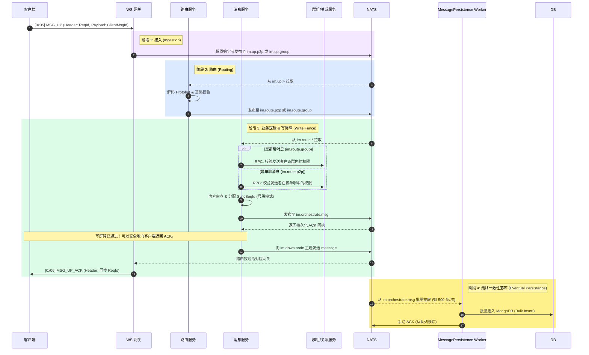

# 消息发送与落库

## 如何架构十万级并发下的消息发送与落库

为了支撑十万级并发连接，传统的同步数据库写入（即阻塞客户端，直到数据库保存消息完毕）会导致严重的性能瓶颈。Ocean Chat 采用基于 NATS JetStream 的 **预写日志 (WAL)** 模式来解决此问题。NATS WAL 利用 JetStream 作为高速持久化缓冲区，将消息瞬间落盘，从而将快速的客户端响应与缓慢的底层数据库写入彻底解耦。

本指南详细介绍了实现高吞吐量、异步消息发送和持久化所需的具体微服务、JetStream 主题以及循序渐进的数据流转过程。

## 必需的核心组件

要完成消息发送和落库的生命周期，需要特定的无状态微服务与有状态的 JetStream Stream 相互配合。

import Tabs from '@theme/Tabs';
import TabItem from '@theme/TabItem';

<Tabs>
  <TabItem value="services" label="必需的微服务" default>
    1. 连接网关 (oceanchat-ws-gateway)：无状态边缘节点。接收 WebSocket 的 MSG_UP 数据帧，剥离传输层，直接转发原始负载。
    2. 路由服务 (oceanchat-router)：流量调度器。拉取原始数据包，解码 Protobuf，并将其路由到正确的业务服务（单聊或群聊）。
    3. 消息逻辑服务 (oceanchat-message)：业务大脑。负责权限校验、内容过滤以及分配基于号段模式的会话级 SyncSeqId。它负责把控写屏障 (Write Fence)。
    4. 群组/关系服务 (oceanchat-group / oceanchat-user)：决策者。由消息服务在校验权限时通过高速内部 RPC 调用，用于判断发送者在该群内或该单聊中的权限。
    5. 消息持久化 Worker (MessagePersistence)：后台消费者。从 NATS 批量拉取消息并写入 MongoDB。
  </TabItem>
  <TabItem value="streams" label="必需的 JetStream">
    1.  IM_CORE Stream:
        - Subject: im.up.> (im.up.p2p, im.up.group)
        - 用途: 网关原始接入流。吞吐量极高，数据保留期短。
    2.  IM_HANDOFF Stream (WAL 预写日志):
        - Subject: im.route.\*
        - 用途: oceanchat-router 将解码后的负载传递给 oceanchat-message。
        - Subject: im.orchestrate.msg
        - 用途: 最终处理完毕的消息。这是写屏障边界。它同时为 `oceanchat-orchestrator`（用于生成极轻量级的 `MSG_NOTIFY` 唤醒通知并进行下行扩散）和 `MessagePersistence worker` 提供数据源。
  </TabItem>
</Tabs>

:::info 富媒体与大载荷上行策略 (长短链协同)
根据 Ocean Chat 全局的长短链结合策略，对于图片、语音、视频等大文件（数据面），客户端**严禁**直接通过长连接传输二进制实体流，此举会导致长连接网关引发严重的队头阻塞 (Head-of-Line Blocking)。
**正确的上行流程为：** 客户端先通过 **HTTP 短连接** 将多媒体文件上传至对象存储 (OSS/S3)，随后将该文件的下载 URL 及元数据封装在极轻量的 Protobuf 载荷中，最后再通过长连接通道发送 `[0x05] MSG_UP` 控制面指令。
:::

以下时序图展示了消息如何从客户端出发，穿过微服务层，进入 NATS WAL，并最终异步落库到 MongoDB。

