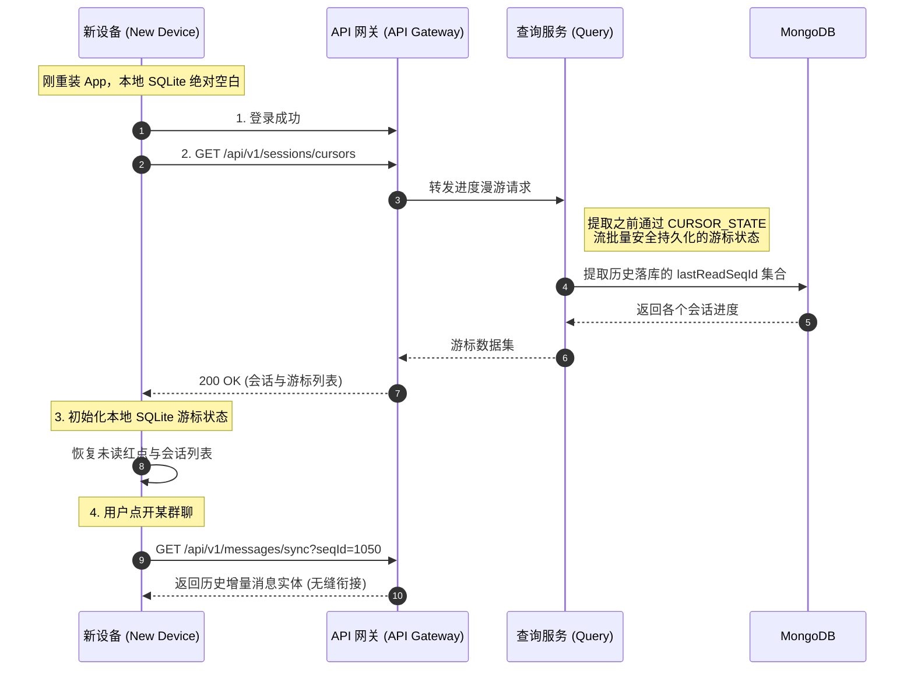

import Tabs from '@theme/Tabs';
import TabItem from '@theme/TabItem';

# 跨设备漫游与进度恢复

本指南将演示 Ocean Chat 如何在用户更换新手机或卸载重装 App 后，无缝恢复其各个群聊与单聊的阅读进度。

通过阅读本指南，你将了解当新设备本地 SQLite 数据库完全空白、丧失“本地兜底去重”能力时，系统如何依赖之前批量持久化到 MongoDB 中的游标数据，将漫游进度精准下发给新设备，让用户的聊天体验实现无缝衔接。

## 必需的核心组件

为了完成端侧漫游进度的恢复，以下无状态微服务与持久化存储需要相互配合：

<Tabs>
  <TabItem value="services" label="必需的微服务" default>
    1. API 网关 (oceanchat-api-gateway)：处理来自新设备的 HTTP 进度与会话拉取请求。
    2. 数据查询服务 (oceanchat-query)：接收网关转发的请求，从数据库中提取用户的会话列表及对应的历史已读游标。
    3. 持久化管道 (MessagePersistence Worker)：（前置条件）负责在日常聊天中，将 `CURSOR_STATE` 流中的高频游标折叠并安全持久化到数据库。
  </TabItem>
  <TabItem value="storage" label="持久化存储">
    1. MongoDB：
       - 用途: 游标数据的最终归宿（Source of Truth）。安全存储了用户在各个会话中的绝对最新阅读进度（如 `lastReadSeqId`）。
  </TabItem>
</Tabs>

---

## 1. 新设备登录与绝对空白状态

当用户购买了一台新手机或卸载重装了 App，新设备登录后的初始状态是极其脆弱的：

- **本地 SQLite 空白**：不存在任何历史消息实体记录。
- **无游标状态**：本地完全不知道各个群聊的 `MaxLocalSyncSeqId` 是多少。
- **丧失去重能力**：因为本地没有历史消息，如果服务端此时将历史消息乱序全量下发，客户端根本无法使用 `ClientMsgId` 进行“本地兜底去重”。

## 2. 发起漫游进度请求

为了安全重建本地的状态机，新设备在登录完成并建立 WebSocket 长连接之前（或同时），第一件事必须是向服务器发起 HTTP 请求，拉取全局会话列表与阅读进度：

```http title="拉取会话漫游进度请求"
GET /api/v1/sessions/cursors
```

:::tip 进度优先于实体消息
客户端必须先获取并初始化所有会话的游标进度，然后才能安全地处理任何实时下行的 `MSG_NOTIFY` 新消息唤醒信令。这保证了状态机与增量拉取（HTTP Sync）的绝对有序性。
:::

## 3. 服务端提取持久化漫游数据

`oceanchat-query` 数据查询服务接收到请求后，会直接向底层的 MongoDB 发起查询。

此时，系统正是极大地依赖了我们在《跨端已读回执同步》中设计的架构成果。由于用户在旧手机上滑动屏幕时产生的高频 `[0x0B] READ_RECEIPT` 信令已经被 `CURSOR_STATE` 队列流自动折叠并安全落盘，MongoDB 中完好无损地保存着该用户每一个会话的精确进度。

查询服务将这些进度数据组装后返回给新设备：

```json title="游标漫游响应示例"
{
  "sessions": [
    {
      "groupId": "G1001",
      "lastReadSeqId": 1050
    },
    {
      "groupId": "G2048",
      "lastReadSeqId": 88
    }
  ]
}
```

## 4. 端侧无缝衔接与按需增量拉取

客户端在接收到上述响应后，执行以下恢复逻辑：

1. **初始化本地库**：将各个会话的 `lastReadSeqId` 写入本地空白的 SQLite，恢复为当前各群组的 `MaxLocalSyncSeqId`。
2. **界面状态自愈**：通过比对当前群聊最新一条消息的 SeqId 与刚拿到的游标，UI 界面可以精准还原哪些群有未读红点、各有几条未读，做到与旧手机体验完全一致。
3. **按需增量拉取**：如果用户点开某个具体的聊天界面，客户端只需拿着刚刚恢复的 `lastReadSeqId`，发起常规的 `HTTP Sync` 增量拉取，完美避免了无脑拉取全量历史数据引发的网络带宽爆炸与内存崩溃。

:::info 体验的上限
客户端的本地兜底去重是系统的“容错下限”；而服务端为了防写风暴而维护的 `CURSOR_STATE` 异步批量持久化，此刻成为了新设备无缝漫游体验的“业务上限”。
:::

## 端到端时序图

下图展示了新设备登录后，系统如何提取持久化游标并完成漫游进度恢复的完整时序：


