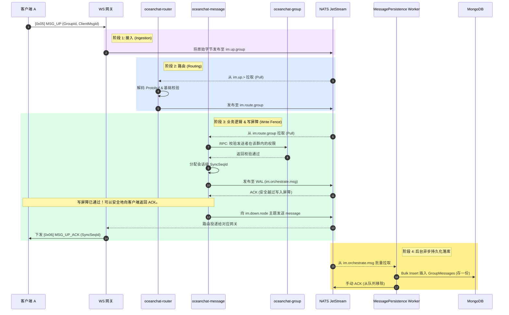
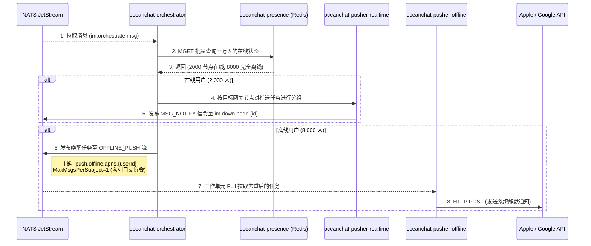
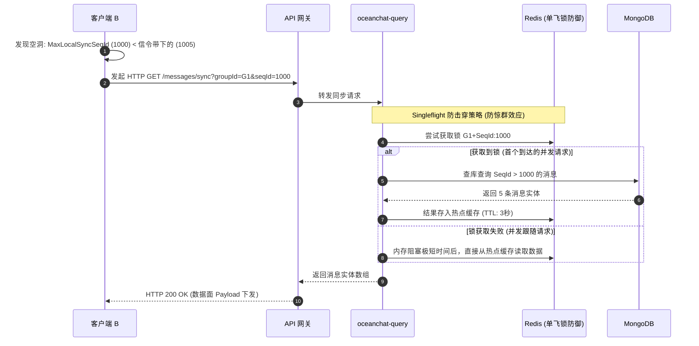
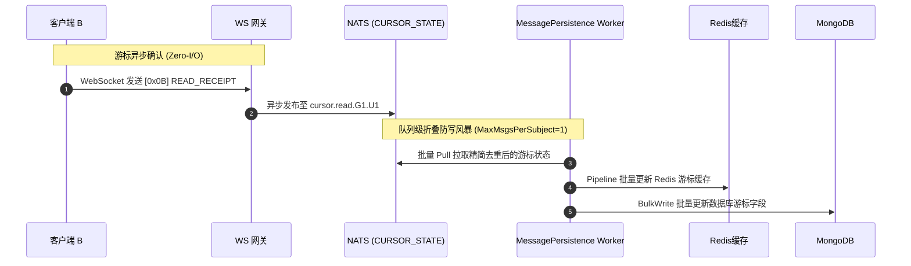

import Tabs from '@theme/Tabs';
import TabItem from '@theme/TabItem';

# 群消息的发送与接收流程

本文档解释了群聊消息在 Ocean Chat 架构中的端到端生命周期。它详细说明了系统如何利用**读扩散（存一份）模型**结合**推拉结合 (Push-Pull Hybrid) 策略**，将消息稳定地投递给数万名群成员，同时绝不引发“写入风暴”或网络雪崩。

该过程主要分为四个阶段：**接入与持久化（上行）**、**定向派发（下行）**、**消息实体拉取（数据面）**，以及**游标状态确认（控制面）**。

---

## 1. 全局架构策略

在深入流程之前，必须理解 Ocean Chat 用于群聊的基础策略：

- **存一份 (读扩散 Read-Diffusion)：** 群消息实体仅在全局 MongoDB 的 `GroupMessages` 集合中保存一次。系统绝*不会*为每个群成员拷贝一份独立数据。
- **推拉结合 (Push-Pull Hybrid)：** WebSocket 长连接严格保留用于极其轻量级的信令投递（控制面）。实际的消息有效载荷由客户端通过 HTTP 短连接增量拉取（数据面）。
- **异步解耦：** NATS JetStream (预写日志 WAL) 是将快速的客户端交互与缓慢的数据库 I/O 彻底隔离的绝对边界。

---

## 2. 第一阶段：接入与持久化（上行）

当用户向群组发送消息时，此阶段的目标是迅速接收消息、进行验证、分配全局单调递增的序列号 (SeqId)，并将其安全存入 WAL，随后立即向发送者返回确认回执。

### 关键机制：

- **写入屏障 (Write Fence)：** 发送者在步骤 8（NATS 确认写入）之后立即收到 `MSG_UP_ACK`。发送者*无需等待* MongoDB 的插入操作完成，这保证了亚毫秒级的极致响应时间。
- **发送幂等去重：** 发送者必须提供唯一的 `ClientMsgId`。如果发送者因网络断开而重试，后端利用此 ID 防止产生重复的 `SyncSeqId` 或插入重复记录。

---

## 3. 第二阶段：定向派发（下行）

一旦消息安全落入 `im.orchestrate.msg` 主题，推送编排服务 (Push Orchestrator) 便开始接管。它的任务是将庞大的接收者名单划分为在线和离线两组，并分别进行路由。

假设一个群有 **10,000 名成员**（2,000 人在线，8,000 人离线）。

### 关键机制：

- **零载荷推送 (Zero-Payload Push)：** 通过 WebSocket 发送给 2,000 名在线用户的 `MSG_NOTIFY` _不包含任何消息实体内容_。它仅仅携带 `GroupId` 和最新的游标 `SyncSeqId`（例如 `{"seqId": 1005}`）。
- **队列级折叠防风暴 (Queue Collapse)：** 对于那 8,000 名离线用户，编排服务向 `push.offline.apns.{userId}` 发布任务。由于该流配置了 `MaxMsgsPerSubject=1`，如果 1 秒内该群连续产生 10 条消息，NATS 队列会自动丢弃每个用户的前 9 个任务。`oceanchat-pusher-offline` 工作单元最终只会拉取到最后一次唤醒任务，对每个用户仅调用一次苹果/谷歌 API。这极大地节省了调用成本，同时避免了疯狂弹窗打扰用户。

---

## 4. 第三阶段：消息实体拉取（数据面）

无论是收到 `MSG_NOTIFY` 在线信令的用户，还是点击 APNs 离线通知唤醒应用的用户，都必须主动去拉取实际的消息实体。

### 关键机制：

- **Singleflight 防击穿 (Thundering Herd Defense)：** 当 2,000 名在线用户同时收到 MSG_NOTIFY 并在百毫秒内并发发起 HTTP GET 请求时，oceanchat-query 服务利用 Singleflight 模式和极短生命周期的 Redis 热点缓存，确保只有第一个请求真正穿透到底层的 MongoDB 执行查询。其余 1,999 个请求全部直接从内存返回结果，完美保护数据库免遭瞬间击穿崩溃。
- **客户端兜底去重：** 客户端在解析 HTTP 返回的数组时，必须利用每条消息的 ClientMsgId 对比本地 SQLite 数据库，静默丢弃因为网络重试引发的任何重复消息。

## 5. 第四阶段：游标状态确认（控制面）

需要明确的是，客户端在后台（数据面）拉取到消息实体后**并不会**立即发送回执。只有当用户真正打开该群聊窗口，并在屏幕上**实际阅读（UI 渲染呈现）**了这些消息后，客户端才会向后端反馈其最新的消费进度。

此阶段的核心业务目标是支撑**未读消息小红点（Badge）精准计算**、**多端状态同步消除红点**以及**跨设备漫游恢复**(当用户换了一台新手机、重新安装了 App，或者在另一台平板/电脑上登录同一个账号时，系统能够完美地“记住并恢复”他之前的聊天进度和未读状态)。技术上的主要挑战则是如何记录状态，同时抵御由海量用户同时触发回执带来的“数据库写风暴”。

### 关键机制：

驱动“未读红点”与业务闭环 (业务价值)： 持久化 Worker 更新游标不仅为计算离线推送的角标（Badge）数提供精确依据，还会联动后端的 DEVICE_SYNC（设备同步流），实时通知该用户同时在线的 PC 端或 iPad 端瞬间清除对应的群未读红点。

- **极致异步与网关零 I/O：** 网关收到 READ_RECEIPT 后，不直接进行任何查写操作，而是极速抛入 NATS CURSOR_STATE 流。
- **底层队列自动折叠：** 该流利用 MaxMsgsPerSubject=1 机制。如果一个用户在群内不断滑动屏幕，产生大量回执，NATS 会自动剔除旧游标，仅保留其在当前群内的最新 lastReadSeqId，从源头消灭冗余数据。
- **批量双写落盘：** 后台 Worker 批量拉取这批折叠后的精简状态，利用 Redis Pipeline 和 MongoDB BulkWrite 完成游标更新，彻底保护了数据库 IOPS 性能。

:::tip 核心总结
这种推拉结合架构保证了宝贵的 WebSocket 长连接严格且专属地用于低延迟、极小带宽的信令控制。繁重的数据实体传输和历史状态同步被完全剥离并降级到可无限水平扩展的 HTTP 接口，配合缓存防击穿机制，使 Ocean Chat 能够从容应对数万活跃用户的超大群聊挑战。
:::
