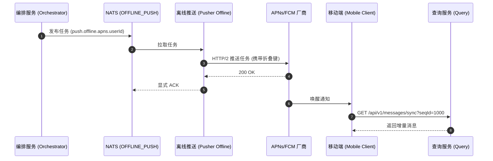

import Tabs from '@theme/Tabs';
import TabItem from '@theme/TabItem';

# 离线消息推送

## 如何架构和处理离线消息推送

本指南详细展示了在 Ocean Chat 中，如何将离线消息可靠地投递给当前没有活跃 WebSocket 连接的用户。

本指南假定您对 NATS JetStream 以及 Ocean Chat 的微服务架构有基本的了解，且消息已成功穿过写入屏障持久化至 `im.orchestrate.msg` 主题中。

## 必需的核心组件

为了完成离线消息的推送投递，以下无状态微服务与有状态的 JetStream Stream 需要相互配合：

<Tabs>
  <TabItem value="services" label="必需的微服务" default>
    1. 编排服务 (oceanchat-orchestrator)：负责拉取消息元数据并判定目标用户的在线状态，从而生成推送任务。
    2. 状态服务 (oceanchat-presence)：基于 Redis。为编排器提供用户连接状态及平台类型（如 iOS, Android）的查询支撑。
    3. 离线推送 Worker (oceanchat-pusher-offline)：专门用于消费离线推送队列的工作单元，负责调用厂商 (APNs/FCM) 的 HTTP API。
    4. 数据查询服务 (oceanchat-query)：提供 HTTP 接口供被唤醒的离线客户端增量拉取历史消息实体。
  </TabItem>
  <TabItem value="streams" label="必需的 JetStream">
    1.  IM_HANDOFF Stream:
        - Subject: `im.orchestrate.msg`
        - 用途: 消息经过写入屏障后的安全持久化点，提供等待派发处理的消息源。
    2.  OFFLINE_PUSH Stream:
        - Subject: `push.offline.{vendor}.{user_id}`
        - 用途: 用于第三方推送任务的工作队列 (WorkQueue)。通过配置 `max_msgs_per_subject: 1` 策略实现通知折叠，防止对用户造成消息轰炸。
  </TabItem>
</Tabs>

## 1. 拦截并持久化消息

当用户发送消息时，`oceanchat-message` 服务会将其写入 NATS JetStream 的 `im.orchestrate.msg` 主题。这充当了一个**写入屏障（Write Fence）**。一旦收到来自 NATS 的 ACK，消息即被视为已安全持久化，并准备好进行下游的投递路由。

## 2. 确定用户在线状态

`oceanchat-orchestrator` 编排服务拉取消息元数据，并查询 `oceanchat-presence` 状态服务（基于 Redis）。

如果检测到目标用户没有任何活跃的 TCP/WebSocket 连接，编排器会将其标记为“离线”，并进一步解析其设备平台（如 iOS、Android）。

## 3. 生成并隔离推送任务

为了避免缓慢的第三方网络请求阻塞核心的实时流量，系统必须将离线推送任务路由到专用队列中。

1. **发布任务**：编排器向 `OFFLINE_PUSH` 流中的 `push.offline.{vendor}.{user_id}` 主题（例如 `push.offline.apns.user123`）发布一个轻量级的推送任务。
2. **队列折叠防风暴**：该流使用 `max_msgs_per_subject: 1` 保留策略。如果短时间内有多条消息发给同一个离线用户，NATS 会自动丢弃旧任务，队列中永远仅保留最新的唤醒信号。这实现了通知折叠，防止对用户造成骚扰。

:::tip 物理隔离
为离线任务使用独立的 NATS 流，可以将核心的 `IM_CORE` 实时消息队列与外部 HTTP API 的高延迟和频率限制彻底物理隔离，保护系统免受缓慢外部 I/O 的影响。
:::

## 4. 通过厂商 API 投递

`oceanchat-pusher-offline` 服务作为消费 `OFFLINE_PUSH` 流的后台工作单元运行。

- **拉取模式消费 (Pull Mode)**：该服务使用 `consumer.sonsume()` 拉取任务，以适配 Apple/Google API 的限流速率，做到削峰填谷。
- **调用厂商接口**：工作单元调用 APNs 或 FCM 接口。它在有效载荷中包含**折叠键（Collapse Key）**，确保移动操作系统仅静默更新未读角标和最新消息预览。
- **显式 ACK**：只有在收到厂商返回的 `200 OK` HTTP 响应后，工作单元才会向 NATS 回复显式 ACK。如果 API 失败或超时，任务最多会被重新投递 3 次（或根据配置次数），随后移入死信队列 (DLQ)。

## 5. 客户端唤醒与 HTTP Sync 同步

推送通知严格作为**唤醒信号**，绝不会携带完整的消息有效载荷。

当移动操作系统接收到 APNs/FCM 有效载荷并唤醒应用时，执行以下拉取流程：

1. 客户端从本地存储读取其 `MaxLocalSyncSeqId`。
2. 客户端通过调用 API 网关发起 HTTP Sync 同步请求：

```http title="HTTP Sync Request"
GET /api/v1/messages/sync?seqId={MaxLocalSyncSeqId}
```

3. oceanchat-query 数据查询服务从 MongoDB 中获取所有严格大于所提供 ID 的增量消息并返回。
4. 客户端处理该批次数据，使用 ClientMsgId 静默丢弃任何重复项，然后更新本地的 MaxLocalSyncSeqId。

:::warning 必须进行客户端去重
务必在客户端使用 ClientMsgId 执行去重操作，以安全处理 NATS “至少投递一次”（At-Least-Once）语义导致同步批次数据重叠的边缘情况。
:::

## 端到端时序图

通过以上步骤，将实现如下的离线推送与同步时序：


