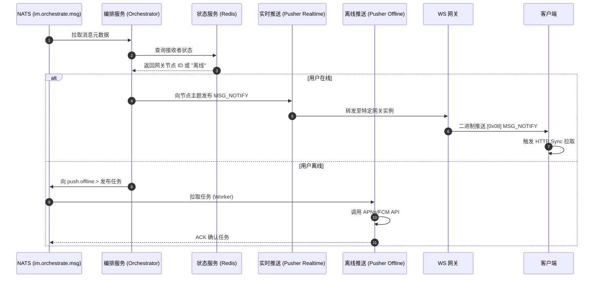

# 消息派发与推送

## 如何架构在线与离线的消息派发与推送

本指南介绍了如何根据接收者的实时在线状态，将消息路由至活跃的 WebSocket 连接或第三方推送供应商（APNs/FCM）。

本指南假设消息已经通过了**写入屏障 (Write Fence)**，并且安全持久化在 NATS JetStream 预写日志 (WAL) 的 `im.orchestrate.msg`主题中。

## 必需的核心组件

为了完成派发编排，以下无状态微服务与有状态的 JetStream Stream 需要相互配合：

import Tabs from '@theme/Tabs';
import TabItem from '@theme/TabItem';

<Tabs>
  <TabItem value="services" label="必需的微服务" default>
    1. 编排服务 (oceanchat-orchestrator)：投递管道的“大脑”。它根据在线状态决定投递路径。
    2. 状态服务 (oceanchat-presence)：基于 Redis。负责维护全局所有活跃会话及其对应的 `gateway_node_uuid`。
    3. 实时推送 (oceanchat-pusher-realtime)：负责将轻量级的 `MSG_NOTIFY` 信令路由至特定的网关实例。
    4. 离线推送 Worker (oceanchat-pusher-offline)：隔离的后台消费者，负责处理缓慢的 APNs 或 FCM 外部 HTTP 调用。
  </TabItem>
  <TabItem value="streams" label="必需的 JetStream">
    1.  IM_HANDOFF Stream:
        - Subject: `im.orchestrate.msg`
        - 用途: 提供等待派发处理的消息源。
    2.  IM_DOWNBOUND Stream:
        - Subject: `im.down.node.{gateway_node_uuid}`
        - 用途: 为在线用户将信令瞬态路由到特定的网关实例。
    3.  OFFLINE_PUSH Stream:
        - Subject: `push.offline.{vendor}.{user_id}`
        - 用途: 用于第三方推送任务的工作队列 (WorkQueue)。它使用 `max_msgs_per_subject: 1` 策略，通过将多条未读消息折叠为一个任务来防止通知风暴。
  </TabItem>
</Tabs>

## 1. 查询接收者在线状态

1.  `oceanchat-orchestrator` 从 `im.orchestrate.msg` 主题拉取消息元数据。
2.  通过 Redis 查询 `oceanchat-presence` 服务，定位接收者的所有活跃会话。

:::info 分支执行
接收者可能同时处于“在线”（例如在桌面客户端）和“离线”（例如手机 App 在后台运行）状态。在这种情况下，系统会**并发执行**在线与离线两条投递路径，以确保最大的触达率。
:::

## 2. 执行在线投递 (推拉结合)

如果发现在特定的 `gateway_node_uuid` 上有活跃会话，则触发实时通知路径：

1.  **信令派发**：编排服务向 `im.down.node.{gateway_node_uuid}` 主题发布一个轻量级的 `MSG_NOTIFY` 信号。
2.  **WebSocket 推送**：`oceanchat-pusher-realtime` 服务将信令路由到持有该连接的精准 `oceanchat-ws-gateway` 实例。网关向客户端推送仅包含 `SyncSeqId` 的二进制 `MSG_NOTIFY` 包。
3.  **HTTP Sync (拉取)**：客户端收到通知后，**不应**立即拉取，而是需实现一个 **200ms 的智能防抖 (Debounce) 窗口**。如果在此期间连续收到多个通知，客户端仅需提取其中最大的 `SyncSeqId`，向 `oceanchat-query` 服务发起一次 **HTTP Sync** 请求，以批量增量拉取实际的消息负载。

:::tip 为什么使用推拉结合？
通过只推送极小的唤醒信令并让客户端通过 HTTP 拉取重型负载，系统避免了 WebSocket 上的“队头阻塞 (Head-of-Line Blocking)”，并能充分利用标准的 HTTP 缓存与负载均衡机制。
:::

## 3. 执行离线投递 (第三方推送)

如果没有活跃会话（或者用户有离线的移动设备），则降级使用厂商特定的推送通知：

1.  **任务生成**：编排服务将推送任务发布到 `OFFLINE_PUSH` 流中的 `push.offline.{vendor}.{user_id}` 主题。
2.  **队列消费**：`oceanchat-pusher-offline` 工作单元拉取该任务。这一步与实时流量严格物理隔离，从而保护系统免受缓慢或被限流的外部网络 I/O 影响。
3.  **厂商调用**：工作单元调用 APNs 或 FCM HTTP/2 API。只有当厂商接受推送时，工作单元才会在 NATS 中回复 ACK 确认。

:::warning 消息折叠
为了防止对用户造成“通知风暴”式的骚扰，`OFFLINE_PUSH` 流依赖 `max_msgs_per_subject: 1` 约束。如果短时间内有大量消息发给离线用户，NATS 会将它们折叠为代表最新状态的唯一通知任务。
:::

## 端到端时序图

通过以上步骤，你将实现如下的投递时序：

