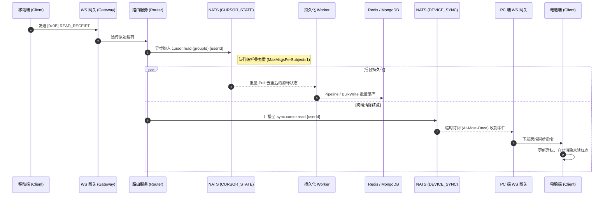

import Tabs from '@theme/Tabs';
import TabItem from '@theme/TabItem';

# 跨端已读回执同步与未读数计算

本指南将演示 Ocean Chat 如何将底层的各种微服务、流和协议指令组合起来，实现优雅的多端已读回执同步，以及背后的核心高性能未读数计算机制。

通过阅读本指南，你将了解当用户在任意单台设备上阅读消息后，系统如何以“零阻塞”的方式准确收集已读游标、在 `O(log(N))` 复杂度内极速算出精准的未读数，并在该用户登录的所有其他设备上实时消除未读通知红点。

## 必需的核心组件

为了完成跨端游标同步，以下无状态微服务与有状态的 JetStream Stream 需要相互配合：

<Tabs>
  <TabItem value="services" label="必需的微服务" default>
    1. 连接网关 (oceanchat-ws-gateway)：负责处理 WebSocket 长连接，接收 `[0x0B] READ_RECEIPT` 指令并将其静默下发至电脑端。
    2. 路由服务 (oceanchat-router)：接收网关透传的信令，将其路由发布至 `CURSOR_STATE` 流，并触发跨端 `DEVICE_SYNC` 同步。
    3. 状态服务 (oceanchat-presence)：基于 Redis。在用户拉取未读数时，通过执行 ZSET 的 `ZCOUNT` 命令提供计算支持。
    4. 持久化管道 (MessagePersistence Worker)：后台工作单元。负责批量拉取被折叠的游标，利用 Redis Pipeline 和 MongoDB BulkWrite 完成游标双写。
  </TabItem>
  <TabItem value="streams" label="必需的 JetStream">
    1.  CURSOR_STATE Stream:
        - Subject: `cursor.read.\{groupId}.\{userId}`
        - 用途: 极速异步写缓冲。配置 `max_msgs_per_subject: 1`，将单用户的海量高频游标更新折叠为一条记录，防范数据库写风暴。
    2.  DEVICE_SYNC Stream:
        - Subject: `sync.cursor.read.\{userId\}`
        - 用途: 用于将游标漫游事件广播到连接网关，实现红点的瞬时多端消除。
  </TabItem>
</Tabs>

---

## 1. 客户端发送已读回执

当用户在移动设备上打开聊天窗口并实际浏览了新消息时，客户端必须发送一个已读回执，指明其当前看过的最新消息的 Sequence ID (`lastReadSeqId`)。

:::info 客户端智能防抖 (Debounce) 去重
为了避免用户在快速滑动历史消息时引发上行的“回执发送风暴”，客户端**不应**在每次渲染新消息时都立即发送回执。
客户端需要实现一个 **200ms 的智能防抖窗口**：如果在连续的 200ms 内触发了多个回执更新请求，客户端仅需在窗口结束时，提取并发送这些请求中 `lastReadSeqId` 最大的那一个。这一机制在端侧构筑了第一道极为有效的流量防线。
:::

请使用 Monkey Protocol 中定义的 `[0x0B] READ_RECEIPT` 二进制指令：

```json title="已读回执载荷 (Read Receipt Payload)"
{
  "groupId": "G1001",
  "userId": "U8899",
  "lastReadSeqId": 1050
}
```

:::tip 网关零 I/O 阻塞
该信令到达 oceanchat-ws-gateway 后，网关仅作解包透传，立即交由后端的 oceanchat-router 路由处理。在此链路上，服务绝不会立即进行任何同步的 Redis 或 MongoDB 写操作。
:::

## 2. 路由派发与异步状态折叠

oceanchat-router 路由服务接收到该回执后，将其作为状态变更事件直接发布到 NATS 的 `CURSOR_STATE` 流中，路由主题精确匹配为：cursor.read.\{groupId\}.\{userId\}。

:::info 防风暴机制 (Queue Collapse)
CURSOR_STATE 流通过配置 max_msgs_per_subject: 1 实现了极致的写缓冲。假设用户在万人大群中快速滑动历史记录，1 秒内触发了 50 次游标更新。当这些更新进入同一个 Subject 时，NATS 会自动丢弃旧值。该主题的队列中永远只保留绝对最新的游标状态供 Worker 拉取，从源头上掐断了读风暴导致的写风暴。
:::

## 3. 批量落盘与缓存更新

此阶段，MessagePersistence Worker 持久化工作单元在后台执行降维打击式的存储更新：

1. 批量拉取：工作单元通过 Pull 模式从 CURSOR_STATE 流每次拉取多达 1000 条去重后的最新游标状态。
2. 批量更新缓存：利用 Redis Pipeline，一次性将这 1000 个用户的 lastReadSeqId 并发写入 Redis 游标缓存中。
3. 数据库兜底持久化：随后，构建批量操作指令对 MongoDB 执行 bulkWrite，将游标状态最终安全持久化到磁盘中。

## 4. 高阶揭秘：基于 Redis ZSET 的滑动窗口（读扩散）未读数计算

**为什么我要大费周章地收集并持久化用户的 lastReadSeqId？**

这是为了配合大群聊的“未读红点计算”。传统的“写扩散”（每发一条消息给一万个群成员的未读计数器 +1）会导致灾难性的写风暴。Ocean Chat 创新性地采用了**基于 Redis ZSET（有序集合）的“读扩散”滑动窗口模型：**

1. **公共消息时间线 (ZADD)**

   当群内有新消息产生时，服务端只对该群的公共 Redis ZSET（例如 Key: group:msg:G1001）执行 1 次写操作。将消息的 SyncSeqId 作为 Score，消息 ID 作为 Member 插入其中。

2. **空间恒定的滑动窗口 (ZREMRANGEBYRANK)**

   为了防止内存无限膨胀，每次插入新消息后，服务端顺手执行截断操作，永远只保留该群最近的 500 条消息。这在内存中形成了一个固定大小的滑动窗口，空间复杂度为绝对的 O(1)。

3. **极速红点计算 (ZCOUNT)**

   当需要给用户 U8899 下发未读数时，oceanchat-presence 状态服务会提取其落库的最新的游标（lastReadSeqId: 1050），向 Redis 发送指令：`ZCOUNT group:msg:G1001 (1050 +inf`。依托跳表 (Skip List)，Redis 会在 O(log(N)) 复杂度内瞬间算出未读数量。

## 5. 跨设备同步与红点实时消除

与此同时（或落库完成后），如果用户在手机端阅读了消息，他在电脑端（或其他活跃端）界面的红点也必须自动消失：

1. 触发漫游广播：oceanchat-router 会向 DEVICE_SYNC 流的 sync.cursor.read.\{userId\} 主题广播一条同步游标事件。
2. 网关拉取分发：目标用户当前保持连接的所有 oceanchat-ws-gateway 网关实例，均以临时、至多一次 (At-Most-Once) 的订阅模式监听此主题。收到事件后，网关组装跨端清除指令并向客户端静默下发。
3. 多端状态自愈：另一台电脑端客户端拦截到下行的同步事件后，静默更新本地数据库中对应群组的 MaxLocalSyncSeqId 游标，从而瞬间消除 UI 界面上的未读小红点，无需任何人工点击干预。

## 预期结果

通过以上步骤，即可成功构建一条高扩展性的多设备游标同步管道。

### 端到端时序图

下图展示了用户在移动设备端发送已读回执后，系统是如何在后台并行处理“异步持久化落库”与“漫游同步电脑端红点消除”的完整时序：


