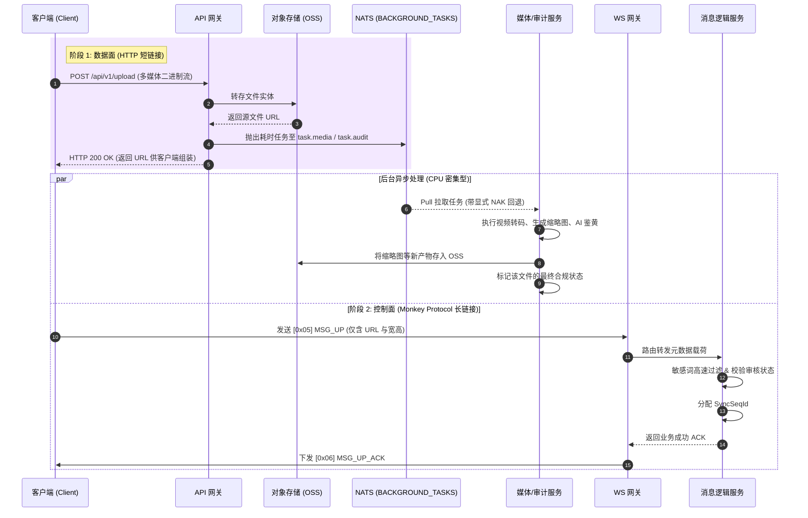

import Tabs from '@theme/Tabs';
import TabItem from '@theme/TabItem';

# 多媒体与合规审核处理

本指南将演示 Ocean Chat 如何在海量并发的聊天场景下，优雅且高性能地处理用户发送的图片、语音、视频等多媒体文件，并对内容进行严格的敏感词过滤与鉴黄合规审核。

通过阅读本指南，你将了解系统如何利用**“长短链协同”**架构彻底避免网关队头阻塞，并借助 NATS JetStream 的 `BACKGROUND_TASKS` 工作队列，将 CPU 密集型操作（如视频转码、缩略图提取、NSFW 审核）与核心的实时消息链路实现完美的物理隔离。

## 必需的核心组件

为了完成多媒体处理与合规审核，以下无状态微服务与 JetStream 流需要相互配合：

<Tabs>
  <TabItem value="services" label="必需的微服务" default>
    1. API 网关 (oceanchat-api-gateway)：接收客户端的 HTTP 大文件上传请求，对接外部对象存储（OSS），并触发后台异步处理任务。
    2. 连接网关 (oceanchat-ws-gateway)：负责处理 WebSocket 长连接，接收极其轻量的 `[0x05] MSG_UP` 业务信令（仅含多媒体元数据）。
    3. 消息逻辑服务 (oceanchat-message)：负责对纯文本内容进行极速的同步敏感词过滤，并根据异步鉴黄结果决定消息状态。
    4. 媒体/审计服务 (Media & Audit Workers)：专注于 CPU 密集型的后台工作单元，负责音视频转码、生成缩略图以及调用外部 AI 模型进行 NSFW（鉴黄/暴恐）识别。
  </TabItem>
  <TabItem value="streams" label="必需的 JetStream">
    1.  BACKGROUND_TASKS Stream:
        - Subject: `task.*` (如 `task.media.transcode`, `task.audit.nsfw`)
        - 用途: 专为 CPU 密集型任务设计的工作队列 (WorkQueue)。保护主业务流不被重型计算拖垮。
    2.  IM_HANDOFF Stream:
        - Subject: `im.orchestrate.msg`
        - 用途: 最终合规且处理完毕的合法消息，将投递至此流越过写屏障。
  </TabItem>
</Tabs>

---

## 1. 短连接上传数据面实体

Monkey Protocol 严格禁止通过 WebSocket 长连接直接传输大体积文件的二进制流，因为这会导致极为严重的队头阻塞（Head-of-Line Blocking）与网关 OOM。

客户端必须首先通过 HTTP/HTTPS 短连接，将图片或音视频实体上传至 `oceanchat-api-gateway`（或直接使用预签名 URL 上传至 OSS/S3）。

## 2. 触发并发布后台重型任务

当文件在对象存储（OSS）中落盘成功后，`oceanchat-api-gateway`（或业务微服务）会立即生成该文件的原始 URL，并将其组装成处理任务，异步发布到 NATS JetStream 的 `BACKGROUND_TASKS` 流中。

```javascript title="发布多媒体处理与审计任务"
// 发布转码与缩略图任务
nats.publish("task.media.process", { fileUrl: "...", type: "VIDEO" });

// 并行发布安全合规审计任务
nats.publish("task.audit.nsfw", { fileUrl: "...", type: "IMAGE" });
```

## 3. 工作单元 Pull 拉取与显式 NAK 容错

后台的 媒体服务 与 审计服务 作为消费者组，通过 Pull 模式从 task.\* 主题中拉取任务。由于多媒体处理高度依赖 CPU 且耗时较长（通常需要几秒到几分钟），这种设计带来了极大的弹性：

- 削峰填谷：无论前端上传多少个视频，后台 Worker 都只会根据自身 CPU 能力“量力而行”地拉取任务，绝不会被压垮。
- 显式 NAK 回退：如果视频转码过程中 ffmpeg 崩溃，或者调用第三方 AI 鉴黄接口超时，工作单元会向 NATS 发送否定确认 (NAK)。这会让该任务立即被重新投入队列，转交给另一个健康的实例进行重试，而不是死等超时。

## 4. 长连接投递控制面信令

文件上传成功后，客户端获得文件的 URL。此时，客户端将该 URL 及元数据（如宽、高、时长）封装在极轻量的 Protobuf 载荷中，通过 Monkey Protocol 长连接发出。

```json
{
  "ClientMsgId": "123e4567-e89b-...",
  "MsgType": "VIDEO",
  "Payload": {
    "URL": "https://oss.example.com/videos/v1.mp4",
    "ThumbnailURL": "https://oss.example.com/thumbs/v1.jpg",
    "Duration": 15,
    "Width": 1080,
    "Height": 1920
  }
}
```

## 5. 敏感词拦截与异步合规决断

当透传着多媒体元数据的 [0x05] MSG_UP 信令到达后端的 oceanchat-message 消息逻辑服务时，系统将进行最终的合规审查：

- 纯文本同步过滤：对于伴随发送的文字说明，使用基于 Trie 树或 DFA 算法的高速敏感词过滤器进行同步拦截。如果包含违禁词，可直接返回发送失败或进行掩码（\*\*\*）替换。
- 异步鉴黄状态校验：对于图片/视频 URL，消息服务可极速查询该文件在 Redis 或数据库中的“合规状态”（由前文的审计服务异步写入）。
  - 如果文件已被判定为违规 (NSFW)，拦截该消息，不予越过写屏障。
  - 如果仍在“审核中”，消息可以先放行（先发后审），一旦后续审计服务判定违规，再通过系统信令向全网广播“撤回/屏蔽”指令。

## 预期结果

通过这套长短链协同与后台异步处理机制，Ocean Chat 将笨重的媒体数据传输和耗时的 CPU 运算彻底剥离出了核心的 IM_CORE 实时链路，保障了聊天信令的绝对高吞吐与低延迟。

## 端到端时序图


