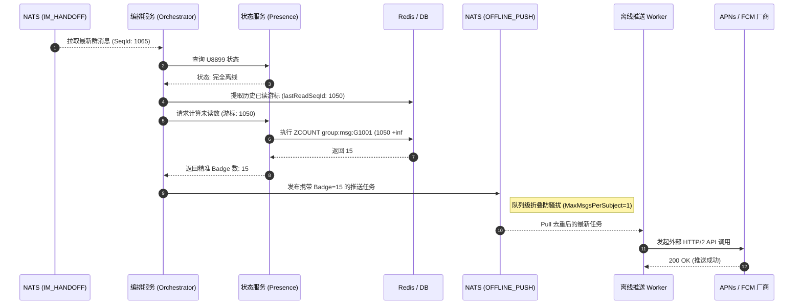

import Tabs from '@theme/Tabs';
import TabItem from '@theme/TabItem';

# 离线推送未读角标精准计算

本指南将演示 Ocean Chat 如何在极高并发的万人大群场景下，为离线设备计算精准的未读红点数（Badge）并进行静默唤醒推送。

通过阅读本指南，你将了解当用户的 App 处于完全离线或后台挂起状态时，系统如何提取其历史已读游标、在 `O(log(N))` 复杂度内极速算出全局未读消息总数，并将带有准确 Badge 数值的载荷投递给第三方推送厂商（苹果 APNs / 谷歌 FCM）。

## 必需的核心组件

为了完成精准未读数的计算与离线派发，以下无状态微服务与有状态的 JetStream Stream 需要相互配合：

<Tabs>
  <TabItem value="services" label="必需的微服务" default>
    1. 编排服务 (oceanchat-orchestrator)：负责判定用户离线、提取用户已读游标，并调用内部接口计算未读数，最终生成推送任务。
    2. 状态服务 (oceanchat-presence)：基于 Redis。对外暴露极速的 `ZCOUNT` 查询能力，为未读数计算提供数据结构支撑。
    3. 离线推送 Worker (oceanchat-pusher-offline)：后台工作单元。负责消费离线推送队列，将包含具体 `badge` 值的 HTTP/2 载荷发往苹果或谷歌服务器。
  </TabItem>
  <TabItem value="streams" label="必需的 JetStream">
    1.  IM_HANDOFF Stream:
        - Subject: `im.orchestrate.msg`
        - 用途: 提供触发离线推送决策的最新消息源。
    2.  OFFLINE_PUSH Stream:
        - Subject: `push.offline.{vendor}.{userId}`
        - 用途: 用于第三方推送任务的削峰队列。配置 `max_msgs_per_subject: 1` 策略，实现通知防风暴折叠。
  </TabItem>
</Tabs>

---

## 1. 消息触发与离线判定

当群聊中产生新消息并成功跨越写入屏障（写入 `im.orchestrate.msg` 主题）后，`oceanchat-orchestrator` 会拉取到该消息。

编排服务会向 Redis 查询目标接收者的在线状态。如果发现用户 `U8899` 当前没有任何活跃的 WebSocket/TCP 连接，系统将判定该用户为“离线”状态，并进入离线推送处理分支。

## 2. 提取全局已读游标

为了计算未读数，系统首先需要知道用户上次看到哪里了。

得益于我们在《跨端已读回执同步》中设计的 `CURSOR_STATE` 异步持久化流，用户的最新已读游标已安全沉淀。编排服务会从 MongoDB / Redis 缓存中极速提取出该用户在目标群组（如 `G1001`）的最新已读序列号：`lastReadSeqId`。

## 3. 核心：利用 ZCOUNT 极速计算群未读数

对于一个 10,000 人的大群，我们**绝对不能**去 MongoDB 执行诸如 `SELECT COUNT(*) WHERE SeqId > lastReadSeqId` 这样的全表扫描，这会在流量洪峰时引发致命的数据库穿透。

取而代之的是，编排服务会将提取到的游标交由 `oceanchat-presence` 服务，利用 Redis ZSET（有序集合）的滑动窗口来进行极速降维计算：

```redis title="执行 ZCOUNT 查询"
ZCOUNT group:msg:G1001 (1050 +inf
```

- **`1050`**: 是用户 `U8899` 的最后已读游标。
- **`+inf`**: 代表正无穷大（即最新消息）。

Redis 底层的跳表（Skip List）能在微秒（`μs`）级别的 `O(log(N))` 时间内，瞬间返回在这段区间内新增的消息条数（例如返回结果为 `15`）。

:::info O(1) 空间复杂度与兜底截断
正如前文所述，该 ZSET 永远只保留群内最近的 500 条消息（通过 `ZREMRANGEBYRANK` 截断）。如果用户的游标实在太老，超出了 ZSET 的保存区间，`ZCOUNT` 会返回 500，系统会直接将其作为 `500+` 的红点标志处理，使得内存和计算成本永远恒定。
:::

## 4. 组装推送载荷与折叠防风暴

得到精确的未读数后，编排服务会将这个数字组装进针对 APNs/FCM 格式优化的推送载荷中。

```json title="APNs 推送载荷示例"
{
  "aps": {
    "alert": {
      "title": "Ocean Group",
      "body": "有人@了你..."
    },
    "badge": 15,
    "sound": "default",
    "content-available": 1
  },
  "apns-collapse-id": "group-G1001"
}
```

随后，编排服务将该任务发布至 `OFFLINE_PUSH` 流的主题 `push.offline.apns.U8899`。得益于 `max_msgs_per_subject: 1` 策略，哪怕 1 秒内该群有 100 条消息触发了推送，NATS 也会自动丢弃旧任务，仅保留带有最新未读数（如 `badge: 15`）的那一条通知任务，极大节省了外部接口调用成本。

## 5. 厂商投递与端侧呈现

最后，后台的离线推送工作单元 `oceanchat-pusher-offline` 拉取到这条被折叠的最终任务，并通过 HTTP/2 将其发送给苹果或谷歌服务器。

用户的手机操作系统在底层接收到该指令后，会静默地将 App 图标右上角的红色数字更新为 `15`，整个计算与下发闭环完成。

## 端到端时序图

下图展示了用户离线状态下，系统计算精准 Badge 未读数并进行推送防风暴下发的完整时序：


