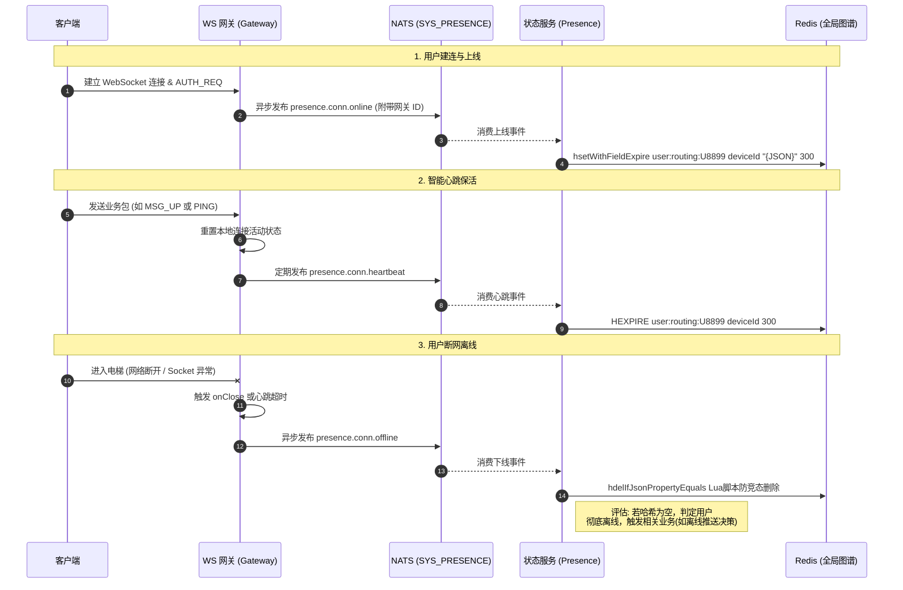

import Tabs from '@theme/Tabs';
import TabItem from '@theme/TabItem';

# 用户上下线管理与在线状态图谱

本指南将演示 Ocean Chat 如何在海量并发场景下，实时精准地感知用户的上线（建连）与下线（断网），并构建出支撑消息精确路由的“全局在线状态图谱”。

通过阅读本指南，你将了解系统如何通过极轻量级的事件驱动模型，解耦有状态的网关与无状态的业务逻辑，从而在十万乃至百万级并发下，优雅处理用户的网络状态变更与多设备漫游。

`oceanchat-presence` 是一个纯 NATS 微服务，专注于处理用户的在线状态更新、离线清理以及路由信息的维护。它通过监听 NATS JetStream 中的 `SYS_PRESENCE` 流（消费者为持久化的 `presence-state-updater`）来保证状态事件的不丢失。状态数据的唯一事实来源（Source of Truth）存储在 Redis 中，使用 Hash 结构维护用户多端设备的长连接节点（Gateway）路由映射。

## 必需的核心组件

为了完成状态图谱的实时更新，以下网关、微服务与流通道需要相互配合：

<Tabs>
  <TabItem value="services" label="必需的微服务" default>
    1. 连接网关 (oceanchat-ws-gateway)：唯一“有状态”的边缘节点。它持有真实的 TCP/WS 句柄，并在连接建立、异常断开或超时时，发出瞬态的上下线事件。
    2. 状态服务 (oceanchat-presence)：无状态业务逻辑单元。负责拉取上下线事件，并将其转化为 Redis 中的全局图谱数据。
  </TabItem>
  <TabItem value="streams" label="必需的 JetStream">
    1.  SYS_PRESENCE Stream:
        - Subjects: `presence.conn.online`, `presence.conn.offline`, `presence.conn.heartbeat`
        - 用途: 缓冲极高并发的用户连接状态变更事件，保护 Redis 免受连接风暴（如服务器重启时的大规模断线/重连）的冲击。
  </TabItem>
  <TabItem value="storage" label="存储支撑">
    1.  Redis 缓存:
        - 用途: 存储全局维度的“在线状态图谱”。采用 Hash 结构存储，键为 `user:routing:{userId}`，字段为 `deviceId`，值为序列化的设备与网关路由信息 JSON。
  </TabItem>
</Tabs>

---

## 1. 建立连接与上线事件 (Online)

当用户打开 App 或在断网后重连时，客户端会与 `oceanchat-ws-gateway` 进行底层的 TCP 握手与 WebSocket 升级，并完成基于 `[0x01] AUTH_REQ` 的鉴权。

1. **本地状态登记**：一旦鉴权通过，连接网关会在其内存中将该物理连接与 `userId`、`deviceId`、`gatewayId` 等设备元数据绑定。
2. **异步抛出事件**：网关**不会**去直接操作 Redis，而是组装一条极其轻量的上线事件载荷，异步发布到 NATS 的 `SYS_PRESENCE` 流中（主题为 `presence.conn.online`）。

:::tip 极致解耦
网关只负责抛出事件，随即立刻返回继续处理网络 I/O。这种“发后即忘 (Fire-and-Forget)”的设计确保了即使在遭遇百万用户同时重连的“惊群效应”时，网关也不会因为等待 Redis 写入而导致线程阻塞。
:::

**状态更新逻辑**：`oceanchat-presence` 接收到上线事件后，构建 Redis 路由键 `user:routing:{userId}`。将 `deviceId` 作为 Hash Field，写入序列化的 `DevicePresence` JSON 数据（包含 `deviceId`, `deviceType`, `gatewayId`, `status: 'online'`, `connectTime`）。

**TTL 策略**：利用 Redis 7.4+ 的新特性 `hsetWithFieldExpire`，为该单一设备的 Field 设置 `300` 秒（5 分钟）的过期时间，实现精准的单设备自动过期清理。

## 2. 智能保活机制与心跳 (Heartbeat)

为了维持连接的存活，Ocean Chat 摒弃了僵化的定时心跳策略。

网关在本地为每条连接维护了一个 TTL（如 5 分钟）的倒计时器。

1. **业务包即心跳**：只要客户端发来了**任何**合法的上行数据包（无论是单纯的 `[0x03] PING` 还是聊天信令 `[0x05] MSG_UP`），网关都会立刻重置该连接的活动状态。
2. **主动推送心跳**：网关每隔 3 分钟主动向 NATS 推送活跃设备的心跳 (`presence.conn.heartbeat`)。这种设计大幅减少了移动端在后台时发送无意义空包的频率。
3. **独立设备续期**：Presence 服务接收到心跳事件后，直接调用 Redis 的 `HEXPIRE` 指令，为 `user:routing:{userId}` 下对应的 `deviceId` 字段续期 300 秒（5分钟）的 TTL。（黄金比例策略：心跳间隔 180s，TTL 300s，容忍一次心跳丢失，同时避免僵尸连接长期存留）。

## 3. 断开连接与下线感知 (Offline)

用户下线通常分为两种情况，网关都能做到精准感知：

- **优雅/硬性断开 (TCP FIN/RST)**：用户主动杀掉 App 进程、切断 Wi-Fi 或进入电梯导致底层的 Socket 被操作系统或网络中间件切断。网关底层瞬间触发 `onClose` 事件。
- **心跳超时 (Timeout)**：客户端进入深度休眠无法发送心跳，导致网关本地的 TTL 倒计时归零。网关将主动切断僵尸连接。

一旦感知到断开，网关会立刻向 `SYS_PRESENCE` 流发布一条 `presence.conn.offline` 事件。

**防竞态条件 (Race Condition Prevention)**：为防止旧网关节点因网络延迟发出的 `offline` 事件误删用户在新网关刚建立的在线状态，服务内部使用 Lua 脚本 (`hdelIfJsonPropertyEquals`) 实现“比较并删除 (Compare-And-Delete)”。仅当 Redis 中存储的 `gatewayId` 与当前离线事件中的 `gatewayId` 严格一致时，才会真正删除该设备的路由记录。

## 4. Redis 存储结构

| 属性             | 说明                                                                                            |
| ---------------- | ----------------------------------------------------------------------------------------------- |
| **Key**          | `user:routing:{userId}`                                                                         |
| **Type**         | Hash                                                                                            |
| **Field**        | `{deviceId}`                                                                                    |
| **Value (JSON)** | `{"deviceId":"...","deviceType":"...","gatewayId":"...","status":"online","connectTime":"..."}` |
| **Field TTL**    | `300s` (Redis 7.4+ 字段级过期)                                                                  |

## 5. 微服务健康检查

- **RPC 主题**: `presence.ping`
- **响应机制**: Presence 服务基于 NestJS 微服务模式拦截 `@MessagePattern('presence.ping')`，并返回固定字符串 `'PONG'`。可用于编排系统（如 K8s）快速验证 NATS 连通性及微服务存活状态。

## 端到端时序图

下图展示了用户从建立连接、维持心跳到最终断网离线，系统实时更新全局在线状态图谱的完整生命周期：

