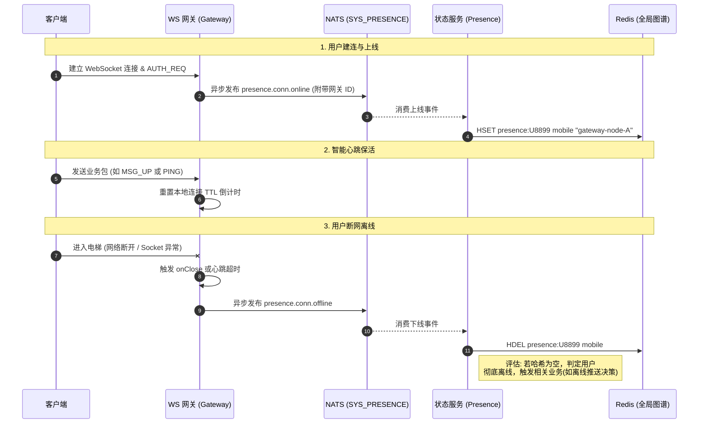

import Tabs from '@theme/Tabs';
import TabItem from '@theme/TabItem';

# 用户上下线管理与在线状态图谱

本指南将演示 Ocean Chat 如何在海量并发场景下，实时精准地感知用户的上线（建连）与下线（断网），并构建出支撑消息精确路由的“全局在线状态图谱”。

通过阅读本指南，你将了解系统如何通过极轻量级的事件驱动模型，解耦有状态的网关与无状态的业务逻辑，从而在十万乃至百万级并发下，优雅处理用户的网络状态变更与多设备漫游。

## 必需的核心组件

为了完成状态图谱的实时更新，以下网关、微服务与流通道需要相互配合：

<Tabs>
  <TabItem value="services" label="必需的微服务" default>
    1. 连接网关 (oceanchat-ws-gateway)：唯一“有状态”的边缘节点。它持有真实的 TCP/WS 句柄，并在连接建立、异常断开或超时时，发出瞬态的上下线事件。
    2. 状态服务 (oceanchat-presence)：无状态业务逻辑单元。负责拉取上下线事件，并将其转化为 Redis 中的全局图谱数据。
  </TabItem>
  <TabItem value="streams" label="必需的 JetStream">
    1.  SYS_PRESENCE Stream:
        - Subjects: `presence.conn.online`, `presence.conn.offline`
        - 用途: 缓冲极高并发的用户连接状态变更事件，保护 Redis 免受连接风暴（如服务器重启时的大规模断线/重连）的冲击。
  </TabItem>
  <TabItem value="storage" label="存储支撑">
    1.  Redis 缓存:
        - 用途: 存储全局维度的“在线状态图谱”。通常采用 Hash 结构存储，键为 `presence:{userId}`，字段为 `deviceId/deviceType`，值为对应的 `gatewayNodeId` 与时间戳。
  </TabItem>
</Tabs>

---

## 1. 建立连接与上线事件 (Online)

当用户打开 App 或在断网后重连时，客户端会与 `oceanchat-ws-gateway` 进行底层的 TCP 握手与 WebSocket 升级，并完成基于 `[0x01] AUTH_REQ` 的鉴权。

1. **本地状态登记**：一旦鉴权通过，连接网关会在其内存中将该物理连接与 `userId`、`deviceId` 绑定。
2. **异步抛出事件**：网关**不会**去直接操作 Redis，而是组装一条极其轻量的上线事件载荷，异步发布到 NATS 的 `SYS_PRESENCE` 流中（主题为 `presence.conn.online`）。

:::tip 极致解耦
网关只负责抛出事件，随即立刻返回继续处理网络 I/O。这种“发后即忘 (Fire-and-Forget)”的设计确保了即使在遭遇百万用户同时重连的“惊群效应”时，网关也不会因为等待 Redis 写入而导致线程阻塞。
:::

## 2. 智能保活机制 (Any Message is Pong)

为了维持连接的存活，Ocean Chat 摒弃了僵化的定时心跳策略。

网关在本地为每条连接维护了一个 TTL（如 5 分钟）的倒计时器。

1. **业务包即心跳**：只要客户端发来了**任何**合法的上行数据包（无论是单纯的 `[0x03] PING` 还是聊天信令 `[0x05] MSG_UP`），网关都会立刻重置该连接的 TTL 倒计时。
2. 这种设计大幅减少了移动端在后台时发送无意义空包的频率，极限节省用户的电量和网络带宽。

## 3. 断开连接与下线感知 (Offline)

用户下线通常分为两种情况，网关都能做到精准感知：

- **优雅/硬性断开 (TCP FIN/RST)**：用户主动杀掉 App 进程、切断 Wi-Fi 或进入电梯导致底层的 Socket 被操作系统或网络中间件切断。网关底层瞬间触发 `onClose` 事件。
- **心跳超时 (Timeout)**：客户端进入深度休眠无法发送心跳，导致网关本地的 TTL 倒计时归零。网关将主动切断僵尸连接。

一旦感知到断开，网关会立刻向 `SYS_PRESENCE` 流发布一条 `presence.conn.offline` 事件。

## 4. 全局在线状态图谱更新

后端的 `oceanchat-presence` 状态服务作为一个消费者组，持续从 `SYS_PRESENCE` 流中拉取（Pull）这些交织的上下线事件，并在 Redis 中绘制出全局状态图谱。

### 支持多端同时在线的 Hash 结构

由于现代 IM 支持多设备登录（例如手机和电脑同时在线），状态服务会在 Redis 中使用 Hash 结构 (`HSET` / `HDEL`) 来精确维护每个设备的路由节点。

```redis title="Redis 状态图谱结构示例"
// Key: presence:{userId}
HSET presence:U8899 mobile "gateway-node-A"
HSET presence:U8899 desktop "gateway-node-B"
```

**处理逻辑**：

- 收到 `online` 事件：执行 `HSET`，记录该设备当前连接的具体的网关节点 ID。这让 `oceanchat-orchestrator` 在下发在线消息时知道应该往哪台网关推送。
- 收到 `offline` 事件：执行 `HDEL`，从 Hash 中剔除该设备。如果删除后发现整个 Hash 变空了，说明该用户的所有设备均已断开，此时该用户彻底变为“离线”状态。

## 端到端时序图

下图展示了用户从建立连接、维持心跳到最终断网离线，系统实时更新全局在线状态图谱的完整生命周期：


