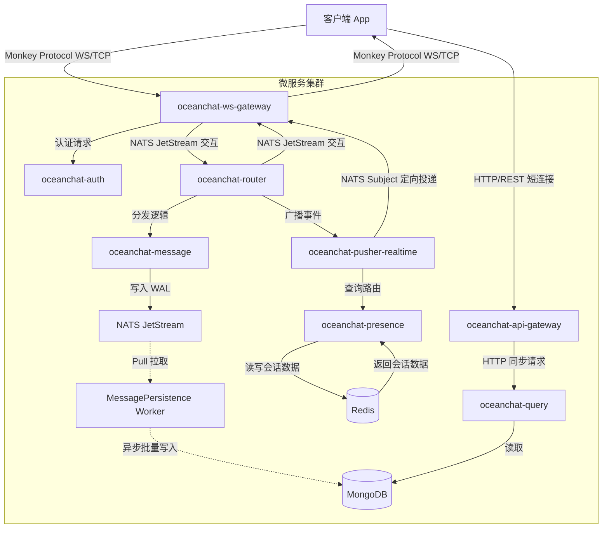
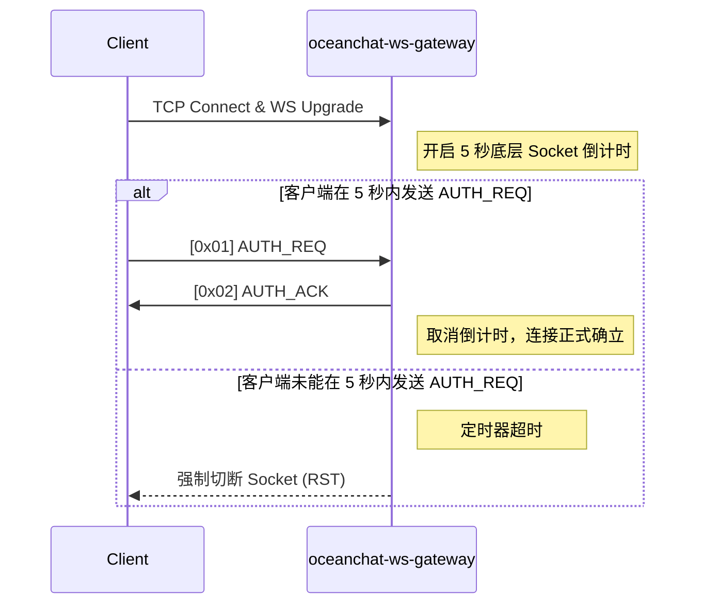
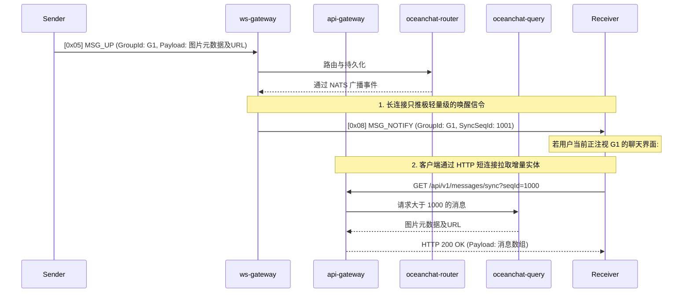
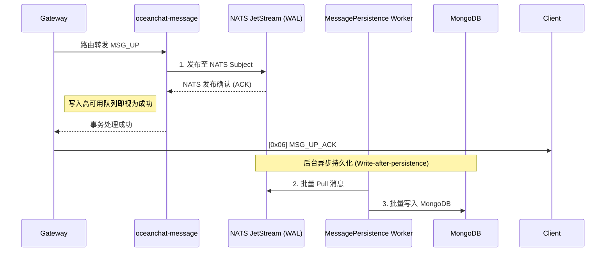
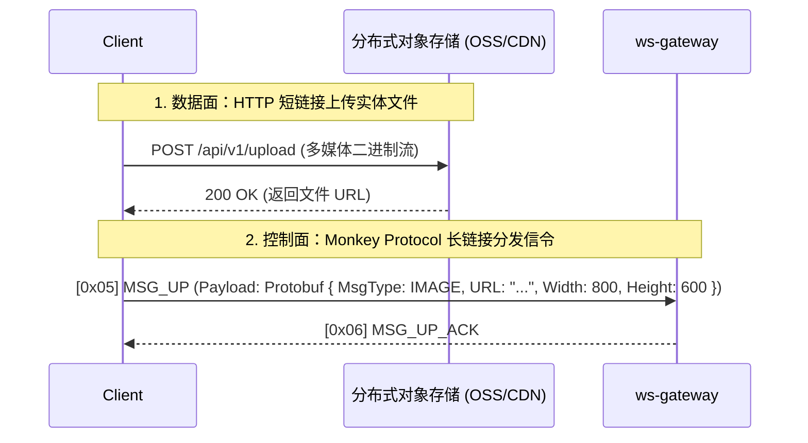

<head>
  <meta name="twitter:card" content="summary_large_image" />
  <meta property="og:title" content="Monkey Protocol 协议规范 | Ocean Chat" />
  <meta property="og:description" content="Ocean Chat Monkey Protocol 综合参考规范。涵盖十万级并发 WebSocket 消息传递、推拉结合模型、微服务架构数据流及高可靠性保障机制。" />
  <link rel="canonical" href="https://jameswilson19970101.github.io/ocean.chat.docs/zh-CN/docs/devdocs/monkey-protocol-spec" />
</head>

# Monkey Protocol 协议规范

**Monkey Protocol** 是 Ocean Chat 自研的高性能二进制应用层协议，运行于 WebSocket 或纯 TCP 之上。该协议专为支持 **1000万+ 并发连接**的分布式微服务架构而设计。

本参考文档详细规定了精确到位级别的帧结构、指令集以及网关和客户端实现中必须遵循的严格状态机操作。

:::info TODO: 多协议网关与底层传输优化
虽然目前为了极致的跨平台兼容性（特别是 Web 端和小程序）使用了 WebSocket (WS)，但对于原生移动端 App (iOS/Android) 而言，**纯 TCP 才是实现极致省电和连接稳定性的首选方案**。

未来规划中，网关需升级为暴露双端口（如 `TCP: 8080` 和 `WS: 8081`）的“多协议网关”。无论外层是 HTTP Upgrade 后的 WS 帧还是纯 TCP 字节流，网关在剥离传输层封包后，向后端微服务透传的都将是完全一致的 12 字节 Monkey Protocol 二进制核心载荷。
:::

## 1. 架构总览与微服务数据流

Ocean Chat 的架构严格将网络 I/O 与业务逻辑隔离。本协议依赖以下核心微服务运作：

- **`oceanchat-ws-gateway`**: 绝对无状态。仅负责长连接生命周期、极简协议编解码、下行信令微批处理（Micro-batching）以及令牌桶限流。
- **`oceanchat-api-gateway`**: 无状态 HTTP 网关。负责承接客户端 HTTP 请求（如增量数据拉取），提供限流与初步鉴权。
- **`oceanchat-auth`**: 在初次建立连接握手时，负责校验 JWT。
- **`oceanchat-presence`**: 管理 Redis 中的全局在线状态 (`UserId -> DeviceType -> Gateway IP`)。
- **`oceanchat-router`**: 核心路由编排器，负责与 NATS JetStream 交互。
- **`oceanchat-message`**: 负责生成全局唯一的 Sequence ID，并将消息可靠地写入 NATS JetStream（预写日志），实现高吞吐异步落库。
- **`oceanchat-query`**: 负责处理离线唤醒或新消息到达、消息空洞情况下的增量消息同步 (基于 HTTP 短连接)。
- **`oceanchat-orchestrator`**: 推送决策大脑，负责查询在线状态，并将消息拆分为在线唤醒通知 (`MSG_NOTIFY`) 或离线推送任务。
- **`oceanchat-pusher-realtime`**: 负责在线信令的具体投递，将 `MSG_NOTIFY` 派发至指定的网关节点。

### 端到端数据流

## 2. 帧结构 (Frame Structure)

每一个 Monkey Protocol 数据包均由严格定长的 **12 字节 Header** 及变长 **Payload** 组成。

### 2.1 Header 布局

| 偏移量 | 字段      | 大小     | 类型      | 说明                                                                                                                                                 |
| :----- | :-------- | :------- | :-------- | :--------------------------------------------------------------------------------------------------------------------------------------------------- |
| 0      | `Magic`   | 2 Bytes  | `UInt16`  | 魔数 `0x4D4B` ("MK")，用于标识协议。                                                                                                                 |
| 2      | `Version` | 1 Byte   | `UInt8`   | 协议版本号，用于前向兼容（当前：`0x01`）。                                                                                                           |
| 3      | `Cmd`     | 1 Byte   | `UInt8`   | 指令类型标识符（参见指令注册表）。                                                                                                                   |
| 4      | `Flags`   | 1 Byte   | `Bitmask` | 8 位标志位，用于控制协议特性（如压缩、ACK）。                                                                                                        |
| 5      | `ReqId`   | 3 Bytes  | `UInt24`  | Request ID，用于在当前连接中匹配请求与响应。达到上限后循环使用。从1开始，0已被占用。出于性能和网络带宽成本考虑，这里需要使用reqid而不是clientMsgId。 |
| 8      | `Length`  | 4 Bytes  | `UInt32`  | 变长 Payload 的字节长度（硬限制最大 16KB）。                                                                                                         |
| 12     | `Payload` | Variable | `Binary`  | **Protobuf** 编码的业务载荷。                                                                                                                        |

:::warning 生产环境严禁使用 JSON
为支撑十万级并发，严禁在 Payload 中进行 JSON 序列化。必须强制使用 **Protobuf**。这能节省 40% 以上的带宽，并极大降低网关的 CPU 解析开销。
:::

### 2.2 标志位 (`Flags`)

为了最大限度减少 Payload 的冗余，布尔状态均被编码进 `Flags` 字节中：

- **Bit 0 (`0x01`) - `REQUIRE_ACK`**: 如果置为 1，接收方必须显式发送确认包（ACK）。
- **Bit 1 (`0x02`) - `COMPRESSED`**: 如果置为 1，表明 Payload 已使用 Zstd 或 Gzip 压缩。
- **Bit 2 (`0x04`) - `ENCRYPTED`**: 如果置为 1，表明 Payload 已进行对称加密（如 AES-GCM）。
- **Bit 3 (`0x08`) - `NO_RETRY`**: 如果置为 1，表明该信令具有极强的时效性（如“对方正在输入...”）。在发生断网重连、底层的飞行中队列 (In-Flight Queue) 自动重放时，客户端 SDK 将直接丢弃带有此标志的数据包，以节省网络恢复瞬间的带宽。

### 2.3 ReqId 匹配机制与服务端主动推送 (Server Push)

在正常的 RPC（远程过程调用）交互流中，`ReqId` 用于实现严格的“请求-响应”匹配（如客户端发送 `MSG_UP` 携带 `ReqId: 123`，服务端回传的 `MSG_UP_ACK` 也会严格带回相同的 `ReqId: 123`）。

但在实际业务中，存在大量由**服务端主动推送（Server Push）**或**单向事件广播**的场景，此时客户端并没有发起任何前置请求。典型场景包括：

- 服务端节点因滚动更新等原因停机前，主动下发 `503 Service Unavailable` 的 `EXCEPTION_ACK` 通知。
- 因安全原因或密码修改导致 JWT Token 动态吊销，服务端主动踢人下发 `401 Unauthorized` 的断连通知。
- 多端状态同步下发跨端已读回执事件。

**协议约定：** 对于所有服务端主动发起的、非响应客户端特定请求的单向推送或广播帧，其 Header 中的 **`ReqId` 必须严格置为 `0`**。
客户端在解析底层协议发现 `ReqId: 0` 时，应当明确这不是某个具体业务接口的回调响应。客户端不应去本地的 Request-Promise 匹配队列中寻址，而应将其作为全局异步事件或系统级通知，直接上抛给全局事件总线或状态机处理。

## 3. 指令注册表 (`Cmd`)

| Cmd Hex | 指令名          | 方向             | 说明                                                                                        |
| :------ | :-------------- | :--------------- | :------------------------------------------------------------------------------------------ |
| `0x01`  | `AUTH_REQ`      | Client -> Server | 请求连接认证。Payload 需包含 `DeviceType`, `DeviceId`, JWT 及客户端 `supported_versions`。  |
| `0x02`  | `AUTH_ACK`      | Server -> Client | 认证结果响应。                                                                              |
| `0x03`  | `PING`          | Client -> Server | 保活心跳请求（Payload 必须为空）。                                                          |
| `0x04`  | `PONG`          | Server -> Client | 保活心跳响应（Payload 必须为空）。                                                          |
| `0x05`  | `MSG_UP`        | Client -> Server | 客户端上行聊天消息。Payload 必须携带 `ClientMsgId` 保证幂等性。                             |
| `0x06`  | `MSG_UP_ACK`    | Server -> Client | 服务端确认收到上行消息。Payload 需包含分配的 `SyncSeqId` 及 `ServerTimestamp`。             |
| `0x08`  | `MSG_NOTIFY`    | Server -> Client | 全局“推拉结合”新消息事件通知（仅唤醒，无实体）。Payload 仅包含目标会话和最新 `SyncSeqId`。  |
| `0x0B`  | `READ_RECEIPT`  | Both             | 多端已读回执同步信令。                                                                      |
| `0x0C`  | `EXCEPTION_ACK` | Server -> Client | 全局异常响应。用于下发错误信息、状态码（如 426 版本不匹配）及 `server_supported_versions`。 |

## 4. 连接生命周期与安全防线

### 4.1 握手空窗期保护 (Handshake Window Timeout)

为了防范慢连接（Slowloris）及文件描述符（FD）耗尽攻击，`oceanchat-ws-gateway` 在 TCP 层面强制实施极短的连接建立窗口。

### 4.2 智能保活机制 (Any Message is Pong)

Ocean Chat 摒弃了传统的“双向定时 PING/PONG”策略，采用**非对称时间差**与**隐式心跳**机制，大幅节省带宽并解决弱网探活问题：

1. **业务包即心跳 (Implicit Heartbeat)：** 无论是 PING、PONG 还是任何业务包（如 `MSG_UP`），只要网关收到客户端发来的合法数据，便立刻刷新该连接的活跃时间戳。客户端同理，收到服务端任何数据即重置心跳倒计时。
2. **非对称时间差 (Asymmetric Interval)：** 服务端主动 PING 间隔固定为 **30 秒**，客户端兜底 PING 间隔固定为 **35 秒**，双端绝对超时断线时间为 **60 秒**。在正常空闲期，永远是服务端先触发 PING，客户端回复 PONG 并重置自己本地的 35 秒定时器，从而完美避免了双向 PING 碰撞造成的带宽浪费。

详见 [Monkey Protocol：非对称时间差心跳与保活设计](./monkey-asymmetric-heartbeat.md)。

### 4.3 流量整形与防雪崩限流

- **分层令牌桶限流：**
  - **连接层 (网关执行)：** 网关层基于单条物理连接限制总体请求速率上限（防恶意刷包，如 20次/秒）。违规数据包将被立即丢弃。
  - **业务层 (路由执行)：** 路由层在解码后，基于 `UserId` 执行更高维度的业务限流（如限制用户每秒 100 条业务消息），以防止分布式协同攻击，拦截时可返回业务错误码。
- **指数退避重连：** 当网络异常断开时，客户端**严禁**立即疯狂重连。必须实施带随机抖动的指数退避（Exponential Backoff，如 1s, 2s, 4s, 8s），以防止产生瞬间压垮 `oceanchat-auth` 的认证风暴。

### 4.4 平滑版本协商 (Smooth Version Negotiation)

为避免服务端不兼容升级导致旧版客户端陷入重连死循环，Monkey Protocol 在握手阶段实施版本协商机制：

1. **兼容性探针**：客户端在 `AUTH_REQ` 中主动上报本地支持的协议版本列表（`supported_versions`）。
2. **优雅拒绝**：如果网关不支持 Header 中首选的 `Version`，将主动下发 `[0x0C] EXCEPTION_ACK`（错误码 `426 Protocol Mismatch`），并附带网关当前支持的版本列表。
3. **静默降级与强制更新**：客户端 SDK 拦截到 426 错误后，计算版本交集，若存在交集则静默降级协议版本并重新握手；若无交集则断开连接并强制要求用户更新 App。

_详见 Monkey Protocol：握手阶段的平滑“版本协商”机制_。

## 5. 消息投递模型

### 5.1 全局消息投递：长短链推拉结合 (Push-Pull Hybrid)

为了保持长连接网关的极高吞吐并防止大载荷引发队头阻塞，Ocean Chat 摒弃了服务器直接将消息实体“塞”给客户端的做法，全局采用**长短链结合的推拉**模型。长连接只负责“推”极轻量的唤醒信令，短连接 (HTTP) 负责“拉”实际数据。

**防击穿缓存策略 (Cache Breakdown Defense)**： 大群消息瞬间通知海量用户时，客户端并发发起 HTTP 同步请求。oceanchat-query 服务或 API 网关必须利用 Redis 缓存及“分布式锁/单飞队列 (Singleflight)”机制合并针对相同 SyncSeqId 范围的并发查询，以避免击穿到底层 MongoDB。

### 5.2 通知折叠与微批处理 (Notification Collapse & Micro-Batching)

为最大化吞吐量并大幅减少软中断，`oceanchat-ws-gateway` 实行信令折叠与微批处理机制。如果从 NATS 总线上，在 200 毫秒的时间窗口内连续产生多条发往同一用户、同一会话的新消息事件，网关**不会**下发多个 `MSG_NOTIFY`。网关会自动进行折叠，仅保留带有最大 `SyncSeqId` 的那**一个** `MSG_NOTIFY` 唤醒信令下发。客户端收到后只需发起一次 HTTP Sync，即可拉取到这期间产生的所有增量。

## 6. 可靠性与时序保障

### 6.1 写后持久化与最终一致性保障

为了支撑十万级高并发，Ocean Chat 采用**写后持久化 (Write-after-persistence)** 的异步方案。一条消息只要成功写入高可用的 NATS JetStream（预写日志 WAL）并返回 ACK，即向网关返回成功，不再等待 MongoDB 的持久化动作。

### 6.2 幂等性保障与乐观 UI 锚点 (Idempotency & Optimistic UI Anchor)

客户端每次发送 MSG_UP 必须生成唯一的 UUIDv7 (ClientMsgId)。该 ID 具有双重关键作用：

1. 服务端幂等去重：若客户端在收到 MSG_UP_ACK 前因断网重试，后端通过 Redis 中的 SET 结构（UserID + ClientMsgId）优雅实现去重拦截，防止在数据库中产生重复记录。
2. 客户端乐观 UI 回环：作为本地临时状态（发送中）与服务端真状态关联的唯一纽带。在极端弱网下，若 ACK 丢失，客户端可通过后续的 HTTP 增量拉取，利用此 ID 将自己发送的消息在本地完美“状态转正”。

详见 [Monkey Protocol：乐观 UI (Optimistic UI) 的辅助设计](./monkey-optimistic-ui.md)

### 6.3 SyncSeqId 与消息空洞检测 (Self-Healing)

为了支撑极高并发，Ocean Chat 在消息同步上采用了**基于号段预分配**的机制（类似微信的 seqsvr）。
为了避免混淆，协议中严格区分了两种 ID 概念：

1. **`ReqId` (Header 中，24 位)：** 仅用于底层 TCP/WS 连接的 RPC 匹配（如映射 `MSG_UP` 与 `MSG_UP_ACK`）。达到上限后循环使用，不持久化。
2. **`SyncSeqId` (Payload 中，64 位)：** 由 `oceanchat-message` 分配的、会话级别的单调递增版本号。由于内存号段预分配机制，**`SyncSeqId` 可能是不连续的**（例如服务器重启后可能从 100 直接跳跃到 1000）。

客户端需在本地维护 `MaxLocalSyncSeqId`。如果下行收到的 `MSG_NOTIFY` 携带的 `SyncSeqId` 大于本地的 `MaxLocalSyncSeqId`，则说明有**新消息**到达或产生了**消息空洞**。

- 由于 `SyncSeqId` 允许合法跳跃，客户端**无法猜测**中间缺失了哪些 ID。
- 客户端**绝不能**直接在界面渲染伪造的消息空壳。
- 它必须暂存该唤醒通知，并立刻通过 **HTTP 短连接** 发起包含当前 `MaxLocalSyncSeqId` 的增量同步请求。
- `oceanchat-query` 服务将通过 HTTP 响应从数据库中查出所有严格大于该 ID 的增量消息并返回。随后客户端将本地 `MaxLocalSyncSeqId` 游标更新为最新收到的值，并渲染真实消息。

### 6.4 全局异常处理 (EXCEPTION_ACK)

当服务端在长连接网关中处理二进制帧遇到业务异常（如：权限不足、请求参数错误）或基础设施异常（如：Redis 暂时不可用）时，底层拦截器会将错误安全隔离，并转换为合法的 `[0x0C] EXCEPTION_ACK` 指令下发给客户端。

客户端在处理 `EXCEPTION_ACK` 时：

1. **特殊协议拦截（版本协商）**：检查 Payload 中的 `errorCode`。如果为 `426`，客户端应立即触发版本协商状态机，利用 `serverSupportedVersions` 计算交集并执行静默重连或阻断。
2. **普通协议匹配**：对于其他错误，通过 Header 中的 `ReqId` 定位到是哪一次具体的长连接 RPC 请求（如 `MSG_UP`）失败。
3. **用户交互**：根据 Payload 提供的 `errorCode` 及安全的 `message` 字段，在 UI 层面（如消息旁边的红色感叹号、Toast 提示等）给予用户反馈，而不会导致长连接崩溃。

## 7. 多端漫游同步

- **未读数降维打击 (ZSET)：** Ocean Chat 规避了所有在 MongoDB 中执行的 `SELECT COUNT` 操作。`oceanchat-presence` 服务在 Redis 中为每个群维护一个存储了近期 500 条消息 ID 的有序集合 (ZSET)。通过将用户的 `LastReadSeqID` 传入 `ZCOUNT` 命令，系统可在 O(log(N)) 复杂度下极速算出精确的未读数。
- **已读回执广播：** 当用户在 PC 端阅读消息并发出了 `[0x0B] READ_RECEIPT` 信令后，该信令将经由 NATS 总线，根据设备类型 (`DeviceType`) 路由并广播至该用户当前活跃的所有移动端网关连接，实现跨设备的未读红点瞬间消除。

## 8. 富媒体与文件传输架构 (长短链协同)

Monkey Protocol 定位于**高并发信令与短文本传输**（控制面）。对于图片、语音、视频等大文件（数据面），系统强制采用**长短链结合**的架构。

严禁通过 Monkey Protocol (WebSocket/TCP) 直接传输大体积文件二进制流，此举会导致网关内存溢出 (OOM) 并引发严重的队头阻塞 (Head-of-Line Blocking)，使得关键信令（如心跳包）无法及时收发。

### 8.1 传输协作流程

1. **短链接 (HTTP) 上传数据面：** 客户端直接通过 HTTP/HTTPS 短连接，将文件分片上传至分布式对象存储 (如 OSS / AWS S3)，此阶段可充分利用 CDN 边缘节点加速及断点续传特性。

2. **长链接 (Monkey Protocol) 投递控制面：** 文件上传成功后，客户端获取文件的下载 URL。随后，客户端将该 URL 及文件的元数据封装在轻量级的 Protobuf 载荷中，通过 Monkey Protocol 的 MSG_UP 指令完成极速投递。

### 8.2 Payload 元数据结构

对于非文本消息，Payload 内部只携带元数据，通常包含：

- 图片：URL, ThumbnailURL, Width, Height, Size, Format
- 语音：URL, Duration (时长秒数), Size
- 文件：URL, FileName, Extension, Size
