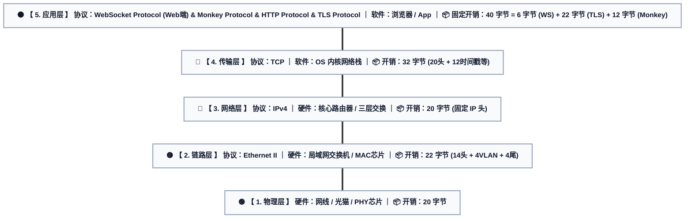

import Tabs from '@theme/Tabs';
import TabItem from '@theme/TabItem';

> 参考文章
>
> - [3.1. Internet Header Format](https://ftp.nic.ad.jp/rfc/inline-errata/rfc791.html)
> - [3.1. Header Format](https://pike.lysator.liu.se/docs/ietf/rfc/92/rfc9293.xml)
> - [5.2. Base Framing Protocol](https://greenbytes.de/tech/webdav/rfc6455.pdf)
> - [IEEE 802.3 Ethernet Frame (包含 MAC, FCS, 前导码及 IPG 规范)](https://en.wikipedia.org/wiki/Ethernet_frame)
> - [IEEE 802.1Q (VLAN 标签规范)](https://en.wikipedia.org/wiki/IEEE_802.1Q)
> - [2.1. Header Layout](../Monkey%20Protocol/monkey-protocol-spec.md)
> - [Transport Layer Security](https://en.wikipedia.org/wiki/Transport_Layer_Security)

# 网络带宽与硬件测算指南

本指南详细介绍了如何计算支撑 Ocean Chat **100,000 并发连接**所需的确切网络带宽计算方法（本文仅以 ws gateway service举例，其他服务模仿本文进行计算即可）。它将这些数学需求转化为具体的物理硬件建议，包括网络接口卡 (NIC) 和网络交换机。

## 固定消耗

### 全链路消耗



- web 端是基于 ws 协议设计的 monkey 协议，手机端是基于 tcp 协议设计的 monkey 协议。
  - ws 协议基础头部固定 2 字节，从“客户端”发往“服务端”的所有帧都必须包含 4 字节掩码。业务数据小于126字节，所以 ws 协议不需要长度扩展。下文统一按照 6 字节（按照多的计算）计算。
  - tls 协议中固定头记录包含 5 个字节，加密和校验开销在采取了不同的加密校验算法时是不同的，取平均值 17 字节。下文统一按照 22 字节计算。
  - monkey 协议中头部包含固定 12 个字节。动态载荷长度见下文。
- TCP 固定开销：20 字节（Bytes）。不包含任何可选字段（如时间戳、窗口扩大因子等）的基础头部大小通常是20字节，由于通常会带上时间戳（Timestamp, 10 字节）等选项，TCP 头部经常是 32 字节。下文统一按照 32 字节计算。
- IPv4 固定开销为 20 字节。IPv6 固定开销为 40 字节。下文按照 20 字节计算。
- 数据链路层：标准以太网帧头（MAC Header）为 14 字节。现代数据中心为实现租户网络隔离，通常会启用 IEEE 802.1Q VLAN，额外插入 4 字节的 VLAN 标签；再加上 4 字节的 FCS 帧尾校验序列，总开销按 22 字节计算。
- 物理层：数据包在网线上传输时，还包含隐形的物理传输开销，包括前导码 (Preamble) 7 字节、帧起始定界符 (SFD) 1 字节和帧间距 (IPG) 12 字节，固定总计 20 字节。

**全链路消耗** = 6 字节 (WS) + 22 字节 (TLS) + 12 字节 (Monkey) + 32 字节（TCP）+ 20 字节（IPV4）+ 22 字节（链路层）+ 20 字节（物理层） = 134 字节

### 工程经验消耗

用户部署项目时为了降低成本经常选择云端服务器。部分公司资金支持到位也有自己的服务器硬件。接下来分这两种情况讨论。

当从“主机角度”——也就是部署无状态 oceanchat-ws-gateway 的 Linux 服务器角度来看时，操作系统（OS）根本看不见物理层（L1）的开销。

- 网卡的 PHY 芯片代劳了：前导码（Preamble 7 字节）、帧起始定界符（SFD 1 字节）和帧间隙（IPG 12 字节）等这 20 个字节，完全是由网卡硬件的物理层收发器（PHY）在发送电信号/光信号时临时插入的。
- Linux 内核的视角：当网络包到达 Linux 内核的网络栈的 buffer 中时，这 20 个字节已经被网卡硬件剥离了。同理，发送时也是 OS 把以太网帧交给网卡，网卡自己去加前导码和帧间隙。
- 链路层（L2）的部分不可见：对于链路层的开销，操作系统**能看到** 14 字节的 MAC 帧头和 VLAN 标签（可通过 `tcpdump -e` 抓取），但在绝大多数默认网卡配置下，操作系统**看不到 4 字节的 FCS 帧尾校验和**。FCS 通常在网卡硬件的 MAC 芯片校验无误后就被自动剥离丢弃了。

> 主机上的任何监控软件、抓包工具（比如 tcpdump），它们钩取的数据流都在操作系统层，根本抓不到物理层的这 20 字节。所以在算服务器出网带宽时，不应该加这 20 字节。

如果公司采用云服务部署项目，像 Vultr、阿里云，在计算实例公网带宽峰值，或者进行流量计费时，通常是在宿主机的虚拟化网络交换机或者三层网关上进行统计的。他们绝大多数时候是按照 IP 层（网络层，L3） 的 Payload 来计费和限速的。也就是说，连那 22 字节的以太网 MAC 帧头都不会算进带宽的账单里。
如果是公司自己在机房里架设物理交换机，由于交换机是二层设备，它处理转发的最小单位就是以太网帧。所以交换机的端口转发包中必须包含 MAC 帧头。

> **拓展：移动运营商（4G/5G 手机流量）是怎么计费的？**
>
> 当 C 端用户使用蜂窝网络收发消息时，手机到基站的“空中接口”使用的是无线电波通信协议（如 PDCP/RLC/MAC），压根不使用有线局域网的以太网协议。所以无线环境下根本不存在“前导码”和“帧间隙”这 20 个字节。
> 此外，移动运营商的核心网计费网关（如 4G 的 PGW 或 5G 的 UPF）同样工作在**网络层（L3）**。运营商在扣除用户的手机流量套餐时，只统计 IP 数据包的总大小（IP 头 + TCP 头 + 业务数据）。无线电波层面的额外头部和空口控制信令开销是由运营商的基础设施承担的，绝不会计入用户的流量账单。

> **结论：**
>
> - **云服务部署消耗** = 6 字节 (WS) + 22 字节 (TLS) + 12 字节 (Monkey) + 32 字节 (TCP) + 20 字节 (IPv4) = 92 字节
> - **公司自行架设服务器消耗** = 6 字节 (WS) + 22 字节 (TLS) + 12 字节 (Monkey) + 32 字节 (TCP) + 20 字节 (IPv4) + 22 字节 (链路层) = 114 字节

下文均以 92 字节固定长度计算。

## 上下文：长短链协同效应

Ocean Chat 带宽计算中最关键的因素是控制面与数据面的严格分离：

1. **控制面 (Monkey Protocol/WebSocket):** 仅承载 12 字节头部和极轻量的 JSON/Protobuf 元数据（`MSG_UP`、`MSG_NOTIFY`、心跳）。
2. **数据面 (HTTP/OSS):** 大文件（图片、视频、语音）直接通过 CDN 上传至对象存储 (OSS/S3)。

**这意味着 IM 集群服务器绝对不会路由原始的多媒体二进制文件。** 集群仅路由轻量级文本和元数据，这极大地降低了为应付高并发消息请求所需的带宽。

## RTT(Round Trip Time)

在网络工程和高性能 IM 架构中，100ms 通常被视为一个分水岭：

- 低于 100ms（黄金标准）：用户会感觉到极其丝滑、毫无延迟，消息如同本地直接渲染一般。
- 100ms - 300ms（极佳/合格线）：绝大多数现代移动端 IM 在常规网络（4G/5G/Wi-Fi）下的真实表现，用户几乎无感。
- 超过 300ms（弱网/长尾延迟）：用户会开始隐约感觉到消息发送的“转圈”或停顿。

注意：下文计算`MSG_UP`和`MSG_UP_ACK`所需带宽时分母为 0.05，本文假设仅网络耗时在 100ms 的情况下需要的带宽，实际上一次 RTT = 网络耗时 + 服务器各节点耗时。

## 第一步：计算基础吞吐量（数学推演）

为了评估网络规模，需要计算空闲状态和流量峰值下的吞吐量。

### 场景 A：空闲状态（心跳保活）

Ocean Chat 采用非对称心跳。服务端每 30 秒发送一次 Ping。

- **业务载荷:** 0 字节 (纯心跳包无附加数据，12 字节 Monkey Header 已计入下方)。
- **协议栈开销:** 92 字节 = 6 字节 (WS) + 22 字节 (TLS) + 12 字节 (Monkey) + 32 字节 (TCP) + 20 字节 (IPv4)

```text title="空闲带宽计算"
(100,000 连接 × 92 Bytes × 8 bits/Byte) / 30 秒
= 2,453,333.33 bps ≈ 2.45 Mbps (兆比特每秒)
```

_结论:_ 空闲连接几乎不消耗任何带宽。区区 2.45 Mbps 在千兆网络中完全可以忽略不计。

### 场景 B：流量峰值（活跃聊天）

在进入场景B之前，先描述业界标准的吞吐量评估基准。明确定义三个变量：

- CC (Concurrent Connections，同时在线连接数)： 即 100,000 这个基数。这些用户保持着 WebSocket 长链接，但不一定在说话。
- 活跃系数 (Activity Ratio)： 在任意给定的 1 秒内，真正在发送消息的用户比例。常规 IM（如微信、企业微信）在峰值（如早晨上班）的活跃系数通常在 1% - 5% 之间；而高频互动场景（如直播间弹幕、游戏世界频道）可能高达 10% - 20%。
- QPS (上行消息并发数)： 这里设置为 10,000 条/秒（按照活跃系数估算，此时用户总数应该在 20w - 100w）。

推导公式：**QPS<sub>上行</sub> = CC &times; 活跃系数**

在评估 10 万同时在线连接 (Concurrent Connections) 的真实物理带宽时，不能假设所有在线用户在同一秒内都在发送消息。需要引入活跃系数来推算真实的并发请求数 (QPS)。

为了覆盖最极端的业务场景（例如公司遇到突发事件导致高频群聊），我们采用极具挑战性的 10% 极值活跃系数进行压力模型构建：

- **推算上行并发 (QPS)：** **100,000 (在线数) &times; 10% (极端活跃系数) = 10,000 条/秒**。
- **推算下行扇出 (Fan-out)：** IM 系统的读写比例极不均衡（写扩散/读扩散）。假设这 10,000 条上行消息中，有相当一部分发生在百人大群与高频单聊中交织，系统需要进行巨大的消息扇出。我们设定系统每秒需要并发推送 100,000 条唤醒通知（即 1:10 的扇出放大率）。这恰好构成了一个“完美风暴”：**在流量最高峰的这一秒内，10 万名在线用户全员同时被唤醒。**

基于上述推导的高压模型，计算峰值带宽消耗：

- **上行 (`MSG_UP`):** 既然是极端瞬间涌入，为了严守 100ms 的完整闭环 RTT（需扣除约 40ms 的往返物理延迟与 10ms 的服务端处理耗时），留给网卡实际收发数据的微突发时间窗最多只有 **0.05 秒 (50ms)**：(10,000 msgs &times; ~300 Bytes (Header + Protobuf(300 - 92 = 208 字节有效载荷，约为 208 个英文字符，69 个 UTF-8 中文字符)) &times; 8) / 0.05s = 480,000,000 bps = **480 Mbps**。
- **上行确认 (`MSG_UP_ACK`):** 越过服务端写屏障后下发的确认包。在成功场景下 Payload 包含 36 字节的 `clientMsgId` (UUIDv7)、`syncSeqId`、`success` (true) 与 `serverTimestamp`，空错误信息不占空间。Protobuf 编码后约 60 字节。加上 92 字节底层开销，单包物理占用约 152 字节。**同理，为了保证 100ms 黄金标准，服务器必须在 0.05 秒的极窄时间窗内将 10,000 个 ACK 全部挤出网卡下发完毕：**(10,000 msgs &times; 152 Bytes &times; 8) / 0.05s = 243,200,000 bps = **243.2 Mbps**。
- **下行推送 (`MSG_NOTIFY`):** 编排服务扇出通知。根据协议规范，`MSG_NOTIFY` 仅作唤醒不带实体，Payload 只包含 `GroupId`（字符串，约 20 字节）与 `SyncSeqId`（int64，约 8 字节），Protobuf 编码后约 30 字节。加上 92 字节底层物理网络开销，单包物理占用约 122 字节。**架构削峰策略：** 服务端在扇出海量通知时，可以将其均匀平滑地打散到 1.0 秒的时间窗口内下发。对于 C 端接收用户而言，不到 1 秒的群消息延迟在体感上毫无区别，但这却能将原本可能引发雪崩的微突发流量直接削减 10 倍！100,000 名在线用户全员收到通知：(100,000 &times; 122 Bytes &times; 8) / 1.0s = 97,600,000 bps = **97.6 Mbps**。
- **HTTP Sync (数据拉取):** 由于前置的 `MSG_NOTIFY` 唤醒信令已被服务端平滑打散到 1 秒内，这 100,000 个客户端随之发起的 HTTP 拉取请求也会**自然而然地被分摊到 1 秒内**，完美避免了 API 网关被瞬间击穿。**假设平均 HTTP 响应总大小为 1KB（包含约 400 字节 HTTP/TLS 协议开销，剩余 600 字节业务载荷。由于多媒体二进制走 OSS，600 字节足以容纳 2-3 条短文本消息或富媒体元数据数组，采用滑动窗口批处理拉取数据，所以一次http请求可能会包含多条消息）。**(100,000 &times; 1,024 Bytes &times; 8) / 1.0s = 819,200,000 bps = **~819.2 Mbps**。

### 集群总带宽需求

- **边缘峰值聚合流量 (Aggregate Throughput):** 在极短的突发时间窗内，上下行数据包在网卡和交换机中是并发交织的。网络设备的背板和总线必须同时处理这些吞吐量，因此必须将它们**相加**（而非取最大值）：480 (上行) + 243.2 (下行) + 97.6 (下行) + 819.2 (下行) = **1640 Mbps**。
- **内部微服务流量 (NATS 复制 + Redis):** 将边缘流量翻倍以涵盖内部路由和 Raft 共识复制 = **3280 Mbps**。

**最终测算:** 一个十万并发的 Ocean Chat 集群在极端流量峰值期间，大约需要 `1640 + 3280 ≈` **4.92 Gbps 的稳定内/外部瞬时带宽容量**。

## 第二步：在真实测试环境中验证带宽（实战抓包）

理论计算虽然严密，但在真正的生产环境上线前，必须通过压测和抓包工具来验证理论值与实际消耗的偏差。可以使用 **tcpdump** 和 **Wireshark** 来进行精准测量。

### 1. 使用 tcpdump 抓取网关流量

在压测期间（例如使用压测脚本模拟 10,000 个客户端建立 WebSocket 连接并高频发送消息），登录到 `oceanchat-ws-gateway` 所在的服务器，使用 `tcpdump` 抓取真实的网络包：

```bash
# 抓取特定端口（如网关端口 8080）的网络包，并保存到 pcap 文件中
sudo tcpdump -i any port 8080 -w gateway_traffic.pcap
```

抓包时间无需过长，在压测流量达到稳定峰值时，抓取 60 秒到 300 秒即可。\_

### 2. 使用 Wireshark 分析吞吐量

将生成的 `gateway_traffic.pcap` 文件下载到本地工作站，并使用 Wireshark 打开：

- **查看整体带宽指标：** 点击菜单栏的 `统计 (Statistics)` -> `捕获文件属性 (Capture File Properties)`。在“测量”区域，可以直接看到 **平均比特率 (Average bits/s)** 和 **平均字节率 (Average bytes/s)**。将这个实测数值按比例放大，即可精确预估十万并发的真实网络带宽。
- **绘制 I/O 吞吐图表：** 点击 `统计 (Statistics)` -> `I/O 图表 (I/O Graphs)`。将 Y 轴设为 `Bits/Tick`，X 轴设为 1 秒。可以直观地观测到流量峰值 (Spikes) 的波动情况，以及心跳包引发的周期性波峰。
- **精确过滤协议：** 在顶部过滤栏输入 `websocket` 或 `tcp.len > 0` 来排除无关的系统背景流量（如纯 TCP ACK），获得最纯粹的业务带宽消耗。

### 3. 理论与实测的对比校验

在 Wireshark 中选中一个由客户端发出的 `MSG_UP` 数据包，查看底部的 `Frame` 层信息中的 `Capture Length`。将该数值与在第一步中计算的理论大小进行对比。

请注意，如果生产环境开启了 **TLS/WSS (wss://)** 加密，TLS 握手以及 TLS Record 层会带来额外的封装开销。实测的网络带宽结果通常会比纯明文的理论值高出 10% - 20%，必须在硬件采购时将这部分加密开销的冗余考虑在内。

## 第三步：选择物理硬件

标准的 1 Gbps（千兆以太网）网卡会在 **4.92 Gbps** 的瞬时峰值流量面前被瞬间击穿。因此，**10GbE（万兆以太网）** 已经不再是冗余，而是物理硬件的绝对**最低刚需标准**。

<Tabs>
  <TabItem value="nic" label="网络接口卡 (NICs)" default>
    对于物理服务器，选择支持 TCP 卸载引擎 (TOE) 和 SR-IOV 的网卡，以减少处理数百万小包时的 CPU 开销。

    * **标准选择: Intel X710-DA2 (双口 10GbE SFP+)**
      * *原因:* 裸金属 Kubernetes 节点的行业标准。Linux 下驱动支持可靠，DPDK 支持出色，可轻松应对 10Gbps 线速。
      * *淘宝:* 约 ￥350。[淘宝链接](https://item.taobao.com/item.htm?id=688301709448&skuId=5088418623349)。
    * **高性能替代: Mellanox ConnectX-4 Lx (10/25GbE)**
      * *原因:* Mellanox (现 Nvidia) 网卡在处理海量小包 (高 PPS - 每秒数据包数) 时比 Intel 拥有更低的延迟。强烈推荐用于 NATS JetStream 和 Redis 节点。
      * *淘宝:* 约 ￥450。[淘宝链接](https://item.taobao.com/item.htm?id=834255588855)

  </TabItem>

  <TabItem value="switch" label="网络交换机 (Top-of-Rack)">
    架顶式 (ToR) 交换机必须具备无阻塞吞吐能力，以确保微服务 RPC 调用不会因缓冲区丢包而受损。

    * **标准选择: Cisco Nexus 93180YC-EX**
      * *原因:* 提供 48 个 10/25GbE 端口，具有超低延迟。完美适用于单机柜 IM 集群部署。
    * **预算选择: MikroTik CRS326-24S+2Q+RM**
      * *原因:* 提供 24 个 10Gbps SFP+ 端口。价格不到 600 美元，是初创公司构建物理集群的无敌性价比之选，轻松应对 **4.92 Gbps** 的需求。

  </TabItem>
</Tabs>

:::warning 线缆至关重要
不使用传统的 Cat5e 网线连接 10GbE。机柜内的微服务通信应始终使用带有 SFP+ 模块的 **DAC（直连铜缆）** 或 **AOC（有源光缆）**。这保证了极低的延迟（亚微秒级）。
:::

## 预期结果

通过将时间约束收紧至 100ms RTT 黄金线并进行数学推演，可以证明十万并发的集群在极端峰值时会产生高达 4.92 Gbps 的瞬时吞吐要求。标准的 **10GbE (Intel X710) 网络架构** 刚刚好能够覆盖这一需求，并保留了安全余量。这有力地佐证了，在高性能 IM 系统中万兆网络是标配，它能确保突发流量被瞬间消化，不会成为 Ocean Chat 发生延迟劣化的瓶颈。
