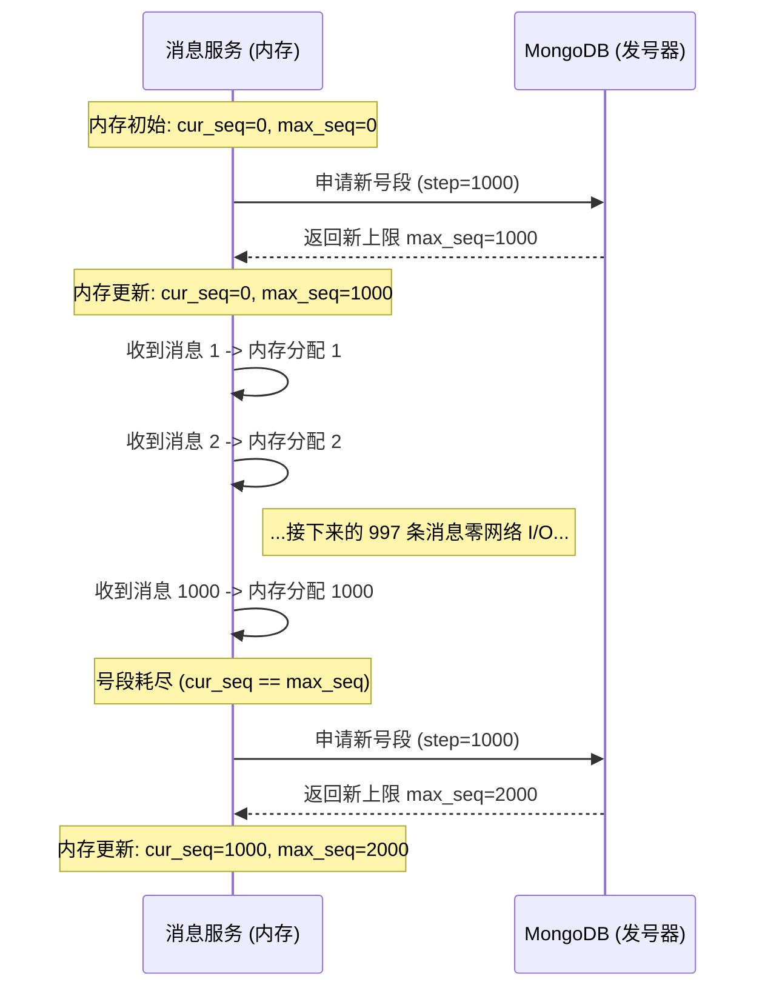

import Tabs from '@theme/Tabs';
import TabItem from '@theme/TabItem';

# 分布式 ID 生成策略

在一个像 Ocean Chat 这样支撑海量用户的分布式 IM 系统中，消息 ID 的生成方式直接决定了数据库的性能上限和消息同步的绝对可靠性。

本文档解释了为什么 Ocean Chat 必须将消息的“唯一性”与“时序性”解耦，以及它是如何借鉴微信经典的 `seqsvr` 架构，实现基于“号段模式”的预分配机制，从而生成能够扛住十万级并发写入的 `SyncSeqId` 的。

---

## 1. 核心矛盾：唯一性 vs. 时序性

许多传统的业务系统试图使用单一的 ID（如雪花算法 Snowflake ID 或 UUID）来同时表示消息的身份和先后顺序。在极高并发的 IM 系统中，这会带来两个致命的缺陷：

1. **时钟回拨 (Snowflake)：** 如果服务器集群发生时钟漂移或 NTP 同步异常，雪花 ID 可能会出现回退。这破坏了消息的“严格递增”属性，导致客户端的防丢漏测（空洞检测）逻辑彻底失效。
2. **缺乏时序上下文 (UUID)：** UUID 虽然能保证宇宙级别的唯一性，但它完全不包含序列信息。客户端拿到两个 UUID，根本无法通过数学计算得出它们之间是否漏掉了其他的消息。

### Ocean Chat 的解耦架构

Ocean Chat 通过将职责严格拆分给两种截然不同的 ID 来解决这个问题：

- **`ClientMsgId` (专职唯一性)：** 由**客户端**在用户点击“发送”按钮的瞬间生成的一个标准 UUID。它专属用于服务端和客户端在应对网络重试时的静默去重（幂等性）。
- **`SyncSeqId` (专职时序与同步)：** 由**服务端**（`oceanchat-message` 服务）生成的一个 64 位整型数字。它**在单一会话（某个特定单聊或某个特定群聊）的维度内，是严格单调递增的**。

正因为 `SyncSeqId` 是严格递增的（例如 100, 101, 102...），客户端才能够执行纯粹的数学空洞检测。如果客户端本地的最大 ID 是 100，而它收到了一个 ID 为 105 的唤醒信令，它就能在数学上绝对证明：101、102、103 和 104 这四条消息在网络传输中丢失了，必须发起 HTTP 请求将它们拉回来。

---

## 2. 号段预分配架构 (Segment-based Pre-allocation)

为了生成 `SyncSeqId`，如果在千万级用户同时发消息时，每发一条消息都去 Redis 或 MongoDB 执行一次同步的 `UPDATE seq = seq + 1`，数据库瞬间就会被天量的随机写 IOPS 打爆。

Ocean Chat 采用了**号段模式 (Segment-based pre-allocation)** 策略。

### 运行原理

`oceanchat-message` 服务不再为每一条消息向数据库索要 ID，而是向数据库一次性申请一整个**号段（Segment）**的 ID（例如 `step = 10,000`）。

1. **内存分配：** 微服务在本地内存中为该会话维护两个变量：`cur_seq` (当前已发放的序列号) 和 `max_seq` (预分配号段的上限上限)。
2. **极速发放：** 当收到一条新消息时，微服务仅仅在内存中执行 `cur_seq++`，然后将这个值作为 `SyncSeqId` 返回。这个操作耗时仅为纳秒级，且**没有任何网络 I/O 阻塞**。
3. **数据库交互 (慢路径)：** 只有当内存中的 `cur_seq == max_seq`（号段耗尽）时，微服务才会发起一次网络请求，要求数据库将持久化的游标向前推进 10,000。数据库返回新的上限后，微服务更新内存中的 `max_seq`，继续纳秒级发放。

:::tip 降维打击式的 I/O 优化
如果步长 (step) 设置为 10,000，数据库的写负载就被**削减了 99.99%**。原本每秒只能扛住 1,000 条消息并发写的数据库，现在理论上可以支撑 10,000,000 条/秒的巅峰吞吐。
:::

---

## 3. Section 块合并存储 (空间极致优化)

:::info 架构降级说明：当前体量无需引入此机制
**Ocean Chat 目前的设计目标用户体量为最高几十万，活跃会话数量会更低。** 在这种量级下，直接在数据库中为每个会话独立保存一条 `max_seq` 记录，总数据量仅有数 MB，对现代数据库毫无压力，且代码逻辑更加清晰简单。因此，**在目前的实际开发中，完全不需要引入复杂的 Section 块合并存储思路**。
本节内容依然保留，仅用以探讨微信等国民级 IM 在面对**十亿级**海量会话时，为了节约存储成本而采用的终极优化方案。
:::

如果大型 IM 系统有数以亿计的活跃群组和单聊会话，要在数据库里为这海量的会话各自保存一条 `max_seq` 记录，将会浪费巨量的磁盘和内存索引空间。

为了优化这一点，Ocean Chat 将成千上万个会话打包成一个 **Section (号段块)**。

例如，UID相邻的用户在数据库里共享同一条 `max_seq` 记录。
当 `oceanchat-message` 服务需要为这个块里的*任何一个*用户申请新号段时，它都会让这个共享的 `max_seq` 增加 10,000。

- 群组 A 可能会分到 `100,000` 到 `109,999` 这个号段。
- 群组 B（恰好在 A 之后申请号段）会分到 `110,000` 到 `119,999`。

这样将极大地降低了底层存储的维护压力。

---

## 4. 节点宕机与 ID 跳跃 (天然容灾)

关于内存预分配，最常见的疑问是：**“如果 `oceanchat-message` 节点刚申请了号段就宕机了，内存里还没用完的 ID 怎么办？”**

假设节点预分配了号段 `[1000, 2000]`。它刚刚给两条消息发了 `1001` 和 `1002`，然后机房断电了。内存中 `1003` 到 `2000` 的 ID 灰飞烟灭。

当服务器重启（或流量被路由到另一个健康节点）时，新节点会重新向数据库申请号段。数据库中安全地持久化着 `max_seq = 2000`，于是它大笔一挥，分发了下一个号段：`[2000, 3000]`。

该群组收到的下一条新消息，将被分配 `SyncSeqId = 2001`。

### 为什么这完全没问题？

`SyncSeqId` 直接从 `1002` 跃升到了 `2001`。**这是完全符合设计的预期行为。**

Monkey Protocol 严格规定：

1.  **单调递增是底线：** ID 永远不能回退，必须越来越大。这保证了时序排列的绝对数学正确性。
2.  **绝对连续是伪命题：** 客户端被**严禁**假设 ID 是连续的 (+1)。

当客户端（本地最新 ID 是 1002）收到包含 `2001` 的推送信令时，它发现了空洞。它立刻发起 HTTP Sync 同步请求：“请给我所有严格大于 1002 的消息实体”。

`oceanchat-query` 服务查询 MongoDB 后，只会返回那条最新的消息 `2001`。客户端在解析后意识到，原来中间并没有真正的消息丢失（只是 ID 跳号了）。它随即将本地游标更新为 `2001`，继续完美运行。

:::info 架构哲学的胜利：舍弃连续性，换取容灾性
通过在宕机时故意丢弃并浪费一小段未使用的 ID，系统牺牲了人类强迫症般的“数字连续性”，却换来了绝对的数据安全和无需任何回滚逻辑的瞬间灾难恢复能力。
:::
