<head>
  <meta name="twitter:card" content="summary_large_image" />
  <meta property="og:title" content="JetStream 拓扑与消费策略 | Ocean Chat" />
  <meta property="og:description" content="Ocean Chat NATS JetStream 拓扑、主题命名空间及分布式消费策略详解，支持十万级并发连接。" />
  <link rel="canonical" href="https://jameswilson19970101.github.io/ocean.chat.docs/zh-CN/docs/devdocs/jetstream-strategy" />
</head>

# NATS JetStream 拓扑与策略

为了支持十万级并发连接，Ocean Chat 将 **NATS JetStream** 不仅作为消息中间件，更作为连接所有微服务的中枢神经系统。该拓扑严格隔离了高吞吐量数据流与控制流，并利用通配符路由实现精确的微服务消费策略。

## 架构概览图

下图展示了 Ocean Chat 微服务与 NATS JetStream 主题之间的生产和消费流程。

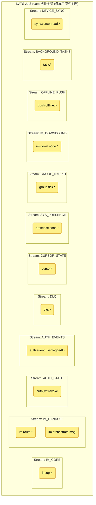

本文档详细介绍了 Ocean Chat 架构所需的流定义、主题命名空间以及交付语义（推/拉、至少一次、至多一次）。

## 1. 流定义

Ocean Chat 中的流按 **业务域** 和 **数据保留生命周期** 进行分区，绝不按用户或群组 ID 分区（否则会导致流爆炸）。

### **IM_CORE (网关上行接入流)**

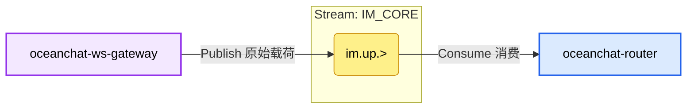

- 核心职责: 整个 IM 系统的流量入口（接入 Ingestion），专门承接 WebSocket 网关接收到的大量原始客户端上行包。这是整个系统中吞吐量极高的流。
- 保留策略 (Retention Strategy): `RetentionPolicy.Limits` (基于限制的保留)。
  - 原因: 数据保留期较短（如 1-3 天即可）。因为这仅仅是网关的原始字节缓冲流，一旦后端的路由服务 (Router) 拉取、解码并交接给 `IM_HANDOFF` 流，这些原始数据的历史使命就完成了。保留短期的存量仅用于极端异常或系统崩溃时的故障排查。
- 存储介质 (Storage): `StorageType.File` (磁盘文件/SSD)。
  - 原因: 虽然保留期短，但在十万级甚至百万级并发洪峰（如重大赛事直播时的大群互动）下，如果后端的微服务解析变慢，上行消息会瞬间在 NATS 积压。使用基于 SSD 的文件存储可以安全地把突发流量缓冲在磁盘中，彻底避免内存溢出 (OOM) 崩溃。
- 关键配置与设计细节:
  - 边缘无状态极速缓冲: 网关在此阶段完全不关心具体的业务逻辑，剥离 WebSocket 协议后瞬间落入此流。极高的 I/O 效率大幅提升了单台网关能承载的长连接数量上限。

#### 主题 1: im.up.> (例如 im.up.p2p, im.up.group)

职责描述: 原始接入缓冲池。承载尚未被解码的 Protobuf 原始业务载荷包。

- 生产者配置 (Producer: `oceanchat-ws-gateway` 连接网关)
  - 发布逻辑: 解析到合法的 WebSocket/TCP 帧后，仅附加必要的系统级元数据（如 `gatewayId` 和 `connectionId`），将核心原始字节 Payload 高速发布至此主题。
  - 配置详情与原因:
    - 纯管道传输: 这个过程不涉及任何数据库查询与写操作。客户端在此阶段**不会**收到 `MSG_UP_ACK`，只有当消息流经下游到达写屏障后才会返回确认。

- 消费者配置 (Consumer: `oceanchat-router` 路由服务)
  - 消费逻辑: Pull 模式 (Pull Queue Group)。
  - 配置详情与原因:
    - 消费者组负载均衡: 多个 Router 实例组成一个相同的消费者组，共同瓜分这个海量上行流量，确保同一条消息只被一个 Router 解析。
    - 批量拉取与解码: Router 不是一条条拉取，而是通过内部循环一次性批量 Pull 拉取（例如数百条），利用 CPU 算力高效解码 Protobuf，并执行基础校验。
    - 延迟交接 ACK 机制: Router 服务在从 `im.up.>` 拉取消息后，只有当它成功将解码后的消息路由分发并投递到下方的 `im.route.*` (`IM_HANDOFF` 流) 之后，才会对这条 `im.up.>` 消息发送显式的 ACK。这完美保证了数据在“边缘接入层”向“内部业务层”交接的途中绝对不丢。

### **IM_HANDOFF (内部路由与 WAL 核心流)**

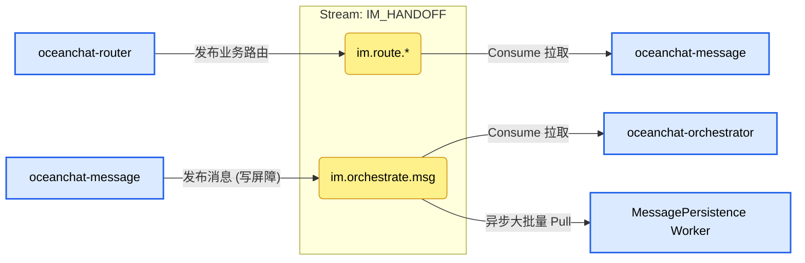

- 核心职责: 系统最关键的流，不仅是微服务之间传递业务负载的“接力棒”，更充当着整个系统的**写屏障 (Write Fence)** 和**预写日志 (WAL)**。
  - 当 `oceanchat-router` 解析完网关上报的数据后，会交接给此流以触发下层核心业务处理。
  - 业务服务处理完毕后，再次写入此流，利用 NATS 的高可靠性确保消息不丢失，随后分离为 [消息发送与落库](./Bussiness%20Logic/Message%20sending%20and%20database%20storage.md) 和“实时派发推送”两条支线。

- 保留策略 (Retention Strategy): `RetentionPolicy.Limits` (基于限制的保留)。
  - 原因: 数据需要被多个不同的微服务消费者组（如推送编排服务、持久化 Worker）独立且全量地消费。Limits 策略确保了即使某个消费者（如 MongoDB 批量落库）出现延迟或宕机，消息依然安全保留在队列中，直到所有订阅者都成功推进消费游标。

- 存储介质 (Storage): `StorageType.File` (磁盘文件/SSD)。
  - 原因: 极致的可靠性要求。这是写屏障（WAL）的所在，服务端只要收到此流的 NATS ACK，就会给客户端返回发送成功的确认。如果发生机房断电或 NATS 宕机，这部分尚未落库 MongoDB 的消息数据必须能从磁盘恢复，绝对不能丢失。

- 关键配置与设计细节:
  - 写后持久化架构 (Write-after-persistence): 将快速的客户端响应（跨越写屏障即返回 ACK）与缓慢的数据库落盘（后台异步大批量 Pull 消费并插入）彻底解耦，这是 Ocean Chat 支撑十万级并发写操作的性能基石。

#### 主题 1: im.route.\* (例如 im.route.p2p, im.route.group)

职责描述: 内部业务路由交接。`oceanchat-router` 完成原始数据包解析后，将业务 Payload 路由投递给对应的具体业务逻辑服务。

- 生产者配置 (Producer: `oceanchat-router` 服务)
  - 发布逻辑: 解析 Protobuf 数据帧、完成初步业务级限流与基础校验后，根据业务类型定向发布。
- 消费者配置 (Consumer: `oceanchat-message` 或 `oceanchat-group` 服务)
  - 消费逻辑: Pull 模式。
  - 配置详情与原因:
    - 队列组 (Queue Group): 相同业务服务的多个实例组成拉取队列组，共享消费游标，实现水平扩展和负载均衡。一条消息只会被一个业务实例拉取处理。
    - 至少一次投递 (At-Least-Once): 如果业务服务在处理中途（如校验权限时）崩溃，未能回传明确的 ACK，NATS 会在等待超时后将该消息重新投递给其他健康的实例，确保核心业务逻辑不中断、消息绝对不丢。

#### 主题 2: im.orchestrate.msg

职责描述: **关键写屏障所在！** 处理完毕的合法消息会投递到此，作为“已安全接收”的最终凭证。它同时为下游的异步落库和消息派发推送提供数据源。

- 生产者配置 (Producer: `oceanchat-message` 服务)
  - 发布逻辑: 完成好友/群组鉴权、内容合规审查、并分配全局单调递增的 `SyncSeqId` 后，将最终业务消息体发布至此主题。
  - 配置详情与原因:
    - 同步等待 ACK: 消息服务发布时，必须等待 NATS JetStream 返回持久化成功的 ACK 回执。只有越过了这个写屏障边界，服务才会通知网关向客户端下发 `[0x06] MSG_UP_ACK`。

- 消费者配置 (具备两个独立的持久化消费者组 / Consumer Groups)
  - 消费者 A: `oceanchat-orchestrator` (推送编排服务)
    - 消费逻辑: 实时 Pull 拉取。
    - 配置详情与原因: 编排服务拉取消息后，会查询 Redis 在线状态图谱来评估接收方的网络状态。由此决定是将消息转化为轻量级的 `MSG_NOTIFY` 发往下行流，还是转化为离线唤醒任务转移到 `OFFLINE_PUSH` 流进行厂商推送。
  - 消费者 B: `MessagePersistence Worker` (消息持久化管道)
    - 消费逻辑: 后台异步大批量 Pull 拉取 (Batch Pull)。
    - 配置详情与原因: 这个 Worker 彻底将慢速的磁盘 I/O 解耦出了主链路。通过一次性批量拉取数百条消息，利用 MongoDB 的 Bulk Insert 接口执行批量写入，极大地降低了数据库的 IOPS 瓶颈压力。只有落库成功后，Worker 才会向 NATS 发送显式 ACK，推进当前消费组的进度，保障了海量并发下的最终一致性。

### **AUTH_STATE (全局安全流)**

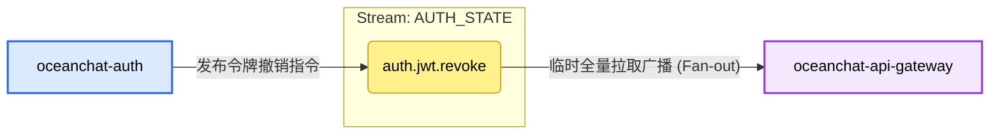

- 核心职责: 用于在微服务之间高速广播全局关键的安全状态变更。
  - 目前专用于 JWT 令牌的黑名单撤销同步 (`auth.jwt.revoke`)。
  - 当发生用户主动登出、后台检测到 Refresh Token 遭到重放攻击（Replay Attack），或者正常的刷新令牌轮换导致旧 Access Token 必须立即失效时，Auth 服务会向此流发布撤销指令。
  - API Gateway 是其主要消费者。Gateway 采用“零 I/O (Zero-I/O) 认证”架构，它不再针对每个请求去查询 Redis，而是通过订阅此流在内存中构建和维护一个本地黑名单（`TokenBlacklistService`）。

- 保留策略 (Retention Strategy): `RetentionPolicy.Limits` (基于限制的保留)。
  - 原因: 这是一个典型的广播（Broadcast / Fan-out）模式。如果有多个 API Gateway 实例，或者网关正在重启，每个实例都必须能够获取到这段时间内的撤销记录。如果使用 Workqueue 模式，一个网关读取了事件后事件就会消失，其他网关就收不到了。

- 存储介质 (Storage): `StorageType.Memory` (内存)。
  - 原因: 黑名单状态具有极高的时效性，读写速度要求最高，放入内存可以实现极致的延迟表现。
  - (注：基于安全性考量，如果 NATS Server 发生崩溃重启，内存数据会丢失。虽然网关会在 JWT 层面校验，但如果条件允许，对于这种数据量极小但极其关键的安全事件，修改为 File 存储能进一步提升容灾能力。)

- 关键配置与设计细节:
  - max_age: 30分钟: 这是一个非常巧妙的滑动窗口设计。因为网关只需要拦截仍在有效生命周期内但被提前撤销的 Token。配置文件中 Access Token 自然寿命是 30 分钟，超过 30 分钟前的撤销事件就毫无保留价值了（因为 Token 自身校验就会过期失效）。(注意：这个值必须大于或等于 `jwt.accessExpiresIn` 配置的时间)。
  - 消费者类型 (`Ephemeral + DeliverPolicy.All`): API 网关没有配置 `durableName`，是一个临时消费者。它每次启动或断线重连时，都会带上 `DeliverPolicy.All` 策略，从头拉取当前流里所有存活的（即过去 30 分钟内）数据。这保证了网关在冷启动时能迅速重建完整的黑名单缓存，防止安全真空期。
  - 发布优先级 (`isCritical: true`): 在底层的 `BoundedPublisherService` 中，撤销指令享有预留的“安全通道”队列额度，即便系统被普通事件挤爆，撤销指令也能优先发出，确保系统安全。

#### 主题 1: auth.jwt.revoke

职责描述: 广播 JWT Token 提前失效（如主动登出、踢人、检测到重放攻击）的安全指令。

- 生产者配置 (Producer: `oceanchat-auth` 服务)
  - 发布逻辑: `BoundedPublisherService.publishSafe('auth.jwt.revoke', payload, '...', { isCritical: true })`
  - 配置详情与原因:
    - isCritical: true (关键优先级):
      - 原因: 此主题传输的是核心安全指令。`BoundedPublisherService` 在内存中维护了两个限制队列：普通队列 (`maxNormalQueueSize=5000`) 和 关键队列(`maxCriticalQueueSize=10000`)。当系统遭受极大流量冲击导致背压（Backpressure）时，普通事件会被抛弃，但配置了 `isCritical: true` 的消息将使用更大的安全阈值，确保在系统极度高压下，撤销指令依然能发送出去，保障系统安全性。
    - 异步 Fire-and-Forget (不等待执行结果):
      - 原因: 撤销指令的发布不应该阻塞当前 HTTP 响应的 RT（响应时间），采用异步抛出可以极大提高接口吞吐量。

- 消费者配置 (Consumer: `oceanchat-api-gateway` 服务)
  - 消费逻辑: `NatsEventsService extends BaseNatsSubscriber`
  - 配置详情与原因:
    - durableName: undefined (临时消费者 / Ephemeral):
      - 原因: API 网关需要的是广播模式 (Fan-out)。如果配置了 `durableName`，多个网关实例会形成负载均衡（互相抢消息），导致每个实例只拿到了一部分黑名单记录。不设 `durableName`，意味着每个网关实例都会建立一个独立的临时订阅，每个实例都能收到所有的撤销指令，从而在各自内存中维护完整的黑名单。
    - deliver_policy: `DeliverPolicy.All` (拉取全量历史):
      - 原因: 临时消费者一旦断开重连，中间的消息就会丢失。为了解决冷启动/网络闪断问题，网关每次连接都会要求 NATS 把流里现存的所有消息（过去30分钟内的所有撤销记录）全部重新发一遍。这就完美实现了网关内存黑名单的快速重建。
    - Redis 分布式锁 `setnx(idempotencyKey, '1', 120)` (幂等处理):
      - 原因: 应对极小概率下 NATS 的网络重发（At-Least-Once）。由于网关把 DeliverPolicy 设为了 All，它每次重启都会拉到已经处理过的老消息，Redis 锁在这里作为高速缓存，快速忽略掉已经在黑名单中的 Token，避免重复执行入库逻辑。

### **AUTH_EVENTS (认证事件流)**

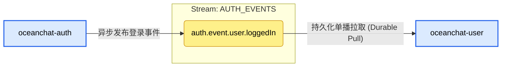

- 核心职责: 用于记录和分发系统业务层面的行为与事件。
  - 目前主要用于广播用户登录成功事件 (auth.event.user.loggedIn)。
  - 属于典型的异步解耦设计。Auth 模块专注于高并发的鉴权和发证，至于“记录用户的最后登录时间”、“更新登录设备历史”这些耗时但不影响用户当前请求的操作，会被作为事件抛入此流，由 oceanchat-user 服务在后台异步、慢慢地消费处理。

- 保留策略 (Retention Strategy): RetentionPolicy.Limits (生产环境)。
  - 原因: 这是事件溯源（Event Sourcing / Pub-Sub）模式。一个登录事件除了让 User 服务更新资料外，未来完全可能让安全审计服务（Audit）或数据统计服务（Analytics）同时也去消费它。Limits 策略确保了一条事件可以被任意个不同业务的消费者（Consumer Group）独立消费。

- 存储介质 (Storage): StorageType.File (磁盘文件)。
  - 原因: 业务事件具有数据价值和一致性要求。如果下游的 User 服务宕机或者 NATS 发生重启，文件存储能保证这段时间内的所有登录记录都不会丢失。

- 关键配置与设计细节:
  - max_age: 24小时: 给下游消费者留足了故障恢复窗口。如果 User 服务由于 Bug 挂掉了，运维人员有长达 24 小时的时间来修复和重启它。重启后，它可以继续处理积压的登录事件。超过 24 小时的数据才会被清理以释放磁盘空间。
  - 消费者类型 (Durable Consumer): oceanchat-user 配置了 durableName: 'oceanchat-user-auth-events'。这让 NATS 服务端持久化地记住了它的消费进度（Cursor/Offset）。即使重启，它也会从上次断开的地方继续消费，做到不漏消息。同时，如果有多个 User 服务实例运行，同名的 Durable 会自动形成队列组（Queue Group），实现负载均衡（一条登录事件只被其中一个实例处理一次）。
  - 幂等性保障: 由于 NATS JetStream 保证的是“至少投递一次（At-least-once）”，为了防止极端网络下的重复投递导致数据库被重复更新，消费者内部借助 Redis 实现了严格的分布式防重锁。

#### 主题 1: auth.event.user.loggedIn

职责描述: 记录用户登录成功的业务行为，用于更新设备的最后活跃时间、记录审计日志等。

- 生产者配置 (Producer: `oceanchat-auth` 服务)
  - 发布逻辑: `BoundedPublisherService.publishSafe('auth.event.user.loggedIn', payload, '...', { isCritical: false })`
  - 配置详情与原因:
    - isCritical: false (普通优先级):
      - 原因: 记录登录时间属于非关键业务事件。如果 Auth 服务因为遇到流量洪峰导致 NATS 彻底拥堵，丢弃这些日志事件是可以接受的（优雅降级），绝对不能为了记录一个登录时间而把 Auth 服务的内存撑爆导致真正的登录功能瘫痪。

- 消费者配置 (Consumer: `oceanchat-user` 服务)
  - 消费逻辑: `NatsEventsService extends BaseNatsSubscriber`
  - 配置详情与原因:
    - durableName: `oceanchat-user-auth-events` (持久化消费者 / Durable)
      - 原因: 这是一个工作队列/单播模式。不管后台部署了多少个 `oceanchat-user` 服务实例，一条登录事件只能被一个实例处理一次（否则会疯狂并发写数据库）。同名的 Durable 会让 NATS 服务端自动在这些实例间做负载均衡 (Load Balancing)。并且，持久化记录了消费游标（Offset），如果所有 user 服务宕机一小时，重启后它们会接着一小时前的地方继续处理，绝不漏单。

### **DLQ (死信队列流)**

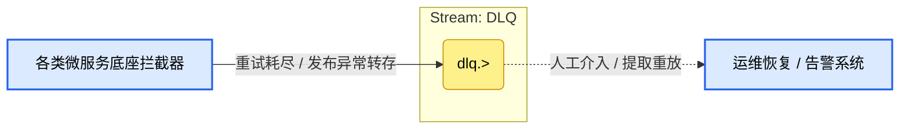

- 核心职责: 系统的错误兜底仓库 (Dead Letter Queue)。集中存放因为种种原因（代码 Bug、脏数据、下游数据库崩溃）经过多次重试依然无法被正常处理的“毒消息（Poison Message）”。
- 保留策略 (Retention Strategy): RetentionPolicy.Limits。
  - 原因: 错误现场的原始数据，不能被其他消费者意外消耗，必须在存储范围内永久保留，等待人工或自动化系统介入。

- 存储介质 (Storage): StorageType.File (磁盘文件)。
  - 原因: 死信数据包含了极其珍贵的报错上下文和原始 Payload，必须绝对可靠地持久化落盘防止丢失。

- 关键配置与设计细节:
  - max_age: 7天: 给开发者和运维团队留出了充足的缓冲期（涵盖了周末和长假）。一旦收到 DLQ 告警，工程师有 7 天的时间来定位问题。修好 Bug 后，还可以通过运维接口从 DLQ 中提取原消息重新投递（只需去掉 dlq. 前缀）。
  - 统一的降级前缀 (dlq.>): 通过规范的主题命名（目前是 dlq.auth.event.> 等），框架能够对系统内不同业务的失败事件进行集中归档，并且通过后缀仍能清晰知道它是哪个业务线产生的死信。
  - 全方位的流入机制:
    - 消费端兜底: 在 BaseNatsSubscriber 中，如果一条消息在消费者端报错 NAK（比如 User 库连不上），且重试达到最大次数 (max_deliver: 3) 后仍失败，消费者框架会主动拦截它，将其转发给 DLQ，并对原消息发 ACK（从原队列踢出，防止无限死循环卡死整个队列）。
    - 生产端兜底: 在 BoundedPublisherService 中，如果 NATS 异常或限流器满载导致普通主题发布失败，发布者框架也会尝试作为 Fallback 把数据扔进 DLQ 保存证据。

#### 主题 1: dlq.> (例如 dlq.auth.event.user.loggedIn)

职责描述: 毒消息（Poison Message）和崩溃现场的回收站。

- 生产者配置 (Producer: 各个微服务中的框架层拦截) 这是一个比较特殊的主题，它的“生产者”不是业务代码，而是底层框架的异常捕获机制。
  - 生产场景 1：消费者（Consumer）重试耗尽:
    - 逻辑: 在 `BaseNatsSubscriber.handleError` 中，当 `deliveryCount >= max_deliver` (默认3次) 依然抛出异常时。
    - 发布行为: 往 `dlq.${m.subject}` 发送原消息，并对原始消息发送 `m.ack()`。
    - 原因: 如果数据库挂了或者遇到代码解不开的脏数据，一直 `m.nak()` 会导致这条消息永远卡在队列前面，阻塞后续所有正常消息的消费（队列阻塞）。将其转存入 DLQ，同时对原队列 ACK，可以“疏通管道”，将错误隔离开来。
  - 生产场景 2：生产者（Publisher）NATS链路中断:
    - 逻辑: 在 `BoundedPublisherService` 中，如果主 subject 发布失败。
    - 发布行为: 进入 .catch() 尝试 `js.publish(dlqSubject, payload)`。
    - 原因: 作为最后一道防线，当目标流不可用（比如配置配错了）时，尝试把数据写入 DLQ 流保存，尽最大努力保留数据证据。

- 消费者配置 (Consumer: 目前为无)
  - 原因：死信队列绝对不能被自动消费。进入 DLQ 的消息意味着经过了系统的反复挣扎依然无法处理。它必须长期静静躺在硬盘上（max_age: 7天）。
  - 未来演进: 通常的做法是，触发 DLQ 的写入会直接联动公司的告警系统（飞书、钉钉机器人）。开发人员看到报警后，排查日志，修复 Bug，最后通过一个 Admin 后台管理界面，点击“一键重放（Replay）”，系统在后台把 dlq. 前缀去掉，重新发回对应的流。

### **CURSOR_STATE (游标状态持久化流)**

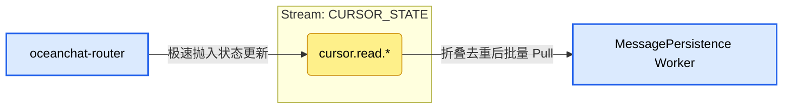

- **核心职责**: 作为极高频的已读/接收游标（ACK/Read Cursor）的**异步写缓冲 (Write-behind Cache)**，保护底层数据库（MongoDB）和缓存层（Redis）免受“确认风暴”导致的 IOPS 过载。
  - 在大群聊或极度活跃的单聊中，客户端拉取消息后会高频发送 `[0x0B] READ_RECEIPT` 确认信令。网关/路由仅将这些状态变更投递到此流，彻底实现网关层的零 I/O 阻塞。
  - 持久化工作单元（Worker）在后台以批量模式消费，将最终去重折叠后的游标状态统一同步至 Redis 并落盘到 MongoDB。

- **保留策略 (Retention Strategy)**: `RetentionPolicy.Limits` (基于限制的保留)。
  - **原因**: 游标数据属于典型的**“状态数据 (State)”**而非**“事件数据 (Event)”**。我们只关心用户的最终状态（最新看到了哪条消息），而完全不在乎过程（中间经过了哪些 SeqId）。Limits 策略配合后续的 `MaxMsgsPerSubject=1` 黑科技，实现了完美的内存与磁盘削峰。

- **存储介质 (Storage)**: `StorageType.Memory` (内存)。
  - **原因**: 即便使用文件存储，由于极致的队列去重特性，它也几乎不占用空间。哪怕极端情况下系统全量宕机丢失了一两秒内的游标 ACK 数据，系统大不了从上次 Redis 或 MongoDB 记录的位置重新开始，由于客户端在下次收发消息或断线重连时具备天然的去重机制，因此不必担心消息重复拉取的问题，完全可以激进地采用 Memory 存储来换取无敌的吞吐量。

- **关键配置与设计细节**:
  - `max_msgs_per_subject: 1` (极客级风暴折叠机制) 🌟:
    - **原因**: **这是解决群聊 ACK 写风暴的最核心黑科技。** 如果一个用户在 1 秒内疯狂滑动万人大群的聊天记录，触发了 50 次游标更新（如 SeqId 从 101 一路更新到 150）。当这 50 个更新事件被发布到精准定位该用户的同一个 Subject 下时，NATS 会自动将旧值丢弃。整个流中，针对该群该用户的游标队列里，**永远只有最新的一条数据（SeqId 150）**。
  - **异步大批次落盘 (BulkWrite)**:
    - **原因**: 持久化 Worker 不需要关心过程中的那 49 次无用更新。它只要定期（如每秒一次）从流中 Pull 拉取被折叠后最精简的状态合集。拿到 1000 个用户的最新游标后，不仅调用一次 MongoDB 的 `bulkWrite`，同时利用 Redis 的 Pipeline 功能批量更新缓存，将原本 50,000 次高频随机写操作降维打击成极少次数的网络 I/O。

#### 主题 1: cursor.read.\{groupId\}.\{userId\}

职责描述: 接收与合并特定用户在特定会话（群组/单聊）的最新游标状态。

- 生产者配置 (Producer: `oceanchat-router` 或 `oceanchat-api-gateway`)
  - 发布逻辑: 接收到客户端的 ACK/Read 信令后，**不进行任何同步数据库或 Redis 操作**，直接将 Payload（如 `{"seqId": 1005}`）异步发布至精确的通配符主题。
  - 配置详情与原因:
    - **高度具粒度的主题**: 必须把 `groupId` 和 `userId` 都写进主题名称里（如 `cursor.read.G1.U1`）。这是 `max_msgs_per_subject: 1` 能够精确执行“只为 U1 保留在 G1 的最新一条记录”的大前提。

- 消费者配置 (Consumer: `MessagePersistence Worker` 消息持久化工作单元)
  - 消费逻辑: Pull 模式订阅 `cursor.>`。
  - 配置详情与原因:
    - **批量拉取与双写同步 (Batch Pull & Dual Write)**: Worker 通过长轮询批量拉取（如 `batch: 1000`），将系统折叠后最精简的游标状态一把抓出。随后，Worker 利用 Redis Pipeline 批量更新 Redis 中的游标缓存，并执行 MongoDB BulkWrite 持久化。
    - **显式 ACK (Explicit ACK)**: 只有在 Redis 和 MongoDB 的批量写入都执行成功后，Worker 才会向 NATS 批量回传 ACK。由于客户端具备幂等去重能力，即使此处发生部分失败导致重试，也不会影响最终业务一致性。
    - **持久化队列组 (Durable Queue Group)**: 多个 Worker 实例共同分担全网的游标落盘压力，一条精简后的游标状态只会被落库一次。

### **SYS_PRESENCE (状态与事件流)**

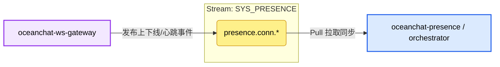

- **职责**: 处理用户在线/下线事件和连接心跳。
- **保留策略**: Interest（仅在有服务监听时保留）或短时间限制。
- **存储**: 内存（瞬态数据）。
- **生产者**: WebSocket 网关。
- **消费者**: 在线状态服务 / 推送服务。
- **策略**: 带队列组的 Pull 消费者 (至少一次交付)。

### **GROUP_HYBRID (超大群降级流)**

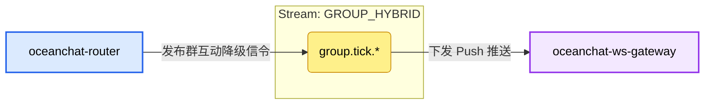

- **职责**: 专门用于万人以上超大群的 **推拉结合 (Push-Pull Hybrid)** 策略，防止扇出雪崩。
- **生产者**: 路由服务。
- **消费者**: WebSocket 网关（并间接传递给客户端）。
- **策略**: 信令推 + 客户端拉 (抖动化的 HTTP/RPC)。

### **IM_DOWNBOUND (实时在线下发流)**

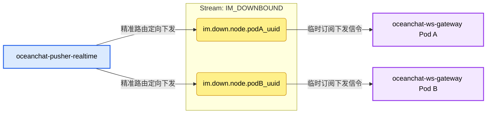

- **核心职责**: 在分布式架构中，负责将下行信令（如 `MSG_NOTIFY` 唤醒通知、`MSG_UP_ACK` 消息回执）**精准投递（Unicast）**到持有目标用户 WebSocket 长连接的特定网关实例上。
  - 这是“无状态网关”与“中心化状态服务”协同工作的纽带。核心编排服务 (`orchestrator`) 只需查阅 Redis 在线图谱找到对应设备的 `gatewayId`，即可将数据像送快递一样精准发往对应的 Pod。
- **保留策略 (Retention Strategy)**: `RetentionPolicy.Interest` (基于兴趣的保留) 或极短的 `Limits`。
  - **原因**: 下发信令强依赖特定的物理网关进程。如果 `Pod A` 崩溃，其内存中的 WebSocket 连接也会随之全部断开。此时再向 `im.down.node.podA_uuid` 堆积消息不仅毫无意义，还会造成数据黑洞。Interest 策略确保只要网关下线，流中的无主消息就会被立刻丢弃。
- **存储介质 (Storage)**: `StorageType.Memory` (内存)。
  - **原因**: 极致的下发延迟要求。在线推送的信令属于“易失性数据”，根据推拉结合机制 (Push-Pull Hybrid)，即使信令在内存中因为极端情况丢失，客户端重连或打开会话时依然会通过主动的 HTTP Sync 接口拉取历史实体数据，因此放心地采用内存以换取最高 IOPS。
- **关键配置与设计细节**:
  - **零载荷推送 (Zero-Payload Push)**: 在这里传输的 `MSG_NOTIFY` 不包含任何业务消息实体，仅携带 `GroupId` 和 `SyncSeqId`（游标）。这彻底消除了高并发群聊下的网络扇出雪崩和队头阻塞问题。

#### 主题 1: im.down.node.\{gatewayId\}

职责描述: 微服务间跨节点通信的精准快递地址，用于向单个特定的网关节点下发实时二进制协议帧。

- 生产者配置 (Producer: `oceanchat-pusher-realtime` 或 `oceanchat-orchestrator`)
  - **发布逻辑**: 从 Redis `oceanchat-presence` 查到目标用户的在线节点 ID 后，向该 UUID 对应的专属主题发布事件。
  - **配置详情与原因**:
    - **异步解耦 (Fire-and-Forget)**: 推送服务发布轻量级信令后立刻放行，无需等待网关的 ACK，充分保障在高频派发时的超高吞吐量。

- 消费者配置 (Consumer: `oceanchat-ws-gateway` 连接网关)
  - **消费逻辑**: 每个网关实例在启动时，提取自身的 UUID，动态监听只属于自己的 `im.down.node.{this.gatewayId}` 主题。
  - **配置详情与原因**:
    - **临时消费者 (Ephemeral Consumer)**: **绝不配置 `durable_name`**。
      - **原因**: 网关是无状态的物理层代理，进程销毁即代表连接断开。如果不设置 `durable_name`，这就是一个至多一次（At-Most-Once）的临时订阅。网关一死，它的私有信箱自动销毁，绝不在服务端遗留不可触达的垃圾队列。
    - **纯内存反向路由**: 收到 NATS 消息后，网关不查任何数据库，直接在本地内存树 (`userRoutingTree`: `Map<UserId, Map<DeviceId, ClientConnection>>`) 中执行 O(1) 查找，找到对应的 TCP socket。
    - **智能微批处理 (Micro-batching)**: 为了防止瞬间爆炸的大群消息引发推送风暴，网关收到信令后不立即下发，而是写入单条连接的折叠池，在 200ms 防抖窗口 (`collapseTimer`) 内将同一个群的多条 `MSG_NOTIFY` 自动折叠为单个携带最大 `SyncSeqId` 的下行数据包。

### **OFFLINE_PUSH (第三方推送流)**

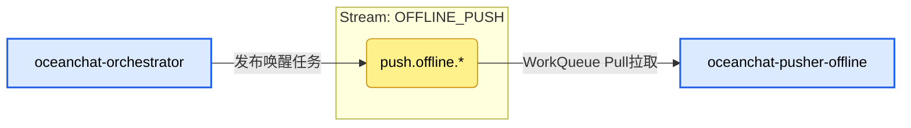

- **核心职责**: 处理发往 Apple APNs、Google FCM 以及国内厂商 API 的离线唤醒通知。
  - 当 `oceanchat-orchestrator` 检测到目标用户离线（无活跃 TCP/WS 连接）时，会将一条轻量级的唤醒任务发布到此流。
  - 专门的 `oceanchat-pusher-offline` 工作单元从该流拉取任务，并调用第三方网络接口。通过物理隔离，确保缓慢或不稳定的第三方 HTTP 调用不会拖垮核心的 `IM_CORE` 实时消息队列。

- **保留策略 (Retention Strategy)**: `RetentionPolicy.WorkQueue` (工作队列)。
  - **原因**: 离线推送是一个典型的任务消费场景。一条推送任务一旦被某个 worker 成功发送给 Apple/Google 并返回了 ACK，这个任务就彻底完成了，应当立即从 NATS 中被移除以释放空间。如果有多个推送服务实例，WorkQueue 能确保一条任务只会分配给其中一个空闲的实例进行处理，天然实现负载均衡。

- **存储介质 (Storage)**: `StorageType.File` (磁盘文件)。
  - **原因**: 第三方推送接口经常会遇到限流（Rate Limit）或宕机。如果出现大量任务积压，全放在内存会导致 NATS 内存溢出（OOM）。采用磁盘存储不仅能容纳海量积压，还能防止 NATS 重启导致尚未发出的离线通知任务丢失。

- **关键配置与设计细节**:
  - `max_msgs_per_subject: 1` 与 `discard: "old"` (折叠去重策略):
    - **原因**: 这是针对大群聊瞬间产生海量消息所引发的“扇出雪崩”问题而设计的极客级优化。离线通知的本质仅仅是“唤醒”客户端和刷新手机操作系统的未读数。配置 `max_msgs_per_subject: 1` 意味着对于单个用户的子主题（如 `push.offline.apns.user123`），NATS 队列中永远只保留最新的一条。如果新消息到来而老消息还没被消费发走，旧消息就会直接被丢弃 (`discard: "old"`) 并被新消息替换。这在队列物理层天然实现了推送**信令的无锁折叠**，极大降低了第三方接口的调用费用，同时也避免了疯狂的弹窗震动打扰用户。
  - `max_age: 24h`:
    - **原因**: 离线推送任务如果因为某些极端原因积压超过了一天，通常也就没有继续补发的意义了。超过 24 小时的死任务会被自动清理。

#### 主题 1: push.offline.\{vendor\}.\{user_id\} (例如 push.offline.apns.uid123)

职责描述: 精确派发到特定设备厂商和特定用户的离线唤醒任务主题。

- 生产者配置 (Producer: `oceanchat-orchestrator` 服务)
  - 发布逻辑: 编排服务查询 Redis 在线状态后，如果目标完全离线，则查出其设备平台，组装轻量的唤醒指令发布至此。
  - 配置详情与原因:
    - **按 `user_id` 细分的主题路径**:
      - **原因**: 必须将主题细化到单个用户级别，这样底层流级别的 `max_msgs_per_subject: 1` 策略才能知道对“哪个用户”的队列进行去重。如果把所有用户的推送任务都发到同一个宽泛的主题里，队列里就只会剩下一条数据了。

- 消费者配置 (Consumer: `oceanchat-pusher-offline` 工作单元)
  - 消费逻辑: 使用 Pull 模式通配符订阅 `push.offline.>`。
  - 配置详情与原因:
    - **拉取模式 (Pull Consumer)**:
      - **原因**: 离线推送服务需要调用苹果或谷歌的外部 HTTP API，网络延迟不可控且有严重的限流（Rate Limit）惩罚。Pull 模式允许消费者根据自身的处理能力和厂商限额“量力而行”地拉取任务，实现削峰填谷，彻底避免被海量离线任务压垮（解决 OOM 风险）。
    - **`ack_policy: "explicit"` (显式确认) 与 `ack_wait: "10s"`**:
      - **原因**: 只有当明确收到 APNs 或 FCM 返回的 HTTP 200 OK 且推送成功后，工作单元才向 NATS 发送 ACK。如果外部接口卡死、超时或返回了 5xx 错误，服务绝不发 ACK，10 秒后 NATS 会自动把该任务重新放回工作队列，交给其他健康的 worker 实例进行重试。
    - **`max_deliver: 3` (最大投递次数)**:
      - **原因**: 防止死循环。如果某个用户的 DeviceToken 已经彻底失效（例如卸载了 App），导致苹果服务器持续返回 400 BadDeviceToken，连续 5 次重试依然失败后，NATS 消费者框架会将任务作为毒消息转入死信队列（DLQ），避免该任务永久卡在队列中空耗系统资源。
    - **`durable_name: "offline-pusher-group"` (持久化消费者组)**:
      - **原因**: 必须配置一个固定的 Durable Name。这样 NATS 会将所有启动的 `oceanchat-pusher-offline` 实例视为同一个“消费者组（Consumer Group）”。它们在 NATS 服务端共享同一个消费游标，天然实现**负载均衡**。一条推送通知只会被其中一个空闲实例拉走，绝不会导致用户收到 n 次重复推送。
    - **`deliver_policy: "all"`**:
      - **原因**: 此策略**仅在消费者组首次创建时生效**。它指示 NATS 将该消费者组的初始共享游标指向流中最旧的消息。配合上面的 Durable 机制，可以确保哪怕所有推送实例都停机维护了一段时间，重新上线后整个集群也能从最早的积压任务开始，不漏不重地清空推送队列。

### **BACKGROUND_TASKS (多媒体与审计流)**

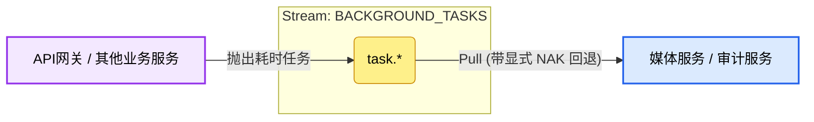

- 核心职责: 处理 CPU 密集型计算（音视频转码、缩略图生成）与耗时的外部 I/O 调用（第三方 AI 鉴黄、暴恐识别）。
  - 通过将这些繁重的多媒体与合规任务抛入专用的后台流，核心的 IM_CORE 实时聊天链路免受了“雪崩”拖垮和队头阻塞的影响，实现了“长短链协同”完美物理隔离。
- 保留策略 (Retention Strategy): RetentionPolicy.WorkQueue (工作队列)。
  - 原因: 这是一个纯粹的任务分发场景。一个转码或审核任务一旦被 Worker 成功执行并返回 ACK，就应该立刻从流中移除。工作队列模式天生支持竞争消费，如果后台部署了 10 台转码 Worker，任务会自动在它们之间进行负载均衡。
- 存储介质 (Storage): StorageType.File (磁盘文件)。
  - 原因: 多媒体转码等任务耗时较长（通常长达数十秒到数分钟）。如果遇到海量视频并发上传，任务积压在内存中极易引发 NATS OOM。落盘存储能安全地应对突发的上传洪峰。
- 关键配置与设计细节:
  - 显式 NAK 回退 (Explicit NAK):
    - 原因: 视频转码过程中 ffmpeg 极易因为文件格式异常等原因崩溃，调用外部鉴黄 API 也极易波动超时。消费者工作单元捕获到这些异常后，会立即向 NATS 发送否定确认 (NAK)。NATS 收到 NAK 后会将任务立即（或根据退避策略延迟）重新投入队列首部，转交给另一个健康的节点重试，而不是死等 Ack Wait 超时，极大提升了容错恢复速度。
  - max_deliver: 3 (最大投递次数):
    - 原因: 防止“毒文件”（如彻底损坏的非法视频文件）无限循环导致整个转码集群陷入瘫痪。超过 3 次重试失败的任务，将触发框架兜底机制，被转发至 DLQ (死信队列) 进行隔离，等待人工介入。

#### 主题 1: task.\* (例如 task.media.transcode, task.audit.nsfw)

职责描述: 触发特定后台异步计算的工作单元任务队列。

- 生产者配置 (Producer: oceanchat-api-gateway 或 oceanchat-message 服务)
  - 发布逻辑: 客户端通过 HTTP 短连接将大文件成功上传至 OSS 后，网关将文件的 OSS URL 和元数据组装为任务抛入此主题。
  - 配置详情与原因:
    - 异步 Fire-and-Forget: 业务微服务抛出任务后立刻放行，绝不等待后台转码或 AI 审核结束。这极大提升了前端请求的吞吐率，完美支持“先发后审”的业务模型。
- 消费者配置 (Consumer: 多媒体服务 / 审计服务 独立工作单元)
  - 消费逻辑: 使用 Pull 模式精确订阅所需的任务类型（如 task.media.> 或 task.audit.>）。
    - 配置详情与原因:
      - Pull 模式 (拉取消费) 与削峰填谷:
        - **原因**: 媒体处理极度消耗 CPU 和内存。Pull 模式允许这些工作单元严格根据自身的硬件负载和并发处理能力（例如限制 `batch: 1`）“量力而行”地拉取任务。这样无论前端并发多高，都不会压垮后端的 Worker 节点。
      - durable_name (持久化消费者组):
        - **原因**: 媒体服务和审计服务必须分别配置对应的 Durable Name（如 `media-worker-group` 和 `audit-worker-group`）。确保同种任务在多实例部署下不被重复处理。
      - 延长 ack_wait 时间:
        - **原因**: 相比普通的聊天信令，转码任务的执行时间较长。必须将消费者的 `ack_wait` 参数设置得足够大（例如 `5m` 或 `10m`），防止任务还在正常执行中，NATS 就误以为节点宕机而触发重新投递。

### **DEVICE_SYNC (设备同步流)**

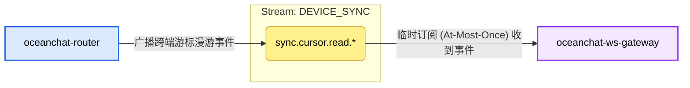

- **核心职责**: 漫游同步已读游标并清除多端通知标记。当用户在某台设备上（如手机端）阅读消息后，触发多端状态同步，让该用户登录的其他活跃设备（如电脑端、平板端）瞬间静默消除对应的未读红点。
- **保留策略 (Retention Strategy)**: `RetentionPolicy.Interest` (基于兴趣的保留)。
  - **原因**: 只有当目标用户在其他设备上确实在线（即网关存在对该 `userId` 的订阅）时，该漫游事件才有派发价值。如果没有订阅者，消息可以直接丢弃，不占用队列存储空间。
- **存储介质 (Storage)**: `StorageType.Memory` (内存)。
  - **原因**: 这仅仅是一个用于提升体验的“瞬时在线通知”。即便是发生 NATS 故障导致事件在投递前丢失，客户端在新设备重连时也会自动从后端拉取一次完整的最新同步游标（通过 HTTP 同步）。因此这部分数据允许丢失，可放心地放在内存里换取极致的 IOPS。

#### 主题 1: sync.cursor.read.\{userId\}

职责描述: 广播特定用户的跨设备游标同步事件。

- 生产者配置 (Producer: `oceanchat-router` 路由服务)
  - 发布逻辑: 在处理来自网关透传的 `[0x0B] READ_RECEIPT` 协议包时，`oceanchat-router` 除了将游标异步放入 `CURSOR_STATE` 进行持久化折叠外，还会向此流的 `sync.cursor.read.{userId}` 主题广播一条跨端同步事件。

- 消费者配置 (Consumer: `oceanchat-ws-gateway` 连接网关)
  - 消费逻辑: 临时、至多一次 (At-Most-Once) 订阅模式监听。
  - 配置详情与原因:
    - **无 durableName (临时订阅)**: 该用户可能同时在线于多个不同的网关实例（如 PC 连在网关A，iPad 连在网关B）。每个网关实例都需要收到这份广播（Fan-out），因此不能组建 Queue Group，必须使用独立的临时订阅。
    - **静默下发与红点消除**: 网关收到该主题事件后，立刻组装跨端清除指令并向对应的长连接下发。电脑端等接收到指令后，静默更新本地数据库中对应群组的 `MaxLocalSyncSeqId` 游标，并在 UI 界面上瞬间消除未读红点，无需人工干预。
