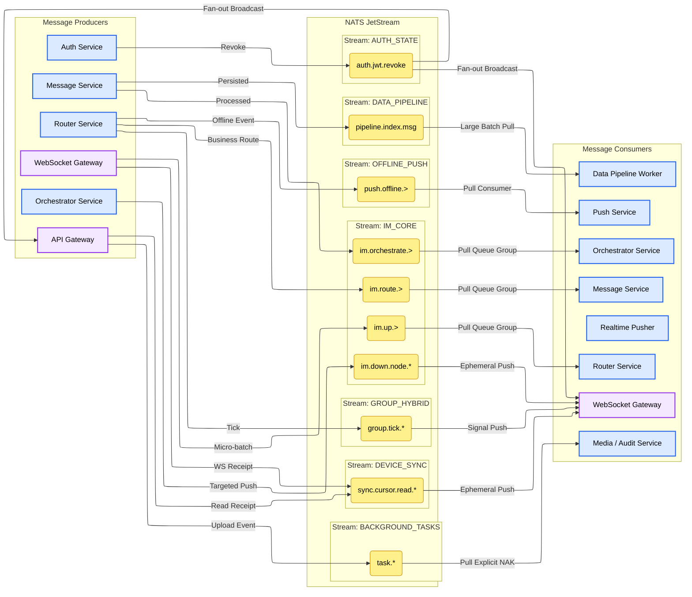
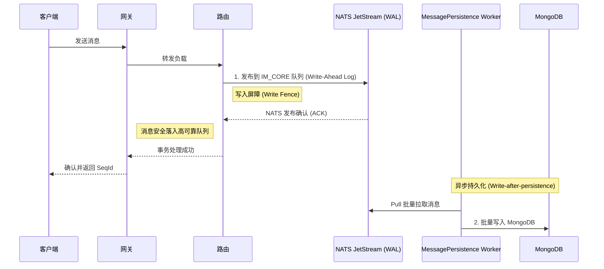

<head>
  <meta name="twitter:card" content="summary_large_image" />
  <meta property="og:title" content="JetStream 拓扑与消费策略 | Ocean Chat" />
  <meta property="og:description" content="Ocean Chat NATS JetStream 拓扑、主题命名空间及分布式消费策略详解，支持十万级并发连接。" />
  <link rel="canonical" href="https://jameswilson19970101.github.io/ocean.chat.docs/zh-CN/docs/devdocs/jetstream-strategy" />
</head>

# NATS JetStream 拓扑与策略

为了支持十万级并发连接，Ocean Chat 将 **NATS JetStream** 不仅作为消息中间件，更作为连接所有微服务的中枢神经系统。该拓扑严格隔离了高吞吐量数据流与控制流，并利用通配符路由实现精确的微服务消费策略。

## 架构概览图

下图展示了 Ocean Chat 微服务与 NATS JetStream 主题之间的生产和消费流程。

本文档详细介绍了 Ocean Chat 架构所需的流定义、主题命名空间以及交付语义（推/拉、至少一次、至多一次）。

## 1. 流定义

Ocean Chat 中的流按 **业务域** 和 **数据保留生命周期** 进行分区，绝不按用户或群组 ID 分区（否则会导致流爆炸）。

### **IM_CORE (核心消息流)**

- **职责**: 承载所有上行用户消息、微服务间路由以及下行系统推送。这是吞吐量最高的流。
- **保留策略**: 限制策略（如 3-7 天），由专门的 MessagePersistence 数据处理管道中的 Worker 进行 MongoDB 异步持久化备份。
- **存储**: 文件存储 (SSD)，用于高吞吐和持久化。
- **生产者**: WebSocket 网关 (上行消息), 路由及消息逻辑服务 (内部交接), 推送编排服务 (下行指令)。
- **消费者**: 路由及各业务服务 (Pull Queue), WebSocket 网关 (下行 Push)。
- **写入屏障约束**: 进入此流的所有上行消息受写入屏障约束，NATS JetStream 作为预写日志 (WAL) 保证高可靠性及最终一致性，消息落入队列后即向客户端 ACK，数据库落库则完全异步进行，详情参见 [Monkey 协议写栅栏](./monkey-protocol-spec.md)。

### **AUTH_STATE (全局安全流)**

- 核心职责: 用于在微服务之间高速广播全局关键的安全状态变更。
  - 目前专用于 JWT 令牌的黑名单撤销同步 (`auth.jwt.revoke`)。
  - 当发生用户主动登出、后台检测到 Refresh Token 遭到重放攻击（Replay Attack），或者正常的刷新令牌轮换导致旧 Access Token 必须立即失效时，Auth 服务会向此流发布撤销指令。
  - API Gateway 是其主要消费者。Gateway 采用“零 I/O (Zero-I/O) 认证”架构，它不再针对每个请求去查询 Redis，而是通过订阅此流在内存中构建和维护一个本地黑名单（`TokenBlacklistService`）。

- 保留策略 (Retention Strategy): `RetentionPolicy.Limits` (基于限制的保留)。
  - 原因: 这是一个典型的广播（Broadcast / Fan-out）模式。如果有多个 API Gateway 实例，或者网关正在重启，每个实例都必须能够获取到这段时间内的撤销记录。如果使用 Workqueue 模式，一个网关读取了事件后事件就会消失，其他网关就收不到了。

- 存储介质 (Storage): `StorageType.Memory` (内存)。
  - 原因: 黑名单状态具有极高的时效性，读写速度要求最高，放入内存可以实现极致的延迟表现。
  - (注：基于安全性考量，如果 NATS Server 发生崩溃重启，内存数据会丢失。虽然网关会在 JWT 层面校验，但如果条件允许，对于这种数据量极小但极其关键的安全事件，修改为 File 存储能进一步提升容灾能力。)

- 关键配置与设计细节:
  - max_age: 30分钟: 这是一个非常巧妙的滑动窗口设计。因为网关只需要拦截仍在有效生命周期内但被提前撤销的 Token。配置文件中 Access Token 自然寿命是 30 分钟，超过 30 分钟前的撤销事件就毫无保留价值了（因为 Token 自身校验就会过期失效）。(注意：这个值必须大于或等于 `jwt.accessExpiresIn` 配置的时间)。
  - 消费者类型 (`Ephemeral + DeliverPolicy.All`): API 网关没有配置 `durableName`，是一个临时消费者。它每次启动或断线重连时，都会带上 `DeliverPolicy.All` 策略，从头拉取当前流里所有存活的（即过去 30 分钟内）数据。这保证了网关在冷启动时能迅速重建完整的黑名单缓存，防止安全真空期。
  - 发布优先级 (`isCritical: true`): 在底层的 `BoundedPublisherService` 中，撤销指令享有预留的“安全通道”队列额度，即便系统被普通事件挤爆，撤销指令也能优先发出，确保系统安全。

#### 主题 1: auth.jwt.revoke

职责描述: 广播 JWT Token 提前失效（如主动登出、踢人、检测到重放攻击）的安全指令。

- 生产者配置 (Producer: `oceanchat-auth` 服务)
  - 发布逻辑: `BoundedPublisherService.publishSafe('auth.jwt.revoke', payload, '...', { isCritical: true })`
  - 配置详情与原因:
    - isCritical: true (关键优先级):
      - 原因: 此主题传输的是核心安全指令。`BoundedPublisherService` 在内存中维护了两个限制队列：普通队列 (`maxNormalQueueSize=5000`) 和 关键队列(`maxCriticalQueueSize=10000`)。当系统遭受极大流量冲击导致背压（Backpressure）时，普通事件会被抛弃，但配置了 `isCritical: true` 的消息将使用更大的安全阈值，确保在系统极度高压下，撤销指令依然能发送出去，保障系统安全性。
    - 异步 Fire-and-Forget (不等待执行结果):
      - 原因: 撤销指令的发布不应该阻塞当前 HTTP 响应的 RT（响应时间），采用异步抛出可以极大提高接口吞吐量。

- 消费者配置 (Consumer: `oceanchat-api-gateway` 服务)
  - 消费逻辑: `NatsEventsService extends BaseNatsSubscriber`
  - 配置详情与原因:
    - durableName: undefined (临时消费者 / Ephemeral):
      - 原因: API 网关需要的是广播模式 (Fan-out)。如果配置了 `durableName`，多个网关实例会形成负载均衡（互相抢消息），导致每个实例只拿到了一部分黑名单记录。不设 `durableName`，意味着每个网关实例都会建立一个独立的临时订阅，每个实例都能收到所有的撤销指令，从而在各自内存中维护完整的黑名单。
    - deliver_policy: `DeliverPolicy.All` (拉取全量历史):
      - 原因: 临时消费者一旦断开重连，中间的消息就会丢失。为了解决冷启动/网络闪断问题，网关每次连接都会要求 NATS 把流里现存的所有消息（过去30分钟内的所有撤销记录）全部重新发一遍。这就完美实现了网关内存黑名单的快速重建。
    - Redis 分布式锁 `setnx(idempotencyKey, '1', 120)` (幂等处理):
      - 原因: 应对极小概率下 NATS 的网络重发（At-Least-Once）。由于网关把 DeliverPolicy 设为了 All，它每次重启都会拉到已经处理过的老消息，Redis 锁在这里作为高速缓存，快速忽略掉已经在黑名单中的 Token，避免重复执行入库逻辑。

### **AUTH_EVENTS (认证事件流)**

- 核心职责: 用于记录和分发系统业务层面的行为与事件。
  - 目前主要用于广播用户登录成功事件 (auth.event.user.loggedIn)。
  - 属于典型的异步解耦设计。Auth 模块专注于高并发的鉴权和发证，至于“记录用户的最后登录时间”、“更新登录设备历史”这些耗时但不影响用户当前请求的操作，会被作为事件抛入此流，由 oceanchat-user 服务在后台异步、慢慢地消费处理。

- 保留策略 (Retention Strategy): RetentionPolicy.Limits (生产环境)。
  - 原因: 这是事件溯源（Event Sourcing / Pub-Sub）模式。一个登录事件除了让 User 服务更新资料外，未来完全可能让安全审计服务（Audit）或数据统计服务（Analytics）同时也去消费它。Limits 策略确保了一条事件可以被任意个不同业务的消费者（Consumer Group）独立消费。

- 存储介质 (Storage): StorageType.File (磁盘文件)。
  - 原因: 业务事件具有数据价值和一致性要求。如果下游的 User 服务宕机或者 NATS 发生重启，文件存储能保证这段时间内的所有登录记录都不会丢失。

- 关键配置与设计细节:
  - max_age: 24小时: 给下游消费者留足了故障恢复窗口。如果 User 服务由于 Bug 挂掉了，运维人员有长达 24 小时的时间来修复和重启它。重启后，它可以继续处理积压的登录事件。超过 24 小时的数据才会被清理以释放磁盘空间。
  - 消费者类型 (Durable Consumer): oceanchat-user 配置了 durableName: 'oceanchat-user-auth-events'。这让 NATS 服务端持久化地记住了它的消费进度（Cursor/Offset）。即使重启，它也会从上次断开的地方继续消费，做到不漏消息。同时，如果有多个 User 服务实例运行，同名的 Durable 会自动形成队列组（Queue Group），实现负载均衡（一条登录事件只被其中一个实例处理一次）。
  - 幂等性保障: 由于 NATS JetStream 保证的是“至少投递一次（At-least-once）”，为了防止极端网络下的重复投递导致数据库被重复更新，消费者内部借助 Redis 实现了严格的分布式防重锁。

#### 主题 1: auth.event.user.loggedIn

职责描述: 记录用户登录成功的业务行为，用于更新设备的最后活跃时间、记录审计日志等。

- 生产者配置 (Producer: `oceanchat-auth` 服务)
  - 发布逻辑: `BoundedPublisherService.publishSafe('auth.event.user.loggedIn', payload, '...', { isCritical: false })`
  - 配置详情与原因:
    - isCritical: false (普通优先级):
      - 原因: 记录登录时间属于非关键业务事件。如果 Auth 服务因为遇到流量洪峰导致 NATS 彻底拥堵，丢弃这些日志事件是可以接受的（优雅降级），绝对不能为了记录一个登录时间而把 Auth 服务的内存撑爆导致真正的登录功能瘫痪。

- 消费者配置 (Consumer: `oceanchat-user` 服务)
  - 消费逻辑: `NatsEventsService extends BaseNatsSubscriber`
  - 配置详情与原因:
    - durableName: `oceanchat-user-auth-events` (持久化消费者 / Durable)
      - 原因: 这是一个工作队列/单播模式。不管后台部署了多少个 `oceanchat-user` 服务实例，一条登录事件只能被一个实例处理一次（否则会疯狂并发写数据库）。同名的 Durable 会让 NATS 服务端自动在这些实例间做负载均衡 (Load Balancing)。并且，持久化记录了消费游标（Offset），如果所有 user 服务宕机一小时，重启后它们会接着一小时前的地方继续处理，绝不漏单。

### **AUTH_DLQ (死信队列流)**

- 核心职责: 系统的错误兜底仓库 (Dead Letter Queue)。集中存放因为种种原因（代码 Bug、脏数据、下游数据库崩溃）经过多次重试依然无法被正常处理的“毒消息（Poison Message）”。
- 保留策略 (Retention Strategy): RetentionPolicy.Limits。
  - 原因: 错误现场的原始数据，不能被其他消费者意外消耗，必须在存储范围内永久保留，等待人工或自动化系统介入。

- 存储介质 (Storage): StorageType.File (磁盘文件)。
  - 原因: 死信数据包含了极其珍贵的报错上下文和原始 Payload，必须绝对可靠地持久化落盘防止丢失。

- 关键配置与设计细节:
  - max_age: 7天: 给开发者和运维团队留出了充足的缓冲期（涵盖了周末和长假）。一旦收到 DLQ 告警，工程师有 7 天的时间来定位问题。修好 Bug 后，还可以通过运维接口从 DLQ 中提取原消息重新投递（只需去掉 dlq. 前缀）。
  - 统一的降级前缀 (dlq.>): 通过规范的主题命名（目前是 dlq.auth.event.> 等），框架能够对系统内不同业务的失败事件进行集中归档，并且通过后缀仍能清晰知道它是哪个业务线产生的死信。
  - 全方位的流入机制:
    - 消费端兜底: 在 BaseNatsSubscriber 中，如果一条消息在消费者端报错 NAK（比如 User 库连不上），且重试达到最大次数 (max_deliver: 3) 后仍失败，消费者框架会主动拦截它，将其转发给 DLQ，并对原消息发 ACK（从原队列踢出，防止无限死循环卡死整个队列）。
    - 生产端兜底: 在 BoundedPublisherService 中，如果 NATS 异常或限流器满载导致普通主题发布失败，发布者框架也会尝试作为 Fallback 把数据扔进 DLQ 保存证据。

#### 主题 1: dlq.> (例如 dlq.auth.event.user.loggedIn)

职责描述: 毒消息（Poison Message）和崩溃现场的回收站。

- 生产者配置 (Producer: 各个微服务中的框架层拦截) 这是一个比较特殊的主题，它的“生产者”不是业务代码，而是底层框架的异常捕获机制。
  - 生产场景 1：消费者（Consumer）重试耗尽:
    - 逻辑: 在 `BaseNatsSubscriber.handleError` 中，当 `deliveryCount >= max_deliver` (默认3次) 依然抛出异常时。
    - 发布行为: 往 `dlq.${m.subject}` 发送原消息，并对原始消息发送 `m.ack()`。
    - 原因: 如果数据库挂了或者遇到代码解不开的脏数据，一直 `m.nak()` 会导致这条消息永远卡在队列前面，阻塞后续所有正常消息的消费（队列阻塞）。将其转存入 DLQ，同时对原队列 ACK，可以“疏通管道”，将错误隔离开来。
  - 生产场景 2：生产者（Publisher）NATS链路中断:
    - 逻辑: 在 `BoundedPublisherService` 中，如果主 subject 发布失败。
    - 发布行为: 进入 .catch() 尝试 `js.publish(dlqSubject, payload)`。
    - 原因: 作为最后一道防线，当目标流不可用（比如配置配错了）时，尝试把数据写入 DLQ 流保存，尽最大努力保留数据证据。

- 消费者配置 (Consumer: 目前为无)
  - 原因：死信队列绝对不能被自动消费。进入 DLQ 的消息意味着经过了系统的反复挣扎依然无法处理。它必须长期静静躺在硬盘上（max_age: 7天）。
  - 未来演进: 通常的做法是，触发 DLQ 的写入会直接联动公司的告警系统（飞书、钉钉机器人）。开发人员看到报警后，排查日志，修复 Bug，最后通过一个 Admin 后台管理界面，点击“一键重放（Replay）”，系统在后台把 dlq. 前缀去掉，重新发回对应的流。

### **SYS_PRESENCE (状态与事件流)**

- **职责**: 处理用户在线/下线事件和连接心跳。
- **保留策略**: Interest（仅在有服务监听时保留）或短时间限制。
- **存储**: 内存（瞬态数据）。
- **生产者**: WebSocket 网关。
- **消费者**: 在线状态服务 / 推送服务。
- **策略**: 带队列组的 Pull 消费者 (至少一次交付)。

### **GROUP_HYBRID (超大群降级流)**

- **职责**: 专门用于万人以上超大群的 **推拉结合 (Push-Pull Hybrid)** 策略，防止扇出雪崩。
- **生产者**: 路由服务。
- **消费者**: WebSocket 网关（并间接传递给客户端）。
- **策略**: 信令推 + 客户端拉 (抖动化的 HTTP/RPC)。

### **OFFLINE_PUSH (第三方推送流)**

- **核心职责**: 处理发往 Apple APNs、Google FCM 以及国内厂商 API 的离线唤醒通知。
  - 当 `oceanchat-orchestrator` 检测到目标用户离线（无活跃 TCP/WS 连接）时，会将一条轻量级的唤醒任务发布到此流。
  - 专门的 `oceanchat-pusher-offline` 工作单元从该流拉取任务，并调用第三方网络接口。通过物理隔离，确保缓慢或不稳定的第三方 HTTP 调用不会拖垮核心的 `IM_CORE` 实时消息队列。

- **保留策略 (Retention Strategy)**: `RetentionPolicy.WorkQueue` (工作队列)。
  - **原因**: 离线推送是一个典型的任务消费场景。一条推送任务一旦被某个 worker 成功发送给 Apple/Google 并返回了 ACK，这个任务就彻底完成了，应当立即从 NATS 中被移除以释放空间。如果有多个推送服务实例，WorkQueue 能确保一条任务只会分配给其中一个空闲的实例进行处理，天然实现负载均衡。

- **存储介质 (Storage)**: `StorageType.File` (磁盘文件)。
  - **原因**: 第三方推送接口经常会遇到限流（Rate Limit）或宕机。如果出现大量任务积压，全放在内存会导致 NATS 内存溢出（OOM）。采用磁盘存储不仅能容纳海量积压，还能防止 NATS 重启导致尚未发出的离线通知任务丢失。

- **关键配置与设计细节**:
  - `max_msgs_per_subject: 1` 与 `discard: "old"` (折叠去重策略):
    - **原因**: 这是针对大群聊瞬间产生海量消息所引发的“扇出雪崩”问题而设计的极客级优化。离线通知的本质仅仅是“唤醒”客户端和刷新手机操作系统的未读数。配置 `max_msgs_per_subject: 1` 意味着对于单个用户的子主题（如 `push.offline.apns.user123`），NATS 队列中永远只保留最新的一条。如果新消息到来而老消息还没被消费发走，旧消息就会直接被丢弃 (`discard: "old"`) 并被新消息替换。这在队列物理层天然实现了推送**信令的无锁折叠**，极大降低了第三方接口的调用费用，同时也避免了疯狂的弹窗震动打扰用户。
  - `max_age: 24h`:
    - **原因**: 离线推送任务如果因为某些极端原因积压超过了一天，通常也就没有继续补发的意义了。超过 24 小时的死任务会被自动清理。

#### 主题 1: push.offline.{vendor}.{user_id} (例如 push.offline.apns.uid123)

职责描述: 精确派发到特定设备厂商和特定用户的离线唤醒任务主题。

- 生产者配置 (Producer: `oceanchat-orchestrator` 服务)
  - 发布逻辑: 编排服务查询 Redis 在线状态后，如果目标完全离线，则查出其设备平台，组装轻量的唤醒指令发布至此。
  - 配置详情与原因:
    - **按 `user_id` 细分的主题路径**:
      - **原因**: 必须将主题细化到单个用户级别，这样底层流级别的 `max_msgs_per_subject: 1` 策略才能知道对“哪个用户”的队列进行去重。如果把所有用户的推送任务都发到同一个宽泛的主题里，队列里就只会剩下一条数据了。

- 消费者配置 (Consumer: `oceanchat-pusher-offline` 工作单元)
  - 消费逻辑: 使用 Pull 模式通配符订阅 `push.offline.>`。
  - 配置详情与原因:
    - **拉取模式 (Pull Consumer)**:
      - **原因**: 离线推送服务需要调用苹果或谷歌的外部 HTTP API，网络延迟不可控且有严重的限流（Rate Limit）惩罚。Pull 模式允许消费者根据自身的处理能力和厂商限额“量力而行”地拉取任务，实现削峰填谷，彻底避免被海量离线任务压垮（解决 OOM 风险）。
    - **`ack_policy: "explicit"` (显式确认) 与 `ack_wait: "10s"`**:
      - **原因**: 只有当明确收到 APNs 或 FCM 返回的 HTTP 200 OK 且推送成功后，工作单元才向 NATS 发送 ACK。如果外部接口卡死、超时或返回了 5xx 错误，服务绝不发 ACK，10 秒后 NATS 会自动把该任务重新放回工作队列，交给其他健康的 worker 实例进行重试。
    - **`max_deliver: 5` (最大投递次数)**:
      - **原因**: 防止死循环。如果某个用户的 DeviceToken 已经彻底失效（例如卸载了 App），导致苹果服务器持续返回 400 BadDeviceToken，连续 5 次重试依然失败后，NATS 消费者框架会将任务作为毒消息转入死信队列（DLQ），避免该任务永久卡在队列中空耗系统资源。
    - **`durable_name: "offline-pusher-group"` (持久化消费者组)**:
      - **原因**: 必须配置一个固定的 Durable Name。这样 NATS 会将所有启动的 `oceanchat-pusher-offline` 实例视为同一个“消费者组（Consumer Group）”。它们在 NATS 服务端共享同一个消费游标，天然实现**负载均衡**。一条推送通知只会被其中一个空闲实例拉走，绝不会导致用户收到 n 次重复推送。
    - **`deliver_policy: "all"`**:
      - **原因**: 此策略**仅在消费者组首次创建时生效**。它指示 NATS 将该消费者组的初始共享游标指向流中最旧的消息。配合上面的 Durable 机制，可以确保哪怕所有推送实例都停机维护了一段时间，重新上线后整个集群也能从最早的积压任务开始，不漏不重地清空推送队列。

### **DATA_PIPELINE (异构数据流)**

- **职责**: 作为数据管道，将聊天记录同步到 Elasticsearch 以进行全局搜索。
- **保留策略**: 限制策略（保留数据直至成功索引）。
- **存储**: 文件存储 (SSD)。
- **生产者**: MessagePersistence Worker（保存到 MongoDB 后立即触发）。
- **消费者**: 数据管道工作单元。
- **策略**: **大批次 Pull**。工作单元一次获取数千条消息，并使用 Elasticsearch Bulk API 进行高效索引。

### **BACKGROUND_TASKS (多媒体与审计流)**

- **职责**: 管理 CPU 密集型后台作业，如媒体转码、缩略图生成和内容审计（NSFW 过滤）。
- **保留策略**: 工作队列 (WorkQueue)。
- **存储**: 文件存储 (SSD)。
- **生产者**: API 网关或业务微服务（文件上传成功后触发）。
- **消费者**: 多媒体服务 / 审计服务。
- **策略**: **带显式 NAK 的 Pull 消费者**。如果视频转码任务失败，消费者向 NATS 发送否定确认 (NAK)，立即将任务重新入队到另一个健康的实例，而不是等待超时。

### **DEVICE_SYNC (设备同步流)**

- **职责**: 同步已读游标并清除多端通知标记。
- **保留策略**: 限制策略或 Interest。
- **存储**: 内存（针对极端 IOPS 优化；由于客户端在重新连接后会进行自动同步，因此在 NATS 重启期间丢失是安全的）。
- **生产者**: API 网关（HTTP 回执）及 WebSocket 网关（WS 信令回执）。
- **消费者**: WebSocket 网关。
- **策略**: **临时至多一次 (At-Most-Once) Push**。网关监听游标更新，并静默传递给连接的客户端以清除 UI 标记。

## 2. 主题命名空间设计

主题层级利用 NATS 通配符 (`*` 和 `>`) 实现精确路由。

- **上行消息 (网关 -> 后端)**
  - 点对点聊天: `im.up.p2p`
  - 群聊: `im.up.group`
  - 信令 (已读、撤回): `im.up.signal.*`
- **内部流转 (内部微服务交接)**
  - 业务路由: `im.route.{service}` (如 `im.route.message`, `im.route.group`)
  - 推送编排: `im.orchestrate.{push_type}`
- **下行推送 (推送服务 -> 网关)**
  - 定向节点推送: `im.down.node.{gateway_node_uuid}`
- **系统状态**
  - 连接事件: `presence.conn.online`, `presence.conn.offline`
- **身份验证控制**
  - 令牌撤销: `auth.jwt.revoke`

## 5. 可靠性时序图

下图展示了微服务与 JetStream 之间的交互，以确保 **写入屏障 (Write Fence)** 保证。

