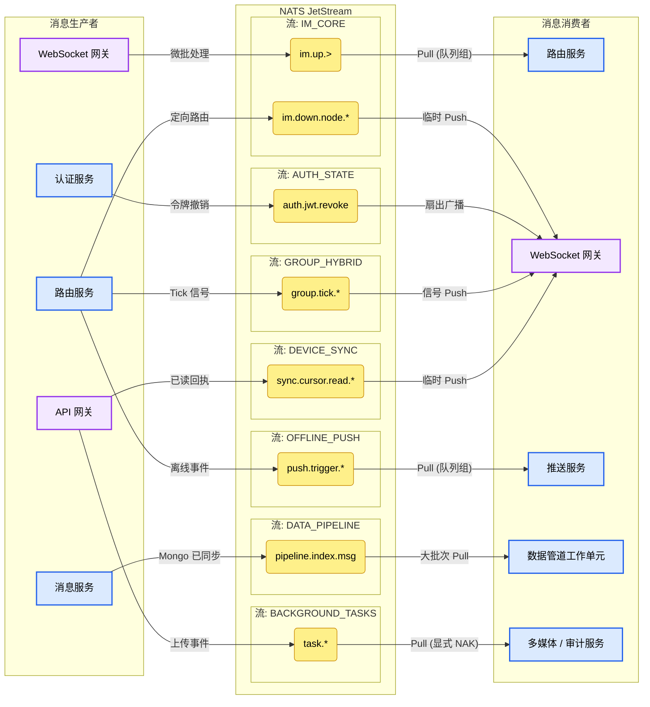
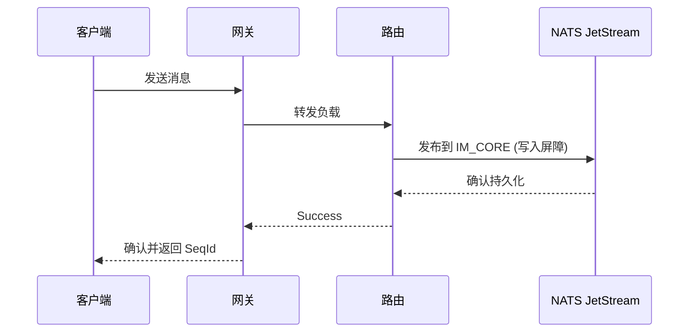

<head>
  <meta name="twitter:card" content="summary_large_image" />
  <meta property="og:title" content="JetStream 拓扑与消费策略 | Ocean Chat" />
  <meta property="og:description" content="Ocean Chat NATS JetStream 拓扑、主题命名空间及分布式消费策略详解，支持千万级并发连接。" />
  <link rel="canonical" href="https://docs.oceanchat.com/zh-CN/devdocs/jetstream-strategy" />
</head>

# NATS JetStream 拓扑与策略

为了支持千万级并发连接，Ocean Chat 将 **NATS JetStream** 不仅作为消息中间件，更作为连接所有微服务的中枢神经系统。该拓扑严格隔离了高吞吐量数据流与控制流，并利用通配符路由实现精确的微服务消费策略。

## 架构概览图

下图展示了 Ocean Chat 微服务与 NATS JetStream 主题之间的生产和消费流程。

本文档详细介绍了 Ocean Chat 架构所需的流定义、主题命名空间以及交付语义（推/拉、至少一次、至多一次）。

## 1. 流定义 (宏观隔离)

Ocean Chat 中的流按 **业务域** 和 **数据保留生命周期** 进行分区，绝不按用户或群组 ID 分区（否则会导致流爆炸）。

### **IM_CORE (核心消息流)**

- **职责**: 承载所有上行用户消息和下行系统推送。这是吞吐量最高的流。
- **保留策略**: 限制策略（如 3-7 天），由 MongoDB 进行冷存储备份。
- **存储**: 文件存储 (SSD)，用于高吞吐和持久化。
- **生产者**: WebSocket 网关 (上行消息), 路由服务 (下行消息)。
- **消费者**: 路由服务 (上行), WebSocket 网关 (下行)。
- **策略**: 带队列组的 Pull 消费者 (用于路由), 临时 Push 消费者 (用于交付)。
- **写入屏障约束**: 进入此流的所有消息必须遵循 [Monkey 协议写栅栏](./monkey-protocol-spec.md)，以确保绝对一致性。

### **AUTH_STATE (全局安全流)**

- **职责**: 分发 JWT 撤销黑名单和安全策略，以支持 Zero-I/O 本地身份验证。
- **保留策略**: 工作队列 (WorkQueue) 或 NATS KV 存储。
- **存储**: 内存或文件。
- **生产者**: 认证服务。
- **消费者**: 所有 WebSocket 网关实例。
- **策略**: 扇出广播 (无队列组)。

### **SYS_PRESENCE (状态与事件流)**

- **职责**: 处理用户在线/下线事件和连接心跳。
- **保留策略**: Interest（仅在有服务监听时保留）或短时间限制。
- **存储**: 内存（瞬态数据）。
- **生产者**: WebSocket 网关。
- **消费者**: 在线状态服务 / 推送服务。
- **策略**: 带队列组的 Pull 消费者 (至少一次交付)。

### **GROUP_HYBRID (超大群降级流)**

- **职责**: 专门用于万人以上超大群的 **推拉结合 (Push-Pull Hybrid)** 策略，防止扇出雪崩。
- **生产者**: 路由服务。
- **消费者**: WebSocket 网关（并间接传递给客户端）。
- **策略**: 信令推 + 客户端拉 (抖动化的 HTTP/RPC)。

## 2. 主题命名空间设计

主题层级利用 NATS 通配符 (`*` 和 `>`) 实现精确路由。

- **上行消息 (网关 -> 后端)**
  - 点对点聊天: `im.up.p2p`
  - 群聊: `im.up.group`
  - 信令 (已读、撤回): `im.up.signal.*`
- **下行推送 (路由 -> 网关)**
  - 定向节点推送: `im.down.node.{gateway_node_uuid}`
- **系统状态**
  - 连接事件: `presence.conn.online`, `presence.conn.offline`
- **身份验证控制**
  - 令牌撤销: `auth.jwt.revoke`

## 3. 微服务消费策略

Ocean Chat 生态系统中的不同微服务需要不同的一致性模型和 JetStream 消费者类型。

:::danger
严禁在 CPU 密集型任务（如路由或消息持久化）中使用 **Push 消费者**。在高负载下，Push 消费者会导致内存耗尽 (OOM) 和大规模重传雪崩。请务必使用带批处理的 **Pull 消费者** 进行重型处理。
:::

import Tabs from '@theme/Tabs';
import TabItem from '@theme/TabItem';

<Tabs>
<TabItem value="router" label="路由服务: 核心路由" default>

路由服务是 IM 系统的核心，负责解码 Protobuf 负载并计算目标网关节点。

- **生产者**: WebSocket 网关（发布微批处理后的客户端消息）。
- **消费者**: 路由服务。
- **策略**: **至少一次 (At-Least-Once) + 队列组 (Queue Group) + Pull 模式**。
- **机制**: 多个路由服务实例使用队列组分担负载。它们使用持续的长轮询循环（例如一次获取 500 条消息）来批量处理。仅在处理成功并记录数据库后发送显式 ACK。

</TabItem>
<TabItem value="gateway" label="WebSocket 网关: 定向交付">

连接网关是严格无状态的，充当透明代理。

- **生产者**: 路由服务（计算并路由到特定网关）。
- **消费者**: WebSocket 网关（监听其特定的 `local_uuid`）。
- **策略**: **至多一次 (At-Most-Once) + 临时 Push 消费者**。
- **机制**: 路由服务向特定网关节点发送下行消息。网关将其盲目转发至已建立的 WebSocket。如果网关崩溃，消息在传输过程中丢失。可靠性由客户端通过 [可靠性与时序保障](./monkey-protocol-spec.md) 保证。

</TabItem>
<TabItem value="auth" label="认证服务: Zero-I/O 验证">

通过保持本地内存状态同步来实现 Zero-I/O 身份验证机制。

- **生产者**: 认证服务（触发令牌撤销）。
- **消费者**: 所有 WebSocket 网关实例。
- **策略**: **扇出广播 (无队列组)**。
- **机制**: 每个网关实例必须独立订阅 `auth.jwt.revoke`。当令牌被撤销时，事件同时到达所有网关，以更新其内存黑名单，从而消除连接握手期间的 Redis 网络 I/O。

</TabItem>
<TabItem value="group" label="群组服务: 推拉结合">

专为超大群组（如直播间）设计，防止 NATS 雪崩。

- **生产者**: 路由服务。
- **消费者**: WebSocket 网关（并间接传递给客户端）。
- **策略**: **信令推 + 客户端拉**。
- **机制**: 路由服务不再扇出 10 万条完整的 Protobuf 消息到 `im.down.node.*`，而是向 `group.tick.{group_id}` 发布一个包含最新 MaxSeqId 的微小 Tick 信号。网关转发该信号，客户端随后发起抖动化的 HTTP/RPC 拉取以获取实际负载，从而平滑后端读取峰值。

</TabItem>
</Tabs>

## 4. 边缘服务流

为了保护 `IM_CORE` 的吞吐量，外围任务被物理隔离到专用流中：

### **OFFLINE_PUSH (第三方推送流)**

- **职责**: 处理发往 APNs、FCM 和其他厂商 API 的离线通知。
- **保留策略**: 工作队列 (WorkQueue)。成功推送后移除消息。
- **存储**: 文件存储 (SSD)，防止厂商 API 故障期间数据丢失。
- **生产者**: 路由服务（当检测到目标用户没有活跃的 TCP 连接时触发）。
- **消费者**: 推送服务。
- **策略**: **队列组 + Pull 消费者**。由于厂商 API 容易触发频率限制和延迟，Pull 模式允许服务控制消费速率。内置的 NATS 重传机制可处理不稳定的外部网络调用。

### **DATA_PIPELINE (异构数据流)**

- **职责**: 作为数据管道，将聊天记录同步到 Elasticsearch 以进行全局搜索。
- **保留策略**: 限制策略（保留数据直至成功索引）。
- **存储**: 文件存储 (SSD)。
- **生产者**: 消息服务（保存到 MongoDB 后立即触发）。
- **消费者**: 数据管道工作单元。
- **策略**: **大批次 Pull**。工作单元一次获取数千条消息，并使用 Elasticsearch Bulk API 进行高效索引。

### **BACKGROUND_TASKS (多媒体与审计流)**

- **职责**: 管理 CPU 密集型后台作业，如媒体转码、缩略图生成和内容审计（NSFW 过滤）。
- **保留策略**: 工作队列 (WorkQueue)。
- **存储**: 文件存储 (SSD)。
- **生产者**: API 网关或业务微服务（文件上传成功后触发）。
- **消费者**: 多媒体服务 / 审计服务。
- **策略**: **带显式 NAK 的 Pull 消费者**。如果视频转码任务失败，消费者向 NATS 发送否定确认 (NAK)，立即将任务重新入队到另一个健康的实例，而不是等待超时。

### **DEVICE_SYNC (设备同步流)**

- **职责**: 同步已读游标并清除多端通知标记。
- **保留策略**: 限制策略或 Interest。
- **存储**: 内存（针对极端 IOPS 优化；由于客户端在重新连接后会进行自动同步，因此在 NATS 重启期间丢失是安全的）。
- **生产者**: API 网关（收到客户端的已读回执后触发）。
- **消费者**: WebSocket 网关。
- **策略**: **临时至多一次 (At-Most-Once) Push**。网关监听游标更新，并静默传递给连接的客户端以清除 UI 标记。

## 5. 可靠性时序图

下图展示了微服务与 JetStream 之间的交互，以确保 **写入屏障 (Write Fence)** 保证。

