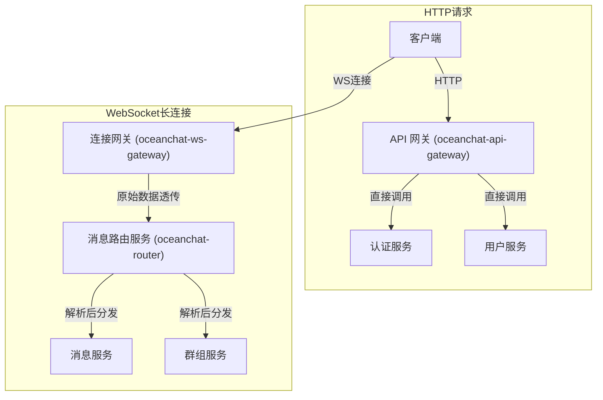

import Tabs from '@theme/Tabs';
import TabItem from '@theme/TabItem';

# 微服务架构

:::info 架构概览
整个平台被划分为四个逻辑层，共包含 11 个核心微服务和 1 个数据处理管道，确保了职责的清晰分离。
:::

## IM 架构图

// TODO: 图示

## 第一层：网关与接入层

这一层是用户的直接入口，专注于处理海量并发连接，是整个系统的性能关键点。

### 1. **API 网关服务（oceanchat-api-gateway）** (无状态)

<Tabs>
<TabItem value="desc" label="简介" default>
本网关是外部 http 请求的唯一入口。
</TabItem>
<TabItem value="resp" label="核心职责">

- **请求路由**: 核心功能。作为所有外部 RESTful API 请求的唯一入口。客户端的登录、注册、获取用户资料、查询历史记录等 HTTP 请求都首先到达这里。然后根据规则将请求转发到对应的服务中。例如，将 /auth/* 开头的请求转发给 oceanchat-auth 服务，将 /users/* 转发给 oceanchat-user 服务。
- **身份认证**：鉴于目前使用的是异步非阻塞的IO，所以这里不仅会校验JWT的合法性，还将查询 redis 的白名单，以确保用户身份的有效性。对于无需认证的接口，则直接放行。
- **限流**: 比如限制同一个 IP 每秒只能请求 10 次，保护后端服务不被压垮。
- **日志与监控**: 记录所有进出的 HTTP 请求日志，用于排查问题和性能分析。

</TabItem>
<TabItem value="reason" label="分离原因">
为所有无状态的HTTP请求提供一个统一、安全且易于管理的门面。将API管理与实时连接管理分离，使得职责更单一，更易于独立扩展和维护。
</TabItem>
</Tabs>

### 2. **连接网关服务（oceanchat-ws-gateway）** (有状态)

<Tabs>
<TabItem value="desc" label="简介" default>
鉴于本服务是有状态的，设计上应保持其业务无关、轻量和简单。
</TabItem>
<TabItem value="resp" label="核心职责">

- **实时连接入口**: 作为所有外部 WebSocket/TCP 长连接的唯一入口。
- **连接认证**: 在客户端建立长连接时，负责对连接进行身份认证（通过调用“认证服务”或使用共享公钥进行本地验证）。
- **数据透传**: 作为纯粹的连接通道，仅封装客户端原始数据包（如附加上 `connectionId`, `gatewayId`），然后快速投递给后端的 **消息路由服务**。
- **客户端消息下发**: 接收来自 **实时推送工作单元** 的指令，将消息准确推送给连接在本实例上的客户端。

</TabItem>
<TabItem value="reason" label="分离原因">
将最消耗资源的 I/O 密集型任务（维护连接）与 CPU 密集型任务（业务逻辑）彻底分离。这使得连接网关可以被极致优化，并独立进行水平扩展，以支撑千万甚至亿级的并发连接。
</TabItem>
</Tabs>

### 3. **消息路由服务（oceanchat-router）** (无状态)

<Tabs>
<TabItem value="resp" label="核心职责" default>

- **消息解码与分发**: 接收来自 **连接网关** 的原始数据包，进行解码、协议解析和初步验证。
- **业务路由**: 根据消息类型，判断其应由哪个业务微服务处理，然后通过 NATS 消息队列分发。
- **上行流量控制**: 实现通用的速率限制和熔断。例如，限制“每个用户 ID 每秒最多转发 100 个请求”。更精细的业务限流（如创建群组频率）应在具体服务中实现。

</TabItem>
<TabItem value="reason" label="分离原因">
解耦接入层和业务逻辑层。路由服务作为中间协调者，使得后端业务服务的增减和变更对网关层完全透明，极大地提高了系统的灵活性和可维护性。
</TabItem>
</Tabs>

## 第二层：核心业务逻辑层

这一层负责处理 IM 平台所有的核心业务功能，设计为无状态服务，易于水平扩展。

### 4. **认证服务（oceanchat-auth）** (无状态)

<Tabs>
<TabItem value="resp" label="核心职责" default>

- **用户身份认证**: 处理由 API 网关代理而来的用户注册、登录、登出等 HTTP 请求。
- **令牌管理**: 负责生成、验证和刷新访问令牌（推荐 JWT），是系统安全的核心。
- **提供验证能力**: 为其他微服务（尤其是 **连接网关**）提供内部接口，验证令牌有效性。
- **发布领域事件**: 在关键业务操作（如用户注册成功、登录成功）完成后，向 NATS JetStream 发布异步领域事件，供其他服务订阅和处理。

</TabItem>
<TabItem value="reason" label="分离原因">
将用户身份认证这一通用且关键的安全能力独立出来，形成单一可信的服务。所有其他服务都依赖它来确认用户身份，职责清晰，便于统一管理安全策略。
</TabItem>
</Tabs>

### 5. **用户关系服务（oceanchat-user）** (无状态)

<Tabs>
<TabItem value="resp" label="核心职责" default>

- **数据管理**: 管理用户账户、个人资料、好友关系（添加/删除/黑名单）、通讯录等。
- **权限认证决策**: 作为关系数据的唯一所有者，负责对相关操作进行权限判断（例如，回答“用户 A 和 B 是否为好友”）。

</TabItem>
<TabItem value="reason" label="分离原因">
用户和关系是 IM 的基础数据，独立服务可为其他服务提供统一、稳定的数据源。将权限决策逻辑内聚在此服务中，确保了数据和规则的一致性。
</TabItem>
</Tabs>

### 6. **群组服务（oceanchat-group）** (无状态)

<Tabs>
<TabItem value="resp" label="核心职责" default>

- **生命周期管理**: 负责群组的创建/解散、成员管理、权限体系、群公告、群设置等。
- **权限认证决策**: 作为群组数据的唯一所有者，内部包含所有群组相关的权限认证逻辑（例如，判断用户是否群成员、是否被禁言等）。

</TabItem>
<TabItem value="reason" label="分离原因">
群聊的业务逻辑（尤其是权限和成员管理）非常复杂，独立成服务有助于降低代码复杂度，便于独立开发和迭代。
</TabItem>
</Tabs>

### 7. **消息逻辑服务（oceanchat-message）** (无状态)

<Tabs>
<TabItem value="resp" label="核心职责" default>

- **权限认证协调**: 作为权限验证的“协调者”，调用正确的“决策者”服务完成权限检查。例如，发单聊消息时调用 **用户关系服务**；发群聊消息时调用 **群组服务**。
- **消息处理**: 作为单聊和群聊消息的业务处理中心，负责权限校验、内容处理（@提及、敏感词过滤）、生成消息 ID、组装消息体等。
- **触发投递**: 处理完成后，调用 **推送编排服务**，启动消息投递流程。

</TabItem>
<TabItem value="reason" label="分离原因">
将消息本身的业务逻辑（“是什么”）与消息的投递过程（“怎么送”）分开，使职责更清晰。
</TabItem>
</Tabs>

## 第三层：消息推送管道

这是确保消息可靠、实时送达的关键，也是一个高度异步化的处理流程。

### 8. **推送编排服务（oceanchat-orchestrator）** (无状态)

<Tabs>
<TabItem value="resp" label="核心职责" default>

- **投递决策**: 接收来自 **消息逻辑服务** 的待投递消息。
- **状态查询**: 实时查询 **在线状态服务**，获取所有接收者的在线状态和所在网关节点。
- **任务派发**: 根据在线状态，将消息拆分为“在线推送任务”和“离线推送任务”，并发布到不同的 NATS 主题（使用 JetStream 以保证持久化）。

</TabItem>
<TabItem value="reason" label="分离原因">
作为消息投递的“大脑”，它负责复杂的决策逻辑。将其独立可以使推送流程更清晰、更易于监控和调试。
</TabItem>
</Tabs>

### 9. **实时推送工作单元（oceanchat-pusher-realtime）** (无状态)

<Tabs>
<TabItem value="resp" label="核心职责" default>

- **任务消费**: 监听“在线推送”队列，消费任务。
- **指令下发**: 直接与目标用户所在的 **连接网关** 实例通信，指令其下发消息。
- **技术栈**: NATS JetStream 订阅者, ioredis (用于网关间 Pub/Sub)。

</TabItem>
<TabItem value="reason" label="分离原因">
专职处理在线消息推送，可根据在线用户数和消息量独立扩缩容，确保实时性。
</TabItem>
</Tabs>

### 10. **离线推送工作单元（oceanchat-pusher-offline）** (无状态)

<Tabs>
<TabItem value="resp" label="核心职责" default>

- **任务消费**: 订阅“离线推送”主题，消费任务。
- **API 调用**: 调用苹果 APNS、谷歌 FCM 或国内厂商的推送 API，发送离线通知。

</TabItem>
<TabItem value="reason" label="分离原因">
与第三方 API 的集成伴随着网络延迟和不确定性。将其隔离可防止其失败或缓慢影响核心的实时推送链路。
</TabItem>
</Tabs>

## 第四层：基础支撑服务

这些服务为整个平台提供稳定、高效的基础能力。

### 11. **在线状态服务（oceanchat-presence）** (无状态)

<Tabs>
<TabItem value="resp" label="核心职责" default>

- **状态维护**: 通过 `userId -> {gatewayId, status}` 的映射，实时维护全局用户的在线状态。
- **状态查询**: 为 **推送编排服务** 等提供毫秒级的在线状态查询接口。

</TabItem>
<TabItem value="reason" label="分离原因">
在线状态是分布式 IM 的基石，读写极为频繁。独立服务使用 Redis 等内存数据库进行极致优化，确保高性能。
</TabItem>
</Tabs>

### 12. **数据查询服务（oceanchat-query）** (无状态)

<Tabs>
<TabItem value="resp" label="核心职责" default>

- **统一查询入口**: 为客户端提供查询历史消息、会话列表等数据的统一 HTTP API。
- **分级查询**: 根据查询的时间范围，智能地从不同存储介质（Redis 缓存、MongoDB 等）中拉取并聚合数据。

</TabItem>
<TabItem value="reason" label="分离原因">
实现了读写分离。将高频的读操作与核心的写链路分开，可以独立优化查询性能，而不会影响消息写入的稳定性。
</TabItem>
</Tabs>

### 数据处理管道（MessagePersistence）：消息持久化

:::note 这是一个异步处理流程，而非独立服务

- **核心职责**: **消息逻辑服务** 处理完消息后，除了调用推送服务，还会将消息副本发送到专用于持久化的 NATS 主题（由 JetStream 支持）。一个或多个独立的**订阅者进程 (Writer)** 会监听此队列，批量将消息写入数据库。

- **分离原因**: 彻底的异步化。消息的发送和接收不应等待数据库写入完成。这种“写后持久化”的设计，最大程度地保证了消息的实时性。

:::

## 流程描述

### 登录阶段

1.  客户端 A → **API 网关** (向 `/auth/login` 发送用户名密码)。
2.  **API 网关** → **认证服务** (转发登录请求)。
3.  **认证服务** 验证成功，生成 JWT，并将其返回给 **API 网关**。

    3a. **认证服务** (异步) → NATS JetStream (发布 `auth.event.user.loggedIn` 事件)。

4.  **API 网关** → 客户端 A (将 JWT 响应给客户端)。

### 发消息阶段

5.  用户 A 发送一条消息给群 G。
6.  客户端 A → **连接网关-1** (建立连接, 并附上 JWT)。
7.  **连接网关-1** 验证 JWT 合法性（通过调用 **认证服务**），确认用户身份为 A，并将 `userId: A` 附加到后续消息中。
8.  **连接网关-1** → **消息路由服务** (透传)。
9.  **消息路由服务** → **消息逻辑服务** (路由)。
10. **消息逻辑服务** 处理消息（校验权限、生成 ID），然后兵分两路：
    - → **推送编排服务** (启动投递)
    - → NATS 持久化主题 (准备存储)
11. **推送编排服务** 查询 **在线状态服务**，得知群成员 B 在线（位于网关 2），C 离线。
12. **推送编排服务** →  NATS 在线推送主题 (B 的任务) 和 NATS 离线推送主题 (C 的任务)。
13. **实时推送工作单元** 消费 B 的任务 → 指令 **连接网关-2** → 客户端 B 收到消息。
14. **离线推送工作单元** 消费 C 的任务 → 调用 APNS/FCM API → 客户端 C 收到通知。
15. **持久化 Writer** 订阅并消费 NATS 消息 → 写入 MongoDB。
