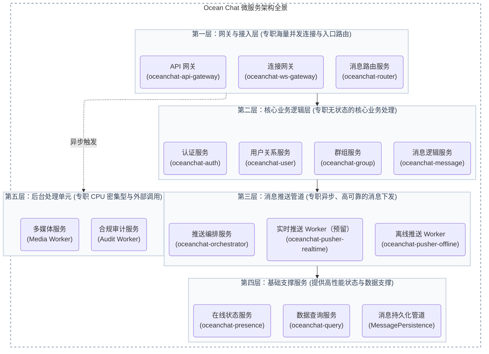
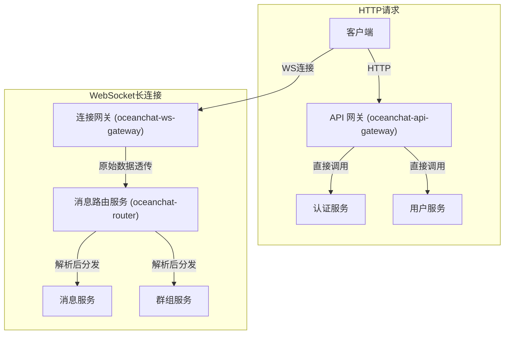

import Tabs from '@theme/Tabs';
import TabItem from '@theme/TabItem';

# 微服务架构

:::info 架构概览
整个平台采用分布式微服务架构，旨在支持十万级（10万+）并发。按职责划分为：

- **10 个必需核心微服务**：`oceanchat-api-gateway`、`oceanchat-ws-gateway`、`oceanchat-router`、`oceanchat-auth`、`oceanchat-user`、`oceanchat-group`、`oceanchat-message`、`oceanchat-orchestrator`、`oceanchat-presence`、`oceanchat-query`
- **3 个后台 Worker**：`oceanchat-pusher-offline`、Media Worker、Audit Worker
- **1 条数据处理管道**：MessagePersistence
- **预留未启用**：`oceanchat-pusher-realtime`（不计入运行所必需的服务）
:::

## 技术栈

本项目基于一套现代且稳健的技术栈构建，选择该技术栈是出于性能、可扩展性和开发者体验方面的考虑。

- **[NestJS 11](https://nestjs.com/)**：一个渐进式的 Node.js 框架，用于构建高效、可靠且可扩展的服务器端应用程序。其模块化架构非常适合开发本项目中的微服务。

- **[TypeScript 5](https://www.typescriptlang.org/)**：本项目的主要编程语言。通过为 JavaScript 添加静态类型，它有助于提高代码质量、可读性和可维护性，这对于大型项目至关重要。

- **[Yarn 4.7](https://yarnpkg.com/)**：一个快速、可靠且安全的依赖管理工具，用于高效地管理项目的包和依赖项。

- **[MongoDB](https://www.mongodb.com/)(搭配 Mongoose)**：用于持久化数据存储的主要 NoSQL 数据库。它用于存储用户数据、消息、群组信息等。Mongoose 作为对象数据建模 (ODM) 库，提供基于模式的应用数据建模解决方案。

- **[Redis](https://redis.io/)**：高性能内存数据存储。在本项目中，它用于缓存、实时用户在线状态管理，以及作为某些实时通信场景的高速消息总线。

- **[NATS](https://nats.io/)(搭配 JetStream)**：简单、安全、高性能的开源消息系统，作为微服务之间的主要通信骨干。本项目特别利用其内置的持久化引擎 **NATS JetStream** 来提供至少一次消息传递保证。这对于持久化消息、处理离线推送和广播域事件等可靠的异步操作至关重要。

## IM 架构图

```mermaid
---
config:
  layout: elk
---
flowchart TB
    subgraph System ["Ocean Chat 微服务架构全景"]
        direction TB

        subgraph Layer1 ["第一层：网关与接入层 (专职海量并发连接与入口路由)"]
            direction LR
            API("API 网关\n(oceanchat-api-gateway)") ~~~ WS("连接网关\n(oceanchat-ws-gateway)") ~~~ Router("消息路由服务\n(oceanchat-router)")
        end

        subgraph Layer2 ["第二层：核心业务逻辑层 (专职无状态的核心业务处理)"]
            direction LR
            Auth("认证服务\n(oceanchat-auth)") ~~~ User("用户关系服务\n(oceanchat-user)") ~~~ Group("群组服务\n(oceanchat-group)") ~~~ Msg("消息逻辑服务\n(oceanchat-message)")
        end

        subgraph Layer3 ["第三层：消息推送管道 (专职异步、高可靠的消息下发)"]
            direction LR
            Orch("推送编排服务\n(oceanchat-orchestrator)") ~~~ PushRT("实时推送 Worker（预留）\n(oceanchat-pusher-realtime)") ~~~ PushOff("离线推送 Worker\n(oceanchat-pusher-offline)")
        end

        subgraph Layer4 ["第四层：基础支撑服务 (提供高性能状态与数据支撑)"]
            direction LR
            Presence("在线状态服务\n(oceanchat-presence)") ~~~ Query("数据查询服务\n(oceanchat-query)") ~~~ DBWorker("消息持久化管道\n(MessagePersistence)")
        end

        subgraph Layer5 ["第五层：后台处理单元 (专职 CPU 密集型与外部调用)"]
            direction LR
            Media("多媒体服务\n(Media Worker)") ~~~ Audit("合规审计服务\n(Audit Worker)")
        end

        Layer1 --> Layer2
        Layer2 --> Layer3
        Layer3 --> Layer4
        Layer1 -. 异步触发 .-> Layer5
    end

    classDef layer fill:#f8fafc,stroke:#cbd5e1,stroke-width:2px,color:#334155;
    classDef system fill:#ffffff,stroke:#94a3b8,stroke-width:2px,stroke-dasharray: 5 5;
    class Layer1,Layer2,Layer3,Layer4,Layer5 layer;
    class System system;

```

## 第一层：网关与接入层

这一层是用户的直接入口，专注于处理海量并发连接，是整个系统的性能关键点。

### 1. **API 网关服务（oceanchat-api-gateway）** (无状态)

<Tabs>
<TabItem value="desc" label="简介" default>
本网关是外部 http 请求的唯一入口。
</TabItem>
<TabItem value="resp" label="核心职责">

- **请求路由**: 核心功能。作为所有外部 RESTful API 请求的唯一入口。客户端的登录、注册、获取用户资料、查询历史记录等 HTTP 请求都首先到达这里。然后根据规则将请求转发到对应的服务中。例如，将 /auth/_ 开头的请求转发给 oceanchat-auth 服务，将 /users/_ 转发给 oceanchat-user 服务。
- **身份认证**: 实现 **Zero-I/O Authentication**。它通过密码学方式验证 RS256 Access Token，并针对令牌黑名单（通过 NATS JetStream 事件同步）进行 `O(1)` 本地内存查找，完全消除了关键路径上的同步网络 I/O（如 Redis 查询），以支持十万级并发。对于无需认证的接口，则直接放行。
- **限流**: 比如限制同一个 IP 每秒只能请求 10 次，保护后端服务不被压垮。
- **日志与监控**: 记录所有进出的 HTTP 请求日志，用于排查问题和性能分析。

</TabItem>
<TabItem value="reason" label="分离原因">
为所有无状态的HTTP请求提供一个统一、安全且易于管理的门面。将API管理与实时连接管理分离，使得职责更单一，更易于独立扩展和维护。
</TabItem>
</Tabs>

### 2. **连接网关服务（oceanchat-ws-gateway）** (无状态)

<Tabs>
<TabItem value="desc" label="简介" default>
鉴于本服务是无状态的，设计上应保持其业务无关、轻量和简单。
</TabItem>
<TabItem value="resp" label="核心职责">

- **实时连接入口**: 作为所有外部 WebSocket/TCP 长连接的唯一入口。
- **连接认证**: 在客户端建立长连接（`AUTH_REQ`）时，实现 **Zero-I/O Authentication**：使用 `oceanchat-auth` 分发的 RS256 公钥在本地完成 JWT 验签，并结合内存黑名单（通过 NATS 撤销事件同步）判定令牌有效性，全程不发起任何网络调用。
- **数据透传**: 作为纯粹的连接通道，仅封装客户端原始数据包（如附加上 `connectionId`, `gatewayId`），然后快速投递给后端的 **消息路由服务**。
- **客户端消息下发**: 当前直接订阅由 **推送编排服务** 发布的节点专属主题 `im.down.node.{gatewayId}`，并将消息准确推送给连接在本实例上的客户端。未来若启用 **实时推送工作单元**，则改为接收该工作单元派发的节点指令；最终的 WebSocket 写入始终由持有连接的网关完成。

</TabItem>
<TabItem value="reason" label="分离原因">
将最消耗资源的 I/O 密集型任务（维护连接）与 CPU 密集型任务（业务逻辑）彻底分离。这使得连接网关可以被极致优化，并独立进行水平扩展，以支撑十万级并发连接。
</TabItem>
</Tabs>

### 3. **消息路由服务（oceanchat-router）** (无状态)

<Tabs>
<TabItem value="resp" label="核心职责" default>

- **消息解码与分发**: 接收来自 **连接网关** 的原始数据包，进行解码、协议解析和初步验证。
- **业务路由**: 根据消息类型，判断其应由哪个业务微服务处理，然后通过 NATS 消息队列分发。
- **业务级上行流量控制**: 配合网关的连接层限流，在解码业务包后实现基于 `userId` 的细粒度速率限制和熔断。例如，限制“每个用户 ID 每秒最多发送 100 个业务请求”。更具体的接口业务限流（如创建群组频率）由对应的下游服务处理。

</TabItem>
<TabItem value="reason" label="分离原因">
解耦接入层和业务逻辑层。路由服务作为中间协调者，使得后端业务服务的增减和变更对网关层完全透明，极大地提高了系统的灵活性和可维护性。
</TabItem>
</Tabs>

```mermaid
graph TD
    Client[客户端]

    subgraph HTTP请求
    Client -- HTTP --> APIGW["API 网关 (oceanchat-api-gateway)"]
    APIGW -- 直接调用 --> Auth[认证服务]
    APIGW -- 直接调用 --> User[用户服务]
    end

    subgraph WebSocket长连接
    Client -- WS连接 --> WSGW["连接网关 (oceanchat-ws-gateway)"]
    WSGW -- 原始数据透传 --> Router["消息路由服务 (oceanchat-router)"]
    Router -- 解析后分发 --> Message[消息服务]
    Router -- 解析后分发 --> Group[群组服务]
    end
```

## 第二层：核心业务逻辑层

这一层负责处理 IM 平台所有的核心业务功能，设计为无状态服务，易于水平扩展。

### 4. **认证服务（oceanchat-auth）** (无状态)

<Tabs>
<TabItem value="resp" label="核心职责" default>

- **用户身份认证**: 处理由 API 网关代理而来的用户注册、登录、登出等 HTTP 请求。
- **令牌管理**: 负责生成、验证和刷新访问令牌（推荐 JWT），是系统安全的核心。
- **分发验证能力**: 作为唯一持有 RS256 私钥的签发者，向各网关（API 网关与连接网关）分发验签公钥，并在令牌撤销（登出、踢人、重放检测）时通过 NATS 广播撤销事件。网关据此在本地完成 Zero-I/O 校验。
- **发布领域事件**: 在关键业务操作（如用户注册成功、登录成功）完成后，向 NATS JetStream 发布异步领域事件，供其他服务订阅和处理。

</TabItem>
<TabItem value="reason" label="分离原因">
将用户身份认证这一通用且关键的安全能力独立出来，形成单一可信的服务。所有其他服务都依赖它来确认用户身份，职责清晰，便于统一管理安全策略。
</TabItem>
</Tabs>

### 5. **用户关系服务（oceanchat-user）** (无状态)

<Tabs>
<TabItem value="resp" label="核心职责" default>

- **数据管理**: 管理用户账户、个人资料、好友关系（添加/删除/黑名单）、通讯录等。
- **权限认证决策**: 作为关系数据的唯一所有者，负责对相关操作进行权限判断（例如，回答“用户 A 和 B 是否为好友”）。

</TabItem>
<TabItem value="reason" label="分离原因">
用户和关系是 IM 的基础数据，独立服务可为其他服务提供统一、稳定的数据源。将权限决策逻辑内聚在此服务中，确保了数据和规则的一致性。
</TabItem>
</Tabs>

### 6. **群组服务（oceanchat-group）** (无状态)

<Tabs>
<TabItem value="resp" label="核心职责" default>

- **生命周期管理**: 负责群组的创建/解散、成员管理、权限体系、群公告、群设置等。
- **组织架构管理**: 负责 Teams（团队）和 Rooms（房间/频道）的层级架构维护，涵盖它们的增删改查 (CRUD) 等核心业务操作。
- **权限认证决策**: 作为群组数据的唯一所有者，内部包含所有群组相关的权限认证逻辑（例如，判断用户是否群成员、是否被禁言等）。

</TabItem>
<TabItem value="reason" label="分离原因">
群聊的业务逻辑（尤其是权限和成员管理）非常复杂，独立成服务有助于降低代码复杂度，便于独立开发和迭代。
</TabItem>
</Tabs>

### 7. **消息逻辑服务（oceanchat-message）** (无状态)

<Tabs>
<TabItem value="resp" label="核心职责" default>

- **权限认证协调**: 作为权限验证的“协调者”，调用正确的“决策者”服务完成权限检查。例如，发单聊消息时调用 **用户关系服务**；发群聊消息时调用 **群组服务**。
- **消息处理**: 作为单聊和群聊消息的业务处理中心，负责权限校验、内容处理（@提及、敏感词过滤）、生成消息 ID、组装消息体等。
- **触发投递**: 处理完成后，调用 **推送编排服务**，启动消息投递流程。

</TabItem>
<TabItem value="reason" label="分离原因">
将消息本身的业务逻辑（“是什么”）与消息的投递过程（“怎么送”）分开，使职责更清晰。
</TabItem>
</Tabs>

## 第三层：消息推送管道

这是确保消息可靠、实时送达的关键，也是一个高度异步化的处理流程。

### 8. **推送编排服务（oceanchat-orchestrator）** (无状态)

<Tabs>
<TabItem value="resp" label="核心职责" default>

- **投递决策**: 接收来自 **消息逻辑服务** 的待投递消息。
- **状态查询**: 实时查询 **在线状态服务**，获取所有接收者的在线状态和所在网关节点。
- **任务派发**: 根据在线状态，将消息转化为“极轻量级的 `MSG_NOTIFY` 在线唤醒任务”或“离线推送任务”，并发布到不同的 NATS 主题。

</TabItem>
<TabItem value="reason" label="分离原因">
作为消息投递的“大脑”，它负责复杂的决策逻辑。将其独立可以使推送流程更清晰、更易于监控和调试。
</TabItem>
</Tabs>

### 9. **实时推送工作单元（oceanchat-pusher-realtime）**（预留，当前未启用）

<Tabs>
<TabItem value="current" label="当前状态" default>

- `oceanchat-pusher-realtime` 当前仅为预留的应用骨架，尚未接入实时消息链路，也不是系统运行所必需的微服务。
- 当前在线链路为：`oceanchat-orchestrator` 查询在线状态并获得 `gatewayId`，直接向 `im.down.node.{gatewayId}` 发布轻量级 `MSG_NOTIFY`；对应的 `oceanchat-ws-gateway` 订阅自己的节点主题，在本地定位连接并执行最终的 WebSocket 下发。
- 在这套链路中再加入一个只负责转发的 Worker，会额外增加一次消息跳转、部署成本和故障点，却无法转移连接维护、网络带宽、慢客户端处理和 `socket.send()` 的压力，因此目前不启用该服务。

</TabItem>
<TabItem value="future" label="未来职责">

若未来启用，该服务不应只是简单转发，而应作为可独立扩缩容的 **实时扇出与流量调度层**：

- **任务消费与扇出**: 消费 orchestrator 发布的、按网关或分片聚合的实时投递任务，将大群消息展开为具体的设备投递指令。
- **流量治理**: 实现网关维度的微批处理、并发限制、优先级调度、过载保护和可丢弃信令的降级策略。
- **指令下发**: 将处理后的信令发布到 `im.down.node.{gatewayId}`；网关仍然负责本地连接查找、发送背压和最终 WebSocket 写入。
- **协议扩展**: 当实时下行需要同时支持 WebSocket、SSE、MQTT 等多种通道时，集中处理通道选择与适配。

</TabItem>
<TabItem value="when" label="启用条件">

仅当监控或压测证明存在以下需求时再引入：

- 大群在线扇出和大量 NATS publish 已使 orchestrator 成为明确瓶颈。
- 需要将实时任务的批处理、分片、限流或优先级策略从 orchestrator 中独立出来。
- 实时推送策略需要独立发布、扩缩容和故障隔离。
- 需要统一适配多种实时下行协议或跨地域网关选择。

启用前必须先定义 orchestrator 与该 Worker 之间的任务契约，例如 `realtime.dispatch.{shard}` 对应的 DTO、Stream 保留和过期策略、分片键以及重复投递语义。不能直接把现有 `im.down.node.{gatewayId}` 当作中间任务队列，因为它已经是网关消费的最终节点地址。

</TabItem>
</Tabs>

### 10. **离线推送工作单元（oceanchat-pusher-offline）** (无状态)

<Tabs>
<TabItem value="resp" label="核心职责" default>

- **任务消费**: 订阅“离线推送”主题，消费任务。
- **API 调用**: 调用苹果 APNS、谷歌 FCM 或国内厂商的推送 API，发送离线通知。

</TabItem>
<TabItem value="reason" label="分离原因">
与第三方 API 的集成伴随着网络延迟和不确定性。将其隔离可防止其失败或缓慢影响核心的实时推送链路。
</TabItem>
</Tabs>

## 第四层：基础支撑服务

这些服务为整个平台提供稳定、高效的基础能力。

### 11. **在线状态服务（oceanchat-presence）** (无状态)

<Tabs>
<TabItem value="resp" label="核心职责" default>

- **状态维护**: 通过 `UserId → DeviceId → { deviceType, gatewayId, status, connectTime }` 的路由图谱，实时维护全局用户的多端在线状态（Redis Hash：`user:routing:{userId}`）。
- **状态查询**: 为 **推送编排服务** 等提供毫秒级的在线状态查询接口。

</TabItem>
<TabItem value="reason" label="分离原因">
在线状态是分布式 IM 的基石，读写极为频繁。独立服务使用 Redis 等内存数据库进行极致优化，确保高性能。
</TabItem>
</Tabs>

### 12. **数据查询服务（oceanchat-query）** (无状态)

<Tabs>
<TabItem value="resp" label="核心职责" default>

- **统一查询入口**: 为客户端提供查询历史消息、会话列表等数据的统一 HTTP API。
- **分级查询**: 根据查询的时间范围，智能地从不同存储介质（Redis 缓存、MongoDB 等）中拉取并聚合数据。

</TabItem>
<TabItem value="reason" label="分离原因">
实现了读写分离。将高频的读操作与核心的写链路分开，可以独立优化查询性能，而不会影响消息写入的稳定性。
</TabItem>
</Tabs>

### 数据处理管道（MessagePersistence）：消息持久化

:::note 这是一个异步处理流程，而非独立服务

- **核心职责**: **消息逻辑服务** 处理完消息后，除了调用推送服务，还会将消息副本发送到专用于持久化的 NATS 主题（由 JetStream 支持）。一个或多个独立的**订阅者进程 (Writer)** 会监听此队列，批量将消息写入数据库。
- **分离原因**: 彻底的异步化。消息的发送和接收不应等待数据库写入完成。这种“写后持久化”的设计，最大程度地保证了消息的实时性。

:::

## 第五层：后台处理单元

### 13. **多媒体服务（Media Worker）** (无状态工作单元)

<Tabs>
<TabItem value="resp" label="核心职责" default>

- **任务消费**: 订阅 NATS JetStream 的 `BACKGROUND_TASKS` 工作队列拉取任务。
- **媒体处理**: 执行 CPU 密集型任务，如视频/音频转码、提取视频首帧、生成图片缩略图等，并将处理后的结果保存回 OSS。

</TabItem>
<TabItem value="reason" label="分离原因">
视频转码极度消耗 CPU 资源。如果把它放在普通的业务微服务中处理，一个大的视频文件可能会将整个容器的 CPU 打满，从而拖垮同节点的长连接或核心信令，引发极其严重的“雪崩”。必须将其隔离至独立的 Worker 集群进行异步拉取处理。
</TabItem>
</Tabs>

### 14. **合规审计服务（Audit Worker）** (无状态工作单元)

<Tabs>
<TabItem value="resp" label="核心职责" default>

- **内容合规**: 订阅 `BACKGROUND_TASKS` 队列，对上传的图片或音视频 URL 调用第三方鉴黄、暴恐识别 AI 模型（NSFW 审核）。
- **状态回写**: 将最终的审核结果（合规/违规）回写至数据库或 Redis，供后续的消息逻辑服务决策是否拦截、放行或全网撤回。

</TabItem>
<TabItem value="reason" label="分离原因">
调用外部 AI 审核模型通常会有数百毫秒到数秒的网络延迟，网络极易波动。独立出 Audit Worker 可避免业务系统发生队头阻塞，完美实现“先发后审”或“异步机审”的业务容错。
</TabItem>
</Tabs>
