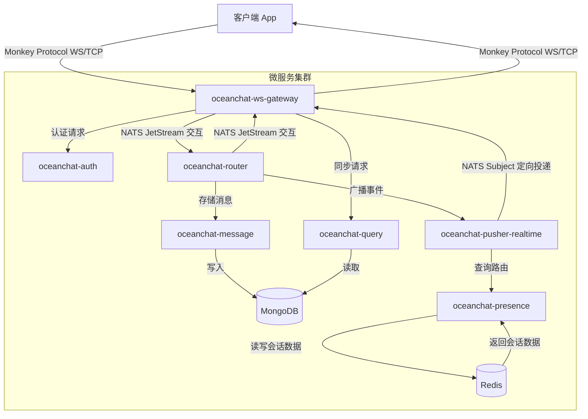
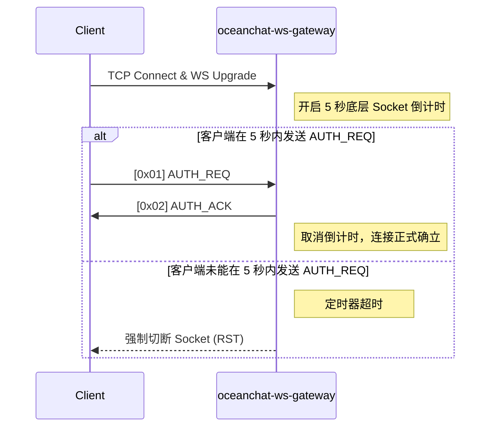
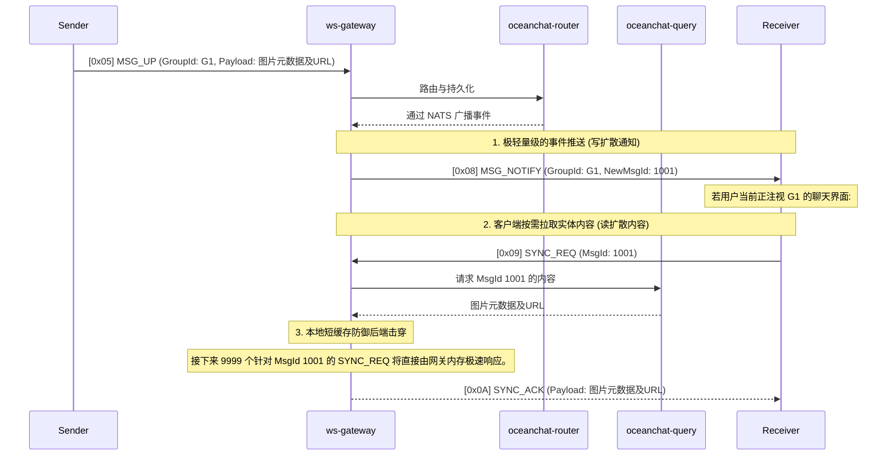
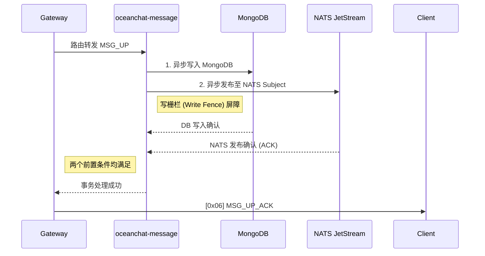
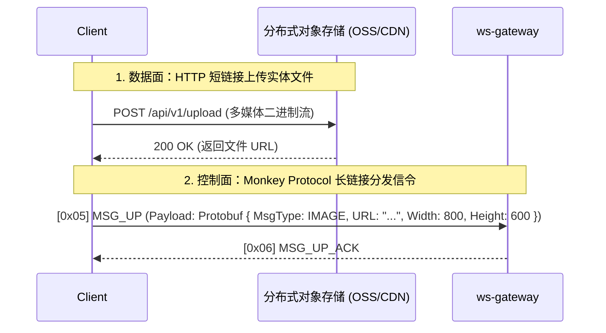

<head>
  <meta name="twitter:card" content="summary_large_image" />
  <meta property="og:title" content="Monkey Protocol 协议规范 | Ocean Chat" />
  <meta property="og:description" content="Ocean Chat Monkey Protocol 综合参考规范。涵盖十万级并发 WebSocket 消息传递、推拉结合模型、微服务架构数据流及高可靠性保障机制。" />
  <link rel="canonical" href="https://jameswilson19970101.github.io/ocean.chat.docs/zh-CN/docs/devdocs/monkey-protocol-spec" />
</head>

# Monkey Protocol 协议规范

**Monkey Protocol** 是 Ocean Chat 自研的高性能二进制应用层协议，运行于 WebSocket 或纯 TCP 之上。该协议专为支持 **1000万+ 并发连接**的分布式微服务架构而设计。

本参考文档详细规定了精确到位级别的帧结构、指令集以及网关和客户端实现中必须遵循的严格状态机操作。

:::info TODO: 多协议网关与底层传输优化
虽然目前为了极致的跨平台兼容性（特别是 Web 端和小程序）使用了 WebSocket (WS)，但对于原生移动端 App (iOS/Android) 而言，**纯 TCP 才是实现极致省电和连接稳定性的首选方案**。

未来规划中，网关需升级为暴露双端口（如 `TCP: 8080` 和 `WS: 8081`）的“多协议网关”。无论外层是 HTTP Upgrade 后的 WS 帧还是纯 TCP 字节流，网关在剥离传输层封包后，向后端微服务透传的都将是完全一致的 12 字节 Monkey Protocol 二进制核心载荷。
:::

## 1. 架构总览与微服务数据流

Ocean Chat 的架构严格将网络 I/O 与业务逻辑隔离。本协议依赖以下核心微服务运作：

- **`oceanchat-ws-gateway`**: 绝对无状态。负责连接生命周期、协议编解码、微批处理（Micro-batching）、本地短缓存以及令牌桶限流。
- **`oceanchat-auth`**: 在初次建立连接握手时，负责校验 JWT。
- **`oceanchat-presence`**: 管理 Redis 中的全局在线状态 (`UserId -> DeviceType -> Gateway IP`)。
- **`oceanchat-router`**: 核心路由编排器，负责与 NATS JetStream 交互。
- **`oceanchat-message`**: 强制执行写栅栏 (Write Fence) 机制，保障 MongoDB 的持久化，并生成全局唯一的 Sequence ID。
- **`oceanchat-query`**: 负责处理离线用户或消息空洞情况下的历史消息同步 (`SYNC_REQ`)。
- **`oceanchat-pusher-realtime`**: 通过 NATS 将下行消息 (`MSG_DOWN` / `MSG_NOTIFY`) 精准派发至对应的网关节点。

### 端到端数据流

## 2. 帧结构 (Frame Structure)

每一个 Monkey Protocol 数据包均由严格定长的 **12 字节 Header** 及变长 **Payload** 组成。

### 2.1 Header 布局

| 偏移量 | 字段      | 大小     | 类型      | 说明                                          |
| :----- | :-------- | :------- | :-------- | :-------------------------------------------- |
| 0      | `Magic`   | 2 Bytes  | `UInt16`  | 魔数 `0x4D4B` ("MK")，用于标识协议。          |
| 2      | `Version` | 1 Byte   | `UInt8`   | 协议版本号，用于前向兼容（当前：`0x01`）。    |
| 3      | `Cmd`     | 1 Byte   | `UInt8`   | 指令类型标识符（参见指令注册表）。            |
| 4      | `Flags`   | 1 Byte   | `Bitmask` | 8 位标志位，用于控制协议特性（如压缩、ACK）。 |
| 5      | `SeqId`   | 3 Bytes  | `UInt24`  | 序列号，用于匹配请求与响应。                  |
| 8      | `Length`  | 4 Bytes  | `UInt32`  | 变长 Payload 的字节长度（硬限制最大 16KB）。  |
| 12     | `Payload` | Variable | `Binary`  | **Protobuf** 编码的业务载荷。                 |

:::warning 生产环境严禁使用 JSON
为支撑十万级并发，严禁在 Payload 中进行 JSON 序列化。必须强制使用 **Protobuf**。这能节省 40% 以上的带宽，并极大降低网关的 CPU 解析开销。
:::

### 2.2 标志位 (`Flags`)

为了最大限度减少 Payload 的冗余，布尔状态均被编码进 `Flags` 字节中：

- **Bit 0 (`0x01`) - `REQUIRE_ACK`**: 如果置为 1，接收方必须显式发送确认包（ACK）。
- **Bit 1 (`0x02`) - `COMPRESSED`**: 如果置为 1，表明 Payload 已使用 Zstd 或 Gzip 压缩。
- **Bit 2 (`0x04`) - `ENCRYPTED`**: 如果置为 1，表明 Payload 已进行对称加密（如 AES-GCM）。

## 3. 指令注册表 (`Cmd`)

| Cmd Hex | 指令名         | 方向             | 说明                                                                      |
| :------ | :------------- | :--------------- | :------------------------------------------------------------------------ |
| `0x01`  | `AUTH_REQ`     | Client -> Server | 请求连接认证。Payload 需包含 `DeviceType`, `DeviceId` 及 JWT。            |
| `0x02`  | `AUTH_ACK`     | Server -> Client | 认证结果响应。                                                            |
| `0x03`  | `PING`         | Client -> Server | 保活心跳请求（Payload 必须为空）。                                        |
| `0x04`  | `PONG`         | Server -> Client | 保活心跳响应（Payload 必须为空）。                                        |
| `0x05`  | `MSG_UP`       | Client -> Server | 客户端上行聊天消息。Payload 必须携带 `ClientMsgId` 保证幂等性。           |
| `0x06`  | `MSG_UP_ACK`   | Server -> Client | 服务端确认收到上行消息。                                                  |
| `0x07`  | `MSG_DOWN`     | Server -> Client | 服务端下行推送消息（适用于私聊或小群聊）。                                |
| `0x08`  | `MSG_NOTIFY`   | Server -> Client | 大群聊下的“推拉结合”新消息事件通知。Payload 仅包含 `GroupId` 和 `MsgId`。 |
| `0x09`  | `SYNC_REQ`     | Client -> Server | 客户端请求拉取离线或出现空洞的消息。Payload 包含需同步的 `SeqId` 范围。   |
| `0x0A`  | `SYNC_ACK`     | Server -> Client | 返回客户端拉取的具体消息数组。                                            |
| `0x0B`  | `READ_RECEIPT` | Both             | 多端已读回执同步信令。                                                    |

## 4. 连接生命周期与安全防线

### 4.1 握手空窗期保护 (Handshake Window Timeout)

为了防范慢连接（Slowloris）及文件描述符（FD）耗尽攻击，`oceanchat-ws-gateway` 在 TCP 层面强制实施极短的连接建立窗口。

### 4.2 智能保活机制 (Any Message is Pong)

Ocean Chat 摒弃了僵化的定时心跳策略。

1. **业务包即心跳：** 只要网关收到客户端发来的**任何**合法上行数据包（如 `MSG_UP`），便会立刻刷新该连接的 `LastActiveTime`。
2. **动态心跳步长：** 客户端**必须**根据所处的 NAT 网络环境及操作系统的后台状态（Foreground/Background），动态调整 `PING` 的发送间隔（例如从 30 秒延长至 4 分钟）。如果客户端正在活跃发信，则应暂停后台的定时 `PING` 以节省带宽。

### 4.3 流量整形与防雪崩限流

- **令牌桶限流：** 网关层限制单条连接的 `MSG_UP` 速率上限（例如 5次/秒）。违规数据包将被立即丢弃，并向客户端返回明确的错误码。
- **指数退避重连：** 当网络异常断开时，客户端**严禁**立即疯狂重连。必须实施带随机抖动的指数退避（Exponential Backoff，如 1s, 2s, 4s, 8s），以防止产生瞬间压垮 `oceanchat-auth` 的认证风暴。

## 5. 消息投递模型

### 5.1 超大群聊：推拉结合 (Push-Pull Hybrid)

对于超过 1000 人的大群，**严禁使用写扩散模式 (Write-Diffusion)**。向 10 万名成员瞬间并发推送大载荷将导致出口带宽崩溃。Ocean Chat 采用**推拉结合**模型。

**网关本地短缓存 (Local Short-Cache)：** 网关维持一个短生命周期（如 3 秒）的 LRU 缓存。它通过直接从内存响应后续相同消息的 `SYNC_REQ`，有效阻止了针对后端服务的“缓存击穿”。

### 5.2 微批打包合并 (Micro-Batching)

为最大化吞吐量并大幅减少软中断，`oceanchat-ws-gateway` 实行微批处理机制。如果从 NATS 总线上，在 200 毫秒的时间窗口内有 10 条发往同一用户的下行消息，网关会将它们打包为一个 Protobuf 数组 Payload，并仅附带**一个** 12 字节的 Header 下发给客户端。

## 6. 可靠性与时序保障

### 6.1 确保绝对一致性的写栅栏 (Write Fence)

一条消息只有在完成持久化并成功进入高可用实时分发队列后，才会被视为“已成功处理”。

### 6.2 幂等性保障 (Idempotency)

客户端每次发送 `MSG_UP` 必须生成唯一的 UUID (`ClientMsgId`)。若客户端在收到 `MSG_UP_ACK` 前因断网重试，后端通过 Redis 中的 SET 结构（`UserID + ClientMsgId`）优雅实现去重拦截，防止在数据库中产生重复记录。

### 6.3 消息空洞检测与自愈 (Message Hole Detection)

客户端需在本地维护 `MaxReceivedSeqId`。如果下行的 `MSG_DOWN` 携带了 `SeqId=105`，而本地的最高纪录是 `103`，则说明产生了**消息空洞**。

- 客户端**绝不能**直接在界面渲染消息 `105`。
- 它必须暂存 `105`，并立刻发起针对 `104` 的 `SYNC_REQ` 请求，待序列完全连续后，方可合并渲染至聊天流中。

## 7. 多端漫游同步

- **未读数降维打击 (ZSET)：** Ocean Chat 规避了所有在 MongoDB 中执行的 `SELECT COUNT` 操作。`oceanchat-presence` 服务在 Redis 中为每个群维护一个存储了近期 500 条消息 ID 的有序集合 (ZSET)。通过将用户的 `LastReadSeqID` 传入 `ZCOUNT` 命令，系统可在 O(log(N)) 复杂度下极速算出精确的未读数。
- **已读回执广播：** 当用户在 PC 端阅读消息并发出了 `[0x0B] READ_RECEIPT` 信令后，该信令将经由 NATS 总线，根据设备类型 (`DeviceType`) 路由并广播至该用户当前活跃的所有移动端网关连接，实现跨设备的未读红点瞬间消除。

## 8. 富媒体与文件传输架构 (长短链协同)

Monkey Protocol 定位于**高并发信令与短文本传输**（控制面）。对于图片、语音、视频等大文件（数据面），系统强制采用**长短链结合**的架构。

严禁通过 Monkey Protocol (WebSocket/TCP) 直接传输大体积文件二进制流，此举会导致网关内存溢出 (OOM) 并引发严重的队头阻塞 (Head-of-Line Blocking)，使得关键信令（如心跳包）无法及时收发。

### 8.1 传输协作流程

1. **短链接 (HTTP) 上传数据面：** 客户端直接通过 HTTP/HTTPS 短连接，将文件分片上传至分布式对象存储 (如 OSS / AWS S3)，此阶段可充分利用 CDN 边缘节点加速及断点续传特性。

2. **长链接 (Monkey Protocol) 投递控制面：** 文件上传成功后，客户端获取文件的下载 URL。随后，客户端将该 URL 及文件的元数据封装在轻量级的 Protobuf 载荷中，通过 Monkey Protocol 的 MSG_UP 指令完成极速投递。

### 8.2 Payload 元数据结构

对于非文本消息，Payload 内部只携带元数据，通常包含：

- 图片：URL, ThumbnailURL, Width, Height, Size, Format
- 语音：URL, Duration (时长秒数), Size
- 文件：URL, FileName, Extension, Size
